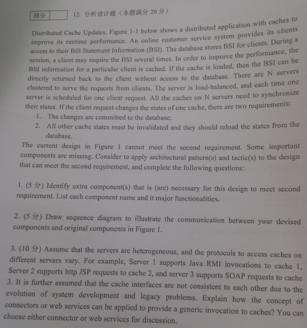
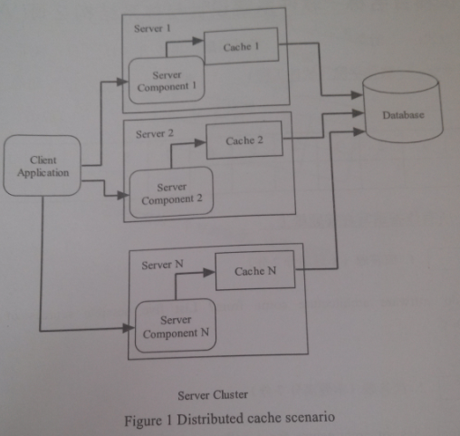

Exam0-往年考试

# 1. 简答题

## 1.1. 软件系统架构
1. 【必考】如何进行质量属性方案建模？请使用"刺激-相应"图的格式进行建模 How to model quality attribute scenarios? Graphically model one quality attributes in "stimulus-response" format:
   1. 【2015】availiability and Performance
   2. 【2017】【2018】availiability and modifiability
   3. 【2019】interoperability and modifiability
2. 【高频 2015 2017 2019】为什么软件系统架构需要使用不同视图来文档化？给出4种示例视图的名称和目的。Why should a software architecture be documented using different differenet views? Give the name and purposes of 4 example views.
3. 【高频 2015 2017 2018】什么区分了软件产品线架构和单个软件产品架构？What distinguishes an architecture for a software product line from an architecture for a single product?
4. 【高频 2015 2017】将以下每个问题（左侧）与解决该问题的架构风格/视图（右侧）对应起来。列出每个样式类别的四个视图。Map each of the following questions (on the left) with the architectural style/view (on the right) that addresses the question. List four views of each category of style.
    1. Left 左侧
       1. 它是如何构建为一组实现单元的？How it is structed as a set of implementation of units
       2. 它是如何构建为一组具有运行时行为和交互的元素的？How it is structed as a set of elements that have runtime behavior and interactions?
       3. 它与环境中的非软件结构有何关系？How it relates to non-software structures in its environment?
    2. Right
       1. 模块连接者模式 Component-connector styles
       2. 分配模式 Allocation styles
       3. 模块模式 Module styles
5. 【2015】【2017】简要描述软件架构过程中的一般活动，以及每个活动的主要输入和输出。Briefly describe the general activities in a software architecture process, and the major inputs and outputs at each activity.
6. 【2015】【2017】描述架构权衡分析方法 (ATAM) 过程的每个阶段生成的输出。Describe the outputs generated from each phase of Architecture Tradeoff Analysis Method(ATAM) process.
7. 【2015】【2019】软件架构来自哪里？列举五种可能的软件架构的来源 Where do software architecture come from? List five possible sources of software architecture.
8. 【2015】【2019】解释代理架构模式的上下文、好处和局限性。Explain the context, benefits and limitations of Broker Architecture Pattern.
9. 【2017】【2019】在设计软件时应用了哪些通用设计策略？为每个策略提供一个带有软件架构的简明工作示例。What are generic design strategies applied in designing software? Give a concise working example with software architecture for each strategy. 
10. 【2017】【2019】什么是ASR？列出提取和识别ASR的四种来源和方法。What are ASR? List four sources and methods for extracting and identifying ASRs.
11. 【2017】【2019】典型的软件架构文档包中应该包含哪些内容？ 简要描述每个组件及其用途。What should be included in a typical software architecture documentation package? Briefly describe each component and its purpose. 
12. 【2017】【2019】描述 4+1 视图 Describe 4+1 view(掌握绘图)
13. 【2018】【2019】软件产品线架构如何实现可变性？描述可变性机制的工作方式
14. 【2015】描述架构设计中架构模式和策略之间的关系。给出可以在架构设计过程中使用的任何四种策略的名称，并描述每种策略的目的。Describe the relationships between architectual patterns and tactics in architecture design. Give name of any four tactics that can be used during architecture design and describe the purpose of each of them.
15. 【2015】简要描述面向服务架构 (SOA) 的基本原则，并讨论 SOA 对互操作性、可伸缩性和安全性等质量属性的影响 Briefly describe the fundamental principles of Service Oriented Architecture(SOA) and discuss the impact of SOA on quality attributes like interoperability, scalability and security
16. 【2015】软件产品线和模型驱动架构如何实现高复用性？从不同的角度比较和讨论这两种架构方法之间的共性和差异。How do software product lines and model driven architecture archive a high reusability? Compare and discuss the commonalities and differences between these two architectural approaches from various perspectives.
17. 【2015】为什么SPL和MDA具有高复用性？ 比较和讨论它们的共同点和不同点。Why SPL and MDA have high reusability? Compare and discuss their commonality and differences.
18. 【2017】软件设计的三个变化维度，每个维度的变化点。不同的绑定时间如何影响可修改性和可测试性。 
19. 【2018】软件架构的关注点有哪些？利益相关方有哪些？
20. 【2018】Software requirements, Quality attributes, ASRs 的区别和联系
21. 【2018】Layered pattern 和 Multi-tier pattern 的区别
22. 【2018】描述ADD过程
23. 【2019】Architecture，structure和Design的区别？
24. 【2019】描述在ATAM的每一个过程中 有哪些Stack holder和他们的职责
25. 【2019】微服务和SOA的区别，相同点

## 1.2. 设计模式
1. 【2017】请至少说出三个面向对象的原则，并解释它们如何应用于策略模式？ Please name at least three Object-Oriented principles, and explain how they are applied in Strategy pattern? 
2. 【2018】【2019】Risks，Senstivity Points，Trade-Off Points分别是什么？各举一个例子。
3. 【2019】设计模式是什么？举例说明类模式和对象模式的区别？
4. 【2019】防御式编程是什么？断言和错误处理的区别？
5. 【2019】设计模式对MVC的影响？
6. 【2019】策略模式和状态模式的区别？
7. 【2019】最小知识原则在设计模式中的应用？

# 2. 设计题
1. 【2019】一个游戏，有几种人类角色：骑士、骑兵、步兵，持有不同的武器(矛、剑、斧)，拥有fight方法；有一个非人类角色巨魔，可以持有武器，但攻击方法不同(beat)。现在希望让巨魔和其他人类角色一起进行游戏，并且要求有角色死亡时其他活着的角色要收到通知。运用设计模式进行设计，并画出类图。
2. 【2019】表驱动，参考PPT即可。
3. 【2019】架构设计，没太看懂……大概是分析程序结构生成报告？
4. 【2018】设计一个飞行模拟软件，要求能模拟多种飞机的特性。为了在将来支持更多飞机种类，要求使用策略模式。画出架构图和类图
5. 【2019】一个买票系统的设计题，不同的角色有不同的打折方案，用策略模式设计， 最后画图，还要说明策略模式的使用场景。

【2015】【2019】

