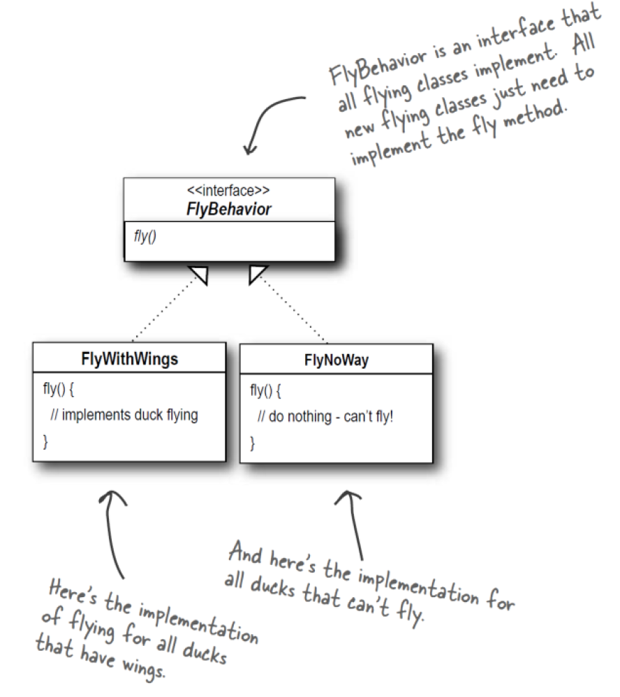
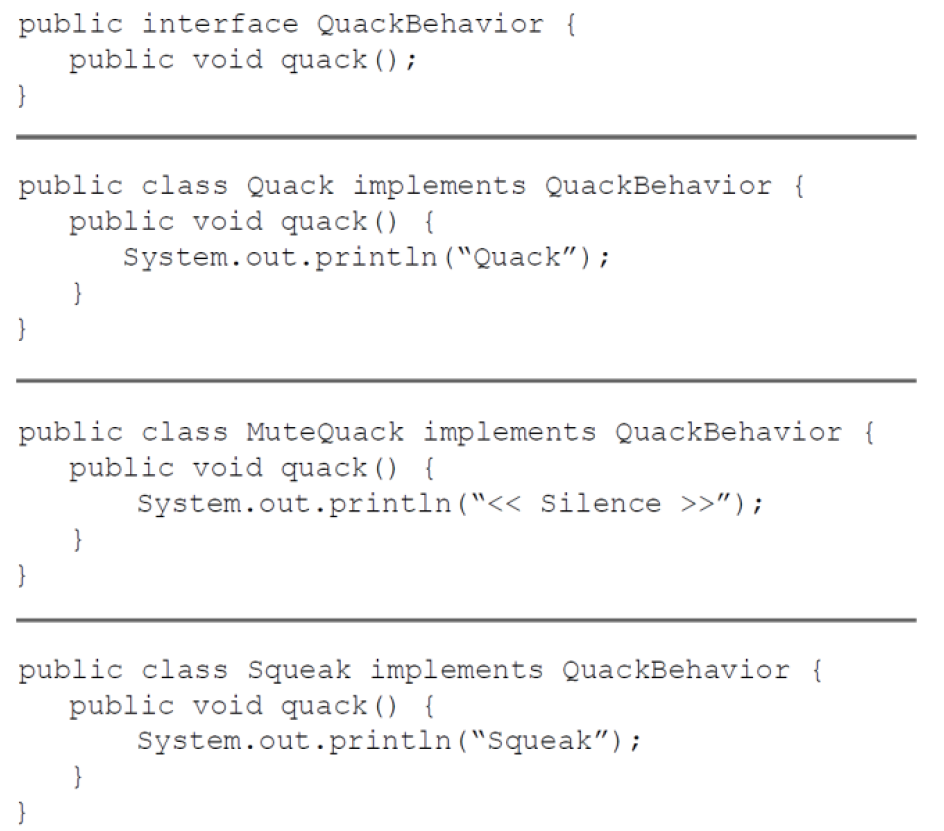

lec02-策略模式
---

# 1. 策略模式引入：鸭子

## 1.1. 从SimUDuck应用程序开始


- 我们需要添加功能使得鸭子可以飞


- 简单的修改鸭子父类，我们可以发现这样子橡皮鸭也可以飞


- 我们需要意识到不是所有的鸭子都会飞
- 考虑继承
   1. 我们总是可以像使用quack()方法一样在橡皮鸭中覆盖fly()方法......
   2. 但是，当我们在程序中添加木制诱饵鸭子时会发生什么呢？他们不应该飞或嘎嘎......
   3. 高管们希望每六个月更新一次产品。每次更新中都会有新的Duck子类，真是一场噩梦！


- 如果我们使用接口呢？


- 其实并没有真正解决这个问题：导致代码无法复用
- 没有重复的代码 
   - 如果您认为必须重写一些方法是不好的，那么当您需要更改飞行行为时会需要所有的飞行的子类
   - 更改非飞行子类(继承，覆盖)VS 更改飞行子类(接口)

## 1.2. 变更
1. 软件开发过程中的一个常数
2. 很多事情都可以推动变化。列出一些您必须在应用程序中更改代码的原因
   1. 在软件开发中编写一些更改
   2. 我的客户或用户决定他们想要其他东西，或者他们想要新功能
   3. 我的公司决定与另一家数据库供应商合作，并且还从另一家使用不同数据格式的供应商那里购买数据
   4. 技术不断变化，我们必须更新代码以使用协议
3. 我们已经学到了足够的知识来构建我们的系统，我们想回去做点更好的事情

# 2. 设计原理：封装各种变化
1. 对应实现的原则：**开闭原则**
2. 识别应用程序中各个方面，将其与保持不变的方面分开
3. 将变化的部分封装起来，以便以后可以更改或扩展变化的部分而不会影响那些不变的部分

## 2.1. 将变化与保持不变分开
1. 我们知道fly()和quack()是Duck类的一部分，它们在鸭子之间有所不同
2. 为了将这些行为与Duck类分开，我们将把这两种方法都从Duck类中拉出，并创建一组新的类来表示每种行为


## 2.2. 设计鸭子行为
1. 我们想要
   1. 保持灵活性
   2. 将行为分配给鸭子的实例
   3. 可以动态的修改鸭子的行为：在运行时修改鸭子的行为。

# 3. 设计原则：面向接口编程，而不是面向实现
对应实现的原则：**依赖倒转原则**

## 3.1. 表示行为的类
1. 不会由Duck类来实现flying和quacking的接口
2. 我们将制作一组类，其全部目的是代表一种行为。
   1. 第一个解决方案：超类中的具体实现
   2. 第二个解决方案：在子类本身中提供专门的实现**它们都依赖于实现**

## 3.2. 回忆多态性(polymorphism)
1. "面向接口编程"实际上意味着"面向超类型编程"
   1. 这里有接口的概念，但也有Java结构接口
   2. 你可以对接口进行编程，而不必实际使用Java接口
2. 变量的声明类型应该是超类型，通常是接口的抽象类，以便分配给这些变量的对象可以是超类型的任何具体实现，这意味着声明它们的类不必知道实际的对象类型！



4. 我们将行为抽象出来，同时分别具体了两个子类(实现了依赖倒转)，并且是完整的封装


## 3.3. 在这个设计过程中
1. 其他类型的对象可以重用我们的fly和quack行为，因为这些行为不再隐藏在我们的Duck类中
2. 我们可以添加新行为，而无需修改任何现有行为类或触摸任何使用飞行行为的Duck类
3. 这样，我们就可以在没有继承带来的所有负担的情况下获得复用的好处

## 3.4. 问答
1. 问：类只是一种行为，这感觉有点奇怪。类不应该代表事物吗？类不应该同时具有状态和行为吗？
2. 答：在OO系统中，是的，类表示通常具有状态(实例变量)和方法的事物。在这种情况下，事情恰好是一种行为。但是，即使一个行为仍然可以具有状态和方法。飞行行为可能具有实例变量，这些变量代表飞行属性(每分钟的飞行节拍，最大高度和速度等)

# 4. 整合鸭子行为
1. 关键在于，Duck现在将**委托**其飞行和鸣叫行为，而不是使用Duck类(或子类)中定义的quacking和flying方法
2. 委托是调用另一个部分的方法

## 4.1. (1) 首先，我们将两个实例变量添加到Duck类中


## 4.2. (2) 现在我们实现performQuack()


## 4.3. (3) 如何设置飞行行为和叫行为实例变量


# 5. 鸭子测试代码 Testing the code
|  |  |
| -------------------- | -------------------- |
|  |  |

## 5.1. 动态设置行为 Setting behavior dynamically


## 5.2. 制作新的鸭子类型 Make a new Duck type


## 5.3. 制作新的FlyBehavior类型 Make a new FlyBehavior type


## 5.4. 使ModelDuck具有火箭功能 Make the ModelDuck rocket-enabled


# 6. HAS-A可以比IS-A更好
> 优先考虑组成而不是继承

1. 合成为您提供了更多的灵活性
2. 它不仅使您可以将一系列算法封装到自己的类集中，而且还使您可以在运行时更改行为

# 7. 第一个设计模式-策略模式
1. **策略模式定义了一系列算法**，将每个算法封装在一起，并使它们可替换，策略使算法独立于使用该算法的客户端而变化
   1. 变化在客户使用时才会出现，也就是要实现这个模式就必须要将细节暴露给用户。
   2. 实际开发的时候，可能是由多个设计模式组合成的
   3. 我们可能需要一个算法族，希望彼此是可以替换的


## 7.1. 模式描述
1. 名称：策略模式 Strategy Pattern
2. 目的：定义一系列算法，封装每个算法，并使它们可替换。策略使算法可以独立于使用该算法的客户端而变化。
3. 别名：Policy Pattern

## 7.2. 模式动机-将文本流分成几行
1. 存在许多用于将文本流分成行的算法。将所有这样的算法硬连接到类中是不可取的。
2. 不满足开闭原则，每次修改都要反复检查每一个条件语句

```java
public class Context{
   public void algorithm(String type){
      if(type.equals("strategyA")) {
         this.strategy = new ConcreteStrategyA();
      } else if(type.equals("strategyB")) {
         this.strategy = new ConcreteStrategyB();
      } else if(type.equals("strategyC")) {
         this.strategy = new ConcreteStrategyC();
      }
   }
}
```

## 7.3. 应用场景
1. 在以下情况下使用策略模式
   1. 许多相关的类仅在**行为**上有所不同，策略提供了一种使用多种行为之一配置类的方法
   2. 您需要**算法的不同变体**。例如，您可能定义了反映不同空间/时间权衡的算法。将这些变体实现为算法的类层次结构时，可以使用策略。
   3. 一种算法使用客户端不应该知道的数据。使用策略模式**可避免暴露复杂的、特定于算法的数据结构**
   4. 一个类定义了许多行为，这些行为在其操作中显示为多个条件语句。代替许多条件，将相关的条件分支移到他们自己的**策略类**中。
2. 很多问题都出现于数据结构被暴露：比如**迭代器模式**。

## 7.4. 模式使用的结果
1. 相关算法家族。策略类的层次结构定义了一系列算法或行为，以供上下文重用。继承可以帮助排除算法的通用功能。
2. 子类化的替代方法。
3. 策略消除条件语句。
4. 多种实现方式。策略可以提供相同行为的不同实现。客户可以选择具有不同时间和空间权衡的策略。
5. 客户必须意识到不同的策略。这种模式有一个潜在的缺点，即**客户在选择合适的策略之前必须先了解策略的不同**，不然客户可能会遇到实现问题。
6. 策略和上下文之间的通信开销。
7. 对象数量增加。
8. 模式一般都会有的缺点：
   1. 增加设计的复杂度和增加类的个数(增加辅助类)
   2. 增加隔阂、方法调用，降低软件运行的效率，但是已经不是目前主要的问题了
9. **Java的加密方法、时间显示算法**等都是通过策略模式实现的

# 8. 引入设计模式的作用

## 8.1. 共享词汇 
1. 爱丽丝(ALICE)：我需要奶油芝士和白面包上的果冻，巧克力苏打和香草冰淇淋，烤芝士三明治配培根，吞拿鱼和吞拿鱼沙拉，香蕉冰淇淋配香蕉片和香蕉片以及一杯咖啡奶油和两种糖，……哦，把汉堡包放在烤架上！
2. FLO：给我C.J.白色，黑色和白色，杰克·本尼(Jack Benny)，一台收音机，一艘船屋，一份普通咖啡并烧一烧！
3. 设计模式为您提供了与其他开发人员共享的词汇表。
4. 通过让您在**模式级别**(而不是实质性对象级别)进行思考，还可以提高您对体系结构的思考。

## 8.2. 共享模式词汇的力量 
1. 共享模式词汇的力量
   1. 当您使用模式与其他开发人员或团队进行沟通时，您不仅在沟通模式名称，还传达了模式所代表的整套质量属性，特征和约束
2. 模式可以让您用更少的话表达更多。
   1. 当您在描述中使用模式时，其他开发人员会快速准确地了解您所考虑的设计。
3. 在模式级别进行交谈可以使您在"设计中"停留的时间更长。T
4. 不要迷失在细节中。
5. 共享词汇可以为您的开发团队提供强大的动力。
6. 共享的词汇表鼓励更多的初级开发人员快速上手。

# 9. 我们如何使用设计模式
1. 依赖库和框架：提供了全部和必要的功能，一般可以直接直接复用
2. 设计模式帮助我们构建自己的应用程序，以使其更具可维护性和灵活性
3. 设计模式首先进入你的大脑
4. 尽量避免过度使用的问题

# 10. 问与答
1. 问：如果设计模式是如此出色，为什么有人不能建立它们的库，所以我不必这样做？
2. 答：设计模式比库更高。设计模式告诉我们如何构造类和对象以解决某些问题，适应这些设计以适合我们的特定应用程序是我们的工作。
3. 问：库和框架不是也在设计模式吗？
4. 答：框架和库不是设计模式；它们提供了我们链接到代码中的特定实现。但是，有时，库和框架在其实现中会使用设计模式。太好了，因为一旦您了解了设计模式，就可以更快地了解围绕设计模式构建的API。

# 11. 模式无非就是使用OO设计原则？
1. 知道诸如抽象，继承和多态之类的概念并不能使您成为一名优秀的面向对象设计者。设计大师考虑如何创建可维护且可以应对变更的灵活设计。
2. 设计模式可以帮助我们更好的理解设计原则

# 12. 设计工具箱的工具
1. 面向对象的基础 OO Basics
   1. 抽象 Abstraction
   2. 封装 Encapsulation
   3. 多态性 Polymorphism
   4. 继承 Inheritance
2. 面向对象原则 OO Principles
   1. 封装可变性 Encapsulate what varies
   2. 选择组合而不是继承 Favor composition over inheritance
   3. 面向接口编程，而不是面向实现编程 Program to interfaces, not implementation
3. 面向对象模式 OO Patterns：策略 Strategy

# 13. 回顾 Reviews
1. 仅仅知道面向对象基础不能让你成一个很好的面向对象的设计人。Knowing the OO basics does not make you a good OO designer.
2. 好的面向对象设计应该可以重用、扩展和稳定的 Good OO designs are reusable, extensible and maintainable.
3. 模式让你知道如何创建一个有很好的面向对象设计质量的系统 Patterns show you how to build systems with good OO design qualities.
4. 模式是公认的面向对象的经验。Patterns are proven object oriented experience.
5. 模式不会为您提供代码，它们会为您提供设计问题的一般解决方案。 您将它们应用于您的特定应用程序。Patterns don't give you code, they give you general solutions to design problems. You apply them to your specific application.
6. 模式不是发明的，而是被发现的。Patterns aren't invented, they are discovered.
7. 大多数模式和原则都解决软件变更问题。Most patterns and principles address issues of change in software.
8. 大多数模式都允许系统的某些部分独立于所有其他部分而变化。Most patterns allow some part of a system to vary independently of all other parts.
9. 我们经常尝试采用系统中的变化并将其封装。We often try to take what varies in a system and encapsulate it.
10. 模式提供了一种共享语言，可以使您与其他开发人员的交流价值最大化。Patterns provide a shared language that can maximize the value of your communication with other developer.