Lec07-Adapter and Composite
---

# 1. 适配器模式

## 1.1. 模式动机


1. 在软件开发中采用类似于电源适配器的设计和编码技巧被称为**适配器模式**。
2. 通常情况下，**客户端可以通过目标类的接口访问它所提供的服务**。有时，现有的类可以满足客户类的功能需要，但是它所提供的接口不一定是客户类所期望的，这可能是因为现有类中方法名与目标类中定义的方法名不一致等原因所导致的。
3. 在这种情况下，现有的接口需要转化为客户类期望的接口，这样保证了对现有类的重用。如果不进行这样的转化，客户类就不能利用现有类所提供的功能，适配器模式可以完成这样的转化。
4. 在适配器模式中可以定义一个包装类，包装不兼容接口的对象，这个包装类指的就是**适配器(Adapter)**，它所包装的对象就是**适配者(Adaptee)**，即被适配的类。
5. 适配器提供客户类需要的接口，**适配器的实现就是把客户类的请求转化为对适配者的相应接口的调用**。也就是说：**当客户类调用适配器的方法时，在适配器类的内部将调用适配者类的方法，而这个过程对客户类是透明的，客户类并不直接访问适配者类**。因此，**适配器可以使由于接口不兼容而不能交互的类可以一起工作**。这就是适配器模式的模式动机。

## 1.2. 模式定义
1. 适配器模式(Adapter Pattern) ：**将一个接口转换成客户希望的另一个接口**，适配器模式使**接口不兼容的那些类可以一起工作**，其别名为包装器(Wrapper)。适配器模式既可以作为类结构型模式，也可以作为对象结构型模式。
2. Adapter Pattern: **Convert the interface of a  class into another interface clients expect**.  Adapter lets classes work together that  couldn't otherwise because of incompatible  interfaces.

## 1.3. 模式结构
1. 对象适配器

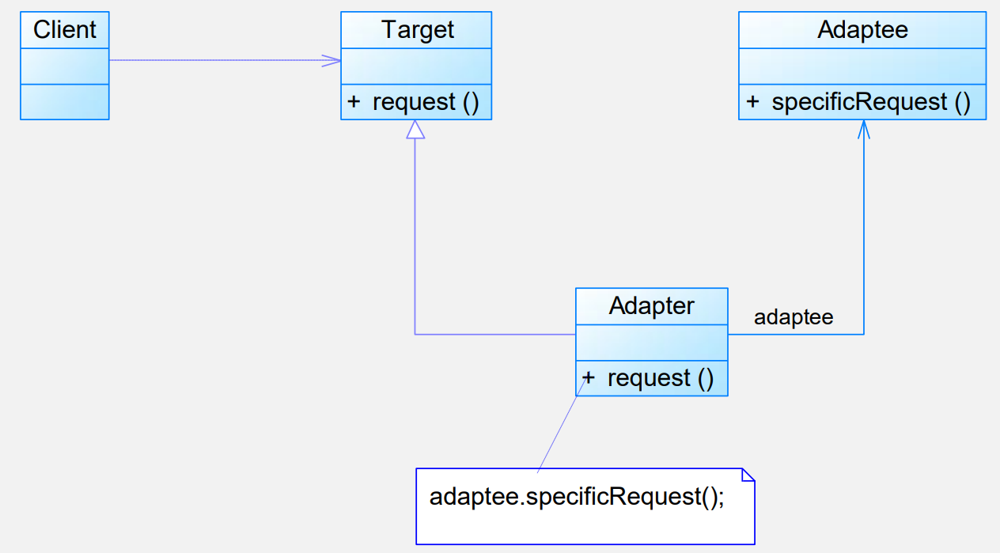

2. 类适配器

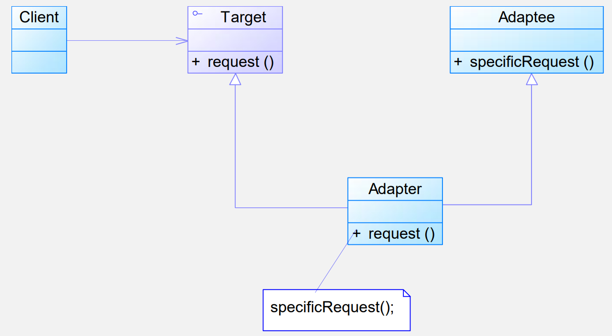

1. 适配器模式包含如下角色：
   1. Target：目标抽象类
   2. Adapter：适配器类
   3. Adaptee：适配者类
   4. Client：客户类

## 1.4. 模式分析
1. 典型的类适配器代码：

```java
public class Adapter extends Adaptee implements Target{
  public void request(){
    specificRequest();
  }
}
```

2. 典型的对象适配器代码：

```java
public class Adapter extends Target{
  private Adaptee adaptee;
  public Adapter(Adaptee adaptee){
    this.adaptee=adaptee;
  }
  public void request(){
    adaptee.specificRequest();
  }
}
```

## 1.5. 适配器模式实例与解析

### 1.5.1. 实例一：仿生机器人
1. 现需要设计一个可以模拟各种动物行为的机器人，在机器人中定义了一系列方法，如机器人叫喊方法cry()、机器人移动方法move()等。如果希望在不修改已有代码的基础上使得机器人能够像狗一样叫，像狗一样跑，使用适配器模式进行系统设计。

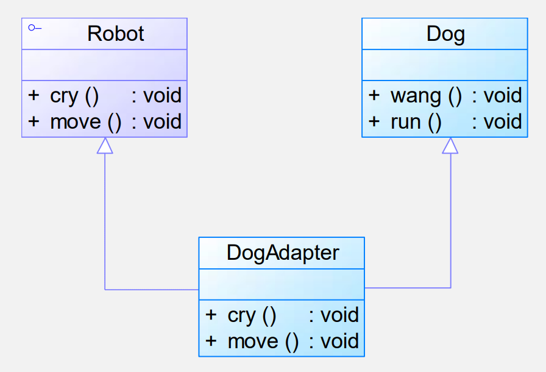

### 1.5.2. 实例二：加密适配器
1. 某系统需要提供一个加密模块，将用户信息（如密码等机密信息）加密之后再存储在数据库中，系统已经定义好了数据库操作类。为了提高开发效率，现需要重用已有的加密算法，这些算法封装在一些由第三方提供的类中，有些甚至没有源代码。使用适配器模式设计该加密模块，实现在不修改现有类的基础上重用第三方加密方法。

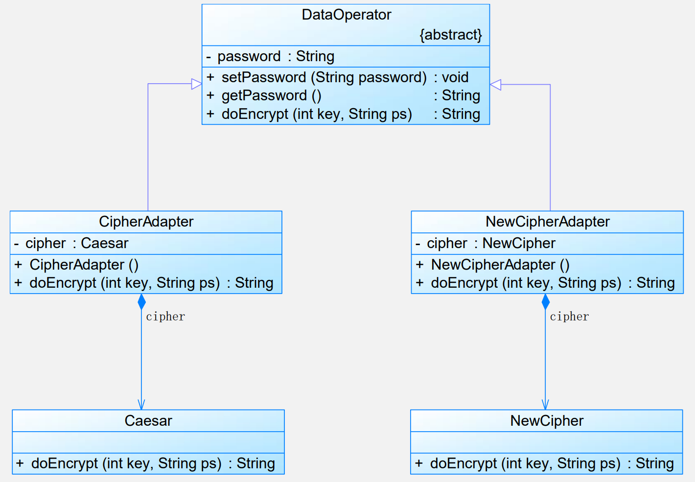

## 1.6. 模式优缺点

### 1.6.1. 适配器模式的优点
1. **将目标类和适配者类解耦**，通过引入一个适配器类来重用现有的适配者类，而无须修改原有代码。
2. **增加了类的透明性和复用性**，将具体的实现封装在适配者类中，对于客户端类来说是透明的，而且提高了适配者的复用性。
3. **灵活性和扩展性都非常好**，通过使用配置文件，可以很方便地更换适配器，也可以在不修改原有代码的基础上增加新的适配器类，完全符合"开闭原则"。

### 1.6.2. 类适配器模式还具有如下优点：
1. 由于适配器类是适配者类的子类，因此**可以在适配器类中置换一些适配者的方法，使得适配器的灵活性更强**。

### 1.6.3. 类适配器模式的缺点如下：
1. 对于Java、C#等不支持多重继承的语言，一次最多只能适配一个适配者类，而且目标抽象类只能为抽象类，不能为具体类，**其使用有一定的局限性**，不能将一个适配者类和它的子类都适配到目标接口。

### 1.6.4. 对象适配器模式还具有如下优点：
1. 一个对象适配器可以把多个不同的适配者适配到同一个目标，也就是说，**同一个适配器可以把适配者类和它的子类都适配到目标接口**。

### 1.6.5. 对象适配器模式的缺点如下：
1. 与类适配器模式相比，要想**置换适配者类的方法就不容易**。如果一定要置换掉适配者类的一个或多个方法，就只好先做一个适配者类的子类，将适配者类的方法置换掉，然后再把适配者类的子类当做真正的适配者进行适配，实现过程较为复杂。

## 1.7. 模式适用环境
1. 在以下情况下可以使用适配器模式：
   1. 系统**需要使用现有的类**，而这些类的接口不符合系统的需要。
   2. **想要建立一个可以重复使用的类，用于与一些彼此之间没有太大关联的一些类**，包括一些可能在将来引进的类**一起工作**。

## 1.8. 模式应用
1. Sun公司在1996年公开了Java语言的数据库连接工具JDBC，JDBC使得Java语言程序能够与数据库连接，并使用SQL语言来查询和操作数据。**JDBC给出一个客户端通用的抽象接口，每一个具体数据库引擎**（如SQL Server、Oracle、MySQL等）**的JDBC驱动软件都是一个介于JDBC接口和数据库引擎接口之间的适配器软件**。抽象的JDBC接口和各个数据库引擎API之间都需要相应的适配器软件，这就是为各个不同数据库引擎准备的**驱动程序**。

## 1.9. 模式应用
1. 在JDK类库中也定义了一系列适配器类，如在com.sun.imageio.plugins.common包中定义的**InputStreamAdapter**类，用于包装ImageInputStream接口及其子类对象。

```java
public class InputStreamAdapter extends InputStream{
  ImageInputStream stream;
  public InputStreamAdapter(ImageInputStream stream) {
    super();
    this.stream = stream;
  }
  public int read() throws IOException {
    return stream.read();
  }
  public int read(byte b[], int off, int len) throws IOException {
    return stream.read(b, off, len);
  }
}
```

2. 默认适配器模式(Default Adapter Pattern)或缺省适配器模式
   1. 当不需要全部实现接口提供的方法时，可先设计一个**抽象类实现接口**，并**为该接口中每个方法提供一个默认实现**（空方法），那么该抽象类的子类可有选择地覆盖父类的某些方法来实现需求，它**适用于一个接口不想使用其所有的方法的情况**。因此也称为**单接口适配器模式**。
   2. 适配者接口
   3. 默认适配器类
   4. 具体业务类


3. 双向适配器
   1. 在对象适配器的使用过程中，如果**在适配器中同时包含对目标类和适配者类的引用，适配者可以通过它调用目标类中的方法，目标类也可以通过它调用适配者类中的方法**，那么该适配器就是一个**双向适配器**。

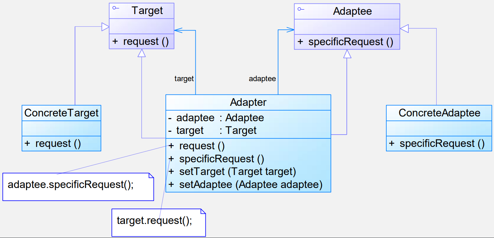

## 1.10. 适配器小结
1. 结构型模式描述如何将类或者对象结合在一起形成更大的结构。
2. 适配器模式用于将一个接口转换成客户希望的另一个接口，适配器模式使接口不兼容的那些类可以一起工作，其别名为包装器。适配器模式既可以作为类结构型模式，也可以作为对象结构型模式。
3. 适配器模式包含四个角色
   1. 目标抽象类定义客户要用的特定领域的接口
   2. 适配器类可以调用另一个接口，作为一个转换器，对适配者和抽象目标类进行适配，它是适配器模式的核心
   3. 适配者类是被适配的角色，它定义了一个已经存在的接口，这个接口需要适配
   4. 在客户类中针对目标抽象类进行编程，调用在目标抽象类中定义的业务方法。
4. 在类适配器模式中，适配器类实现了目标抽象类接口并继承了适配者类，并在目标抽象类的实现方法中调用所继承的适配者类的方法；在对象适配器模式中，适配器类继承了目标抽象类并定义了一个适配者类的对象实例，在所继承的目标抽象类方法中调用适配者类的相应业务方法。
5. 适配器模式
   1. 主要优点是将目标类和适配者类解耦，增加了类的透明性和复用性，同时系统的灵活性和扩展性都非常好，更换适配器或者增加新的适配器都非常方便，符合"开闭原则"
   2. 类适配器模式的缺点是适配器类在很多编程语言中不能同时适配多个适配者类
   3. 对象适配器模式的缺点是很难置换适配者类的方法。
6. 适配器模式适用情况包括：系统需要使用现有的类，而这些类的接口不符合系统的需要；想要建立一个可以重复使用的类，用于与一些彼此之间没有太大关联的一些类一起工作。

# 2. 组合模式

## 2.1. 模式动机
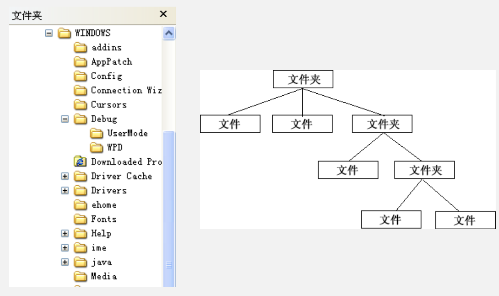

1. 对于**树形结构**，当容器对象（如文件夹）的某一个方法被调用时，将遍历整个树形结构，寻找也包含这个方法的成员对象（可以是容器对象，也可以是叶子对象，如子文件夹和文件）并调用执行。**（递归调用）**
2. 由于容器对象和叶子对象在功能上的区别，在使用这些对象的客户端代码中必须**有区别地对待容器对象和叶子对象**，而实际上**大多数情况下客户端希望一致地处理它们，因为对于这些对象的区别对待将会使得程序非常复杂**。
3. 组合模式描述了**如何将容器对象和叶子对象进行递归组合**，使得**用户在使用时无须对它们进行区分**，可以**一致地对待容器对象和叶子对象**，这就是组合模式的模式动机。

## 2.2. 模式定义
1. 组合模式(Composite Pattern)：组合多个对象形成**树形结构**以**表示"整体-部分"的结构层次**。组合模式对**单个对象（即叶子对象）**和**组合对象（即容器对象）**的**使用具有一致性**。
2. 组合模式又可以称为**整体-部分(Part-Whole)模式**，属于对象的结构模式，它**将对象组织到树结构中，可以用来描述整体与部分的关系**。
3. Composite Pattern: Compose objects into tree  structures to represent part-whole hierarchies. Composite lets clients treat individual objects and compositions of objects uniformly.

## 2.3. 模式结构
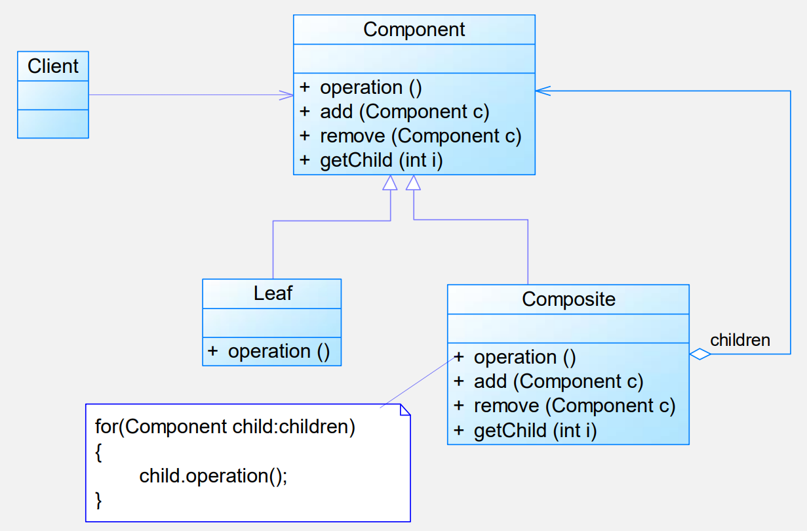

1. 组合模式包含如下角色：
   1. Component: 抽象构件
   2. Leaf: 叶子构件
   3. Composite: 容器构件
   4. Client: 客户类

## 2.4. 模式分析
1. 组合模式的关键是**定义了一个抽象构件类**，它既可以代表叶子，又可以代表容器，而**客户端针对该抽象构件类进行编程**，无须知道它到底表示的是叶子还是容器，可以对其进行统一处理。
2. 同时**容器对象与抽象构件类之间还建立一个聚合关联关系**，在容器对象中既可以包含叶子，也可以包含容器，以此**实现递归组合，形成一个树形结构**。
3. 文件系统组合模式结构图：

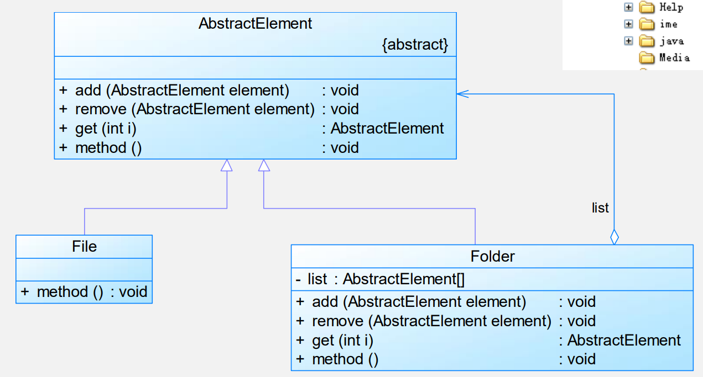

4. 典型的抽象构件角色代码：

```java
public abstract class Component{
  public abstract void add(Component c);
  public abstract void remove(Component c);
  public abstract Component getChild(int i);
  public abstract void operation();
}
```

5. 典型的叶子构件角色代码：

```java
public class Leaf extends Component{
  public void add(Component c)
  { //异常处理或错误提示 
  }
  public void remove(Component c)
  { //异常处理或错误提示 
  }
  public Component getChild(int i)
  { //异常处理或错误提示 
  }
  public void operation()
  {
  //实现代码
  }
}
```

6. 典型的容器构件角色代码：

```java
public class Composite extends Component
{
  private ArrayList list = new ArrayList();
  public void add(Component c)
  {
    list.add(c);
  }
  public void remove(Component c)
  {
    list.remove(c);
  }
  public Component getChild(int i)
  {
    (Component)list.get(i);
  }
  public void operation()
  {
    for(Object obj:list)
    {
      ((Component)obj).operation();
    }
  }
}
```

## 2.5. 组合模式实例与解析

### 2.5.1. 实例一：水果盘
1. 在水果盘(Plate)中有一些水果，如苹果(Apple)、香蕉(Banana)、梨子(Pear)，当然大水果盘中还可以有小水果盘，现需要对盘中的水果进行遍历（吃），当然如果对一个水果盘执行"吃"方法，实际上就是吃其中的水果。使用组合模式模拟该场景。

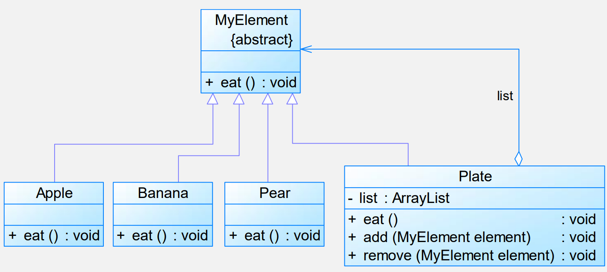

### 2.5.2. 实例二：文件浏览
1. 文件有不同类型，不同类型的文件其浏览方式有所区别，如文本文件和图片文件的浏览方式就不相同。对文件夹的浏览实际上就是对其中所包含文件的浏览，而客户端可以一致地对文件和文件夹进行操作，无须关心它们的区别。使用组合模式来模拟文件的浏览操作。


## 2.6. 模式优缺点

### 2.6.1. 组合模式的优点
1. 可以清楚地定义**分层次的复杂对象**，表示对象的全部或部分层次，使得增加新构件也更容易。
2. 客户端调用简单，**客户端可以一致的使用组合结构或其中单个对象**。
3. 定义了包含叶子对象和容器对象的**类层次结构**，叶子对象可以被组合成更复杂的容器对象，而这个容器对象又可以被组合，这样不断递归下去，**可以形成复杂的树形结构**。
4. **更容易在组合体内加入对象构件**，客户端不必因为加入了新的对象构件而更改原有代码。组合模式

### 2.6.2. 组合模式的缺点
1. **使设计变得更加抽象**，对象的业务规则如果很复杂，则实现组合模式具有很大挑战性，而且不是所有的方法都与叶子对象子类都有关联。
2. 增加新构件时可能会产生一些问题，**很难对容器中的构件类型进行限制**。

## 2.7. 模式适用环境
1. 在以下情况下可以使用组合模式：
   1. 需要表示一个**对象整体或部分层次**，在具有整体和部分的层次结构中，希望通过一种方式忽略整体与部分的差异，可以一致地对待它们。
   2. 让客户能够忽略不同对象层次的变化，**客户端可以针对抽象构件编程，无须关心对象层次结构的细节**。
   3. **对象的结构是动态的并且复杂程度不一样，但客户需要一致地处理它们**。

## 2.8. 模式应用
1. XML文档解析

```xml
<?xml version="1.0"?>
<books>
  <book>
    <author>Carson</author>
    <price format="dollar">31.95</price>
    <pubdate>05/01/2001</pubdate>
  </book>
  <pubinfo>
    <publisher>MSPress</publisher>
    <state>WA</state>
  </pubinfo>
</books>
```

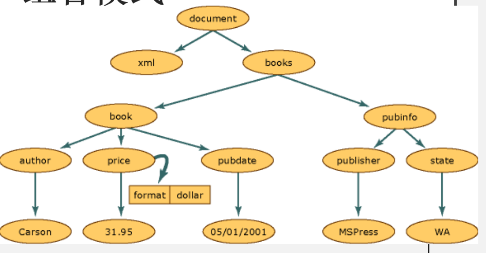

2. **操作系统中的目录结构**是一个树形结构，因此在对文件和文件夹进行操作时可以应用组合模式，例如杀毒软件在查毒或杀毒时，既可以针对一个具体文件，也可以针对一个目录。如果是对目录查毒或杀毒，将递归处理目录中的每一个子目录和文件。
3. JDK的**AWT/Swing**是组合模式在Java类库中的一个典型实际应用。

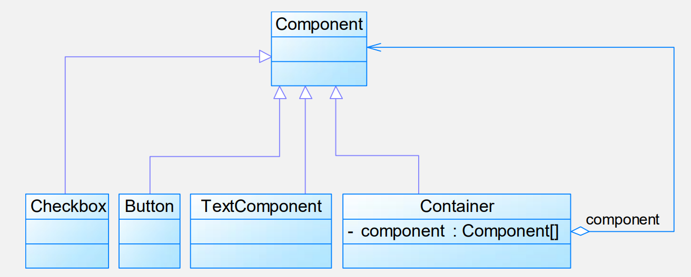

## 2.9. 模式扩展
1. 更复杂的组合模式

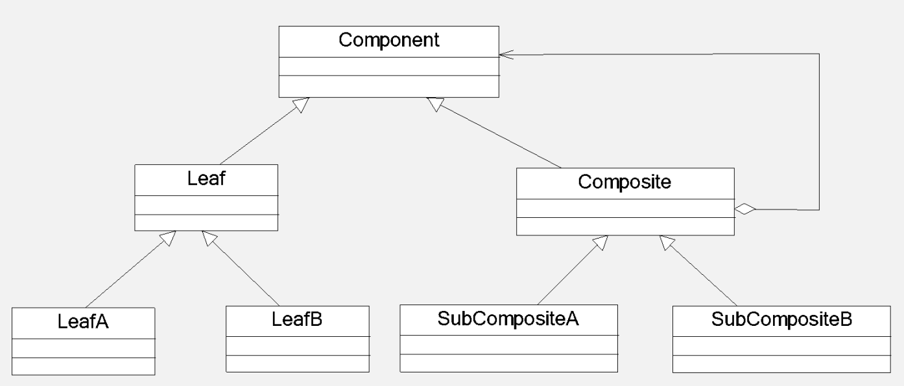

2. **透明**组合模式

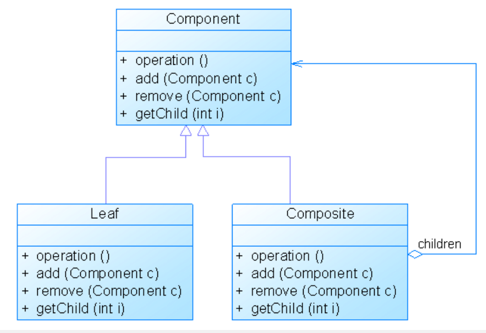

3. **安全**组合模式：违反了里氏代换原则

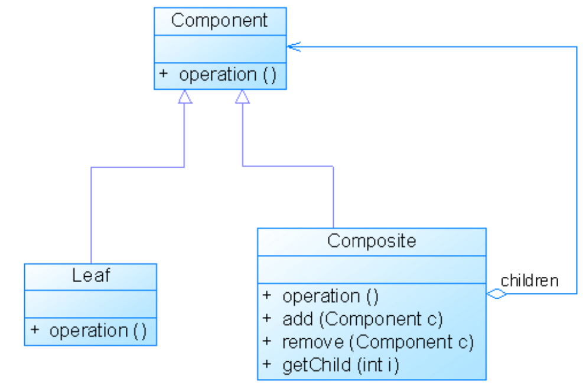

## 2.10. 组合小结
1. 组合模式用于组合多个对象形成树形结构以表示"整体-部分"的结构层次。组合模式对单个对象（即叶子对象）和组合对象（即容器对象）的使用具有一致性。组合模式又可以称为"整体-部分"模式，属于对象的结构模式，它将对象组织到树结构中，可以用来描述整体与部分的关系。
2. 组合模式包含三个角色
   1. 抽象构件为叶子构件和容器构件对象声明接口，在该角色中可以包含所有子类共有行为的声明和实现
   2. 叶子构件在组合结构中表示叶子节点对象，叶子节点没有子节点
   3. 容器构件在组合结构中表示容器节点对象，容器节点包含子节点，其子节点可以是叶子节点，也可以是容器节点，它提供一个集合用于存储子节点，实现了在抽象构件中定义的行为。
3. 组合模式的关键是定义了一个抽象构件类，它既可以代表叶子，又可以代表容器，而客户端针对该抽象构件类进行编程，无须知道它到底表示的是叶子还是容器，可以对其进行统一处理。
4. 组合模式
   1. 主要优点在于可以方便地对层次结构进行控制，客户端调用简单，客户端可以一致的使用组合结构或其中单个对象，用户就不必关心自己处理的是单个对象还是整个组合结构，简化了客户端代码
   2. 缺点在于使设计变得更加抽象，且增加新构件时可能会产生一些问题，而且很难对容器中的构件类型进行限制。
5. 组合模式适用情况包括
   1. 需要表示一个对象整体或部分层次
   2. 让客户能够忽略不同对象层次的变化，客户端可以针对抽象构件编程，无须关心对象层次结构的细节
   3. 对象的结构是动态的并且复杂程度不一样，但客户需要一致地处理它们。
6. 组合模式根据抽象构件类的定义形式，又可以分为透明组合模式和安全组合模式。