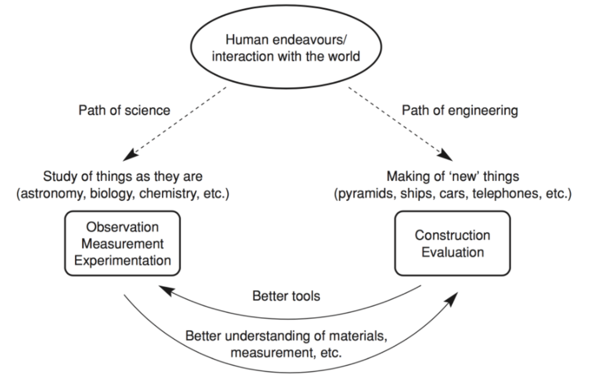

Lec1-Introduction
---

# 1. 课程背景

## 1.1. 为什么要研究软件设计体系结构？Why Study Software Design & Architecture?
1. Sfoftware(IT) systems are everywhere 软件(IT)系统无处不在
2. Every software intensive system has a sofftware design and architecture 每个软件密集型系统都有一个软件设计和体系结构
3. Software design and architecture are an increasingly important area of practice, education, and research 软件设计和体系结构是实践，教育和研究中越来越重要的领域
4. As a profession: Software Architect 专业：软件架构师
5. As a research area 作为研究领域
   1. Originally started around 1960 最初于1960年左右开始
   2. Attracting major attention since 1990 自1990年以来备受关注
6. This course is about 本课程是关于
   1. Concepts, principles, methods, and patterns of software design and architecture 软件设计和体系结构的概念，原理，方法和模式
   2. State-of-the-art practices of software design and architecture 软件设计和体系结构的最新实践

## 1.2. Learning Objectives 将要学习到的东西
1. Understand concepts and principles of software design and architecture 理解软件设计和体系结构的概念和原理
2. Create software architecture by taking requirements or through reverse architecting 通过考虑需求或通过反向体系结构来创建软件体系结构
3. Apply tactics, patterns, styles, middleware technologies and frameworks in creating soffware architecture and design 在创建软件体系结构和设计的时候应用设计模式、风格、中间件技术和框架
4. Analyze software design and evaluate software architecture systematically 分析软件设计和评估软件体系结构的系统性
5. Understand state-of the-art methods applied in software design and architecture 理解艺术式的设计是如何应用到软件设计与体系结构中的
6. Understand relationships between software design and soffware architecture, and other soffware engineering topic areas 理解软件设计与软件体系结构之间的关系，以及其他软件工程的领域话题

# 2. 介绍

## 2.1. Understanding Software Engineering 理解软件工程
1. Software | Engineering
   1. Software vs. ?
   2. Science vs. Engineering

## 2.2. What is Software Architecture 什么是软件体系结构
1. Definition 1:“The software architecture of a program or computing system is the structure or structures of the system, which comprise sottware elements, the externally visible properties of those elements, and the relationships among them." [Software Engineering Institute (SEl)] 定义1：程序或计算系统的软件体系结构是系统的一个或多个结构，其中包括软件组件，这些组件的外部可见属性以及它们之间的关系。 [软件工程学院(SEI)]
2. Definition 2: "The fundamental organization of a  system, embodied in its components, their relationships，to each other and the environment, and the principles governing its design and evolution." [IEEE 1471 -2000 Recommended Practice for Architectural Description of Software-Intensive Systems"] 定义2：系统的基本组织，体现在其组件，它们之间的相互关系以及环境以及支配其设计和演进的原则。[IEEE 1471 -2000 有关软件密集型系统的体系结构描述的推荐做法]

## 2.3. 体系结构 vs 设计 Architecture vs. Design
1. It's about software design 它是关于软件设计
   1. All architecture is software design, but not all design is software architecture 所有的体系结构都是软件设计，但不是所有的软件设计都是体系结构。
   2. "Architecting" is part of the design process 体系结构是设计过程的一个过程
2. Other views 其他观点
   1. High-level designs 更高层的设计
   2. A set of design decisions 设计决策的组合
   3. Locality 地区
3. Structure/Organization of the system 系统的结构或组织
   1. Elements: components & connectors 元素：部件和连接件
   2. Relationships: static & dynamic relationships 关系：静态和动态的关系
4. Properties: elements, groups of elements & overall system属性：元素，元素组和整个系统

## 2.4. 体系结构 vs 结构 Architecture vs. Structure
1. Decomposition of system into components/ modules/ subsystems 将系统分解成部件/模块/子系统
2. Architecture defines 体系结构定义：
   1. Component intertaces:What a component can do?部件接口：部件可以做什么？
   2. Component communications and dependencies:How components communicate? 部件交流和依赖：部件可以怎么沟通交流？
   3. Component responsibilities:Precisely what a component will do when you ask it?部件职责：当我们询问它时，部件需要精确的知道自己将要做什么？

## 2.5. 结构和体系结构 Structure and Architecture
|  |  |
| ------------------- | ------------------- |

## 2.6. 体系结构指定通信 Architecture Specifies Communication
1. Communication involves:通信需要：
   1. Data passing mechanisms, for example:**数据**通过机器传递，比如
      1. Function call函数调用
      2. Remote method invocation远程方法调用
      3. Asynchronous message异步信息
   2. Control flow**控制**流
      1. Flow of messages between components to achieve required functionality组件间的信息流来满足需要的功能
      2. Sequential序列化的
      3. Concurrent/ parallel并发/并行
      4. Synchronization同步

## 2.7. 体系结构强调非功能性需求(NFA) Architecture Address NFRS
1. **非功能性需求(Non-functional requirements)**定义了**系统运行的有多好** Non-functional requirements (NFRs) define "how well a system works?
2. 非功能性需求很少在功能性性需求中很少被发现 NFRs rarely captured in functional requirements
   1. 又名体系结构需求 Aka. architecture requirements
   2. 必须通过体系结构引出 Must be elicited by architect
3. 非功能性需求 NFRs include
   1. 技术约束 Technical constraints
   2. 商业约束 Business constraints
   3. 质量属性 Quality attrilbutes
4. 讨论：质量属性列表 Discussion: A list of quality attributes?

## 2.8. Design is an Abstraction 设计是一种抽象
1. 体系结构提供了设计的更高层抽象视角Architecture provides an higher level abstract view of a design
   1. 隐藏设计的复杂性和实现Hides complexity and implementation of design
   2. 可能是或者可能不是体系结构元素和软件元素之间的直接映射May or may not be a direct mapping between architecture elements and sottware elements 
2. 黑盒设计 和 白盒设计Blackbox design and W hitebox design
   1. 是对系统结构和交互的非正式描述Informal depiction of system's structure and interactions.
   2. 描述在体系结构中内嵌的设计哲学Portray the design philosophies embodied in the
architecture
3. 讨论：为什么在设计中使用抽象？Discussion: Why abstraction in design?

## 2.9. 体系结构视角Architecture Views
1. 软件体系结构表示了一个复杂的设计制品A software architecture represents a complex design artifact
2. 很多体系结构的可能视图：类比建筑-平面图，外部设计，电力设计，水暖，空气调节Many possible 'views' of the architecture:Analogy with buildings - floor plan, external, electrical, plumbing, air-conditioning

# 3. 如何创建一个设计 How to Develop a Design?
1. 广义的设计策略Generic Design Strategies:
   1. 分解Decomposition
   2. 抽象Abstraction
   3. 逐步的：分而治之Stepwise:Divid and Conquer
   4. 生成和测试Generate and Test
   5. 迭代：渐进式细化Iteration: Incremental Refinement
   6. 重用元素Reuseable elements

## 3.1. K.Kruchen的4+1视图模型 P.Krutchen's 4+1 View Model
1. 逻辑视图：描述了体系结构中在体系结构上明显重要的元素以及他们之间的关系Logical view: describes architecturally significant elements of the architecture and the relationships between them
2. 过程视图：描述了体系结构中的并发和交流元素Process view: describes the concurrency and communications elements of an architecture.
3. 物理视图：描述了主要过程和部件是如何映射到应用硬件上的Physical view: depicts how the major processes and
components are mapped on to the applications hardware.
4. 发展视图：描述了软件部件是如何在软件内部组织的，比如配置管理工具Development view: captures the internal organization of the software components as held in e.g./ a configuration management tool.
5. 使用体系结构的情况：描述了体系结构的需求，关系到了超过一个常规的视图Architecture use cases: capture the requirements for the architecture; related to more than one particular view

## 3.2. 体系结构和软件体系结构 Architect & Software Architect
> 体系结构设计了满足人类需求的结构 Architects design structures to meet human needs. - James Fitch, 1972

1. 体系结构的作用仍然保持着一致 The role of the architect remains the same
   1. 监听客户端，理解整体的需求 Listening to clients, understanding the totality of needs
   2. 仔细检查灵活性 Scrutinizing feasibilities
   3. 形成一个实际的结构版本，创建一个蓝图 Forming a practical vision of a structure and creating a blueprint
   4. 监督构建过程，保证是符合规范的 Overseeing construction and ensuring compliance to the plan 
   5. 引导在暴风雨式的设计变更、危机和歧义性中的版本Guiding the vision through the tempest of design changes, crises and ambiguities
2. 软件体系结构则是监督软件的构建过程：开发人员、工程师和设计者Software architects oversee software construction professionals Programmers, Engineers, Designers
3. 有名的软件体系结构
   1. Bill Gates: Chief Software Architect of Microsoft
   2. Tim Bernrs-Lee: Inventor and Chief Architect of World Wide Web
   3. Roy Fielding: Representational State Transfer (REST)

## 3.3. 软件体系结构在做什么 What Does a Software Architect Do?
1. 联络人Liaison
   1. 在客户、技术团队和商业/需求分析师之间Among clients, technical team and business/requirements analysts
   2. 包含管理和市场分析With management or marketing 
2. 软件工程：软件工程的最佳实践 Software Engineering:Software engineering best practices
3. 技术知识：深入理解技术领域Technology Knowledge:Deep understanding of technology domain
4. 风险管理：Risk Management
   1. 与设计、技术决策相关的风险Risks associated with the design, technology choices
   2. 更多？More?

## 3.4. 总体设计模型 A General Design Model

## 3.5. 软件设计过程 Software Design Process

## 3.6. 体系结构活动Architecture Activities
1. 创建系统的商业案例Creating the business casenfor the System
2. 理解需求Understanding the requirements
3. 创建和选择体系结构Creating and selecting architecture
4. 沟通体系结构(涉众，包括开发商)Communicating the architecture (stakeholders including developers)
5. 分析或评估体系结构Analysing or evaluating the architecture
   1. 整体的方法论Overall methodologies
   2. 具体技术的质量Quality specific techniques
6. 实现体系结构Implementing the architecture
7. 保证和体系结构的一致性Ensuring contormance to an architecture

## 3.7. 软件体系结构过程 Software Architecture Process

## 3.8. 体系结构声明周期 Architecture Lifecycle

## 3.9. 软件体系结构和体系结构知识领域 Software Design & Architecture Knowledge Areas
1. 软件设计基本原理Software Design Basic Concepts
   1. 整体设计原理General design concepts
   2. 上下文：软件发展生命周期-需求、设计、编码和测试Context: software development life cycle - requirements, design, construction and testing
   3. 设计过程：决策、活动、可运行产品Design process(role, activity, work product)
   4. 软件设计的使能技术 Enabling techniques for software design
2. 核心问题(技术)：一致性、事件控制和处理、分发、异常处理、交互系统、持久化Key Issues (technical): concurrency, control and handling of events, distribution, exception handling, interactive systems, persistence
3. 软件结构和体系结构Software Structure and Architecture
   1. 体系结构结构和视点Architecture Structures and viewpoints
   2. 体系结构风格和模式(宏观体系结构)Architectural styles and patterns (macro-architecture)
   3. 设计模式(微观体系结构)Design patterns (micro-architecture)
4. 软件设计方法Software Design Methods
   1. 体系结构方法，比如属性驱动的设计Architecture Methods (e .g., Attribute- Driven Design)
   2. 设计方法，比如动态系统发展方法Design Methods (e.g., Dynamic System Development Method)
5. 软件设计的质量分析和评估Software Design Quality Analysis and Evaluation 
   1. 质量属性Quality attributes
   2. 质量分析和评估方法、技术和工具Quality analysis and evaluation methods, techniques and tools
      1. 设计回顾：比如SEI的体系结构权衡分析方法Design reviews (e.g. SEI's Architecture Trade-off Analysis Method)
      2. 静态分析和动态分析Static analysis and dynamic analysis
      3. 模拟和原型Simulation and prototyping
   3. 度量Measures:
      1. 矩阵：体系结构级别Metrics: Architecture level
      2. 技术特有度量指标Technique specific measures
6. 设计建模和展示Design Modeling and Representation
   1. 体系结构和设计符号(体系结构描述语言，Architecture Description Languages，ADL)Architecture and Design Notations (Architecture Description Languages(ADL))
   2. UML Unified Modelling Language (UML)
   3. 设计文档(意见或其他)Design Documentation (Views & Beyond)
   4. 其他：在活动、关注点和领域上的不同，比如ACME，Rapide Others: differ in ability, focus and domain (e.g. ACME, Rapide)

# 4. 讨论
1. 科学和工程有什么不同？What is Difference between Science and Engineering?
2. 软件和硬件有什么不同？What is Difference between 'Software' and 'Hardware' ?
3. 体系结构和设计有什么不同？What is Difference between Architecture and Design?
4. 体系结构和结构有什么不同？What is Difference between Architecture and Structure?
