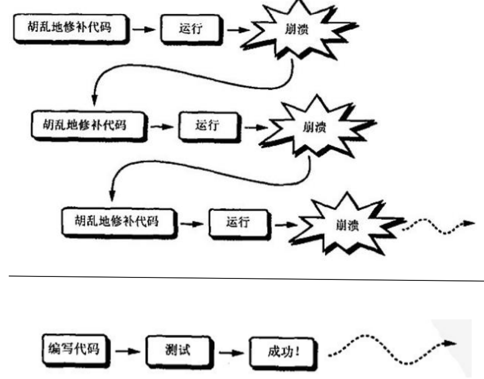
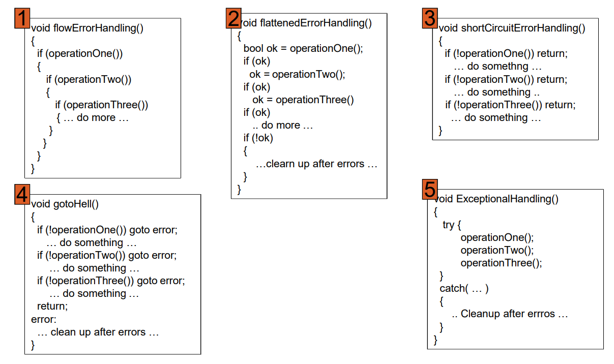
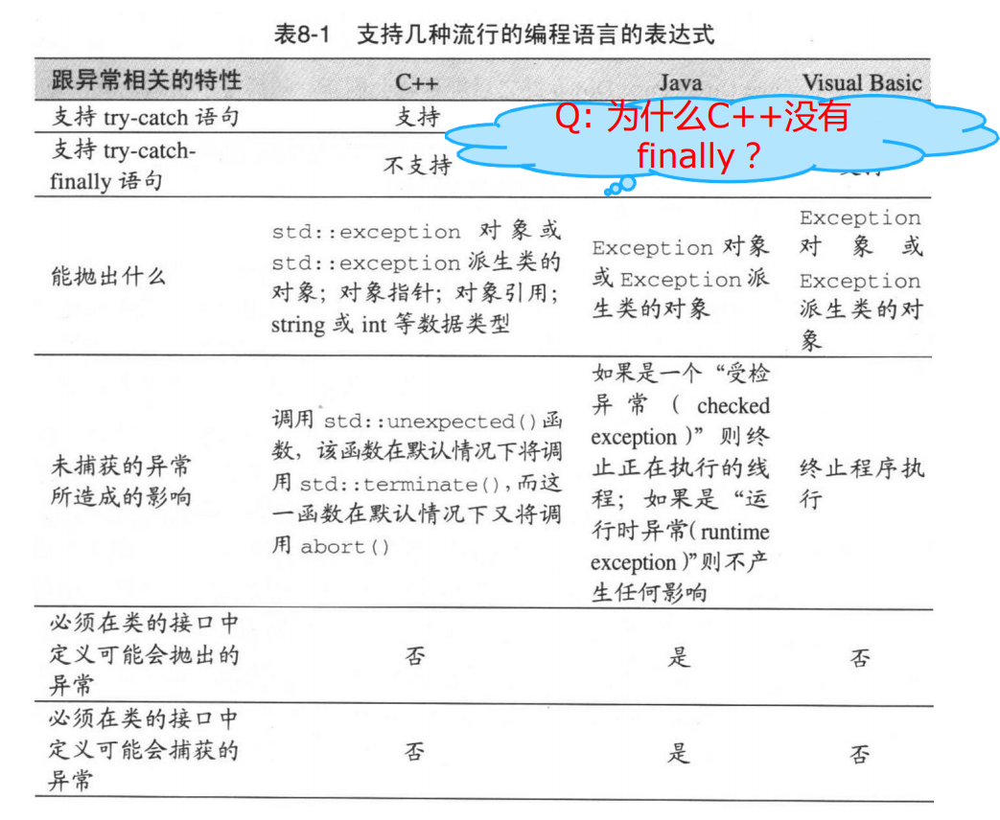
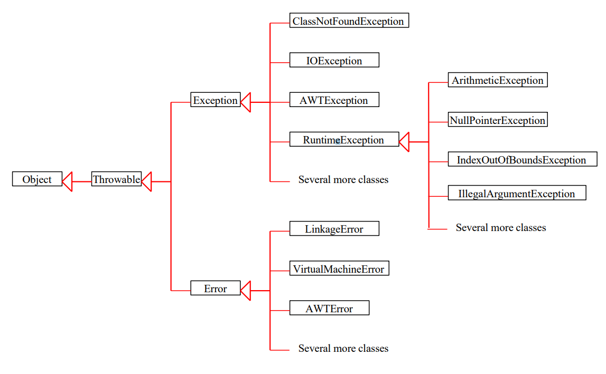
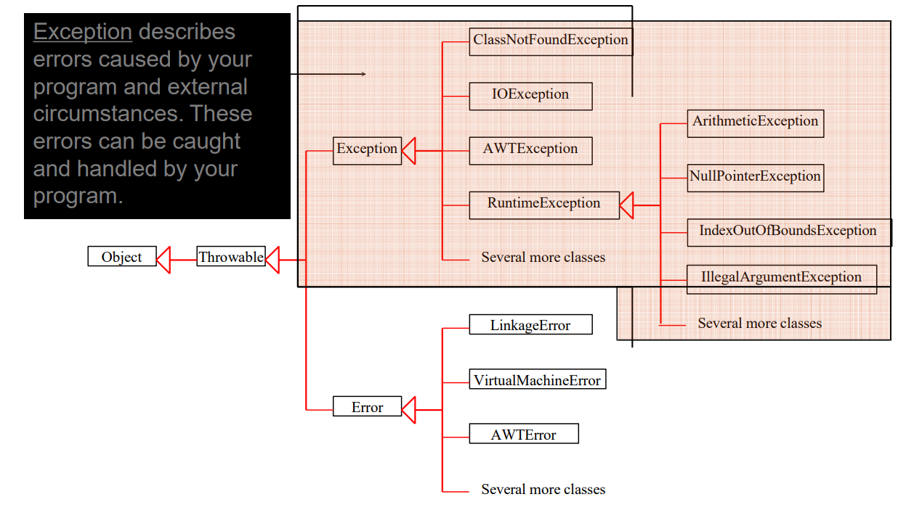
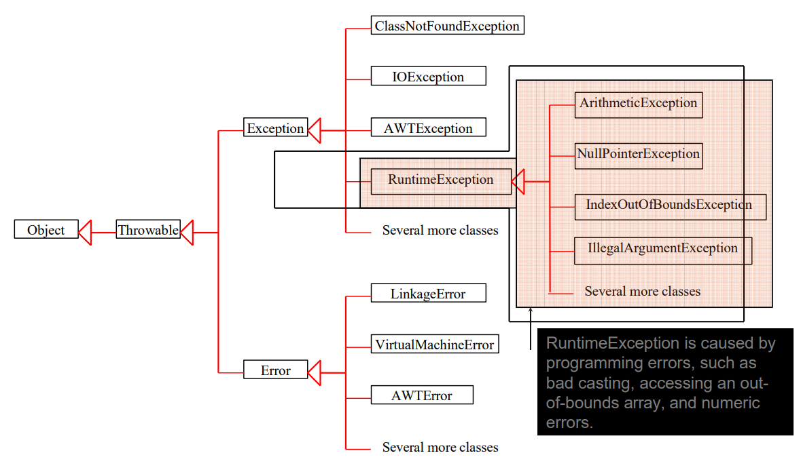
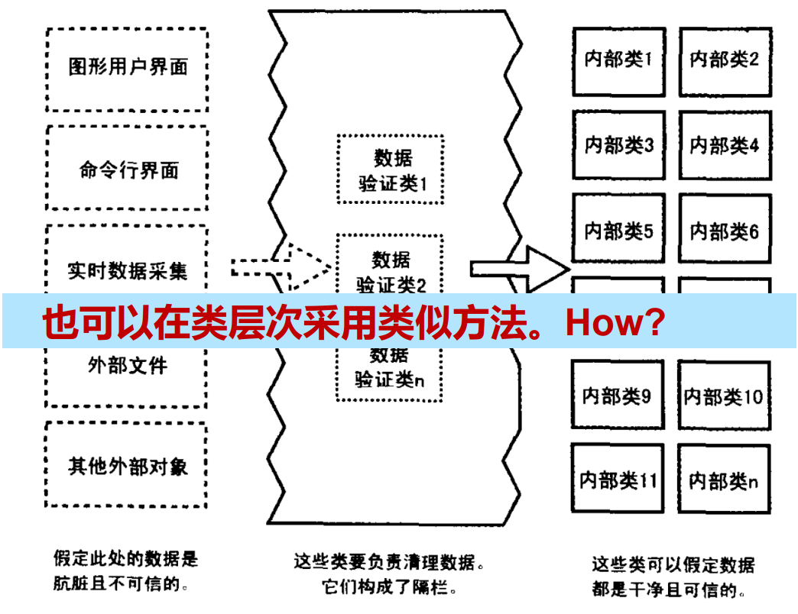
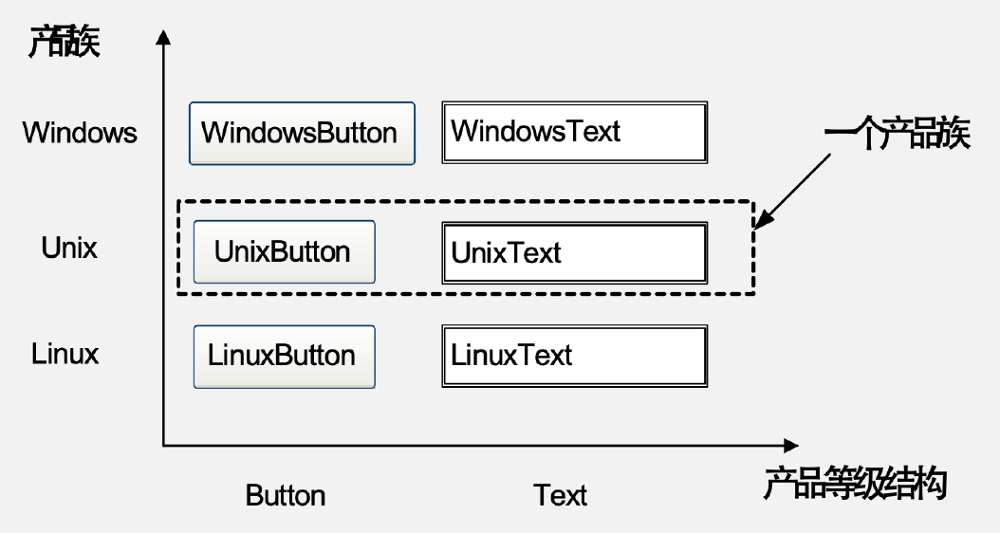
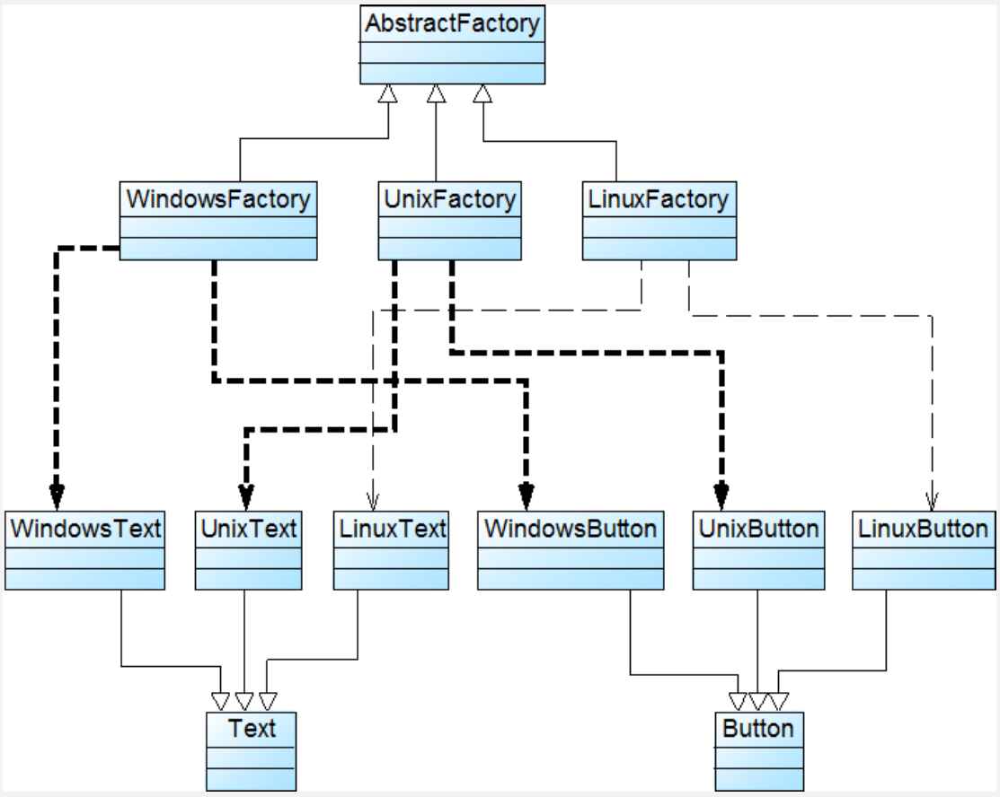
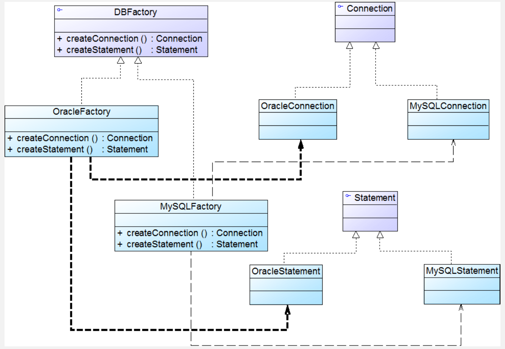

Lec10-Factory
---
1. 一共分为创建型、结构性和行为性三种设计模式
2. 迭代完成后添加模块完成对策略的修改满不满足开闭原则
   1. 确定设计模式的目的：需要修改或增加策略的时候
      1. 修改策略：不符合开闭原则，如果已经迭代了很多个版本则选择增加模块来替代原来的部分。
      2. 增加策略：符合开闭原则
   2. 当我们修改后我们需要new这个对象，search一下，也可以使用反射机制，但是我们在需要用到这个方法的时候都用一段重复的代码来new这个对象
3. 因此我们希望以后新建一个对象的时候可以只修改一个方法来完成创建，这就引出了工厂模式。

# 1. 简单工厂模式
1. 分类
   1. 模式本身使用
      1. 行为型
      2. 创建型
      3. 结构性
   2. 模式的实现上
      1. 类模式：以集成为主要方式实现的
      2. 对象模式：以合成为主要方式实现的

## 1.1. 模式动机
1. 考虑一个简单的软件应用场景，一个软件系统可以提供多个外观不同的按钮（如圆形按钮、矩形按钮、菱形按钮等），这些按钮都源自同一个基类，不过在继承基类后不同的子类修改了部分属性从而使得它们可以呈现不同的外观，如果我们希望在使用这些按钮时，不需要知道这些具体按钮类的名字，只需要知道表示该按钮类的一个参数，并提供一个调用方便的方法，把该参数传入方法即可返回一个相应的按钮对象，此时，就可以使用简单工厂模式。
2. 在一定情况下、一定约束中，给出的设计信息。
3. Java一般会提供一个static的方法，这样就不必实例化工厂对象。

## 1.2. 模式定义
1. 简单工厂模式(Simple Factory Pattern)：又称为**静态工厂**方法(Static Factory Method)模式，它属于**类创建型模式**。
2. 在简单工厂模式中，可以根据参数的不同返回不同类的实例。简单工厂模式专门定义一个类来负责创建其他类的实例，被创建的实例通常都具有共同的父类。
3. 工厂角色提供静态工厂方法来创建其他类的实例，这样子满足了原则：单一职责原则(封装变化)**将对象的创建和使用分离**(创建本质上和使用上强耦合)，但这样子可以将复杂度进行降低，同时分离开之后变化的部分和不变的部分也就分离开了，但是对开闭原则的支持不太好



## 1.3. 模式结构
1. 简单工厂模式包含如下角色：
   1. Factory：工厂角色
   2. Product：抽象产品角色
   3. ConcreteProduct：具体产品角色

## 1.4. 模式分析
1. 分析如下代码：可以使用策略模式进行修改

```java
// 代码复杂，难以维护
public void pay(String type)
{
  if(type.equalsIgnoreCase("cash")){
    //现金支付处理代码
  }
  else if(type.equalsIgnoreCase("creditcard")){
    //信用卡支付处理代码
  }
  else if(type.equalsIgnoreCase("voucher")){
    //代金券支付处理代码
  }
  else{
  }
}
```

2. 重构后的代码：抽象和具体成为了工厂的产品，没有办法开闭原则，如果工厂进行修改则会导致大规模的修改

```java
// 抽象支付类
public abstract class AbstractPay{
  public abstract void pay();
}
// 具体支付类
public class CashPay extends AbstractPay{
  public void pay(){
  //现金支付处理代码
  }
}
// 支付工厂
public class PayMethodFactory{
  public static AbstractPay getPayMethod(String type){
    if(type.equalsIgnoreCase("cash")){
      return new CashPay(); //根据参数创建具体产品
    }
    else if(type.equalsIgnoreCase("creditcard")){
      return new CreditcardPay(); //根据参数创建具体产品
    }
  }
}
```

3. **将对象的创建和对象本身业务处理分离**可以**降低系统的耦合度**，使得两者修改起来都相对容易。
4. 在调用工厂类的工厂方法时，由于工厂方法是**静态方法**，使用起来很方便，可通过类名直接调用，而且只需要传入一个简单的参数即可，在实际开发中，还可以在调用时将所传入的参数保存在XML等格式的**配置文件**中，修改参数时无须修改任何Java源代码。
5. 简单工厂模式最大的问题在于**工厂类的职责相对过重**，增加新的产品需要修改工厂类的判断逻辑，这一点**与开闭原则**是相违背的。
6. 简单工厂模式的要点在于：**当你需要什么，只需要传入一个正确的参数，就可以获取你所需要的对象，而无须知道其创建细节**。

## 1.5. 模式实例与解析
1. 实例：权限管理
   1. 在某OA系统中，系统根据对比用户在登录时输入的账号和密码以及在数据库中存储的账号和密码是否一致来进行身份验证，如果验证通过，则取出存储在数据库中的用户权限等级（以整数形式存储），根据不同的权限等级创建不同等级的用户对象，不同等级的用户对象拥有不同的操作权限。现使用简单工厂模式来设计该权限管理模块。
   2. 相同权限的怎么处理，不同权限的怎么处理等等问题



## 1.6. 模式优缺点

### 1.6.1. 简单工厂模式的优点
1. 工厂类含有必要的判断逻辑，可以决定在什么时候创建哪一个产品类的实例，客户端可以免除直接创建产品对象的责任，而仅仅"消费"产品；简单工厂模式通过这种做法**实现了对责任的分割，它提供了专门的工厂类用于创建对象**。
2. **客户端无须知道所创建的具体产品类的类名，只需要知道具体产品类所对应的参数即可**，对于一些复杂的类名，通过简单工厂模式可以减少使用者的记忆量。
3. **通过引入配置文件，可以在不修改任何客户端代码的情况下更换和增加新的具体产品类**，在一定程度上提高了系统的灵活性。

### 1.6.2. 简单工厂模式的缺点
1. 由于**工厂类集中了所有产品创建逻辑**，一旦不能正常工作，整个系统都要受到影响。
2. 使用简单工厂模式将会**增加系统中类的个数**，在一定程序上增加了系统的复杂度和理解难度。
3. **系统扩展困难，一旦添加新产品就不得不修改工厂逻辑，在产品类型较多时**，有可能造成工厂逻辑过于复杂，不利于系统的扩展和维护。只是把分散在系统各个地方的变化汇总到了一起。
4. 简单工厂模式由于使用了静态工厂方法，造成**工厂角色无法形成基于继承的等级结构**。

## 1.7. 模式适用环境
1. 在以下情况下可以使用简单工厂模式：
   1. **工厂类负责创建的对象比较少**：由于创建的对象较少，不会造成工厂方法中的业务逻辑**太过复杂**(如果扩展使比较少的)
   2. **客户端只知道传入工厂类的参数，对于如何创建对象不关心**：客户端既不需要关心创建细节，甚至连类名都不需要记住，只需要知道类型所对应的参数(比如只知道名称参数)

## 1.8. 模式应用
1. 在JDK类库中广泛使用了**简单工厂模式**，如工具类java.text.DateFormat，它用于格式化一个本地日期或者时间。

```java
public final static DateFormat getDateInstance();
public final static DateFormat getDateInstance(int style);
public final static DateFormat getDateInstance(int style,Locale locale);
```

2. Java加密技术：对称加密和非对称加密，但是变化比较少

```java
//获取不同加密算法的密钥生成器
KeyGenerator keyGen=KeyGenerator.getInstance("DESede");
//创建密码器
Cipher cp=Cipher.getInstance("DESede");
```

## 1.9. 模式扩展
1. 简单工厂模式的简化：在有些情况下工厂类可以由抽象产品角色扮演，一个抽象产品类同时也是子类的工厂，也就是说把静态工厂方法写到抽象产品类中。
2. 有些情况下，产品本身只提供一两个方法，此时抽象产品可以和简单工厂进行角色合并。



# 2. 工厂方法模式

## 2.1. 简单工厂模式的不足
1. 在简单工厂模式中，只提供了一个工厂类，该工厂类处于对产品类进行实例化的中心位置，它知道每一个产品对象的创建细节，并决定何时实例化哪一个产品类。**简单工厂模式最大的缺点是当有新产品要加入到系统中时，必须修改工厂类，加入必要的处理逻辑，这违背了"开闭原则"**。在简单工厂模式中，所有的产品都是由同一个工厂创建，工厂类职责较重，业务逻辑较为复杂，具体产品与工厂类之间的耦合度高，严重影响了系统的灵活性和扩展性，而工厂方法模式则可以很好地解决这一问题。

## 2.2. 模式动机
1. 考虑这样一个系统，按钮工厂类可以返回一个具体的按钮实例，如圆形按钮、矩形按钮、菱形按钮等。在这个系统中，如果需要增加一种新类型的按钮，如椭圆形按钮，那么**除了增加一个新的具体产品类之外，还需要修改工厂类的代码，这就使得整个设计在一定程度上违反了"开闭原则"**。



2. 现在对该系统进行修改，不再设计一个按钮工厂类来统一负责所有产品的创建，而是**将具体按钮的创建过程交给专门的工厂子类去完成，我们先定义一个抽象的按钮工厂类，再定义具体的工厂类来生成圆形按钮、矩形按钮、菱形按钮等**，它们实现在抽象按钮工厂类中定义的方法。这种抽象化的结果使这种结构**可以在不修改具体工厂类的情况下引进新的产品**，如果出现新的按钮类型，只需要为这种新类型的按钮创建一个具体的工厂类就可以获得该新按钮的实例，这一特点无疑使得工厂方法模式具有超越简单工厂模式的优越性，**更加符合"开闭原则"**。
3. 使用工厂方法模式设计的按钮工厂


## 2.3. 模式定义
1. 工厂方法模式(Factory Method Pattern)又称为工厂模式，也叫**虚拟构造器(Virtual Constructor)模式或者多态工厂(Polymorphic Factory)模式**，它属于**类创建型模式**。
2. 在工厂方法模式中，工厂父类负责定义创建产品对象的公共接口，而工厂子类则负责生成具体的产品对象，这样做的目的是将产品类的实例化操作延迟到工厂子类中完成，即通过工厂子类来确定究竟应该实例化哪一个具体产品类。
3. 工厂方法是以继承方法为主，工厂子类是继承工厂父类的。
4. 按钮只有被创建时才需要确定类型(任意对象使用要尽可能在设计时延迟，延迟到必须要进行实例化的时候)，在抽象工厂，我们使用的是抽象产品，而不是具体的某个对象
5. 工厂方法
   1. 变化的部分：变化的是产品的服务
   2. 不变的部分：对象的使用是不变的

## 2.4. 模式结构


## 2.5. 模式分析
1. 工厂方法模式是简单工厂模式的进一步抽象和推广。由于使用了面向对象的多态性，工厂方法模式保持了简单工厂模式的优点，而且克服了它的缺点。**在工厂方法模式中，核心的工厂类不再负责所有产品的创建，而是将具体创建工作交给子类去做**。这个核心类仅仅负责给出具体工厂必须实现的接口，而不负责哪一个产品类被实例化这种细节，这使得**工厂方法模式可以允许系统在不修改工厂角色的情况下引进新产品**。
2. 当系统扩展需要添加新的产品对象时，仅仅需要添加一个具体产品对象以及一个具体工厂对象，原有工厂对象不需要进行任何修改，也不需要修改客户端，**很好地符合了"开闭原则"**。而简单工厂模式在添加新产品对象后不得不修改工厂方法，扩展性不好。**工厂方法模式退化(抽象工厂和具体工厂合并)后可以演变成简单工厂模式**。

```java
// 抽象工厂类代码
public abstract class PayMethodFactory
{
  public abstract AbstractPay getPayMethod();
}
// 具体工厂类代码
public class CashPayFactory extends PayMethodFactory{
  public AbstractPay getPayMethod(){
    return new CashPay();
  }
}
// 客户类代码片段
PayMethodFactory factory;
AbstractPay payMethod;
factory=new CashPayFactory();
payMethod =factory.getPayMethod();
payMethod.pay();
```

1. 为了提高系统的可扩展性和灵活性，在**定义工厂和产品时都必须使用抽象层**，如果需要更换产品类，只需要更换对应的工厂即可，其他代码不需要进行任何修改。
2. 工厂方法生成的产品都是一类产品
3. 配置文件代码：
   1. 在实际的应用开发中，一般将具体工厂类的实例化过程进行改进，不直接使用new关键字来创建对象，而是将具体类的类名写入**配置文件**中，再通过Java的**反射机制**，读取XML格式的配置文件，根据存储在XML文件中的类名字符串生成对象。

```xml
<?xml version="1.0"?>
<config>
  <className>CashPayFactory</className>
</config>
```

8. Java反射(Java Reflection)：
   1. 是指**在程序运行时获取已知名称的类或已有对象的相关信息的一种机制**，包括类的方法、属性、超类等信息，还包括实例的创建和实例类型的判断等。可通**过Class类的forName()方法**返回与带有给定字符串名的类或接口相关联的Class对象，再通过newInstance()方法创建此对象所表示的类的一个新实例，即**通过一个类名字符串得到类的实例**。

```java
//创建一个字符串类型的对象
Class c = Class.forName("String");
Object obj = c.newInstance();
return obj;
```

9. 工具类XMLUtil代码片段：

```java
//创建DOM文档对象
DocumentBuilderFactory dFactory =
DocumentBuilderFactory.newInstance();
DocumentBuilder builder = dFactory.newDocumentBuilder();
Document doc;
doc = builder.parse(new File("config.xml"));
//获取包含类名的文本节点
NodeList nl = doc.getElementsByTagName("className");
Node classNode=nl.item(0).getFirstChild();
String cName=classNode.getNodeValue();
//通过类名生成实例对象并将其返回
Class c=Class.forName(cName);
Object obj=c.newInstance();
return obj;
```

10. 修改后的客户类代码片段

```java
PayMethodFactory factory;
AbstractPay payMethod;
factory=(PayMethodFactory)XMLUtil.getBean(); //getBean()的返回类型为Object，此处需要进行强制类型转换
payMethod =factory.getPayMethod();
payMethod.pay();
```

## 2.6. 模式实例与解析
1. 实例：日志记录器
2. 某系统日志记录器要求支持多种日志记录方式，如文件记录、数据库记录等，且用户可以根据要求动态选择日志记录方式，现使用工厂方法模式设计该系统。



## 2.7. 模式优缺点

### 2.7.1. 工厂方法模式的优点
1. 在工厂方法模式中，工厂方法用来创建客户所需要的产品，同时还向客户隐藏了哪种具体产品类将被实例化这一细节，**用户只需要关心所需产品对应的工厂，无须关心创建细节，甚至无须知道具体产品类的类名**。
2. 基于工厂角色和产品角色的多态性设计是工厂方法模式的关键。它能够使**工厂可以自主确定创建何种产品对象，而如何创建这个对象的细节则完全封装在具体工厂内部**。工厂方法模式之所以又被称为多态工厂模式，是因为所有的具体工厂类都具有同一抽象父类。
3. 使用工厂方法模式的另一个优点是在**系统中加入新产品时，无须修改抽象工厂和抽象产品提供的接口，无须修改客户端，也无须修改其他的具体工厂和具体产品**，而**只要添加一个具体工厂和具体产品就可以了**。这样，系统的可扩展性也就变得非常好，完全符合"开闭原则"。

### 2.7.2. 工厂方法模式的缺点
1. 在添加新产品时，**需要编写新的具体产品类，而且还要提供与之对应的具体工厂类，系统中类的个数将成对增加，在一定程度上增加了系统的复杂度**，有更多的类需要编译和运行，会给系统带来一些额外的开销。
2. 由于考虑到系统的可扩展性，需要引入抽象层，在客户端代码中均使用抽象层进行定义，**增加了系统的抽象性和理解难度**，且在实现时可能需要用到DOM、反射等技术，增加了系统的实现难度。

## 2.8. 模式适用环境
1. 在以下情况下可以使用工厂方法模式：
   1. **一个类不知道它所需要的对象的类**：在工厂方法模式中，客户端不需要知道具体产品类的类名，只需要知道所对应的工厂即可，具体的产品对象由具体工厂类创建；客户端需要知道创建具体产品的工厂类。
   2. **一个类通过其子类来指定创建哪个对象**：在工厂方法模式中，对于抽象工厂类只需要提供一个创建产品的接口，而由其子类来确定具体要创建的对象，利用面向对象的多态性和里氏代换原则，在程序运行时，子类对象将覆盖父类对象，从而使得系统更容易扩展。
   3. **将创建对象的任务委托给多个工厂子类中的某一个，客户端在使用时可以无须关心是哪一个工厂子类创建产品子类，需要时再动态指定**，可将具体工厂类的类名存储在配置文件或数据库中。
2. 希望能够推迟创建的时候

# 3. 抽象工厂模式
1. 在工厂方法模式中具体工厂负责生产具体的产品，每一个具体工厂对应一种具体产品，工厂方法也具有唯一性，一般情况下，一个具体工厂中只有一个工厂方法或者一组重载的工厂方法。但是有时候**我们需要一个工厂可以提供多个产品对象，而不是单一的产品对象**。
2. 为了更清晰地理解工厂方法模式，需要先引入两个概念：
   1. **产品等级结构：产品等级结构即产品的继承结构**，如一个抽象类是电视机，其子类有海尔电视机、海信电视机、TCL电视机，则抽象电视机与具体品牌的电视机之间构成了一个产品等级结构，抽象电视机是父类，而具体品牌的电视机是其子类。
   2. **产品族**：在抽象工厂模式中，**产品族是指由同一个工厂生产的，位于不同产品等级结构中的一组产品**，如海尔电器工厂生产的海尔电视机、海尔电冰箱，海尔电视机位于电视机产品等级结构中，海尔电冰箱位于电冰箱产品等级结构中。
3. 当系统所提供的工厂所需生产的具体产品并不是一个简单的对象，而是**多个位于不同产品等级结构中属于不同类型的具体产品时**需要使用抽象工厂模式。抽象工厂模式是所有形式的工厂模式中最为抽象和最具一般性的一种形态。
4. 抽象工厂模式与工厂方法模式最大的区别在于，**工厂方法模式针对的是一个产品等级结构，而抽象工厂模式则需要面对多个产品等级结构**，一个工厂等级结构可以负责多个不同产品等级结构中的产品对象的创建。当一个工厂等级结构可以创建出分属于不同产品等级结构的一个产品族中的所有对象时，抽象工厂模式比工厂方法模式更为简单、有效率。
5. 抽象工厂模式(Abstract Factory Pattern)：提供一个**创建一系列相关或相互依赖对象的接口**，而无须指定它们具体的类。抽象工厂模式又称为Kit模式，属于对象创建型模式。
   1. 调用kit很可能是抽象工厂模式。
   2. 判断是类模式还是对象模式：重点是类和对象哪个更为重要
6. **Abstract Factory Pattern**: Provide an interface for creating **families of related or dependent objects** without specifying their concrete classes. 
7. Frequency of use: high



## 3.1. 模式结构
1. 抽象工厂模式包含如下角色：
   1. AbstractFactory：抽象工厂
   2. ConcreteFactory：具体工厂
   3. AbstractProduct：抽象产品
   4. Product：具体产品






2. 抽象工厂类的典型代码如下

```java
public abstract class AbstractFactory{
  public abstract AbstractProductA createProductA();
  public abstract AbstractProductB createProductB();
}
```

3. 具体工厂类的典型代码如下：

```java
public class ConcreteFactory1 extends AbstractFactory{
  public AbstractProductA createProductA(){
    return new ConcreteProductA1();
  }
  public AbstractProductB createProductB(){
    return new ConcreteProductB1();
  }
}
```

## 3.2. 模式示例与解析
1. 实例一：电器工厂：一个电器工厂可以产生多种类型的电器，如海尔工厂可以生产海尔电视机、海尔空调等，TCL工厂可以生产TCL电视机、TCL空调等，相同品牌的电器构成一个产品族，而相同类型的电器构成了一个产品等级结构，现使用抽象工厂模式模拟该场景。


2. 实例二：数据库操作工厂：某系统为了改进数据库操作的性能，自定义数据库连接对象Connection和语句对象Statement，可针对不同类型的数据库提供不同的连接对象和语句对象，如提供Oracle或SQL Server专用连接类和语句类，而且用户可以通过配置文件等方式根据实际需要动态更换系统数据库。使用抽象工厂模式设计该系统。



## 3.3. 抽象工厂模式的优点
1. 抽象工厂模式**隔离了具体类的生成**，使得客户并不需要知道什么被创建。由于这种隔离，更换一个具体工厂就变得相对容易。所有的具体工厂都实现了抽象工厂中定义的那些公共接口，因此**只需改变具体工厂的实例，就可以在某种程度上改变整个软件系统的行为**。另外，应用抽象工厂模式**可以实现高内聚低耦合的设计目的**，因此抽象工厂模式得到了广泛的应用。
2. 当一个产品族中的多个对象被设计成一起工作时，它**能够保证客户端始终只使用同一个产品族中的对象**。这对一些需要根据当前环境来决定其行为的软件系统来说，是一种非常实用的设计模式。
3. **增加新的具体工厂和产品族很方便，无须修改已有系统，符合"开闭原则"**。
   1. 增加新的产品族符合开闭原则
   2. 增加新的产品等级结构麻烦
4. 实现开闭原则最重要的原则：依赖倒转
5. 保证依赖倒转能够实现的原则：里氏替代原则
6. 类中存在具体耦合是很难实现开闭原则的

## 3.4. 抽象工厂模式的缺点
1. 在添加新的产品对象时，**难以扩展抽象工厂来生产新种类的产品**，这是因为在抽象工厂角色中规定了所有可能被创建的产品集合，要支持新种类的产品就意味着要对该接口进行扩展，而这将涉及到对抽象工厂角色及其所有子类的修改，显然会带来较大的不便。开闭原则的倾斜性(**增加新的工厂和产品族容易，增加新的产品等级结构麻烦**)

## 3.5. 在以下情况下可以使用抽象工厂模式
1. 一个系统**不应当依赖于产品类实例如何被创建、组合和表达的细节**，这对于所有类型的工厂模式都是重要的。
2. 系统中有**多于一个的产品族**，而每次只使用其中某一产品族。
3. **属于同一个产品族的产品将在一起使用**，这一约束必须在系统的设计中体现出来。
4. 系统提供一个产品类的库，**所有的产品以同样的接口出现**，从而**使客户端不依赖于具体实现**。

# 4. 模式扩展

## 4.1. "开闭原则"的倾斜性
1. "开闭原则"要求系统对扩展开放，对修改封闭，通过扩展达到增强其功能的目的。对于涉及到多个产品族与多个产品等级结构的系统，其功能增强包括两方面：
   1. 增加产品族：**对于增加新的产品族，工厂方法模式很好的支持了"开闭原则"，对于新增加的产品族，只需要对应增加一个新的具体工厂即可，对已有代码无须做任何修改**。
   2. 增加新的产品等级结构：**对于增加新的产品等级结构，需要修改所有的工厂角色，包括抽象工厂类，在所有的工厂类中都需要增加生产新产品的方法，不能很好地支持"开闭原则"**。
2. 抽象工厂模式的这种性质称为"开闭原则"的倾斜性，抽象工厂模式以一种倾斜的方式支持增加新的产品，它为新产品族的增加提供方便，但不能为新的产品等级结构的增加提供这样的方便。

## 4.2. 工厂模式的退化
1. 当抽象工厂模式中每一个具体工厂类只创建一个产品对象，也就是**只存在一个产品等级结构时，抽象工厂模式退化成工厂方法模式**；**当工厂方法模式中抽象工厂与具体工厂合并，提供一个统一的工厂来创建产品对象，并将创建对象的工厂方法设计为静态方法时，工厂方法模式退化成简单工厂模式**。