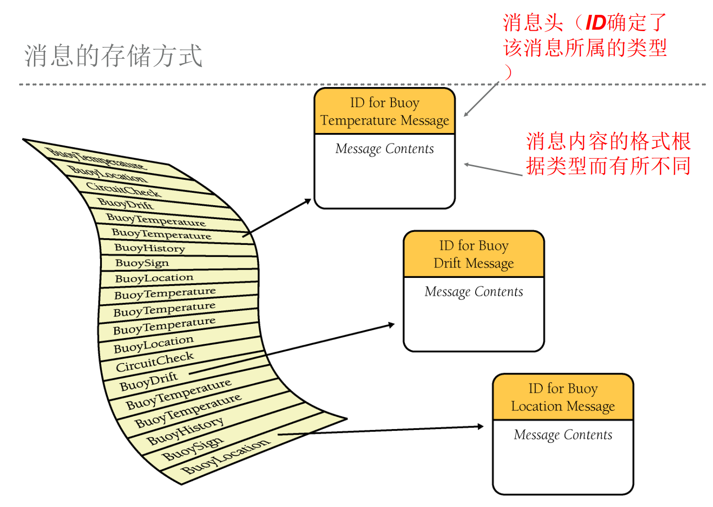

Lec11-Creational Pattern
---

# 1. 建造者模式

## 1.1. 模式动机
1. 无论是在现实世界中还是在软件系统中，都存在一些复杂的对象，它们拥有多个组成部分，如汽车，它包括车轮、方向盘、发送机等各种部件。而对于大多数用户而言，无须知道这些部件的装配细节，也几乎不会使用单独某个部件，而是使用一辆完整的汽车，可以通过建造者模式对其进行设计与描述，**建造者模式可以将部件和其组装过程分开，一步一步创建一个复杂的对象**。用户只需要指定复杂对象的类型就可以得到该对象，而无须知道其内部的具体构造细节。



2. 在软件开发中，也存在大量类似汽车一样的复杂对象，它们拥有一系列成员属性，这些成员属性中有些是引用类型的成员对象。而且在这些复杂对象中，还可能存在一些限制条件，如某些属性没有赋值则复杂对象不能作为一个完整的产品使用；有些属性的赋值必须按照某个顺序，一个属性没有赋值之前，另一个属性可能无法赋值等。
3. 复杂对象相当于一辆有待建造的汽车，而对象的属性相当于汽车的部件，建造产品的过程就相当于组合部件的过程。由于组合部件的过程很复杂，因此，这些部件的组合过程往往被"外部化"到一个称作建造者的对象里，建造者返还给客户端的是一个已经建造完毕的完整产品对象，而用户无须关心该对象所包含的属性以及它们的组装方式，这就是建造者模式的模式动机。

## 1.2. 模式定义
1. 建造者模式(Builder Pattern)：将**一个复杂对象的构建与它的表示分离**，使得**同样的构建过程可以创建不同的表示**。
2. Builder Pattern: Separate the construction of a complex object from its representation so that the same construction process can create different representations.
3. 建造者模式是**一步一步创建一个复杂的对象**，它允许用户只通过指定复杂对象的类型和内容就可以构建它们，用户不需要知道内部的具体构建细节。建造者模式属于对象创建型模式。根据中文翻译的不同，建造者模式又可以称为生成器模式。
4. 建造者模式
   1. 变化：产品的细节
   2. 不变：建造的过程

## 1.3. 模式结构


1. 建造者模式包含如下角色：
   1. Builder：抽象建造者
   2. ConcreteBuilder：具体建造者
   3. Director：指挥者
   4. Product：产品角色

## 1.4. 模式分析
1. 一个典型的复杂对象其类代码示例如下：

```java
public class Product{
  private String partA; //可以是任意类型
  private String partB;
  private String partC;
  //partA的Getter方法和Setter方法省略
  //partB的Getter方法和Setter方法省略
  //partC的Getter方法和Setter方法省略
}
```

2. 抽象建造者类中定义了产品的创建方法和返回方法，其典型代码如下：

```java
public abstract class Builder{
  protected Product product=new Product();
  public abstract void buildPartA();
  public abstract void buildPartB();
  public abstract void buildPartC();
  public Product getResult(){
    return product;
  }
}
```

3. 建造者模式的结构中还引入了一个指挥者类Director，该类的作用主要有两个：一方面它隔离了客户与生产过程；另一方面它负责控制产品的生成过程。指挥者针对抽象建造者编程，客户端只需要知道具体建造者的类型，即可通过指挥者类调用建造者的相关方法，返回一个完整的产品对象。
4. 控制生成过程
5. 指挥者类的代码示例如下：

```java
public class Director{
  private Builder builder;
  public Director(Builder builder){
    this.builder=builder;
  }
  public void setBuilder(Builder builder){
    this.builder=builer;
  }
  public Product construct(){
    builder.buildPartA();
    builder.buildPartB();
    builder.buildPartC();
    return builder.getResult();
  }
}
```

5. 客户端类代码片段：

```java
Builder builder = new ConcreteBuilder();
Director director = new Director(builder);
Product product = director.construct();
```

6. 在客户端代码中，无须关心产品对象的具体组装过程，只需确定具体建造者的类型即可，建造者模式将复杂对象的构建与对象的表现分离开来，这样使得同样的构建过程可以创建出不同的表现。

## 1.5. 建造者模式实例与解析

### 1.5.1. 实例：KFC套餐
1. 建造者模式可以用于描述KFC如何创建套餐：套餐是一个复杂对象，它一般包含主食（如汉堡、鸡肉卷等）和饮料（如果汁、可乐等）等组成部分，不同的套餐有不同的组成部分，而KFC的服务员可以根据顾客的要求，一步一步装配这些组成部分，构造一份完整的套餐，然后返回给顾客。
2. KFC使用了建造者模式


### 1.5.2. 建造者模式的优点
1. 在建造者模式中，**客户端不必知道产品内部组成的细节，将产品本身与产品的创建过程解耦，使得相同的创建过程可以创建不同的产品对象**。
2. 每一个具体建造者都相对独立，而与其他的具体建造者无关，因此可以很方便地替换具体建造者或增加新的具体建造者，**用户使用不同的具体建造者即可得到不同的产品对象**。
3. **可以更加精细地控制产品的创建过程**。将复杂产品的创建步骤分解在不同的方法中，使得创建过程更加清晰，也更方便使用程序来控制创建过程。
4. **增加新的具体建造者无须修改原有类库的代码，指挥者类针对抽象建造者类编程，系统扩展方便，符合"开闭原则"**。

### 1.5.3. 建造者模式的缺点如下：
1. 建造者模式所创建的产品一般具有较多的共同点，其组成部分相似，如果产品之间的差异性很大，则不适合使用建造者模式，因此其使用范围受到一定的限制。
2. 如果产品的内部变化复杂，可能会导致需要定义很多具体建造者类来实现这种变化，导致系统变得很庞大。

### 1.5.4. 在以下情况下可以使用建造者模式：
1. 需要生成的产品对象有复杂的内部结构，这些产品对象通常包含多个成员属性。
2. 需要生成的产品对象的属性相互依赖，需要指定其生成顺序。
3. 对象的创建过程独立于创建该对象的类。在建造者模式中引入了指挥者类，将创建过程封装在指挥者类中，而不在建造者类中。
4. 隔离复杂对象的创建和使用，并使得相同的创建过程可以创建不同的产品。

## 1.6. 模式应用

### 1.6.1. JavaMail（一步一步构造一个完整的邮件对象，然后发送）

```java
//由邮件会话对象新建一个邮件消息对象
MimeMessage message=new MimeMessage(session);
//设置邮件地址
InternetAddress from=new InternetAddress("sunny@test.com");
message.setFrom(from);//设置发件人
InternetAddress to=new InternetAddress(to_mail);
message.setRecipient(Message.RecipientType.TO,to);//设置
收件人，并设置其接收类型为TO
message.setSubject(to_title);//设置主题
message.setText(to_content);//设置信件内容
message.setSentDate(new Date());//设置发信时间
message.saveChanges();//存储邮件信息
Transport transport=session.getTransport("smtp");
transport.connect("smtp.test.com","test","test");
transport.sendMessage(message,message.getAllRecipients());
```

### 1.6.2. 地图或任务
1. 在很多游戏软件中，地图包括天空、地面、背景等组成部分，人物角色包括人体、服装、装备等组成部分，可以使用建造者模式对其进行设计，通过不同的具体建造者创建不同类型的地图或人物。

## 1.7. 模式比较
1. 建造者模式的简化
   1. **省略抽象建造者角色**：如果系统中只需要一个具体建造者的话，可以省略掉抽象建造者。
   2. **省略指挥者角色**：在具体建造者只有一个的情况下，如果抽象建造者角色已经被省略掉，那么还可以省略指挥者角色，让Builder角色扮演指挥者与建造者双重角色
2. 建造者模式与抽象工厂模式的比较
   1. 与抽象工厂模式相比，建造者模式返回一个组装好的完整产品，而抽象工厂模式返回一系列相关的产品，这些产品位于不同的产品等级结构，构成了一个产品族。
   2. 在抽象工厂模式中，客户端实例化工厂类，然后调用工厂方法获取所需产品对象，而在建造者模式中，客户端可以不直接调用建造者的相关方法，而是通过指挥者类来指导如何生成对象，包括对象的组装过程和建造步骤，它侧重于一步步构造一个复杂对象，返回一个完整的对象。
   3. 如果将抽象工厂模式看成汽车配件生产工厂，生产一个产品族的产品，那么建造者模式就是一个汽车组装工厂，通过对部件的组装可以返回一辆完整的汽车。

## 1.8. 建造者小结
1. 建造者模式将一个复杂对象的构建与它的表示分离，使得同样的构建过程可以创建不同的表示。建造者模式是一步一步创建一个复杂的对象，它允许用户只通过指定复杂对象的类型和内容就可以构建它们，用户不需要知道内部的具体构建细节。建造者模式属于对象创建型模式。
2. 建造者模式包含如下四个角色：抽象建造者为创建一个产品对象的各个部件指定抽象接口；具体建造者实现了抽象建造者接口，实现各个部件的构造和装配方法，定义并明确它所创建的复杂对象，也可以提供一个方法返回创建好的复杂产品对象；产品角色是被构建的复杂对象，包含多个组成部件；指挥者负责安排复杂对象的建造次序，指挥者与抽象建造者之间存在关联关系，可以在其construct()建造方法中调用建造者对象的部件构造与装配方法，完成复杂对象的建造。
3. 在建造者模式的结构中引入了一个指挥者类，该类的作用主要有两个：一方面它隔离了客户与生产过程；另一方面它负责控制产品的生成过程。指挥者针对抽象建造者编程，客户端只需要知道具体建造者的类型，即可通过指挥者类调用建造者的相关方法，返回一个完整的产品对象。
4. 建造者模式的主要优点在于客户端不必知道产品内部组成的细节，将产品本身与产品的创建过程解耦，使得相同的创建过程可以创建不同的产品对象，每一个具体建造者都相对独立，而与其他的具体建造者无关，因此可以很方便地替换具体建造者或增加新的具体建造者，符合"开闭原则"，还可以更加精细地控制产品的创建过程；其主要缺点在于由于建造者模式所创建的产品一般具有较多的共同点，其组成部分相似，因此其使用范围受到一定的限制，如果产品的内部变化复杂，可能会导致需要定义很多具体建造者类来实现这种变化，导致系统变得很庞大。
5. 建造者模式适用情况包括：需要生成的产品对象有复杂的内部结构，这些产品对象通常包含多个成员属性；需要生成的产品对象的属性相互依赖，需要指定其生成顺序；对象的创建过程独立于创建该对象的类；隔离复杂对象的创建和使用，并使得相同的创建过程可以创建不同类型的产品。

# 2. 原型模式

## 2.1. 模型动机
1. 在面向对象系统中，使用原型模式来复制一个对象自身，从而克隆出多个与原型对象一模一样的对象。
2. 在软件系统中，有些对象的创建过程较为复杂，而且有时候需要频繁创建，原型模式通过给出一个原型对象来指明所要创建的对象的类型，然后用复制这个原型对象的办法创建出更多同类型的对象，这就是原型模式的意图所在。

## 2.2. 模式定义
1. 原型模式(Prototype Pattern)：原型模式是一种对象创建型模式，用原型实例指定创建对象的种类，并且通过复制这些原型创建新的对象。原型模式允许一个对象再创建另外一个可定制的对象，无须知道任何创建的细节。
2. Prototype Pattern: Specify the kind of objects to create using a prototypical instance, and create new objects by copying this prototype.
3. 原型模式的基本工作原理是通过将一个原型对象传给那个要发动创建的对象，这个要发动创建的对象通过请求原型对象拷贝原型自己来实现创建过程。

## 2.3. 模型结构


1. 原型模式包含如下角色：
   1. Prototype：抽象原型类
   2. ConcretePrototype：具体原型类
   3. Client：客户类

## 2.4. 模式分析
1. 在原型模式结构中定义了一个抽象原型类，所有的Java类都继承自java.lang.Object，而Object类提供一个clone()方法，可以将一个Java对象复制一份。因此在Java中可以直接使用Object提供的clone()方法来实现对象的克隆，Java语言中的原型模式实现很简单。
2. 能够实现克隆的Java类必须实现一个标识接口Cloneable，表示这个Java类支持复制。如果一个类没有实现这个接口但是调用了clone()方法，Java编译器将抛出一个CloneNotSupportedException异常。
3. 实例代码

```java
public class PrototypeDemo implements Cloneable{
  public Object clone(){
    Object object = null;
    try {
      object = super.clone();
    } catch (CloneNotSupportedException exception) {
      System.err.println("Not support cloneable");
    }
    return object;
  }
}
```

4. 通常情况下，一个类包含一些成员对象，在使用原型模式克隆对象时，根据其成员对象是否也克隆，原型模式可以分为两种形式：深克隆和浅克隆。
5. Java语言提供的clone()方法将对象复制了一份并返回给调用者。一般而言，clone()方法满足:
   1. 对任何的对象x，都有x.clone() !=x，即克隆对象与原对象不是同一个对象。
   2. 对任何的对象x，都有x.clone().getClass()==x.getClass()，即克隆对象与原对象的类型一样。
   3. 如果对象x的equals()方法定义恰当，那么x.clone().equals(x)应该成立。

## 2.5. 原型模式实例与解析

### 2.5.1. 实例一：邮件复制（浅克隆）
1. 由于邮件对象包含的内容较多（如发送者、接收者、标题、内容、日期、附件等），某系统中现需要提供一个邮件复制功能，对于已经创建好的邮件对象，可以通过复制的方式创建一个新的邮件对象，如果需要改变某部分内容，无须修改原始的邮件对象，只需要修改复制后得到的邮件对象即可。使用原型模式设计该系统。在本实例中使用浅克隆实现邮件复制，即复制邮件(Email)的同时不复制附件(Attachment)。


## 2.6. 原型模式的优缺点

### 2.6.1. 原型模式的优点
1. 当创建新的对象实例较为复杂时，使用原型模式可以简化对象的创建过程，通过一个已有实例可以提高新实例的创建效率。
2. 可以动态增加或减少产品类。
3. 原型模式提供了简化的创建结构。
4. 可以使用深克隆的方式保存对象的状态。

### 2.6.2. 原型模式的缺点
1. 需要为每一个类配备一个克隆方法，而且这个克隆方法需要对类的功能进行通盘考虑，这对全新的类来说不是很难，但对已有的类进行改造时，不一定是件容易的事，必须修改其源代码，违背了"开闭原则"。
2. 在实现深克隆时需要编写较为复杂的代码。

## 2.7. 模式适用环境

### 2.7.1. 在以下情况下可以使用原型模式：
1. 创建新对象成本较大，新的对象可以通过原型模式对已有对象进行复制来获得，如果是相似对象，则可以对其属性稍作修改。
2. 如果系统要保存对象的状态，而对象的状态变化很小，或者对象本身占内存不大的时候，也可以使用原型模式配合备忘录模式来应用。相反，如果对象的状态变化很大，或者对象占用的内存很大，那么采用状态模式会比原型模式更好。
3. 需要避免使用分层次的工厂类来创建分层次的对象，并且类的实例对象只有一个或很少的几个组合状态，通过复制原型对象得到新实例可能比使用构造函数创建一个新实例更加方便。

## 2.8. 模式应用
1. 原型模式应用于很多软件中，如果每次创建一个对象要花大量时间，原型模式是最好的解决方案。很多软件提供的复制(Ctrl + C)和粘贴(Ctrl + V)操作就是原型模式的应用，复制得到的对象与原型对象是两个类型相同但内存地址不同的对象，通过原型模式可以大大提高对象的创建效率。
2. 在Struts2中为了保证线程的安全性，Action对象的创建使用了原型模式，访问一个已经存在的Action对象时将通过克隆的方式创建出一个新的对象，从而保证其中定义的变量无须进行加锁实现同步，每一个Action中都有自己的成员变量，避免Struts1因使用单例模式而导致的并发和同步问题。
3. 在Spring中，用户也可以采用原型模式来创建新的bean实例，从而实现每次获取的是通过克隆生成的新实例，对其进行修改时对原有实例对象不造成任何影响。

## 2.9. 模式扩展

### 2.9.1. 带原型管理器的原型模式


### 2.9.2. 相似对象的复制
1. 很多情况下，复制所得到的对象与原型对象并不是完全相同的，它们的某些属性值存在异同。通过原型模式获得相同对象后可以再对其属性进行修改，从而获取所需对象。如多个学生对象的信息的区别在于性别、姓名和年龄，而专业、学院、学校等信息都相同，为了简化创建过程，可以通过原型模式来实现相似对象的复制。

## 2.10. 原型小结
1. 原型模式是一种对象创建型模式，用原型实例指定创建对象的种类，并且通过复制这些原型创建新的对象。原型模式允许一个对象再创建另外一个可定制的对象，无须知道任何创建的细节。原型模式的基本工作原理是通过将一个原型对象传给那个要发动创建的对象，这个要发动创建的对象通过请求原型对象拷贝原型自己来实现创建过程。
2. 原型模式包含三个角色：抽象原型类是定义具有克隆自己的方法的接口；具体原型类实现具体的克隆方法，在克隆方法中返回自己的一个克隆对象；让一个原型克隆自身从而创建一个新的对象，在客户类中只需要直接实例化或通过工厂方法等方式创建一个对象，再通过调用该对象的克隆方法复制得到多个相同的对象。
3. 在Java中可以直接使用Object提供的clone()方法来实现对象的克隆，能够实现克隆的Java类必须实现一个标识接口Cloneable，表示这个Java类支持复制。
4. 在浅克隆中，当对象被复制时它所包含的成员对象却没有被复制；在深克隆中，除了对象本身被复制外，对象包含的引用也被复制，也就是其中的成员对象也将复制。在Java语言中，通过覆盖Object类的clone()方法可以实现浅克隆。
5. 原型模式最大的优点在于可以快速创建很多相同或相似的对象，简化对象的创建过程，还可以保存对象的一些中间状态；其缺点在于需要为每一个类配备一个克隆方法，因此对已有类进行改造比较麻烦，需要修改其源代码，并且在实现深克隆时需要编写较为复杂的代码。
6. 原型模式适用情况包括：创建新对象成本较大，新的对象可以通过原型模式对已有对象进行复制来获得；系统要保存对象的状态，而对象的状态变化很小；需要避免使用分层次的工厂类来创建分层次的对象，并且类的实例对象只有一个或很少的几个组合状态，通过复制原型对象得到新实例可能比使用构造函数创建一个新实例更加方便。