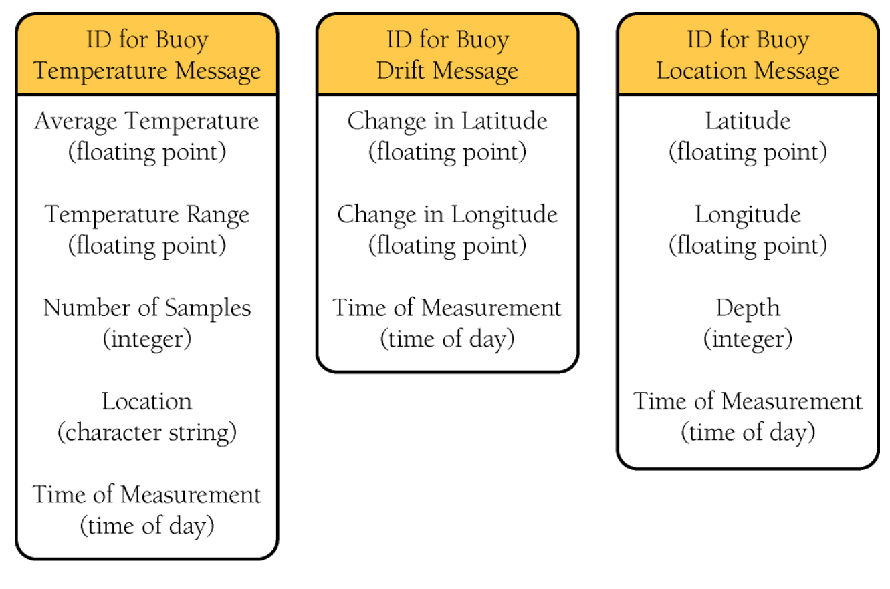
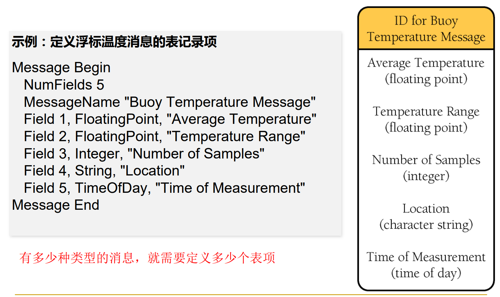
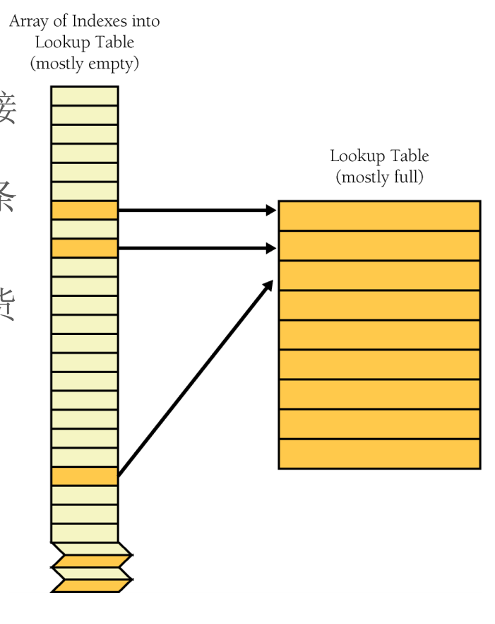

lec11-Table-Driven Methods
---

# 1. 表驱动法
1. 表驱动法是一种编程模式(scheme)：从表里面查找信息而不使用逻辑语句(if和case)
2. 表驱动法适用于复杂的逻辑
3. 表驱动法的另一个好处是可以将复杂逻辑从代码中独立出来，以便于单独维护

## 1.1. 表驱动示例
1. Java示例：使用复杂的逻辑对字符分类
```java
if ((('a' <= inputChar) && (inputChar <= 'z'))||
  (('A' <= inputChar) && (inputChar <= 'Z'))) {
    charType = CharacterType.Letter;
}else if ((inputChar==' ')||(inputChar==',')||
  (inputChar == '.')||(inputChar == '!')||
  (inputChar == '(')||(inputChar == ')')||
  (inputChar == ':')||(inputChar == ';')||
  (inputChar == '?')||(inputChar == '-')){
    charType = CharacterType.Punctuation;
}else if (('0' <= inputChar)&&(inputChar <= '9')) {
    charType = CharacterType.Digit;
}
```

2. 构造一个查询表：把每一个字符的类型保存在一个字符编码访问的数组
3. Java示例：使用查询表对字符分类`chartype = charTypeTable[inputChar];`

## 1.2. 使用表驱动法的两个问题
1. 在表里存放什么信息：主要存放的是数据，但在一些特殊情况下也存放动作
2. 如何快速从表中查询条目
   1. 直接访问(Direct access)
   2. 索引访问(Indexed access)
   3. 阶梯访问(Stair-step access)：连续性条件方法

### 1.2.1. 直接访问表
1. 所谓"直接访问"是指通过索引值(如下标)可以直接从表中找到对应的条目

```vb
'VB示例：确定各月天数的笨拙做法
If (month = 1) Then
  days = 31
ElseIf (month = 2) Then
  days = 28
ElseIf (month = 3) Then
  days = 31
...
ElseIf (month = 11) Then
  days = 30
ElseIf (month = 12) Then
  days = 31
End If

' 你需要首先创建出这张表用来存放各个月份的天数
' VB示例：确定各月天数的优雅做法
Dim daysPerMonth() As Integer = _
{31, 28, 31, 30, 31, 30, 31, 31, 30, 31, 30, 31}
days = daysPerMonth(month-1)
```

### 1.2.2. 例子:灵活的消息格式
1. 假设你编写一个子程序，打印存储在一份文件中的消息
   1. 通常该文件中会存储大约500 条消息，而每份文件中会存有大约20 种不同的消息。这些消息源自于一些浮标( Buoy) ，提供有关水温、浮标位置等信息。
   2. 每一条消息都有若干字段，并且每条消息都有一个消息头，其中有一个ID ，告诉你该消息属于这20 多种消息中的哪一种。
   3. 这些消息的格式并不是固定不变的消息的存储方式消息头(ID确定了该消息所属的类型)

#### 1.2.2.1. 消息的存储方式


#### 1.2.2.2. 消息的格式细节


#### 1.2.2.3. 基于逻辑的方法
1. 读取每一条消息，检查其ID，然后调用一个用来阅读、解释以 及打印一种消息的子程序
   1. 消息阅读子程序包含一个循环，用来读入消息、解释其 ID，以及根据该ID调用20 个子程序中的某一个
   2. 如果你有20 种消息，那么就要有20 个子程序
   3. 每次有任何一种消息的格式变了，你就不得不修改负责
   处理该消息的子程序或者类的逻辑

#### 1.2.2.4. 基于逻辑方法所用的伪代码
```
While more messages to read
  Read a message header
  Decode the message ID from the message header
  If the message header is type 1 then
    Print a type 1 message
  Else if the message header is type 2 then
    Print a type 2 message
  ...
  Else if the message header is type 19 then
    Print a type 19 message
  Else if the message header is type 20 then
    Print a type 20 message
```

1. 如何修改？将动作存储到表中可以将子程序入口地址存储，类似的有多态的实现

#### 1.2.2.5. 画向对象的方法
1. 但是基本结构还是同样复杂
2. 问题的逻辑可以隐藏在对象继承结构里

```
While more messages to read
  Read a message header
  Decode the message ID from the message header
  If the message header is type 1 then
    Instantiate a type 1 message object
  Else if the message header is type 2 then
    Instantiate a type 2 message object
  ...
  Else if the message header is type 19 then
    Instantiate a type 19 message object
  Else if the message header is type 20 then
    Instantiate a type 20 message object
  End if
  End While
```

#### 1.2.2.6. 读取和打印浮标温度消息子程序


### 1.2.3. 表驱动法
1. 消息阅读子程序由一个循环组成，该循环负责读入每一个消息头，对其ID解码，在Message 数组中查询其消息描述，然后每次都调用同一个子程序来解释该消息
2. 只需要用一张表来描述每种消息的格式，而不用再把它们硬编码进程序逻辑里

### 1.2.4. 定义所有可能的字段类型
1. 在定义消息表项之前先定义消息中可能出现的所有
字段类型

```c++
// C++示例：定义消息数据类型
enum FieldType {
  FieldType_FloatingPoint,
  FieldType_Integer,
  FieldType_String,
  FieldType_TimeOfDay,
  FieldType_Boolean,
  FieldType_BitField,
  FieldType_Last = FieldType_BitField
};
```

### 1.2.5. 消息的表记录-浮标温度消息


### 1.2.6. 表驱动法代码
1. 表驱动法中最上层循环的伪代码：这部分的代码与前面的方法差别不大

```
While more messages to read      
  Read a message header           
  Decode the message ID from the message header       
  Look up the message description in the message-description table
  Read the message fields and print them based on the message 
description
End While
```

### 1.2.7. 消息打印子程序
```
While more fields to print
Get the field type from the message description
  case ( field type )
    of ( floating point )
      read a floating-point value
      print the field label
      print the floating-point value
    of ( integer )
      read an integer value
      print the field label
      print the integer value
    of ( character string )
      read a character string
      print the field label
      print the character string
    …
  End Case
End While
```

1. 用一个打印子程序取代了19种消息的打印子程序。

## 1.3. 索引访问表
1. 当无法直接从表中查询需要的条目时，就需要借助其他办法先获取表键值
2. 索引访问的方法
   1. 就是先用一个基本类型的数据从一张索引表中查出一个键值，然后再用这一键值查出你感兴趣的主数据
3. 索引表是一种间接访问的技术

### 1.3.1. 示例
1. 假设你经营着一家商店，有大约100 种商品。再假设每种商品都有一个4 位数字的物品编号， 其范围是0000 到9999
   1. 如果你想用这个编号作为键值直接查询一张描述商品信息的表，那么就要生成一个具有10000 条记录的访问表
2. 利用索引表
   1. 如果用这个编号作为键值直接查询一张描述商品信息的表，那么就生成一个具有10000 条记录的索引数组(从0到9999)
   2. 该数组中除了与你商店中的货物的标志相对应的100条记录以外，其余记录都是空的索引



### 1.3.2. 索引访问技术的主要优点：
1. 如果主查询表中的每一条记录都很大，那么索引数组就
可以节省很多空间
   1. 一般而言索引表中的每条记录需要占用2 ~4字节
1. 即使你用了索引以后没有节省内存空间， 操作位于索引中的记录有时也要比操作位于主表中的记录更方便更廉价
2. 编写到表里面的数据比嵌入代码中的数据更容易维护

## 1.4. 阶梯访问表
1. 阶梯访问方法不像索引结构那样直接， 但是它要比索引访问方法节省空间
2. 阶梯结构的基本想法
   1. 通过确定每项命中的阶梯层次确定其归类
3. 如果你正在开发一个等级评定的应用程序，按照如下等级区间对分数定级
   1. 你不能用简单的数据转换函数来把表键值转换为A 至F 字母所代表的等级
   2. 用索引也不合适，因为这里用的是浮点数


### 1.4.1. 使用阶梯方法
1. 把每一区间的上限写入一张表里， 然后写一个循环，按照各区间的上限来检查分数
   1. 当分数第一次超过某个区间的上限时， 你就知道相应的等级了
   2. 区间表：{ 50.0, 65.0, 75.0, 90.0, 100.0 }
2. Visual Basic示例：阶梯表查询
```vb
' set up data for grading table
Dim rangeLimit() As Double = { 50.0, 65.0, 75.0, 90.0, 100.0 }
Dim grade() As String = { "F", "D", "C", "B", "A" }
maxGradeLevel = grade.Length - 1
...
' assign a grade to a student based on the student's score
gradeLevel = 0
studentGrade = "A"
While ( gradeLevel < maxGradeLevel )
  If ( studentScore < rangeLimit( gradeLevel ) ) Then
    studentGrade = grade( gradeLevel )
  End If
  gradeLevel = gradeLevel + 1
Wend
```

### 1.4.2. 注意事项
1. 注意端点
2. 二分查找取代顺序查找

# 2. 示例：CDF
