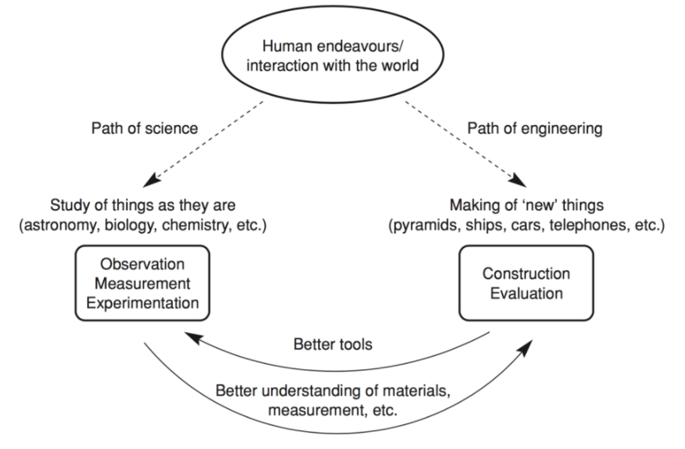

Lec12-State and Command
---

# 1. 状态模式

## 1.1. 模式动机
1. 在很多情况下，一个对象的行为取决于一个或多个动态变化的属性，这样的属性叫做状态，这样的对象叫做有状态的(stateful)对象，这样的对象状态是从事先定义好的一系列值中取出的。当一个这样的对象与外部事件产生互动时，其内部状态就会改变，从而使得系统的行为也随之发生变化。
2. 在UML中可以使用状态图来描述对象状态的变化。

