lec14-Architectural Pattern
---
1. 架构模式是一组架构设计决策，适用于重复出现的设计问题，并进行了参数化处理以解决出现该问题的不同软件开发环境。An architectural pattern is a set of architectural design decisions that are applicable to a recurring design problem, and parameterized to account for different software development contexts in which that problem appears.
2. 体系结构模式与DSSA相似，但适用于较低级别，范围更窄。Architectural patterns are similar to I SSAs but applied at a lower level" and within a much narrower scope.
3. 课本227页

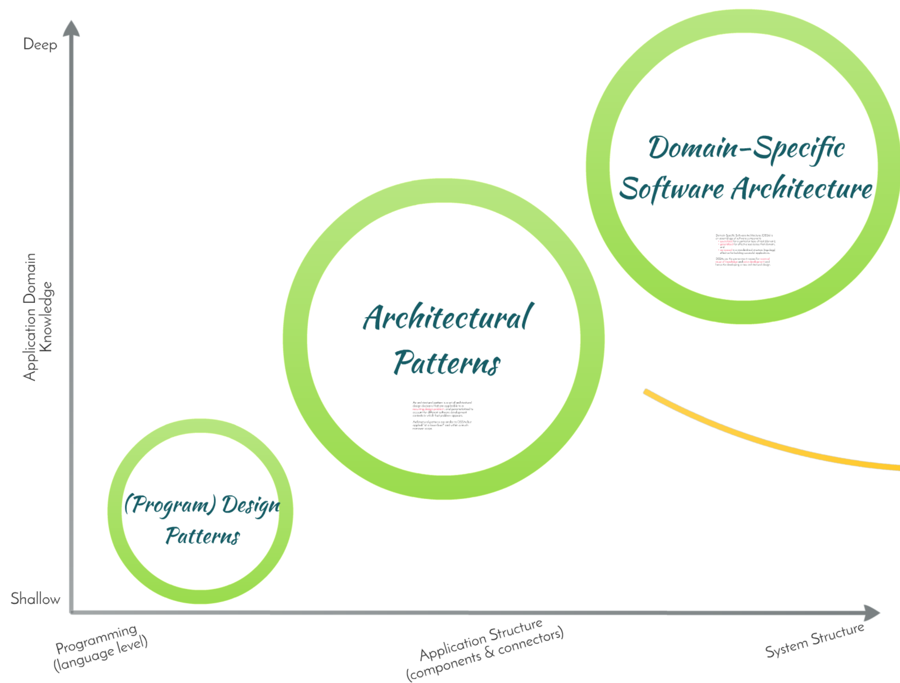

# 1. 领域特定的软件体系结构 Domain-Specific Software Architecture
1. 领域特定的软件体系结构(DSSA)是软件组件的组合 Domain- Specific Software Architectures (DSSA) isan assemblage ot sottware components
   1. 专用于特定类型的任务(域) specialized for a particular type of task (domain) generalized for effective use across that domain, and
   2. 普遍适用于该领域的有效使用 composed in a standardized structure (topology)
   3. 有效构建成功应用程序的标准化结构(拓扑)组成 effective for building successful applications.
2. DSSA是最大限度地**重用**知识和进行先期开发并因此开发新的体系结构设计的卓越手段。DSSAs are the pre-eminent means for maximal reuse of knowledge and prior development and hence for developing a new architectural design.

# 2. (程序)设计模式 (Program) Design Patterns

## 2.1. 架构模式 Architectural Patterns
1. 架构模式 Architecture pattern
   1. 是在实践中**反复**发现的一套设计决策 is a package of design decisions that is found repeatedly in practice,
   2. 具有允许**重复使用**的已知属性，并且描述了**一类**架构 has known properties that permit reuse, and describes a class of architectures.
2. 架构模式建立了以下之间的**关系**：Architecture pattern establishes a relationship between:
   1. **背景**：世界上经常发生的常见问题，会引起问题 A context: A recurring, common situation in the world that gives rise to a problem.
   2. 一个**问题**：在给定的上下文中出现的问题，经过适当概括 A problem: The problem, appropriately generalized, that arises in the given context.
   3. **解决方案**：针对问题的成功架构解决方案，并进行了适当抽象 A solution: A successful architecture resolution to the problem, appropriately abstracted. 
3. 在实践中找到模式 Patterns are found in practice
   1. 一个人不发明模式，一个人发现它们 One does not invent patterns, one discovers them
   2. 永远不会有一个**完整的模式列表** There will never be a complete list of patterns

## 2.2. 分层模式 Layered Pattern
对应4+1视图中的逻辑视图

### 2.2.1. 解决方案
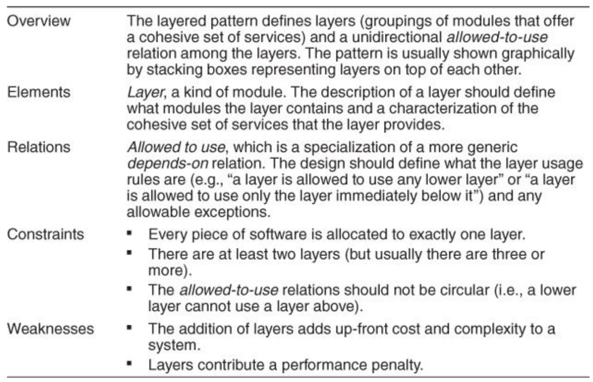

1. 层间的访问必须按照逐层进行访问

### 2.2.2. 堆栈符号

### 2.2.3. 基于分层模式的系统

### 2.2.4. 分层模式变体
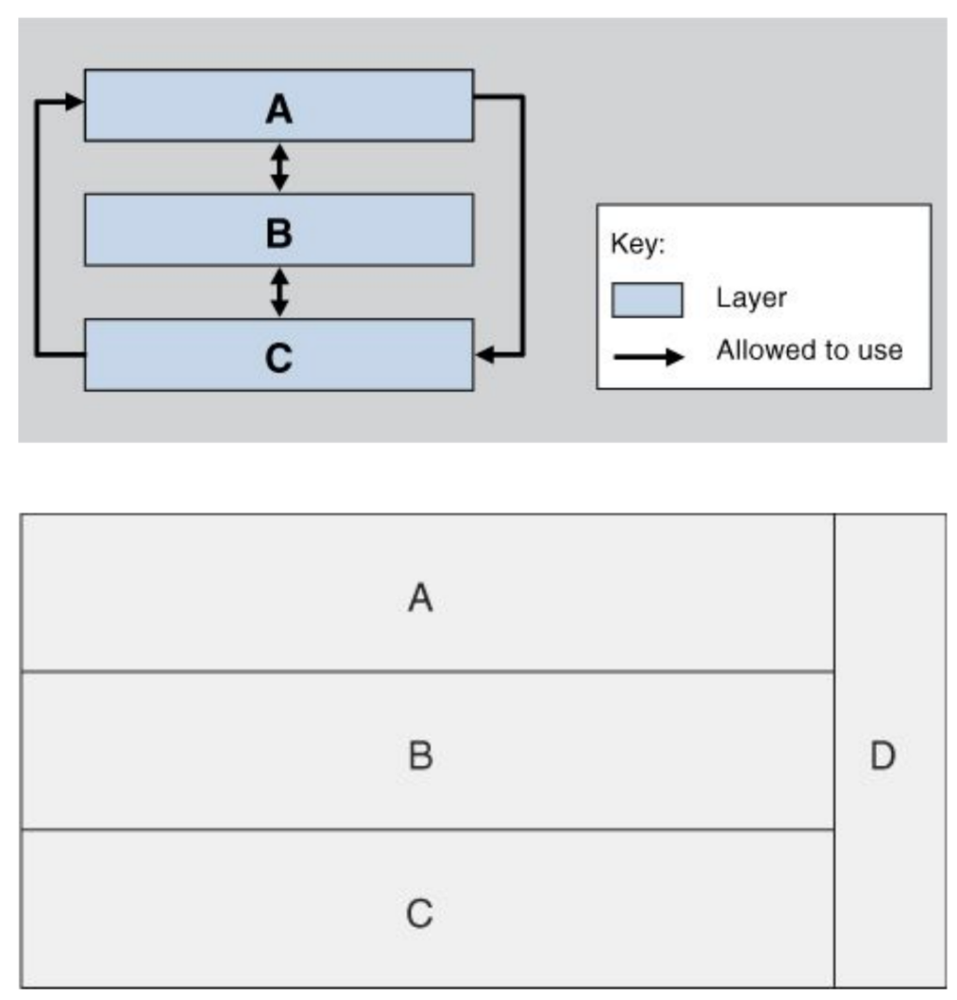

1. 上面的A、B、C：不是一种分层模式
   1. 分层的核心是为了实现关注点分离
   2. 不是分层模式：
      1. 形成了环状依赖
      2. 没有实现关注点分离，一个的修改可能有多个原因
      3. 是一种软件的坏味道
2. 下面的A、B、C、D：是一种分层模式
   1. 也可以是一种分层模式，D不期待A的结果且D不期待B的结果
   2. 而严格意义和其他场景中，不认为是一种分层模式

### 2.2.5. 分层模式对质量属性的影响
1. 可修改性
2. 可模块化
3. 可维护性
4. 可复用性

## 2.3. 代理模式 Broker Pattern
1. Broker可以理解为中间人，撮合双方达成交易。

### 2.3.1. 解决方案
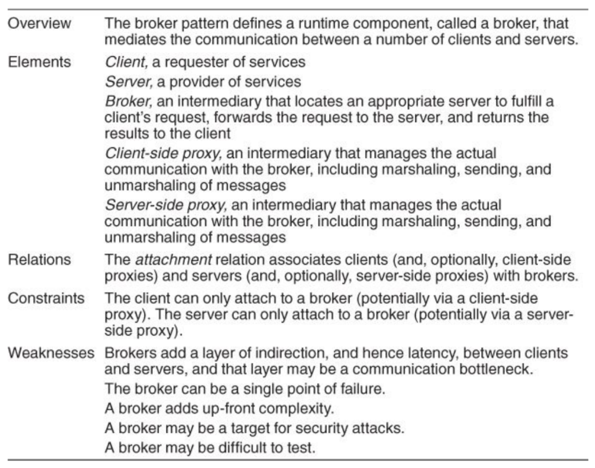

### 2.3.2. 概述图

### 2.3.3. 质量属性体现模式的优缺点
1. 优点
   1. Interoperability：根本目的，提高Server-Client之间的交互性
   2. Scaliability：可伸缩和扩展
   3. Modifiabiliy：
   4. 两面性：
      1. Security：代理对象屏蔽了系统内部的具体实现
      2. Reliability：服务降级和实例重启
      3. Availability：
2. 缺点
   1. Security：成为被攻击的对象
   2. Reliabiliy：可靠性会降低
3. 两面性：
   1. Performance：整体大集群的性能可能会提高(QPS等提高)，但是局部单点性能会下降，多次网络请求、多次匹配，有可能会抵消。

## 2.4. 模型-视图-控制器模式 Model-View-Controller Pattern(MVC)
1. 使用运行时、动态、相互之间的关系来审视，集成到了开发框架中，也是分层架构的变种(会强调各模块之间的约束关系，model不可以直接返回到controller)
   1. model 业务逻辑
   2. view 处理用户展示，接收用户操作
   3. controller 对用户操作进行处理，将信息通知给model
2. model -> controller 不会产生通信

### 2.4.1. 解决方案
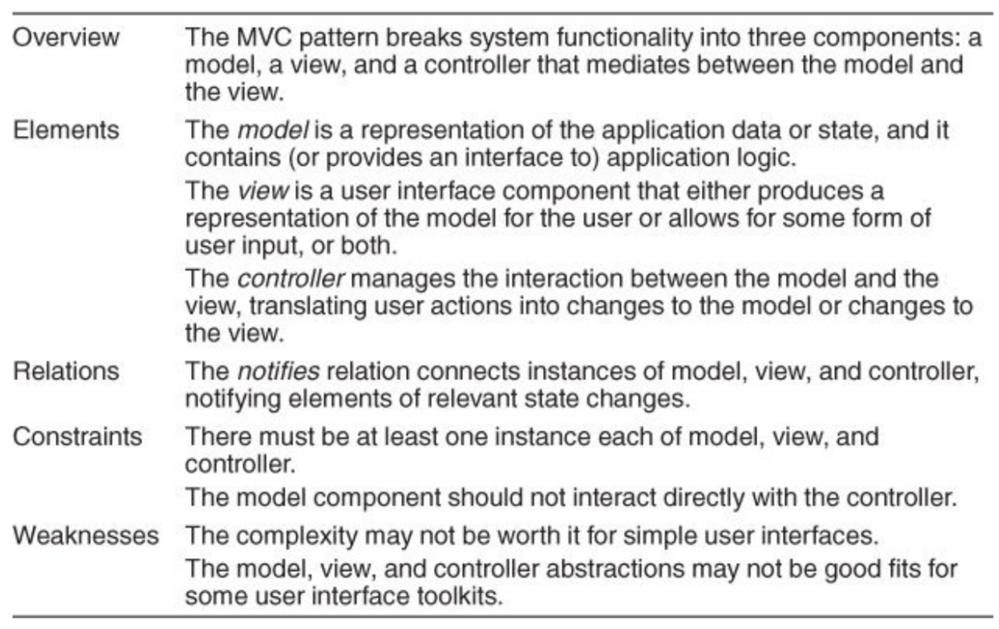

### 2.4.2. 概述图
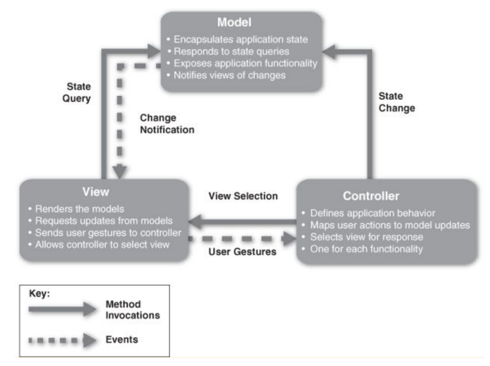

## 2.5. Pipe-and-Filter Pattern 管道和过滤模式
1. filter：相当于component，起到数据处理、计算作用，每个filter有input和多个output，数据处理后传递给后续的部分。
2. pipe：连接filter，相当于connector，将output导入到其他的filter的input中去，不会孤立存在。
3. 管道和过滤模式不会孤立存在，应用在顺序处理结构，有一系列的数据结构filter，体现依赖关系。
4. 场景应用在科学计算的场景中，需要避免出现环形的filter，不适用于有很多交互产生的场景。

### 2.5.1. 解决方案

### 2.5.2. 概述图
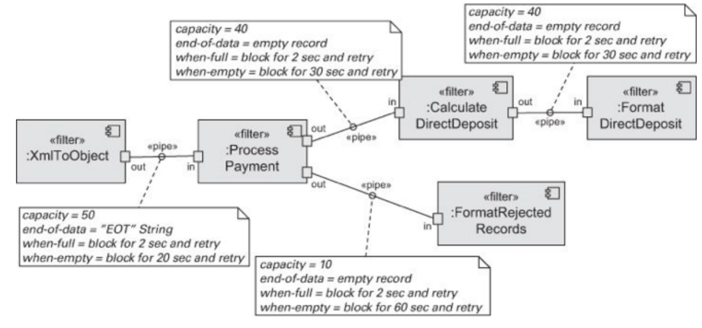

1. 每一组件表示filter，连接两个组件的部分是pipe(类似于queue交易任务的排队等待处理)
2. 任何一个filter都依赖于前一个filter的输出，中间没有机会接收外部的交互来改变严格定义好的流程。
3. 不适用于一些可以引入变形的场景(相互独立、不依赖前面的产出，会带来损耗)

## 2.6. Client-Server Pattern 客户端-服务端模式
1. 包含两类不同的component
2. 请求发起client、server接收请求，这里没有broker，不能动态改变client和server的关系，相对更固定，但是一个client可以连接多个server
3. 一个component在一个关系中可以是client，也可能是server，非绝对，但是成对的关系相对固定。
4. 会受到负载的限制。
5. Server可能有性能瓶颈，但是可以通过事先规划避免。
6. Server可能单点失效，但是broker可以控制

### 2.6.1. 解决方案
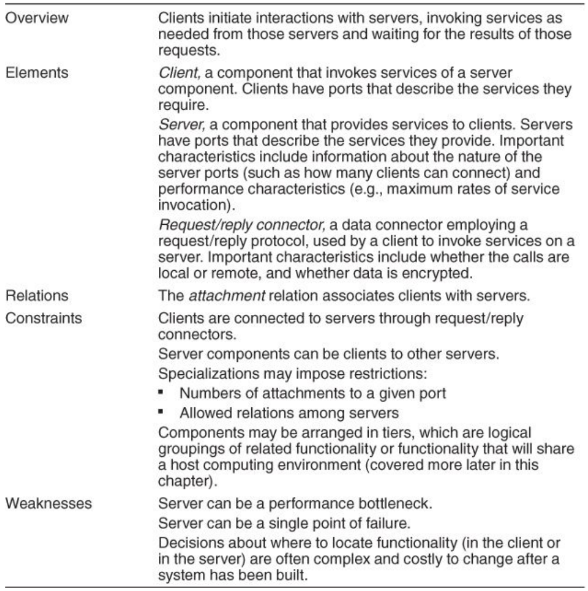

### 2.6.2. 概述图
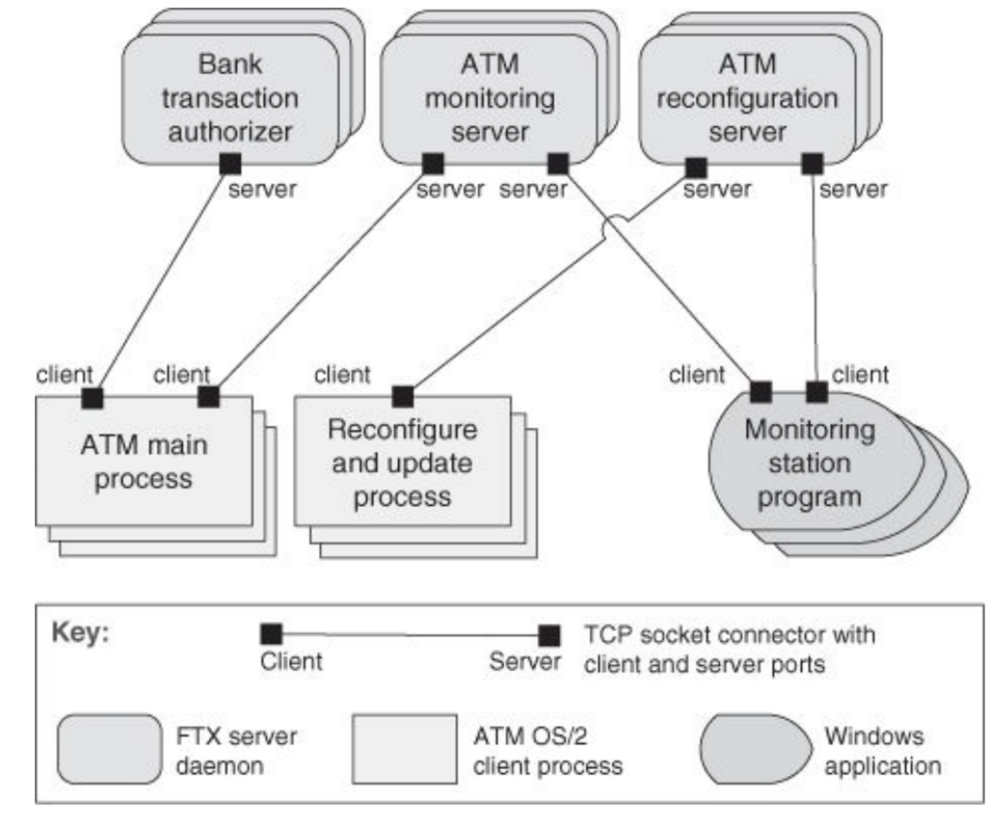

1. ATM验证身份，某一个server会给很多设备提供服务。
2. ATM操作安全监控、盗刷之类，通过monitoring 发现问题找到记录
3. 对银行工作人员而言，需要新的业务，policy发生变化，银行工作人员定义ATM上的操作
4. 银行负责安全金融的根据ATM、对照用户操作行为是否有安全隐患，多对多。
5. 问题：broker也存在client和server之间的关系，对质量属性的影响，做一下比较，broker是之前，c/s是90年代流行广泛应用
   1. 互操作性：可能导致变弱？没有broker，需要人为连接
   2. 安全性：Client、Server不采用broker 可能被拦截
   3. 伸缩性
   4. 性能
   5. 可修改性
6. 小型局域网、互联网还没有普及，规模有限，直接联系，性能上安全性可能带来更大收益
7. broker的一些负面影响就不必承担了，c/s会比broker投入更少，收益可能更大

## 2.7. Peer-to-Peer Pattern 点对点模式
1. 这一刻是提供者，下一刻就是消费者，是对等的。
2. 不单单提供服务，还能提供物流(对于整个网络)
3. 对每一个peer可能会给他一个规定对的连接数

### 2.7.1. 解决方案
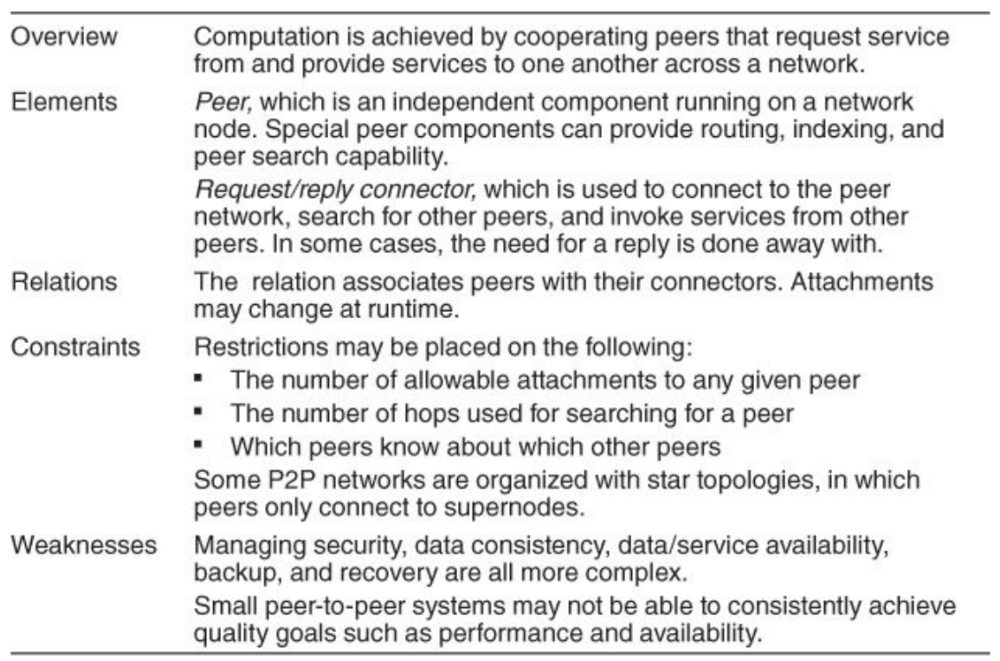

### 2.7.2. 概述图
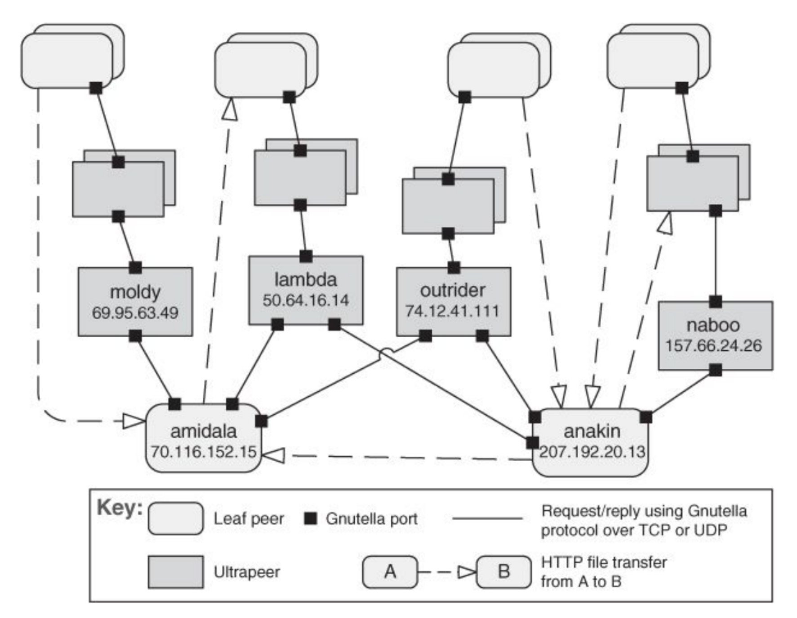

1. 可能安全性不受保障，因为节点既是Client又是Server，被攻击可能性提高了，attack、surface受攻击面变大
2. 数据分布在不同的节点上，相同数据多处拷贝，如果要的话，可能会导致数据不一致(数据一致性难度更大)，不能保证数据一定可用，数据可用性不能百分之百保证。
3. 可用性 availability，同一个数据多个副本，所以个别数据出问题不影响整体。
4. 但又不能保证availability，不会以后任何一个节点有权限。
5. Performance：多个节点同时提供服务，性能快(多个渠道获取数据，并行能力提高)

## 2.8. Service-Oriented Pattern 面向服务的模式
1. broker架构的延续。
2. component包含服务提供者、服务消费者。
3. 除了这些component还有ESB、企业服务组件、连接处理，包括发现、注册。
4. Registry of Services
5. Orchestration Server 不同的Service按照一定的顺序进行编排，提供更高级的(申请贷款流程)
6. Connectors：
   1. SOAP：
   2. REST：
   3. Asynchronous messaging connector

### 2.8.1. 解决方案
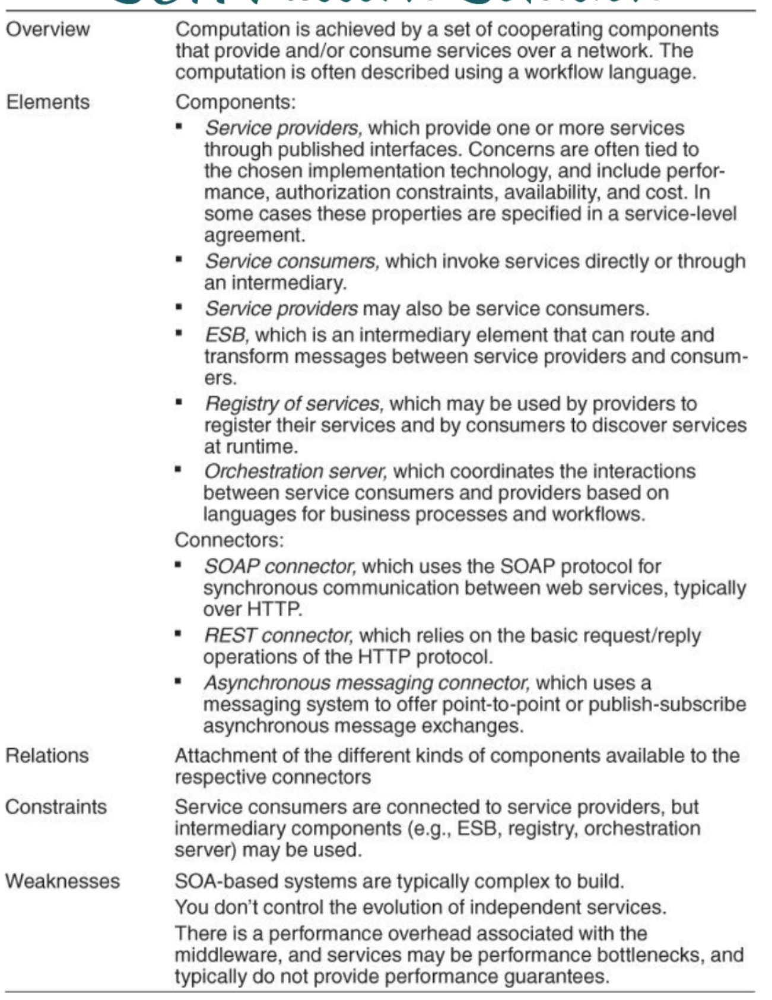

### 2.8.2. 概述图
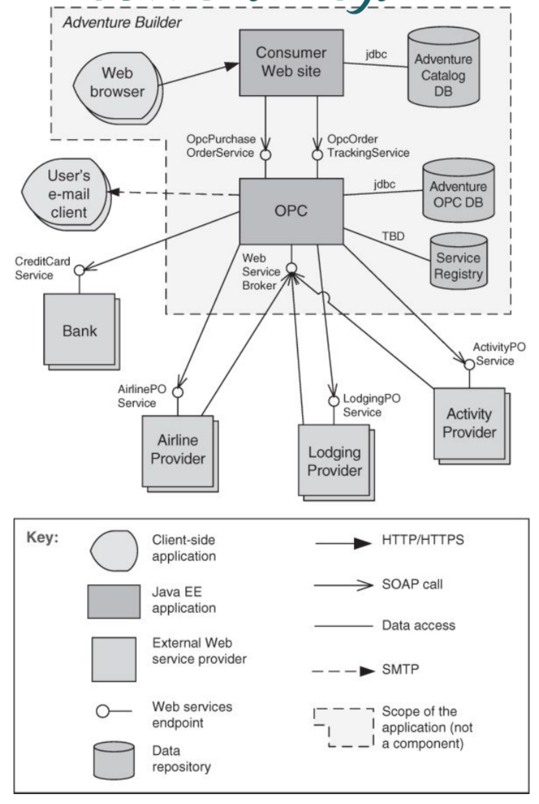

1. 旅行社有一系列需求
2. 真正提供服务的是酒店、导游之类的，系统需要通过Web Service Broker连接到不同的真正提供者。下单：商家发货。

### 2.8.3. SOA中的连接器
1. **SOAP**(简单对象访问协议)：服务使用者和提供者通过通常在**HTTP之上**交换请求/答复**XML消息**进行交互 SOAP (Simple Object Access Protocol): Service consumers and providers interact by exchanging request/reply XML messages typically on top of HTTP
2. **REST**(代表性状态传输)：服务使用者发送依赖于**四个**基本**HTTP命令(POST，GET，PUT，DELETE)**的HTTP请求REST (Representational State Transfer) : A service consumer sends HT TP requests that rely on; four basic HTTP commands (POST, GET, PUT, DELETE)
3. **异步消息传递**(“**即发即忘**”)：参与者不必等待收据的确认。Asynchronous messaging ("fire-and-forget"): Participants do not have to wait for an acknowledgment of receipt.

### 2.8.4. SOA和其他架构的区别
1. 具备broker的优势，这里又不想继承broker，所以broker消失了
2. 出现类似集基础设施的组件，代替单一节点broker，单点失效的问题消失了
3. 商业模式的变化、看技术可用性
4. 基础条件——互联网普及范围参与者人数规模比以往大这样一个背景下打破broker c-s
5. 追求更高互操作性更高伸缩性
6. 技术条件下提供的服务越来越多现在可以分得更细更大差异化更细粒度的组合可以实现出来社会分工越来越细（不同航空公司不同酒店细粒度体现如果固定就很难实现差异化）微服务也是这样的体现服务粒度越来越小是有很多技术条件支持的（单体系统内部复杂度外化外面复杂度可以进行动态绑定可以提供多样化服务）

## 2.9. Publish-Subscribe Pattern 发布-订阅模式
1. subscribe注册对于publiser进行注册
2. 某一个publiser发布自己的消息可能订阅其他消息（朋友圈微博）

### 2.9.1. 解决方案
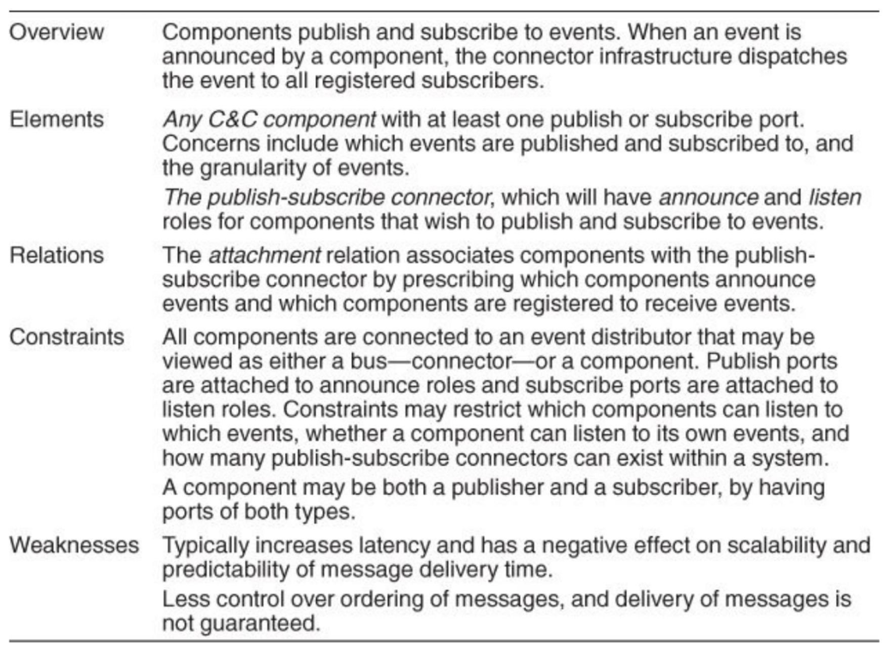

1. 传统操作系统也是通过事件驱动方式来管理的
2. IDE环境注册后就行结构发布的事件
3. 数据发生变化会反映到环境中去
4. 性能上的延迟（可限制subscriber数量订阅越多性能下降）
5. scalability publisher数量不会变多
6. 发布者不关心每个订阅者都收到不是guarantee

### 2.9.2. 概述图

## 2.10. Shared-Data Pattern 共享数据模式3
1. 中间安全数据会被很多人共享登录访问

### 2.10.1. 解决方案

1. 这样一个系统模式有什么问题嘛？
2. 单点失效性能瓶颈问题（都要对它操作） 安全性（攻击中心点有风险）对安全性数据来说强调强一致性如果有副本有一段时间才能到其他副本上更（可能成为漏洞任何时刻访问数据都必须一致）
3. 一致性
   1. CAP原则又称CAP定理，指的是在一个分布式系统中，一致性（Consistency）、可用性（Availability）、分区容错性（Partition tolerance）
   2. 看哪个更重要只能同时实现两者
   3. 其他实现一致性方式：最终一致性（不保证任何时候访问数据都一致但是可以保证最终结果要一致） 互联网不可能牺牲可用性也必须是分布式结构（面对分布在很多地方保证信号要求） 一致性设计难度非常大

### 2.10.2. 概述图

1. 既有读又有写

## 2.11. Map-Reduce Pattern
1. 软件和外部环境的关系 部署
2. map对数据进行抽取所需要的信息信息转换
3. 可以有多个map 处理数据工作内容不一样
4. 相互独立可以运行
5. reduce进行合并产出想要的答案

### 2.11.1. 解决方案
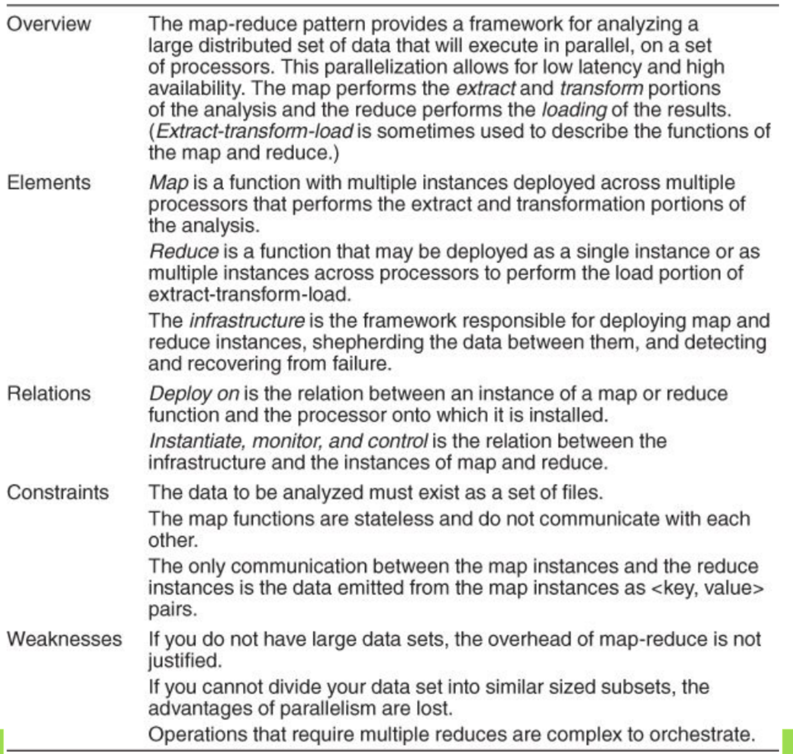

1. map reduce部署在不同的地方
2. 词频分析案例大量数据
3. Map-Reduce Based System
4. 每一个partition对应一个map 每一个map任务一样不同实例
5. 所有词汇使用频率标注出来
6. 通过reduce进行合并
7. 最后进行排序

### 2.11.2. 概述图

## 2.12. Multi-Tier Pattern 多层模式
1. 部署的环境划分
2. layer是真实存在的
3. 这里是逻辑的组合没有和层的强依赖关系
4. 不同的部署环境里面分层不同但是软件完成内容一样

### 2.12.1. 解决方案

1. 旅行社例子
2. tier只是部署方案决定并没有改变代码本身

### 2.12.2. 概述图
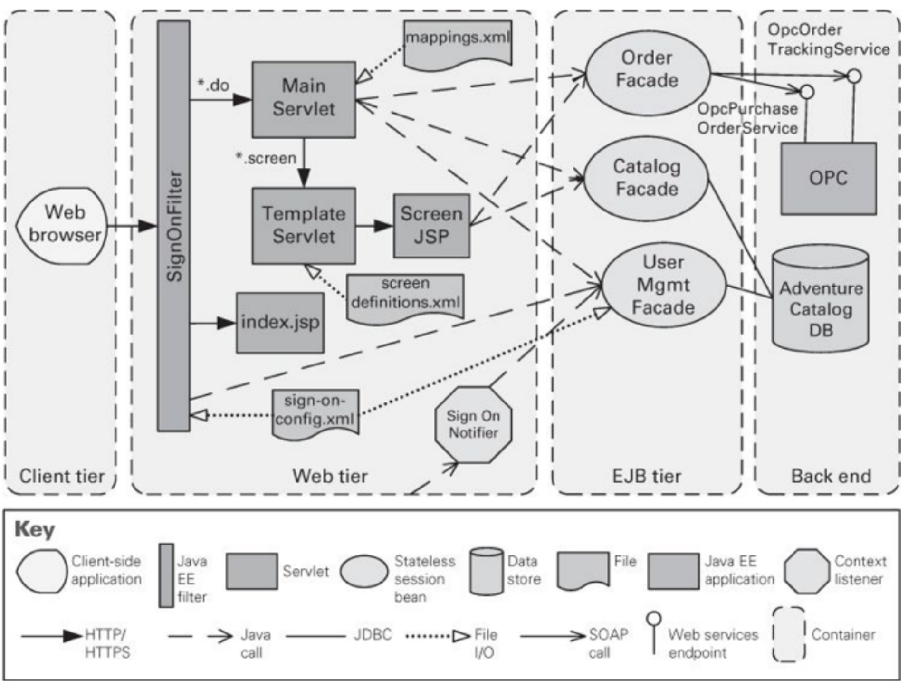

1. 三大类：modular类、runtime process动态类、软件和非软件环境关系（部署关系）11个架构模式

## 2.13. 不同的模式对于质量属性不同的影响
某一个Pattern会对一些质量属性产生积极影响，但是也会对其他属性产生不好的影响

# 3. 模式与策略 Architecture Putterns and Tactics
1. 策略比模式简单。他们使用**单一的结构或机制**来应对**单一的架构力量** Tactics are simpler than patterns; they use a single structure or mechanism to address a single architectural force.
2. 模式通常将多个设计决策组合到一个包中 Patterns typically combine multiple design decisions into a package.
3. 模式和策略共同构成了软件设计师的主要工具 Patterns and tactics together constitute the software architect' s primary tools.
4. **战术是设计的“构建块”**，可从中创建建筑模式 Tactics are "building blocks" of design from which architectural patterns are created.
5. 大多数模式包含几种不同的策略，这些策略可能 Most patterns consist of several different tactics that may:
   1. 都有共同的目的 all serve a common purpose,
   2. 经常被选择来承诺不同的质量属性 be often chosen to promise different quality attributes
6. 示例：分层图案 Example: layered pattern
   1. 提高语义连贯性 Increase semantic coherence
   2. 限制依赖 Restrict dependencies
7. tactic是设计最小粒度tactic进行组合一个tactic是为了某一个质量属性也会影响其他属性（正面、负面）
8. 针对某一个质量属性Modifiablity 相关的tactic 和pattern之间的关系是否涉及到

1. 设计深度问题

1. 椭圆形——某一个tactic 如ping/Echo
2. 可用性有贡献但是可能会产生其他影响（系统复杂度、资源影响、性能）
3. 如果性能很在意就对它单独进行设计成本、增加资源利用率问题

1. 为了提高利用率需要引入调度机制
2. 最终判断是ASR
   1. 负面影响系统可以容忍对最在意的asr可以忽略就可以停止，每一个tactic都会增加系统复杂度和规模
   2. 没有足够人力物力实现也可以停止
   3. 整个过程不断迭代最后达成妥协

# 4. Reading Materials

