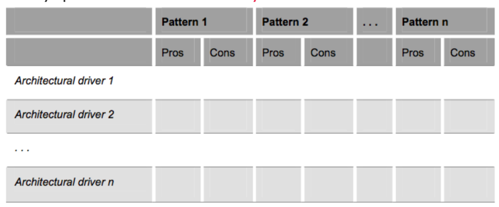
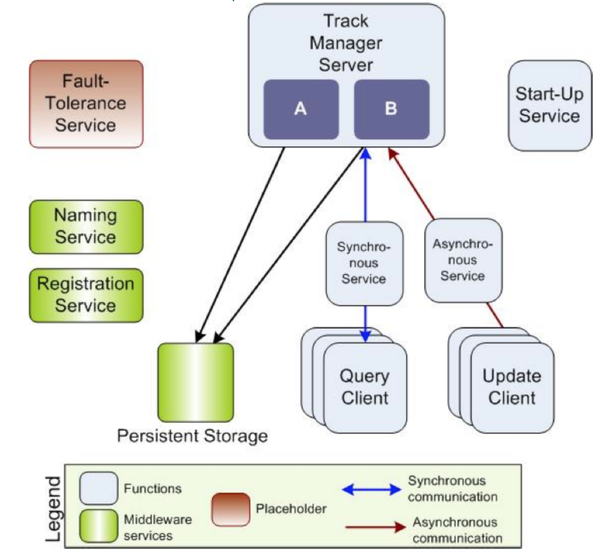
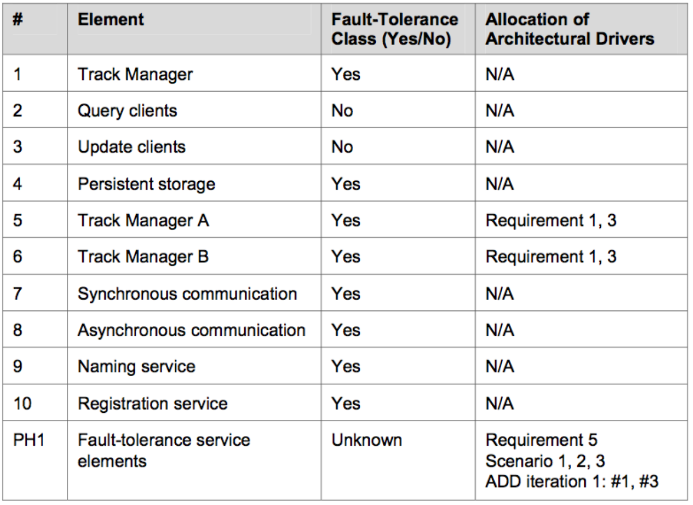
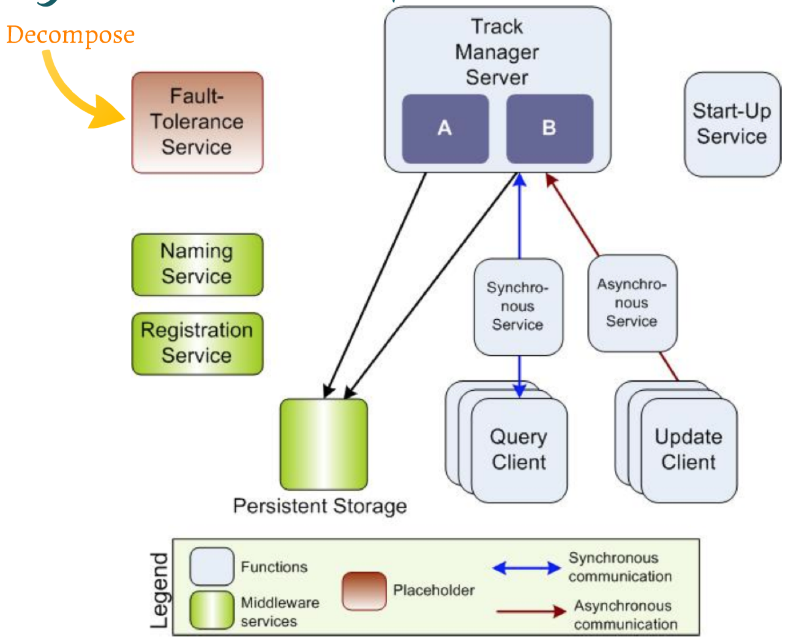
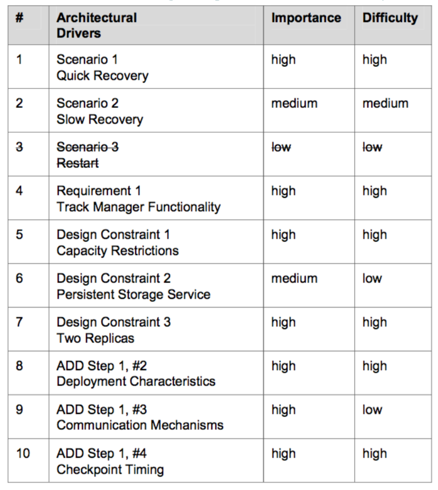
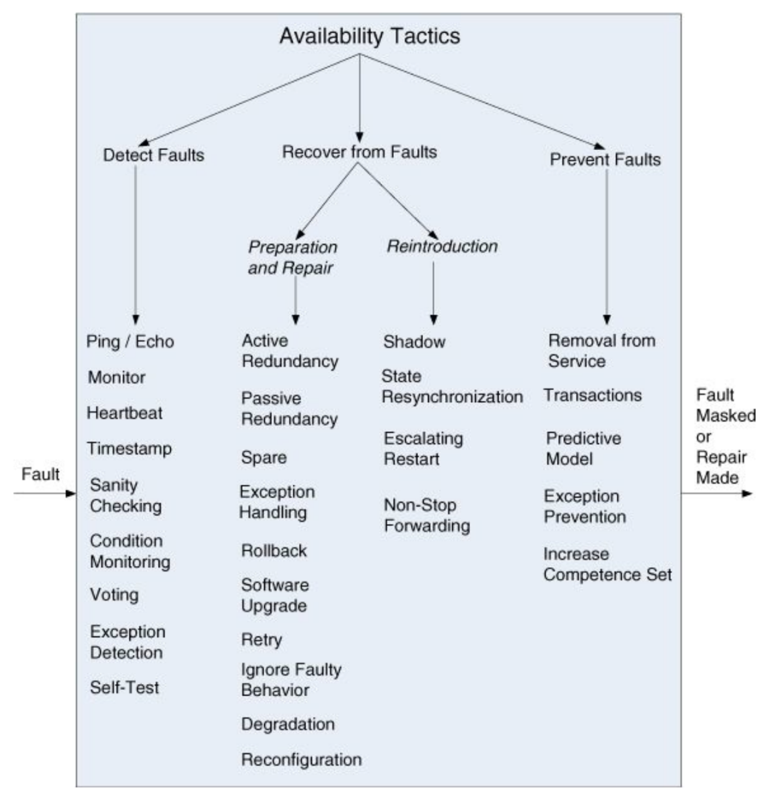
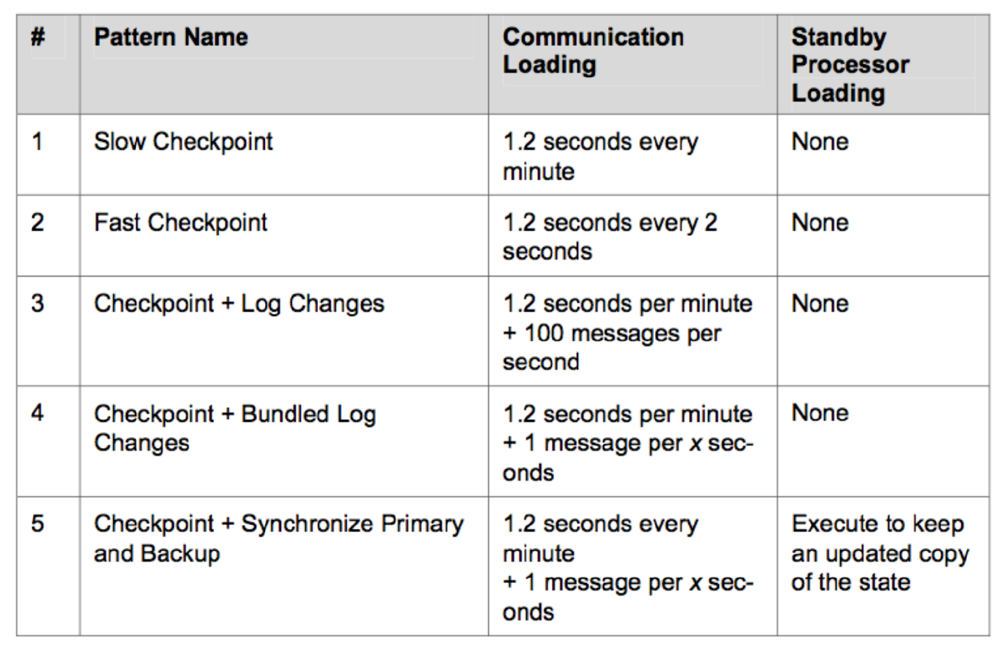
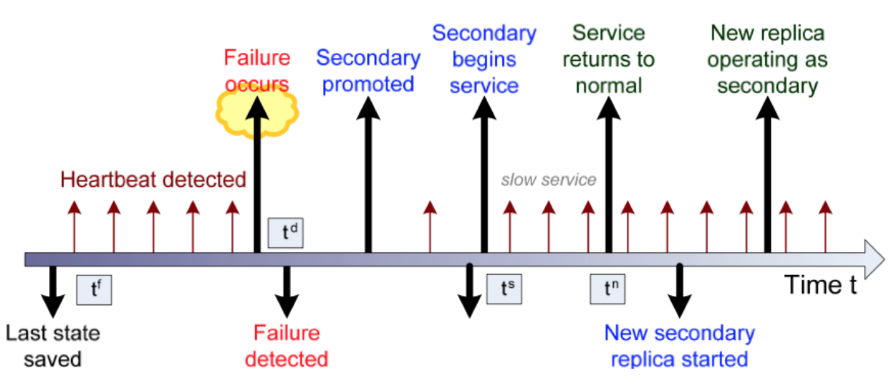
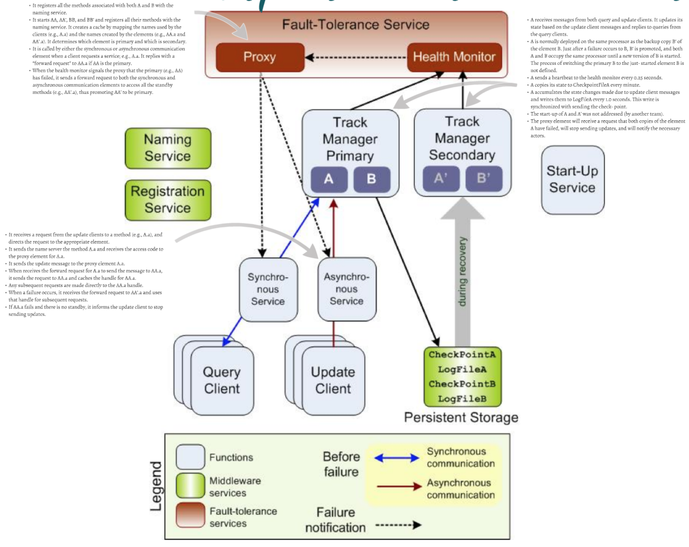
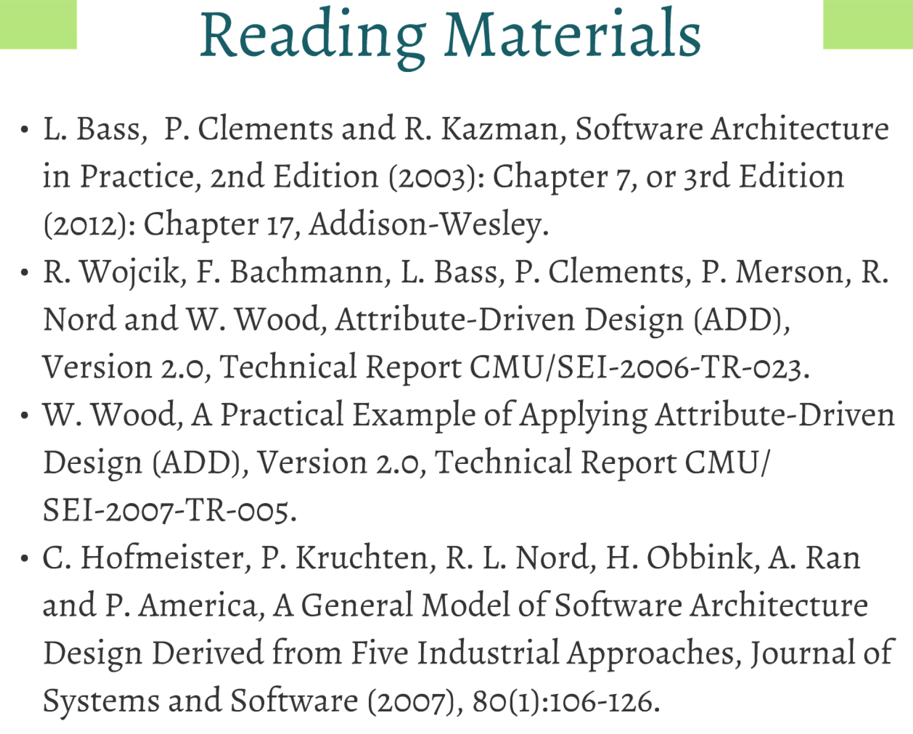

lec15-Designing Architecture
---

# 1. 设计架构 Design Architecture

## 1.1. 设计策略 Design Strategies
1. Abstraction
2. Generate & Test
3. Decomposition
4. Reusable Elements
5. Iteration & Refinement
6. Divide & Conquer

### 1.1.1. 分解 Decomposition
1. 质量属性需求可以**分解**，并**分配**给分解**元素**。Quality attribute requirements can be decomposed and assigned to the elements of the decomposition.
2. 请记住给定的约束，并安排分解，使其能够**适应**这些**约束**。Keep in mind the constraints given and arrange the decomposition so that it will accommodate those constraints.
3. 设计活动的目标是生成一个适应约束并**达到**系统**质量**和**业务目标**的设计。The goal of the design activity is to generate a design that accommodates the constraints and achieves the quality and business goals for the system.

#### 1.1.1.1. 根据ASR进行设计 Designing to ASRs
1. **非ASR**需求如何进行设计？ What about the non-ASR requirements?
   1. ASR的选择意味着需求的**优先级** The choice of ASRs implies a prioritization of the requirements.
      1. 您**仍然可以满足**其他需求 You can still meet the other requirements.
      2. 您可以**稍加调整**现有**设计**来完成与其他人通信 You can meet the others with a slight adjustment of the existing design.
      3. 您无法在当前设计下沟通其他人 You cannot meet the others under the current design.
         1. 您**即将**满足需求 you are close to meeting the requirements.
         2. 重新确定需求的**优先级**并**重新设计** reprioritize the requirements and revisit the design.
         3. 您**不能满足**需求 you cannot meet requirements.
2. 是一次性设计**所有**的ASR还是一次设计**一个**ASR？Design for all of ASRs or one at a time?
   1. 答案是经验问题。The answer is a matter of experience.
   2. 通过经验和教育，您将开发出一种直观的设计方法，并运用模式/策略来帮助您设计多个ASR。Through experience and education, you will develop an intuition for designing, and employ patterns/tactics to aid you in designing for multiple ASRs.

### 1.1.2. 生成并测试 Generate and Test
1. 将特定设计视为假设：当前设计假设的**错误**在**下一设计假设中得到解决**，而正确的事情得到保留。View a particular design as a hypothesis: the things wrong with the current design hypothesis are fixed in the next design hypothesis, and the things right are kept.
2. **最初的假设**从何而来？Where does the initial hypothesis come from?
   1. 现有系统 Existing systems
   2. 框架(部分设计)Frameworks (partial designs)
   3. 模式与策略 Patterns and tactics
   4. 设计清单(提供指导和信心)Design checklists (providing guidance and confidence)
3. 有哪些**测试**？What are the tests that are applied?
   1. 根据分析技术 Analysis techniques
   2. 根据设计清单 Design checklists
      1. Allocation of Responsibility
      2. Coordination Model
      3. Data Model
      4. Mapping among Architecture Elements
      5. Resource Management
      6. Binding Time
      7. Choice of Technology
4. **下一个假设**是如何产生的？How is the next hypothesis generated?
   1. 基于目前的假设，和系统实现的具体情况与质量属性之间的差距
   2. 然后结合新的tactics生成下一个假设
5. 你什么时候**做完** When are you done?
   1. 具有满足ASR的设计，或者在您用尽预算进行设计时。Either have a design that satisfies the ASRs or when you exhaust you budget for design.
   2. 实施您做出的最佳假设 Implement the best hypothesis you made

# 2. 属性驱动设计(Attribute-Driven Design，ADD)

## 2.1. ADD的步骤概述
1. 步骤1：确认有足够的需求信息 Step 1: Confirm there is sufficient requirements information
2. 步骤2：选择要分解的系统元素 Step 2: Choose an element of the system to decompose
3. 步骤3：确定所选元素的ASR Step 3: ldentify the ASRs for the chosen element
4. 步骤4：选择符合ASR的设计概念 Step 4:Choose a design concept that satisfies the ASRs
5. 步骤5：实例化架构元素并分配职责 Step 5: Instantiate architectural elements and allocate responsibilities
6. 步骤6：为实例化元素定义接口 Step6: Define interfaces for instantiated elements
7. 步骤7：验证和完善需求，并使其成为实例化元素的约束 Step 7: Verify and refine requirements and make them constraints for instantiated elements
8. 步骤8：重复进行，直到满足所有ASR Step 8: Repeat until all the ASRs have been satisfied

## 2.2. ADD的输入：需求？ Inputs to ADD：Requirements?
1. 文档提供的信息是不充分的。

### 2.2.1. 步骤1：确认有足够的需求信息 Step 1: Confirm there is sufficient requirements information
1. 系统的涉众已根据业务和任务目标确定了**需求**的**优先级**。The system's stakeholders have prioritized the requirements according to business and mission goals.
2. 您可以确定设计期间要重点关注的**系统元素**。You determine which system elements to focus on during the design.
3. 您确定是否有关于系统质量属性要求的**足够信息**："**刺激反应**"形式(图)。You determine if there is sufficient information about the quality attribute requirements of the system:stimulus-response form.

### 2.2.2. 步骤2：选择要分解的系统元素 Step 2: Choose an element of the system to decompose
1. 如果是第一次作为"**未开发**"开发的一部分，则将**所有需求**分配给系统。If the first time as part of a greenfield development, all requirements are assigned to the system.
2. **完善**部分设计的系统时，系统已划分为多个元素，并为其分配了要求。从这些元素中选择**一个**作为聚焦点。When refining a partially designed system, the system has been partitioned into elements with requirements assigned to them. Choose one of these elements as the focus.
3. Ploughed field：耕种过的地

### 2.2.3. 步骤3：确定所选元素的ASR Step 3: ldentify the ASRs for the chosen element
1. 根据对每个需求的高影响，中影响或低影响，根据对架构的相对**影响**第二次对这些相同需求进行**排名**。Rank these same requirements a second time based on their relative impact on the architecture as assigning high impact," medium impact," or" low impact" to each requirement.
2. (H，H) (H，M) (H，L) (M，H) (M，M) (M，L) (L，H) (L，M) (L，L)
   1. 第一个字母表示要求对涉众的重要性 The first letter indicates the importance of requirements to stakeholders
   2. 第二个字母表示需求对体系结构的潜在影响 The second letter indicates the potential impact of requirements on the architecture

### 2.2.4. 步骤4：选择符合ASR的设计概念 Step 4:Choose a design concept that satisfies the ASRs

#### 2.2.4.1. 步骤4.1：找出设计问题 Step 4.1: Identify design concerns
1. 如何解决设计中的ASR？How to address ASRs in your design?
2. 如何将问题划分成几个子问题。

#### 2.2.4.2. 步骤4.2：列出替代模式，下属关注的策略 Step 4.2: List alternative patterns/tactics for subordinate concerns
1. 对于列表中的每个模式，您应该 For each pattern on your list, you should
   1. **识别**每个模式的区分**参数**，以帮助您在模式和战术中进行选择 identify each pattern s discriminating parameters to help you choose among the patterns and tactics
   2. **估计**区分参数的**值** estimate the values of the discriminating parameters

#### 2.2.4.3. 步骤4.3：从清单中选择模式/策略 Step 4.3: Select patterns/tactics from the list
1. 使用每种模式时需要进行哪些**权衡**？ What tradeoffs are expected when using each pattern?
2. 模式之间的**结合**程度如何？ How well do the patterns combine with each other?
3. 是否有任何模式**互斥**？ Are any patterns mutually exclusive?

#### 2.2.4.4. 步骤4.4：确定模式/策略与ASR之间的关系 Step 4.4: Determine relationship between patterns/ tactics and ASRs
1. 考虑到目前为止确定的**模式/策略**，我决定它们**之间的关系**。Consider the patterns/ tactics identified so far and decide how they relate to each other. The combination of the selected patterns may result in a new pattern.
2. 所选图案的组合可以产生新的图案。

#### 2.2.4.5. 步骤4.5：捕获初步的架构视图 Step 4.5: Capture preliminary architectural viewg
1. 通过开始捕获不同的**架构视图**来描述您选择的**模式**。Describe the patterns you have selected by starting to capture different architectural views.
2. 在此阶段，您无需创建完整记录的架构视图(You don't need to create fully documented architectural views at this stage)

#### 2.2.4.6. 步骤4.6：评估并解决不一致问题 Step 4.6: Evaluate and resolve inconsistencies
1. 根据体系结构**驱动**程序评估**设计**。Evaluate the design against the architectural drivers.
2. 确定**是否有未考虑**的体系结构驱动程序。Determine if there are any architectural drivers that were not considered.
3. 评估**替代模式**或应用其他**策略**。Evaluate alternative patterns or apply additional tactics.
4. 将**当前元素的设计**与体系结构中**其他**元素的设计进行评估，并解决所有**不一致**之处。Evaluate the design of the current element against the design of other elements in the architecture and resolve any inconsistencies.

### 2.2.5. 步骤5：实例化架构元素并分配职责 Step 5: Instantiate architectural elements and allocate responsibilities
1. 实例化您选择的**每种元素**的一个**实例**。Instantiate one instance of every type of element you chose.
2. 根据**子元素**的类型**分配职责**。Assign responsibilities to child elements according to their type.
3. 在其子级之间**分配**与父级元素相关联的责任。Allocate responsibilities associated with the parent element among its children.
4. 分析并**记录**您所做的设计决策。Analyze and document the design decisions you have made.

### 2.2.6. 步骤6：为实例化元素定义接口 Step6: Define interfaces for instantiated elements
1. 接口描述了PROVIDES和REQUIRES假设，即软件元素之间相互联系。Interfaces describe the PROVIDES and REQUIRES assumptions that software elements make about one another.
   1. 练习涉及您实例化的元素的**功能要求**。Exercise the functional requirements that involve the elements you instantiated.
   2. 观察由一个元素**产生**并由另一元素**消耗**的**任何信息**。Observe any information that is produced by one element and consumed by another.

### 2.2.7. 步骤7：验证和完善需求，并使其成为实例化元素的约束 Step 7: Verify and refine requirements and make them constraints for instantiated elements
1. **验证**分配给**父元素**的所有需求是否已分配给一个或多个**子元素**。Verify that all requirements assigned to the : parent element have been allocated to one or more child elements.
2. 将分配给子元素的所有**职责转换**为各个元素的**功能需求**。Translate any responsibilities assigned to child elements into functional requirements for the individual elements.

### 2.2.8. 步骤8：重复进行，直到满足所有ASR Step 8: Repeat until all the ASRs have been satisfied

## 2.3. ADD的输出 Outputs of ADD
1. **软件元素**：履行各种角色和**职责**，具有预定**属性**并与其他软件元素相关以组成系统架构的计算或开发工件 software element: a computational or developmental artifact that fulills various roles and responsibilities, has defined properties, and re elates to other software elements to compose the architecture of a system
2. **角色**：一组相关职责 role: a set of related responsibilities
3. **责任**：软件元素提供的**功能，数据或信息** responsibility: the functionality, data, or information that a software element provides
4. **属性**：有关软件元素的附加信息 property: additional information about a software element
5. **关系**：两个软件元素如何相互**关联或交互**的定义 relationship: a definition of how two software elements are associated with or interact with one another

# 3. 基于ADD进行系统架构设计的实例

## 3.1. 系统的功能视角 System Functional Overview

## 3.2. 系统的相关需求、约束和质量属性需求

### 3.2.1. 实例的功能需求
1. 轨迹管理器为两种类型的客户端提供跟踪服务：The Track Manager provides a trackin'g service for two types of clients:
   1. **更新客户端**：这些客户端会**定期**向Track Manager发送曲目更新。轨迹管理器可以**容忍**某些偶然的更新丢失，尤其是在由于设备故障造成的瞬态情况下。所有更新客户端**每秒都会进行一次更新**，当轨迹管理器收到第三个信号时，它可以从**两个丢失的更新信号中恢复**。如果错过了两个以上的信号，则操作员可能必须在恢复过程中协助轨迹管理器。换句话说，如果发生故障，则**必须在两秒钟之前重新开始处理**，以避免操作员的干预。update clients: These clients send track updates to the Track Manager periodically. The Track Manager can tolerate some occasional loss of updates, especially during transient conditions caused by equipment failure. All update clients perform an update every second, and thel rack Manager can recover from two missed update signals when it receives the third signal. If more than two signals are missed, the operator may have to assist the Track Manager in the recovery process. In other words, if a failure occurs, the processing must restart before two seconds have elapsed in order to avoid operator intervention.
   2. **查询客户端**：这些客户端**偶尔**会运行，并且必须收到对其查询的准确答复。(查询客户端可能与某些客户端经常请求小块数据(例如，从一个客户端进行两次请求之间有五秒的几千字节的请求)和其他客户端**偶尔**请求**大数据块**(例如在两次询问之间有数分钟的几兆字节的请求)不同。查询的时间应少于特定查询正常响应时间的两倍。query clients: These clients operate sporadically and must receive exactly one reply to their query. Query clients can be dissimilar with some clients requesting small chunks of data often (e.g., several kilobytes with five seconds between queries from a single client) and others requesting large chunks of data occasionally (e.g., several megabytes with minutes between queries). | he response time for queries should be less than double the normal response time for a particular query.
  
### 3.2.2. 示例的设计约束 Design Constraints
1. **容量限制**：提供的处理器在交付时应具有**50%的备用处理器**和**内存**容量，而局域网(LAN)具有**50%的备用吞吐量**能力。有**100个更新**客户端和**25个查询**客户端。为了进行时序估算，假设每秒有**100个更新和5个查询**。capacity restrictions: The provided processors shall have 50% spare processor and memory capacity on delivery, and the local area network (L AN) has 50% spare throughput capability. There are 100 update clients and 25 query clients. For the purposes of timing estimates, assume that there are 100 updates and 5 queries per second.
2. **持久性存储服务**：我的服务将**维护状态**副本，该副本至少由Track Manager**每分钟检查一次**。 如果Track Manager的所有副本均失败，则可以从检查点文件开始**重新启动**。persistent storage service: T his service will maintain a copy of state that is checked at least once per minute by the Track Manager. If all replicas of the Track Manager fail, a restart can begin from the checkpoint file.
3. **两个副本**：为了满足可用性和可靠性要求，已经进行了可靠性，可用性和可维护性(RMA)研究，并且在正常情况下，Track Manager和永久性存储元素都应具有两个副本。two replicas: To satisfy the availability and reliability requirements, a Reliability, Availability, and Maintainability (RMA) study has been conducted, and the Track Manager and persistent storage elements shall all have two replicas operating during normal circumstances.

### 3.2.3. 实例的质量属性需求 Quality Attribute Requirements

## 3.3. 步骤 1：Confirm there is sufficient requirements information

### 3.3.1. 第一次迭代的原始元素视图

### 3.3.2. 第一次迭代的结果 Results from Iteration1
1. 该设计使用客户端-服务器模型，其中Track Manager为更新和查询客户端提供服务。The design uses a client-server model where the Track Manager provides services to the update and query clients.
2. Track Manager分为两个元素：A和B。此分解允许两种部署策略：The Track Manager has been broken into two elements: A and B. This decomposition allows two deployment strategies:

3. 更新和查询客户端与Track Manager之间的**通信机制**不同：The communication mechanisms between the update and query clients and the Track Manager differ:
   1. **更新**客户端使用**异步通信**机制。Update clients use an asynchronous communication mechanism.
   2. **查询**客户端使用**同步通信**机制。Query clients use a synchronous communication mechanism.
4. 元素A和B都包含状态数据，必须将其保存为永久存储中的检查点。Elements A and B both contain state data that must be saved as a checkpoint in persistent storage.

5. 中间件**Naming Service**接受**请求的服务**的名称，并返回该服务的访问代码。A middleware naming service accepts the name of a requested service and returns an access code tor the service.
6. 如果提供中间件**注册服务**会导致**持久性存储超出**其备用**容量**限制，则该中间件注册服务将拒绝为新客户端提供服务。A middleware registration service refuses service to new clients if providing it would cause persistent storage to exceed its spare capacity limit.
7. 分配了一个**单独的团队**来考虑Track Manager元素的启动。A separate team is assigned to consider the start-up of the Track Manager elements.
8. A和B都在命名服务中注册其接口。Both A and B register their interfaces with the naming service.
9. 当**更新客户端**发出**请求**时，该请求直接从A或B到达**异步**通信服务，然后再到达**命名服务**以获取该服务的**句柄**。When an update client is making the request, the request goes directly from A or B to the asynchronous communication service and then to the naming service to get the handle for the service.
10. 当**查询客户端**发出**请求**时，该请求直接从A或B到达**同步**通信服务，然后再到达**命名服务**以获取该服务的**句柄**。When a query client is making the request, the request goes directly trom Aor B to the synchronous communication service and then to the naming service to get the handle for the service.
11. 团队决定由一位容错专家来完善容错占位符。The team decides to have a fault-tolerance expert refine the fault-tolerance placeholder.

## 3.4. 步骤 2：Choose an Element of system to decompose

- 我们选择Fault-Tolerance Service作为设计焦点

## 3.5. 步骤 3：Identify the ASRs for the chosen element
1. 识别出架构上重要的要求，如下图所示 Architectually Significant Requirements

2. 从初始**体系结构要求**中识别出**7**个ASR。7 ASRs are identified from the initial architecture requirements.
3. 从ADD的第一次迭代产生的**设计约束**中识别出**3**个ASR。3 ASRs are identified from the design constraints resulting from the first iteration of ADD.
4. 标记为(**高，高**)的ASR直接取决于方案1(**最难满足**且具有**最高优先级**驱动程序)中**2秒**的端到端定时要求。ASRs labeled (high, high) bear directly on the end-to-end timing requirement of 2 seconds in Scenario 1 (the most difficult to satisfy and has the highest priority drivers
5. 标有(**中，中**)的ASR与运行追踪管理器的单个副本的时间相关联，并且恢复应在**2**分钟内发生。ASRs labeled (medium, medium) are associated with the timing when a single copy of the Track Manager is operating, and restoration should occur within 2 minutes.
6. 重新启动场景最不重要，因此单独的启动设计工作正在考虑其细节。The restart scenario is least important, and a separate “start-up" design effort is considering its details.

## 3.6. 步骤 4：Choose a design concept that satisfies the ASRs

### 3.6.1. 步骤 4.1：Identify design concerns
1. How to address ASRs in your design?

#### 3.6.1.1. 容错服务的设计问题 Design concerns with Fault- Tolerance Services
1. **故障准备**：此问题包括在正常操作过程中**定期执行的策略**，以确保发生故障时可以进行恢复。fault preparation: T his concern consists of those tactics performed routinely during normal operation to ensure that when a failure occurs, a recovery can take place.
2. **故障检测**：此问题包括与**检测**故障并**通知**要处理该故障的元素有关的策略。fault detection: This concern consists of the tactics associated with detecting the fault and notifying an element to deal with the fault.
3. **故障恢复**：此问题解决了在**瞬态**情况下的操作，在故障**发生**和**恢复**正常操作之间的时间段。fault recovery:This concern addresses operations during a transient condition —— the time period between the fault occurrence and the restoration ot normal operation.

4. 4个分支是4个关注点，我们选择Detect Faults作为关注点

#### 3.6.1.2. 设计考量(可能的策略)

### 3.6.2. 步骤 4.2: List alternative patterns/tactics for subordinate concerns

#### 3.6.2.1. 可替代的重启策略 Alternative Restart Tactics
1. 区分参数：Discriminating parameters:
   1. 故障后可以忍受的停机时间(方案1)the downtime that can be tolerated after failure  (scenario 1)
   2. 系统在故障时间前后的时间间隔内处理服务请求的方式； 例如，如果它尊重了他们并降低了响应时间或放弃了它们(方案1)the manner in which the system treats requests for services in the time interval around the failure time; for example, if it honors them and degrades the response time or it drops them (scenario 1)

#### 3.6.2.2. 可替代的部署策略
1. 区分参数：Discriminating parameters:
   1. 故障后可以**忍受**的**停机时间**(方案1)the downtime that can be tolerated after failure  (scenario 1)
   2. 支持**100个更新客户端**和**25个查询客户端**(需求2)the support of 100 update clients and 25 query clients (requirement 2)

#### 3.6.2.3. 可替代的数据集成策略

#### 3.6.2.4. 可替代的生命检测策略

#### 3.6.2.5. 可替代的透明策略

### 3.6.3. 步骤 4.3: Select patterns/tactics from the list

#### 3.6.3.1. 可选重启策略 Alternative Restart Tactics
1. 区分参数：故障后可以容忍的停机时间（方案1）Discriminating parameters: the downtime that can be tolerated after failure(scenario 1) 
2. 系统在故障时间前后的时间间隔内处理服务请求的方式； 例如，它满足它们并降低了响应时间，或者丢弃了它们（方案1） the manner in which the system treats requests for services in the time interval around the failure time; for example, it it honors them and degrades the responsetime or it drops them (scenario 1) 

1. 推理 Reasoning
   1. 方案1和要求1都指示**重新启动时间**必须**少于2秒**；因此，冷重启策略是不合适的。Both Scenario1 and Requirement 1 indicate that the restart time must be less than two seconds; thus, Cold Restart tactic is inappropriate.
   2. “热备份”策略比“主/主”或“老兄共享”策略更**易于实施**；并且似乎很容易满足场景中描述的时间要求。The Warm Standby tactic is simpler to implement than the Master/ Master or L oad Sharing tactics; and it seems to easily satisfy the timing requirement described in scenario 1.
2. 决策：使用**热备份**策略。Decision: Use the Warm Standby tactic.
3. 实现 Implications
   1. 每个组件(A和B)的**主要**跟踪管理器都会接收所有请求并做出响应。A primary Track Manager for each component (A and B) receives all requests and responds to them.
   2. 每个组件(A和B)的**辅助**(备用)轨道管理器都加载在另一个处理器上，并占用内存。A secondary (standby) Track Manager for each component (A' and B") is loaded on another processor and takes up memory.

#### 3.6.3.2. 可选部署策略 Alternative Deployment Tactics
1. 区分参数：Discriminating parameters:
   1. 故障后可以忍受的停机时间（方案1） the downtime that can be tolerated after failure(scenario 1)
   2. 支持100个更新客户端和25个查询客户端（需求2）the support of 100 update clients and 25 query clients (requirement 2)

1. 推理 Reasoning
   1. 即使恢复时间较慢，架构师也**熟悉**采用**单一故障**转移方案从软件或硬件故障中恢复(统称为策略)。The architect is familiar with having a single failover scheme for recovery from a software or hardware failure (Together tactic), even though it has a slower recovery time.
   2. 该策略可以满足处理要求，尽管可以减少处理次数。This tactic meets the processing requirements, although it can pertorm less processing.
2. 决策：使用**共同**战术。Decision: Use the Together tactic.
3. 实现 Implications
   1. **主要**组件(A和B)**共享一个处理器**，次要组件(A和B)也共享一个处理器。The primary components (A and B) share a processor, as do the secondary components (A and B ).
   2. 该系统将永远无法与不同处理器中的主要组件一起运行。The system will never be operational with the primary components in different processors.

#### 3.6.3.3. 选择数据集成策略 Alternative Data Integrity Tactics

1. 推理 Reasoning
   1. 显然，需要每分钟有一个状态检查点才能满足方案2。但是，**一分钟前**的状态不能满足方案1。策略1被拒绝。Clearly a checkpoint of state every minute is needed to satisfy Scenario 2. However, a state that is one minute old cannot satisfy Scenario 1. Tactic 1 is rejected.
   2. 策略2满足方案1和2的升级要求；但是，这会带来不可接受的**通信负载**。策略2被拒绝。Tactic 2 would satisfy the upgrade requirements of Scenarios 1 and 2; however, it places an unacceptable communication load. Tactic 2 is rejected.
   3. 策略3将满足方案1和2，但是(如策略2一样)它给通信系统带来了沉重的负担。策略3被拒绝。Tactic 3 would satisfy Scenarios1 and 2, but like Tactic 2) it places a significant burden on the communication system. Tactic了is rejected.
   4. **如果x小于2秒**，则策略4满足方案1和2。这也带来了更合理的通信负载。捆绑升级周期为2秒似乎令人满意。选择了战术4。Tactic 4 satisfies Scenarios 1 and 2 ifx is less than 2 seconds. It also puts a more reasonable communication load. Having a bundled upgrade periodicity of 2 seconds appears to be satisfactory. Tactic 4 is selected.
   5. 策略5也可以满足这种情况，但**更为复杂**，因为辅助服务器必须每隔x秒执行一次以更新其状态副本。策略5被拒绝。Tactic 5 also satisfies the scenarios but is more complex, since the secondary must execute every x seconds to update its state copy. Tactic 5 is rejected.
2. 决策：
   1. 使用**检查点+捆绑日志更改**策略。Use the Checkpoint + Bundled Log Changes tactic.
   2. x小于2：此时策略满足了方案1和方案2
3. 实现 Implications
   1. 主副本每分钟将状态保存到一个**持久性检查点文件**中。The primary replica saves the state to a persistent CheckpointFile every minute.
   2. 主数据库将所有状态更改的本地捆绑文件保留2秒，然后**每2秒**将其作为**日志文件**发送一次。The primary keeps a local bundled file of all state changes for 2 seconds, and sends it as a L ogFile every 2 seconds.
   3. 升级后的主数据库在升级后会先读取检查点文件，然后读取日志文件并在读取时更新每个状态更改 The promoted primary reads in the CheckpointFile after it is promoted, then reads the L _ogFile and updates each state change as it is read...

#### 3.6.3.4. Alternative Health Monitoring Tactics

1. 推理 Reasoning：
   1. **ping/echo**故障检测比**心跳**检测**更为复杂**，并且需要**两倍的带宽**。The ping/echo fault detection is more complex than the heartbeat detection and requires twice the bandwidth.
   2. 不选择3和4的原因是如果使用客户端来检查，可能没有办法在2s之内完成，从而导致更严重的问题。
2. 决策：使用**心跳**策略。Decision: Use the Heartbeat tactic.
3. 实现 Implications
   1. 心跳必须足够快，以允许辅助节点**初始化**并在**发生故障后2秒钟内开始**处理。初始化两个检查点文件需要1.2秒。心跳会额外增加0.25秒，剩下0.55秒的备用时间，这似乎是合理的。The heartbeat must be fast enough to allow the secondary to become initialized and start processing within 2 seconds after a failure occurs. Initializing the two checkpoint files takes 1.2 seconds. The heartbeat adds an additional 0.25 second, leaving 0.55 second spare, which seems reasonable.
   2. 运行状况**监视**元素**每0.25秒检查一次心跳**。 如果未检测到心跳，则健康监视器会**通知**所有**必要的元素**。A health monitoring element checks for the heartbeat every 0.25 second. When a heartbeat is not detected, the health monitor informs all the necessary elements.
   3. 如果主根子跟踪管理器组件检测到内部故障，则用于传达故障的机制是不发出心跳。If a primary Track Manager component detects an internal failure, the mechanism for communicating the failure is to not issue the heartbeat.

#### 3.6.3.5. Alternative Transparency Tactics 选择透明策略

1. 推理 Reasoning
   1. 客户端处理故障是不希望的，故障转移很容易被误解并使它变得不那么健壮。It is undesirable to have the clients handle failure, the failover could be misinterpreted easily and render it less than robust.
   2. 该基础结构**没有内置的多播**功能，因此添加此功能将很昂贵。The infrastructure has no built-in multicast capability, and adding this feature would be expensive.
2. 决策：使用**代理处理失败**策略。Decision: Use the Proxy Handles Failure tactic.
3. 含义 Implications
   1. 代理服务将服务方法注册到名称服务器。The proxy service registers the service methods with the name server.
   2. 代理服务会启动第一个组件，并以不同的名称(AA.a，AA.b，BB.c和BB.d)注册它们，并同样对第二个组件(AA.a，AA'.b，BB'.c 和 BB'.d)进行注册。The proxy service starts the first components, registering them under different names (AA.a, AA.b, BB.c, and BB.d) and does likewise for the secondary components (AA.c, AA'.b, BB'.c, and BB'd).
   3. 客户端请求服务(A.a)。此请求将导致命名服务被调用并返回A.a的访问代码，该代码被指定为access(A.a)。接下来，客户端调用访问权限(A.a)。The client requests a service (A.a). This request causes the naming service to be invoked and to return the access code for A.a, designated as access(A.a). Next, the client invokes access(A.a).
   4. 代理服务(A.a)确定AA是主要副本，并将访问(AA.a)作为“转发请求”返回给客户端。The proxy service (A.a) determines that AA is the primary replica and returns access (AA.a) to the client as a forward request to
   5. 客户端调用访问(AA.a)并继续执行直到AA失败。The client invokes access(AA.a) and continues to do so until AA fails.
   6. 当运行状况监视器在AA中检测到心跳失败时，它将通知代理服务... When the health monitor detects heartbeat failure in AA, it informs the proxy service...

### 3.6.4. 步骤 4.4: Determine relationship between patterns/ tactics and ASRs
- 策略和ASR之间的映射 Mapping between Patterns/Tactics and ASRs

### 3.6.5. 步骤 4.5: Capture preliminary architectural viewg

#### 3.6.5.1. 元素表 Element Table

#### 3.6.5.2. 架构元素视图 Architectual Element View

#### 3.6.5.3. 顺序图 Sequence Diagram

### 3.6.6. 步骤 4.6: Evaluate and resolve inconsistencies

#### 3.6.6.1. 时间模型 Timing Model

#### 3.6.6.2. 顺序发生的事件Events Occuring in Sequence
1. 保存对持久性日志文件的状态更新。A save is made of state updates to the persistent LogFile.
2. 保存状态后，多次检测到心跳。A heartbeat is detected a number of times after the state save.
3. 轨迹管理器中发生崩溃故障。A crash failure occurs in the Track Manager.
4. 当心跳之前发生超时时，运行状况监视器将检测到故障。The health monitor detects the failure when a timeout occurs before the heartbeat
5. 辅助跟踪管理器提升为主要。The secondary Track Manager is promoted to primary
6. 辅助服务开始响应客户端请求，以减少请求的积压并缩短响应时间。The secondary service starts to respond to client requests, working off the backlog of requests and giving slower response times.
7. 响应缓慢的过渡时间结束后，服务将恢复正常。The service returns to normal when the transient period of slow responses ends.
8. 新副本完成初始化，并准备与当前主副本同步并成为辅助副本。A new replica completes initialization and is ready to synchronize with the current primary and become the secondary.
9. 新副本已完成所有需要的状态更新，并且还原服务的过程已完成。The new replica has completed any needed state updates, and the process of restoring the service is completed.

#### 3.6.6.3. 时间衡量 Timing Evaluation
1. Tps：状态ogFile保存的周期(2秒)Tps: periodicity of the state LogFile save (2 seconds)
2. Th：心跳周期(0.25秒)Th: periodicity of the heartbeat (0.25 second)
3. TrA：从持久性存储中恢复A状态所花费的时间(0.8秒)TrA: elapsed time taken to recover the state of A from persistent storage (0.8 second)
4. TrB：从持久性存储中恢复B状态所花费的时间(0.6秒)TrB: elapsed time taken to recover the state of B from persistent storage (0.6 second)
5. TrL：从持久性存储中恢复L _ogFile所花费的时间(估计为0.2秒)TrL: elapsed time to recover the L ogFile from persistent storage (estimated at 0.2 second)
6. Tus：从日志文件更新A和B的状态所花费的时间(估计为0.1秒)Tus: elapsed time to update the state of A and B from the LogFile (estimated at 0.1 second)
7. T1 = Tps + Th + TrA + TrB + TrL + Tus
8. T1 = 2 + 0.25 + 0.8 + 0.6 + 0.2 + 0.1 = 3.95> 2.0

#### 3.6.6.4. 可能的时间分辨率 Possible Timing Resolutions
1. 减少日志文件保存到永久性存储的周期。同步日志文件和心跳，以便在启动保存后立即发生心跳。Reduce the periodicity of the LogFile save to persistent storage. Synchronize the L _ogFile save and the heartbeat such that the heartbeat occurs just after a save is initiated.
2. 将日志文件保存到永久性存储中相当于心跳。每0.5秒发送一次日志。扩展持久性存储元素，以便它识别出未能接收到日志文件更新会触发一个请求，以通知其他必要的元素失败(即代理，备用，客户端)。Have the LogFile save to persistent storage serve as the heartbeat equivalent. Send the log every 0.5 seconds. Extend the persistent storage element so that it recognizes that a failure to receive the LogFile update triggers a request to intorm the other necessary elements of a failure (i.e., proxy, standby, clients).
3. 使持久存储并发访问，而不是顺序访问。Make the 3 persistent storage accesses concurrent instead of sequential.
4. 将部署决策更改为第二种模式，其中A和B的主节点位于不同的处理器中；因此，带有组件A的处理器的故障将是最坏的情况。Change the deployment decision to the second pattern, in which the primaries of A and B are in different processors; hence, the failure of the processor with component A will be the worst case.
5. 更改状态更新的样式，其中辅助数据库通过在启动期间与主数据库同步来维护状态模型。它还定期接收一堆状态更新，从而消除了从持久性存储中读取数据的需求。Change the style of the state update, in which the secondary maintains a model of the state by synchronizing with the primary during start-up. It also receives a bundle of state updates periodically, thus obviating the need to read from persistent storage.
6. 通过在重新启动时重新计算一些状态数据来减少要为组件A和B保存的状态的大小。Reduce the size of the state to be saved for components A and B by recomputing some state data on restart.

#### 3.6.6.5. 时间决策 Timing Decisions

## 3.7. 步骤 5: Instantiate architectural elements and allocate responsibilities

### 3.7.1. 分配职责给每一个元素

### 3.7.2. 解释1
1. A接收来自查询和更新客户端的消息。 它根据更新客户端消息更新其状态，并回复查询客户端的查询。A receives messages from both query and update clients. It updates its state based on the update client messages and replies to queries from the query clients.
2. 通常，A与元素B的备份副本B'部署在同一处理器上。在B发生故障之后，B'被提升，并且A和B都占用相同的处理器，直到启动新版本的B。 未定义将主节点B切换到刚启动的元素B的过程。A is normally deployed on the same processor as the backup copy B' of the element B. Just after a failure occurs to B, B' is promoted, and both A and B occupy the same processor until a new version of B is started. The process of switching the primary B to the just- started element B is not defined.
3. A每0.25秒向健康监视器发送一次心跳 A sends a heartbeat to the health monitor every 0.25 seconds.
4. A每分钟将其状态复制到检查点文件A。A copies its state to CheckpointFileA every minute.
5. A会累积由于更新客户端消息而导致的状态更改，并每1.0秒将其写入LogFileA。A accumulates the state changes made due to update client messages and writes them to LogFileA every 1.0 seconds. This write is synchronized with sending the check- point.
6. 此写入与发送检查点同步。 A和A'的启动未解决(另一个团队)。 The start-up of A and A' was not addressed (by another team).
7. proxy元素将收到一个请求，要求元素A的两个副本都失败，将停止发送更新，并通知必要的参与者。The proxy element will receive a request that both copies of the element A have failed, will stop sending updates, and will notify the necessary actors.

### 3.7.3. 解释2
1. 它使用命名服务注册与A和B关联的所有方法It registers all the methods associated with both A and B with the naming service.
2. 它启动AA，AA'，BB和BB'，并在命名服务中注册其所有方法。 它通过映射客户端使用的名称(例如A.a)和元素创建的名称(例如AA.a和AA'.a)来创建缓存。 它确定哪个元素是主要元素，哪个是次要元素。It starts AA, AA', BB, and BB’and registers all their methods with the naming service. It creates a cache by mapping the names used by the clients (e.g,, A.a) and the names created by the elements (e.g., AA.a and AA' .a). It determines which element is primary and which is secondary.
3. 当客户端请求服务时，它由同步或异步通信元素调用； 例如A.a. 如果AA是主要服务器，它会向AA.a发出“转发请求”。当运行状况监视器向代理发出信号通知主服务器(例如AA)发生故障时，它将向同步和异步通信元素发送转发请求，以访问所有备用方法(例如AA'.a)，从而提升AA'到主要位置。It is called by either the synchronous or asynchronous communication element when a client requests a service; e.g., A.a. It replies with a “forward request" to AA.a if AA is the primary.
4. When the health monitor signals the proxy that the primary (e.g, AA) has failed, it sends a forward request to both the synchronous and asynchronous communication elements to access all the standby methods (e.g., AA' .a), thus promoting AA' to be primary.

### 3.7.4. 解释3
1. 它接收来自更新客户端的对方法(例如A.a)的请求，并将该请求定向到适当的元素。It receives a request from the update clients to a method (e.g., A.a), and directs the request to the appropriate element.
2. 它向名称服务器发送方法A.a，并接收对A.a代理元素的访问代码。It sends the name server the method A.a and receives the access code to the proxy element for A.a.
3. 它将更新消息发送到代理元素A.a。It sends the update message to the proxy element A.a.
4. 当收到转发给A.a的转发请求以将消息发送到A.a时，它将请求发送给A.a并缓存A.a的句柄。When receives the forward request for A.a to send the message to AA.a, it sends the request to AA.a and caches the handle for AA.a.
5. 任何后续请求均直接向AA.a句柄发出。Any subsequent requests are made directly to the AA.a handle.
6. 发生故障时，它将接收到AA'.a的转发请求，并将该句柄用于后续请求。When a failure occurs, it receives the forward request to AA'.a and uses that handle for subsequent requests.
7. 如果Aa.a失败并且没有备用，它将通知更新客户端停止发送更新。If AA.a fails and there is no standby, it informs the update client to stop sending updates.

## 3.8. 步骤 6: Define interfaces for instantiated elements
- 接口总结 Summary of Interfaces

## 3.9. 步骤 7：Verify and refine requirements and make them constraints for instantiated elements
- 架构上重要的要求 Architectually Significant Requirements

# 4. 阅读材料

