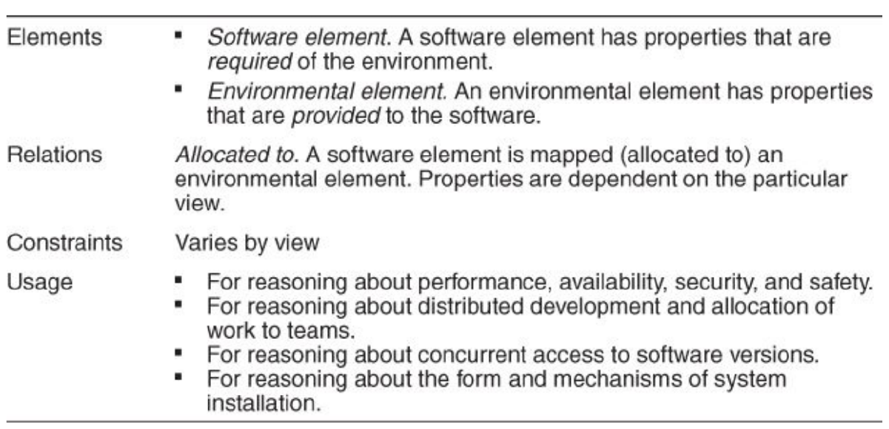
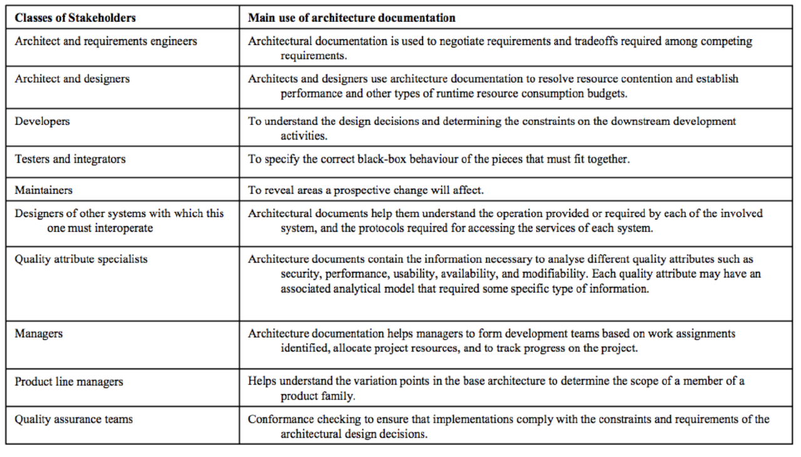
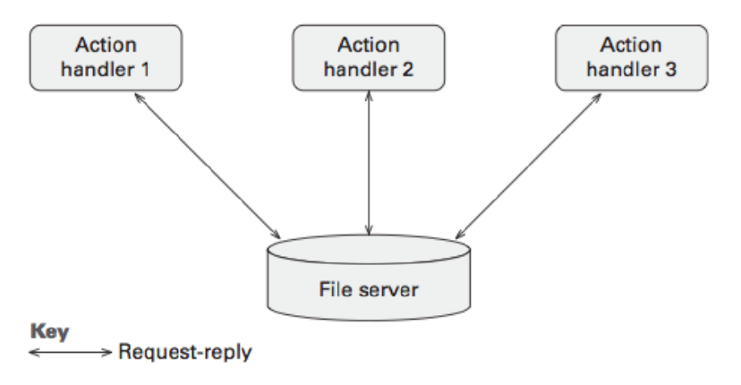
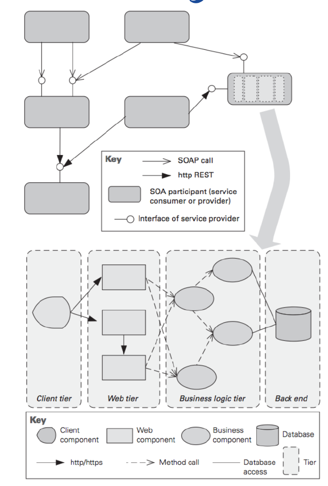
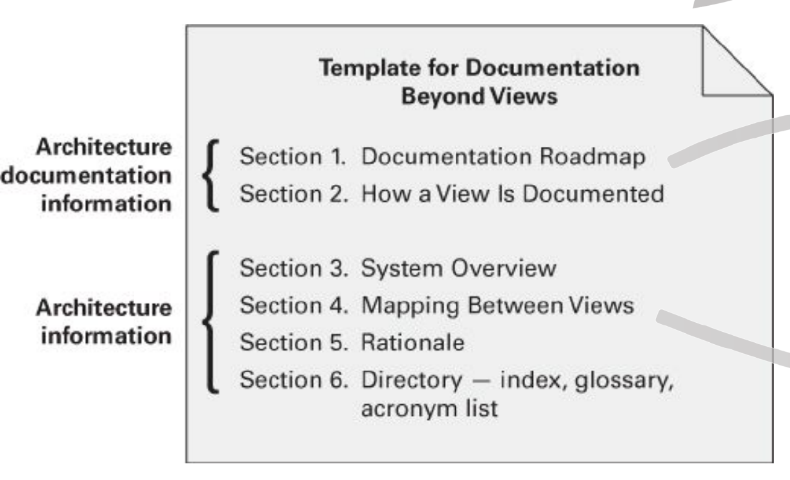
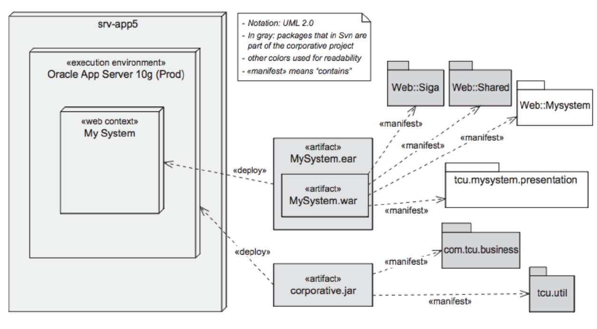

lec17-Document
---

# 1. 文件架构 Document Architecture

## 1.1. 为什么要记录软件架构？ Why to document software architecture?
1. 这是记录软件架构的几个很好的理由，例如：There are several good reasons for documenting software architecture such as:
   1. 交流和社交化架构设计决策 Communicating and socialising architecture design decisions
   2. 帮助理解和评估架构设计决策 Helping understand and assess architecture designdecisions
   3. 刷新设计师对某些决策的记忆 Refreshing designers' memories about certain decisions
   4. 培训架构设计人员 Training people in designing architecture
   5. 支持地理位置分散的团队 Supporting geographically ditributed teams
2. 体系结构文档用于以下活动：Architecture documentation is used for several activities:
   1. 架构设计分析 Architecture design analysis.
   2. 工作分解和分配 Work breakdown and assignment.
   3. 部署后维护 Post-deployment maintenance.
3. 软件体系结构文档提供了维护和修改决策的框架 Software architecture documentation provides a framework for maintenance and modification decisions.

## 1.2. 记录架构的挑战 Challenges in documenting architecture
1. **没有**普遍接受的记录软件架构的**标准**或方法。No universally accepted standard or method of documenting software architecture.
2. 记录大型系统的架构可能是一项**耗时**且重要的任务。 Documenting architecture of large-scale system can be time consuming and non-trivial task.
3. 对用于记录架构的视图的**数量和性质没有达成共识** - 资源密集型活动。No consensus on the number and nature ofviews used to document architecture - resource intensive activity.
4. 迫在眉睫的最后期限和不断发展的架构性质不利于架构文档的流通。Looming deadlines and evolving nature of architecture are detrimental to the currency of architecture documentation.
5. 缺乏全面的**符号和工具**。Absence of a comprehensive notation and tooling.

## 1.3. What to document?
1. 许多值得记录的事情，例如：Many things worth of documenting such as:
   1. 组件**接口**和**依赖项** Component interfaces and dependencies
   2. 子系统**约束** Subsystems constraints
   3. **测试场景** Test scenarios
   4. 围绕设计决策的**上下文**信息 Contextual information surrounding design decisions
2. 有几个因素会影响对记录内容的决定 Several factors affect the decision of what to document:
   1. 被记录的架构的**复杂性** Complexity of the architecture being documented
   2. 应用程序的**寿命** Longevity of an application
   3. 基于**涉众**对文档的预期使用 Based on the expected use of documentation by stakeholders

## 1.4. (7) Rules for Architecture Documentation
1. 从**读者的角度**撰写文档 Write documentation from the reader's point of view
2. 避免没有意义的**重复** Avoid unnecessary repetition.
3. 避免**模糊性** Avoid ambiguity.
4. 使用**标准**的文档组织方式 Use a standard organization. 
5. 记录**理由** Record rationale.
6. 保持文档**最新**但不要太最新 Keep documentation current but not too current
7. **审查**文件是否适合**用途** Review documentation for fitness of purpose

# 2. 视图和视图之外的部分 View and Beyond

## 2.1. Views 视图

### 2.1.1. Styles and Views 样式和视图

#### 2.1.1.1. Three Categories of Styles
1. 它是如何构建为一组实现单元的？How it is structured as a set of implementation units? Module styles
2. 它是如何构建为一组具有运行时行为和交互的元素的？How it is structured as a set of elements that have runtime behavior and interactions? Component-connector(C&C) styles
3. 它与环境中的非软件结构有何关系？How it relates to non-software structures in its environment? Allocation style

#### 2.1.1.2. 架构风格 和 架构模式 Styles Vs. Patterns
1. **架构风格**是元素和关系类型的特殊化，以及关于如何使用它们的一组约束 An architecture style is a"specialization of element and relation types, together with a set of constraints on how they can be used" (Bass, Clements, and Kazman 2003)
2. **架构模式**表达了软件系统的基本结构组织模式 An architecture pattern"expresses a fundamental  structural organization schema for software systems"(Buschmann et al. 1996)
3. 架构模式的一个重要部分是关注问题和上下文，以及如何在该上下文中解决问题。An essential part of an architecture pattern is its focus on the problem and context as well as how to solve the problem in that context.
4. 架构风格侧重于架构方法，对特定风格何时有用或无用提供更轻量级的指导。An architecture style focuses on the architecture approach, with more lightweight guidance on when a particular style may or may not be useful.
5. 架构模式：{问题，上下文} --> 架构方法Architecture pattern: {problem, context} --> architecture approach
6. 架构风格：架构方式 Architecture style: architecture approach
7. 风格描述通常不包括详细的问题/上下文信息； 架构模式可以。A style description does not generally include detailed problem/context information; architecture patterns do.
8. 微服务知识定义了element，和element通过什么方式进行交互。

### 2.1.2. Architectura Views
1. 视图是一组系统元素和它们之间关系的表示——不是所有的系统元素，而是特定类型的那些元素 A view is a representation of a set of system elements and relations among them - not all system elements, but those of a particular type.
2. 视图让我们将系统的实体划分为有趣且易于管理的系统表示 Views let us divide the system's entity into interesting and manageable representations of the system.
3. 不同的视图支持不同的目标和用户，突出不同的系统元素和关系 Different views support different goals and users, and highlight different system elements and relations
4. 不同的视图在不同程度上暴露了不同的质量属性。 Different views expose different quality attributes to different degrees.

### 2.1.3. Structural Views 结构关系视图

#### 2.1.3.1. Module Views 模块视图
1. 模块是提供一组连贯职责的实现单元 A module is an implementation unit that provides a coherent set of responsibility.
2. 没有至少一个模块视图，任何软件架构的文档都不可能是完整的 It is unlikely that the documentation of any software architecture can be complete without at least one module view.
3. 视图示例
   1. 分解视图 Decomposition view
   2. 使用视图 Uses view 
   3. 泛化视图 Generalization view
   4. 分层视图 Layered view
   5. 领域视图 Aspects View
   6. 数据模型视图 Data model view
4. Summary of Module Views

#### 2.1.3.2. Component-Connector Views
1. 组件和连接器视图显示具有某些**运行时存在**的元素，例如进程、对象、客户端、服务器和数据存储（称为“组件”）。 Component-and-connector views show elements that have some runtime presence, e.g, processes, objects, clients, servers, and data stores (being termed 'components).
2. 附件指示哪些连接器连接到哪些组件 Attachments indicate which connectors are attached to which components.
3. 通过将连接器的端点连接到组件的端口来显示附件。 Attachment is shown by connecting the endpoints of the connector to the ports of components.
4. 视图示例
   1. 管道和过滤器视图 Pipe-and-filter view
   2. 客户端-服务器视图 Client-server view
   3. 点对点视图 Peer-to-peer view
   4. 面向服务的架构 (SOA) 视图 Service-oriented architecture (SOA) view
   5. 发布订阅视图 Publish-subscribe view
   6. 共享数据视图Shared-data view
   7. 多层视图 Multi-tier view
5. Summary of C&C Views

#### 2.1.3.3. 分配视图 Allocation Views
1. 分配视图描述了软件单元到软件开发或执行环境元素的映射 Allocation views describe the mapping of software units to elements of an environment in which the software is developed or in which it executes.
2. 分配视图的通常目标是将软件元素所需的属性与环境元素提供的属性进行比较，以确定分配是否成功 The usual goal of an allocation view is to compare the properties required by the software element with the properties provided by the environmental elements to determine whether the allocation will be successful or not.
3. 分配视图可以描绘静态或动态视图 Allocation views can depict static or dynamic views
4. 视图实例
   1. 部署视图 Deployment view
   2. 安装视图 Install view
   3. 工作分配视图 Work assignment view
   4. 其他分配视图 Other allocation views
5. Summary of Allocation Views

### 2.1.4. 质量视图 Quality Views
1. 安全视图 Security view
2. 性能视图 Performance view
3. 可靠性视图 Reliability view
4. 沟通视图 Communication View
5. 异常(错误处理)视图Exception view (error-handling) view

### 2.1.5. 文档视图 Documenting Views

#### 2.1.5.1. 使用3步选择视图 3-Step for Choosing Views
1. 步骤 1：构建**涉众/视图表** Step-1: Build a stakeholder/view table
2. 步骤 2：**合并视图** Step-2: Combine views
   1. 2.1 识别上表中的边缘视图 2.1 Identify marginal views in the above table
   2. 2.2 通过关联一个视图中的元素和另一个视图中的元素，将每个边缘视图与另一个具有更强选区的视图相结合 2.2 Combine each marginal views with another view with stronger constituency by associating between elements in one view and elements in the other
3. 步骤 3：确定优先级和阶段 Step-3: Prioritize and stage
   1. 分解视图 decomposition view
   2. 80/20原则 80/20 principle
   3. 按顺序完成所有视图？complete all views in sequence?

#### 2.1.5.2. 利益相关者和文件 Stakeholder and Documentation

#### 2.1.5.3. 利益相关者视图表 Stackholder-View Table

- 上图中每一个格子是指涉众对某一个部分的细节了解程度。

### 2.1.6. 组合视图 Combining Views
1. 各种 C&C 视图 Various C&C view
2. 带有 SOA 或通信进程视图的部署视图 Deployment view with either SOA or communicating- process Views
3. 分解视图和任何工作分配、实施、使用或分层视图 Decomposition view and any of work assignment, implementation, uses, or layered views

- 使用一张视图说明整个系统的部署信息

- 描述了component之间的关系

### 2.1.7. View Template

1. 第1部分：主要介绍 Section-1: The Primary Presentation
   1. 显示视图的元素和关系 shows the elements and relations of the view
   2. 通常带有一个键的图形 often graphical with a key
2. 第2部分：**元素目录** Section-2: The **Element Catalog**
   1. 详细介绍了第1节中描述的元素。details the elements depicted in Sect.1
   2. 元素及其属性 Elements and their properties
   3. 关系及其属性 Relations and their properties
   4. 元素接口和行为 Element interfaces and behavior
3. 第3部分：**上下文图** Section-3: **Context Diagram**
   1. 系统或其部分如何与其环境相关 how the system or its portion relates to its envlronment
4. 第4部分：**可变性** 指南 Section-4: **Variability** Guide
   1. 如何在此视图中练习架构的任何变化点 how to exercise any variation points of the architecture in this view
5. 第 5 节：**基本原理** Section-5: **Rationale**
   1. 为什么设计反映在视图中 why the design reflected in the view
   2. 提供了一个令人信服的论据，证明它是合理的。 provides a convincing argument that it is sound .

### 2.1.8. 上下文图 Context Diagram

## 2.2. 超越（超越观点的信息）Beyond(Information Beyond Views)

### 2.2.1. 超越视图的文档 Documentation Beyond Views

### 2.2.2. 文件控制信息 Document Control information

1. 第1部分：文档路线图说明文档中的信息以及在哪里可以找到它 Section-1: Documentation Roadmap tells what in formation is in the documentation and where to find it 
   1. 范围和总结 Scope and summary
   2. 文档的组织方式 How the documentation is organized
      1. 简短的概要 short synopsis
      2. 带注释的目录 annotated table of contents
   3. 查看概览 View overview
   4. 利益相关者如何使用文档 How stakeholders can use the documentation

### 2.2.3. Mapping between Views

### 2.2.4. Documentation Package

# 3. 作业三
1. brownfield system、ADD
2. BankStat Case Study
   1. 银行账单的系统
   2. 基础之上满足为了second的所有需求和ASR
3. 要求
   1. 20页及以下
      1. 每一次迭代选择出的要解决的问题
      2. 包括依据
   2. 文档化的形式表现出来：添加cross-view(三个之上)
   3. 每个同学写干了什么(每人半夜)
      1. 如何使用ADD方法
      2. 自己的贡献
   4. 英文保证要看懂