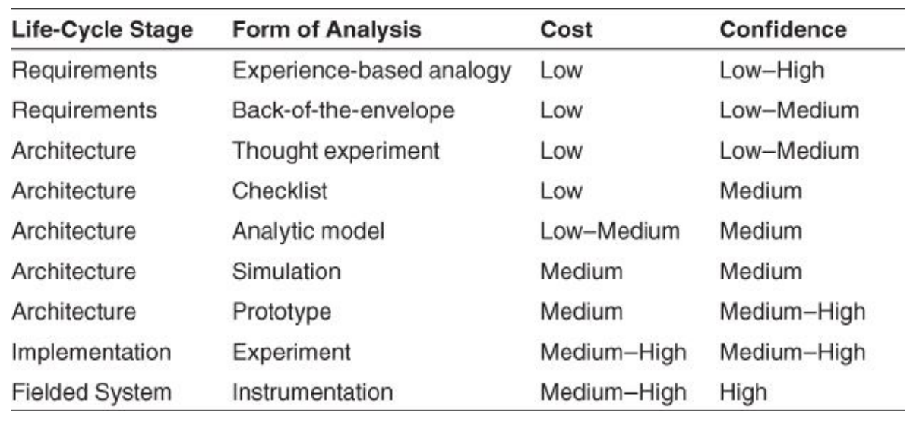
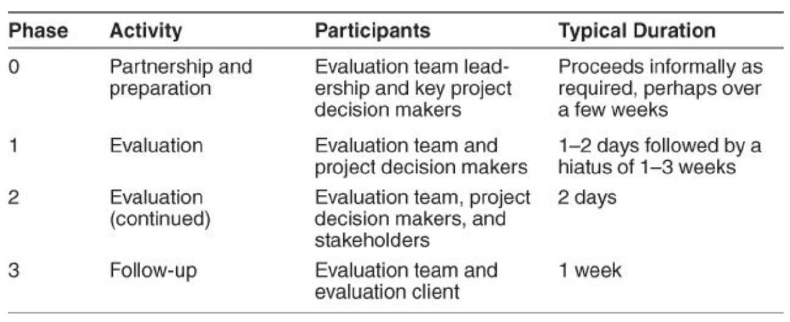
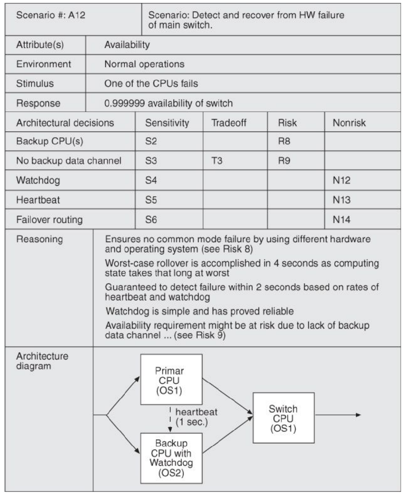
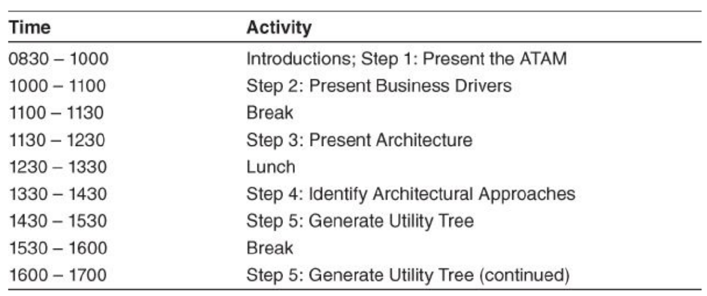

lec18-Evaluating Architecture
---

# 1. Architecture Process

## 1.1. Why to evaluate architecture?
1. 大型项目经常延迟交付和超出预算 Large projects often delivered late and over-budget
   1. 由于设计失败而无法及时交付 Don't function as promised due to design failures
   2. 商业组件不能按照预期运行 COTS components don't work as expected
2. 项目后期需要大量的返工 Considerable rework often required late in project
   1. 团队成员没有讨论这个问题 Team members not communicated the issues? 
   2. 团队成员中缺少可以尽早发现问题的专家 Team members lacking expertise to detect problems early?
   3. 有代价 Costly
3. 架构评估有助于缓解这些问题 Architecture evaluations help alleviate these problems
   1. 彻底评估商业组件的稳定性 Thoroughly assess COTS component suitability
   2. 在问题变的需要一定代价去修复前识别发现问题 Identify problems before they become costly to fix
   3. 通知管理层，以方便他们做出更好的决策 Inform management so they can make better decisions
4. 在问题修复代价还比较低时尽早定位问题 Locate problems early when they are cheap to fix
   1. 设计缺陷 Design faults
   2. 没有考虑到的商业组件行为 Unexpected COTS components behavior
   3. 商业组件对整体系统架构不匹配 Mismatch of COTS components to overall architecture
5. 传播架构/设计最佳实践 Disseminate architecture/design best practices
   1. 评估者是可以发现最佳时间的专家 Reviewers are experts, can capture best practices
   2. 评估者拥有不同项目的广阔视野 Reviewers have broad perspective across many projects
6. 提供更好的技术和项目信息给管理层 Provide management with better technical and project information
7. 确定培训可以对常见问题领域产生广泛影响的领域 Identify areas where training could provide broad impact on commonly recurring problem areas
8. 改善与商业组件供应商的互动 Improve interactions with COTS component suppliers

## 1.2. 什么时候需要评估架构呢？When to evaluate an architecture?
1. 期望获得 Acquisition
   1. 选择不合适的商业组件时的最小风险 Minimize risks of choosing inappropriate COTS components
   2. 涉及收购方和供应商(有明显的警告)Involve acquirers and vendors (with obvious caveats:-})
2. 演化/升级 Evolution/Upgrade
   1. 评估变化的影响 Assess impact of changes
3. 设计 Design
   1. 新架构适合需求的早期“验证” Early 'validation' that the new architecture is suitable for requirements
4. 构建 Build
   1. 实际架构是否按预期构建 Is actual architecture built as intended
   2. 它是否被很好的构建 Is it built 'well?
5. 尽早地进行评估 Always evaluate early!!!

## 1.3. Why evaluate architecture early?
1. 架构评估需要尽早完成因为 Architecture evaluation should be done early because:
   1. 还有时间来修复 there is time for correction
   2. 修复错误的决定的成本相对比较小 correcting wrong decision is relatively inexpensive
   3. 它是最有效的质量保证和风险缓解技术之一 it is one of the most effective quality assurance and risk mitigation techniques
   4. 这被认为是一种良好的商业惯例 it is considered a good commercial practice
2. 早期质量评估具有成本效益（AT&T：生产力提高 10%/1991 年项目） - 最近，通过及早发现和解决问题，在 100,000行(不含注释)的系统上节省了 100 万美元 Early quality evaluation is cost effective (AT&T: 10% productivity increase/project 1991) - Lately, $I million savings on systems of 100,000 non-commentary LOC by detecting and resolving problems early
3. 存在相互竞争的要求； 必须根据业务目标及早做出决定 There are competing requirements; decisions must be made early according to business goals 
4. 架构设计决策的基本原理应该被捕获和推理 Rationale for architecture design decisions should be captured and reasoned about

## 1.4. 如何评估软件架构 How to evaluate software architecture?
1. 评估架构的系统方法需要一种有助于提出正确问题的方法 A systematic approach to evaluate architecture needs a method that helps ask right questions
   1. 来发现风险 to discover risks
   2. 来识别错误的架构决定 to identify wrong architectural choices
   3. 确保质量问题得到解决 to ensure quality issues have been addressed
2. 这里有很多用来评估软件架构的方法 There are a number of methods to evaluate software architecture:
   1. Software Architecture Analysis Method (SAAM)
   2. Architecture Level Modifiability Analysis (ALMA)
   3. Performance Assessment of Software Architecture (PASA)
   4. Architecture Trade-off Analysis Method (ATAM)
3. 所有这些方法都是基于场景的方法，因为质量属性是使用场景定义的 All these methods are scenario-based approaches as quality attributes are defined using scenarios
4. 场景被映射到架构组件上，以评估架构能力，以满足所需的质量属性 Scenarios are mapped on architectural components to evaluate architectural capability to fulfill desired quality attributes

## 1.5. 方法如何可以变得有用？How can a method be helpful!?
1. 帮助涉众尽早问正确的问题来：It helps stakeholders ask right questions early to:
   1. 识别风险：可能对所需质量属性产生负面影响的架构决策Identify risks: Architectural decisions that may negatively affect desired quality attributes
   2. 发现敏感点：特定质量属性对其敏感的架构决策Find sensitivity points: Architecture decisions to which a particular quality attribute is sensitive to
   3. 发现**权；衡**：影响多个质量属性的架构决策 Discover tradeoffs: Architecture decision that affect more than one quality attribute
2. 发现趋势：架构决策与系统属性预测之间的相关性 Find trends: correlation between architectural decisions and predictions of system properties
3. 可以通过进一步分析、设计或原型制作来减轻风险 Efforts can be directed to mitigate the found risks by further analysis, design or prototyping
4. 所做的权衡和支持它们的理由可以适当地记录下来以备将来参考 Tradeoffs made and rationale underpinning them can appropriately be documented for future reference

## 1.6. 评价分析方法 Analysis Methods for Evaluation

## 1.7. 评估格式 Evaluate Forms
1. **设计师**在设计过程中评估 Evaluation by designers within the design process
   1. 生成-测试方法 generate-and-test approach
2. **其他人**在设计过程中评估 Evaluation by peers within the design process
   1. 审查者确定许多质量属性方案来推动审查。The reviewers determine a number of quality attribute scenarios to drive the review.
   2. 架构师介绍要评估的架构部分 The architect presents the portion of the architecture to be evaluated.
   3. 对于每个场景，设计人员都会遍历架构并解释如何满足场景。For each scenario, the designer walks through the architecture and explains how the scenario is satisfied.
   4. 潜在的问题被捕获。Potential problems are captured.
3. 架构设计完成后由外部人员进行评估 Evaluation by outsiders once the architecture has been designed

# 2. ATAM：架构权衡分析方法 ATAM：Architecture Tradeoff Analysis Method

## 2.1. 阶段 Phase
1. ATAM方法分为4个阶段完成

### 2.1.1. 阶段0：准备好伙伴 Phase-0: Partnership 8 Preparation
1. 参与者：评估团队领导和关键项目决策者 Participants: evaluation team leadership and key project decision makers
2. 输入：架构设计文档 Inputs: the architecture documentation
3. 输出：评估计划 Outputs: the evaluation plan
   1. **谁？**涉众的初步名单 Who? a preliminary list of stakeholders
   2. 逻辑：**什么时候？什么地点和如何？** Logistics: When? Where? and How?
   3. 什么时候评估报告被送给**谁**？When the evaluation report is to be delivered to whom?
   4. 评估报告中应该包含**什么**信息？What information to be included in the evaluation report?

### 2.1.2. 阶段1：评估(1) Phase-1: Evaluation (1)
1. 参与者：评估团队和项目决策者 Participants: evaluation team and project decision makers
2. 步骤1-6 Step 1-6
3. 输出 Outputs:
   1. 架构的简明介绍 a concise presentation of the architecture
   2. 业务目标（驱动因素）的阐述 articulation of the business goals (drivers)
   3. 作为场景实现的特定质量属性要求的优先列表 a prioritized list of specific quality attribute requlrements realized as scenarios
   4. 效用树 utility tree
   5. 风险和无风险 risks and nonrisks
   6. 敏感点和权衡点 sensitivity points and tradeoff points

### 2.1.3. 阶段2：评估(2) Phase-2: Evaluation (2)
1. 参与者：评估团队，项目决策者和架构涉众 Participants: evaluation team, project decision makers, and architecture stakeholders
2. 步骤(1) 7-9 Step (1) 7~9
3. 输出：Outputs:
   1. 涉众社区的优先场景列表 a list of prioritized scenarios from the stakeholder community
   2. 风险主题和业务驱动因素各自受到威胁 risk themes and business drivers threatened by each one

### 2.1.4. 阶段3：后续 Phase-3: Follow-up
1. 参与者：评估团队和主要涉众(评估客户) Participants: evaluation team and key stakeholders (evaluation clients)
2. 输出：最终评估报告 Outputs: the final evaluation report
3. 评估团队制作一份书面最终报告，分发给主要涉众以供审核。The evaluation team produces a written final report that is circulated to key stakeholders for revlew.
4. 审查结束后，将报告提交给委托评估的人。After the review, the report is delivered to whom commissioned the evaluation.

### 2.1.5. ATAM阶段总结 Summary of ATAM phases

## 2.2. 第一阶段的步骤 Steps of Phase-1

### 2.2.1. 第一步：介绍ATAM Step1 - Present the ATAM
1. 评估负责人向集合的项目代表（“决策者”）简要介绍 ATAM，让他们了解评估的过程和输出 The evaluation leader presents the ATAM in brief to assembled project representatives ('decision makers') for their understanding of the process and outputs of the evaluation

### 2.2.2. 第二步：介绍业务驱动因素 Step2 - Present the Business Drivers
1. 项目经理或系统的客户从业务角度呈现系统概览，描述 Project manager or system's customer presents a system overview from a business perspective, describing
   1. 它最重要的功能需求 its most important functional requirements
   2. 其技术、管理、经济或政治限制 its technical, managerial, economic, or political constraints
   3. 其商业目标和上下文 its business goals and context
   4. 其主要涉众 its major stakeholders
   5. 架构驱动因素（塑造架构的主要质量属性目标）the architectural drivers (major quality attribute goals that shape the architecture)

### 2.2.3. 第三步：介绍架构 Step3 - Present the architecture
1. 首席架构师在适当的细节级别上进行了描述架构的演示： The lead architect makes a presentation describing the architecture at an appropriate level of detail:
   1. 技术限制，例如规定使用的操作系统、硬件或中间件 technical constraints such as an OS, hardware, or middleware prescribed for use
   2. 系统必须与之交互的其他系统 other systems with which the system must interact
   3. 用于满足质量属性要求的架构方法 architectural approaches used to meet quality attribute requirements
2. 架构演示（大约 20 张幻灯片；60 分钟）Architecture Presentation (Approximately 20 slides; 60 Minutes)
   1. 推动架构要求、与这些要求相关联的可测量数量，以及满足这些要求的任何现有标准/模型/方法（2-3 张幻灯片） Driving architectural requirements, the measurable quantities you associate with these requirements, and any existing standards/ models/ approaches for meeting these (2-3 slides)
      1. 重要的架构信息（4-8 张幻灯片）：Important architectural information (4-8 slides):
         1. 语境图 - 系统在其存在的语境中。系统将与之交互的人类或其他系统。 Context diagram-the system within the context in which it will exist. Humans or other systems with which the system will interact.
         2. 模块或层视图 - 描述系统功能分解的模块（可以是子系统或层），以及填充这些的对象、过程、函数以及它们之间的关系（例如，过程调用、方法调用、 回调，遏制）。Module or layer view- the modules (which may be subsystems or layers) that describe the system s decomposition of functionality, along with the objects, procedures, functions that populate these, and the relations among them (e.g, procedure call, method invocation, callback, containment).
         3. 组件和连接器视图进程、线程以及连接它们的同步、数据流和事件。Component-and-connector view-processes, threads along with the synchronization, data flow, and events that connect them.
         4. 部署视图 - CPU、存储、外部设备/传感器以及连接它们的网络和通信设备。 还显示了在各种处理器上执行的进程。Deployment view- CPUs, storage, external devices/ sensors along with the networks and communication devices that connect them. Also shown are the processes that execute on the various processors.
      2. 采用的架构方法、模式或策略，包括它们解决的质量属性以及这些方法如何解决这些属性的描述（3-6 张幻灯片）：Architectural approaches, patterns, or tactics employed, including what quality attributes they address and a description of how the approaches address those attributes (3-6 slides):
         1. 商业现货 (COTS) 产品的使用以及它们的选择/集成方式（1-2 张幻灯片）。Use of commercial off-the-shelf (COTS) products and how they are chosen/integrated (1-2 slides).
         2. 跟踪 1 到 3 个最重要的用例场景。 如果可能，包括每个场景消耗的运行时资源（1-3 张幻灯片）。Trace of 1 to 3 of the most important use case scenarios. If possible, include the runtime resources consumed for each scenario (1-3 slides).
         3. 跟踪 1 到 3 个最重要的变化场景。 如果可能，根据更改的模块或界面（1-3 张幻灯片）描述更改影响（更改的估计大小/难度） Trace of1 to 3 of the most important change scenarios. If possible, describe the change impact (estimated size/ difficulty of the change) in terms of the changed modules or interfaces (1-3 slides).
         4. 与满足驱动架构要求相关的架构问题/风险（2-3 张幻灯片）。Architectural issues/risks with respect to meeting the driving architectural requirements (2-3 slides).
         5. 词汇表（1张PPT）Glossary (1 slide).

### 2.2.4. 第四步：确定架构方法 Step4 - Identify Architectural Approaches
1. ATAM 专注于通过理解架构方法来分析架构。ATAM focuses on analyzing an architecture by understanding its architectural approaches.
2. 在这一步，评估团队：By this step, the evaluation team
   1. 研究了架构文档 have studied the architecture documentation
   2. 听取了架构师的展示 have heard the architect's presentation
   3. 向架构师询问了设计系统时使用的模式和策略 have asked the architect about patterns and tactics used in designing the system
3. 评估团队对已确定的架构方法（风格、模式和策略）进行编目。The evaluation team catalogs the architectural approaches (styles, patterns and tactics) that have been identified.

### 2.2.5. 第五步：生成质量属性效用树 Step5 - Generate Quality Attribute Utility Tree
1. 这是指导其余分析的关键步骤。 This is a crucial step that guides the remainder of the analysis.
2. 评估团队与项目决策者合作，确定、确定和优化系统最重要的质量属性目标。The evaluation team works with the project decision makers to identify, prioritize and refine the system's most important quality attribute goals.
3. 质量属性目标通过质量属性效用树详细阐述，该树通过精确定义相关质量属性需求使需求具体化。The quality attribute goals are articulated in detail via quality attribute utility tree that makes the requirements concrete by defining precisely the relevant quality attribute requirements.

### 2.2.6. 第六步：分析架构方法 Step6 - Analyze Architectural Approaches
1. 目标是让评估团队确信该方法的实例化适合满足特定于属性的要求。The goal is for the evaluation team to be convinced that the instantiation of the approach is appropriate for meeting the attribute-specific requirements.
2. 评估团队通过要求架构师解释架构如何相互支持，一次检查排名最高的场景（来自实用程序树）。The evaluation team examines that the highest-ranked scenarios(from the utility tree) one at a time by asking the architect to explain how the architecture supports each other.
3. 评估团队记录相关的架构决策，并通过讨论识别和分类其风险、非风险、敏感点和权衡。The evaluation team documents the relevant architectural decisions and identifies and catalogs their risks, nonrisks, sensitivity points, and tradeoffs through a discussion.
4. 分析是为了引出足够的架构信息，以在已经做出的架构决策和需要满足的质量属性之间建立某种联系。The analysis is to elicit sufficient architectural information to establish some link between the architectural decisions that have been made and quality attributes that need to be satisfied.
5. 在这一步结束时，评估团队应该清楚地了解整个架构的最重要方面、关键设计决策的基本原理以及风险、非风险、敏感点和权衡点的列表。At the end of this step, the evaluation team should have a clear picture of the most important aspects of the entire architecture, the rationale for key design decisions, and a list of risks, nonrisks, sensitivity points, and tradeoff points.

### 2.2.7. ATAM 第 1 天的示例议程 Example Agenda for Day 1 for ATAM

## 2.3. 阶段2的步骤 Steps of phase-2

### 2.3.1. 第一步：展示ATAM和之前的结果 Step-1: Present the ATAM & Previous Results
1. 重复步骤 1，以便利益相关者了解方法和他们将扮演的角色。 Step 1 is repeated so that the stakeholders understand the method and the roles they are to play.
2. 评估负责人总结第 2 步到第 6 步的结果，并分享输出（效用树除外）。The evaluation leader recaps the results of steps 2 through 6, and shares the outputs (except the utility tree).

### 2.3.2. 第七步：头脑风暴并确定场景的优先级 Step-7: Brainstorm & Prioritize Scenarios
1. 此步骤的目的是把握更大的利益相关者社区的脉搏，以了解系统成功对他们意味着什么。The purpose of this step is to take the pulse of the larger stakeholder community to understand what system success means to them.
2. 评估团队要求利益相关者集思广益，就其个人角色而言，在操作上有意义的场景。The evaluation team asks the stakeholders to brainstorm scenarios that are operationally meaningful with respect to their individual roles.
3. 一旦收集了场景，就会要求利益相关者对他们认为代表行为或质量问题的场景进行优先级排序和合并。Once the scenarios have been collected, stakeholders are asked to prioritize and merge scenarios they feel represent the behavior or quality concern.
4. 将优先场景列表与实用程序树中的场景进行比较。The list of prioritized scenarios is compared with those from the utility tree.
5. 如果差异很大，则额外的情景可能被识别为风险。If the discrepancy is significant, the additional scenario may be identified as a risk.

### 2.3.3. 第八步：分析架构方法 Step-8: Analyze Architectual Approaches
1. 在此步骤中，评估团队执行与步骤 6 中相同的活动，使用排名最高的（例如前 5 到 10）但新生成的场景。In this step, the evaluation team performs the same activities as in Step 6, using the highest ranked (e.g. top 5 to 10), but newly generated scenarios. 
2. 架构师解释了相关的架构决策如何有助于实现每个决策。 The architect explains how relevant architectural decisions contribute to realizing each one.

### 2.3.4. 第九步：展示结果 Step-9: Present Results
1. 评估团队根据共同的潜在问题或系统性缺陷将风险分组为风险主题。The evaluation team groups the risks into risk themes, based on common underlying concern or systemic deficiency.
2. 然后，确定的风险主题与步骤 2 中列出的特定业务驱动因素相关。The identified risk themes are then related to specific business drivers listed in Step 2.
3. 从评估中收集的信息被总结并呈现给所有利益相关者：The collected information from evaluation is summarized and presented to all stakeholders: 
   1. 记录的架构方法 The architectural approaches documented
   2. 集思广益的场景集及其优先级 The set of scenarios and their prioritization from brainstorming
   3. 实用树 The utility tree
   4. 发现的风险和记录的非风险 The risks discovered and nonrisks documented
   5. 发现的敏感因素和权衡因素 The sensitivity points and tradeoff points found
   6. 风险主题和受威胁的业务驱动因素 Risk themes and the business drivers threatened by each one

## 2.4. Summary of ATAM Phases

## 2.5. ATAM输出总结 Summary of ATAM Outputs
1. 架构的简明展示 A concise presentation of the architecture
2. 业务目标的阐述 Articulation of the business goals 
3. 表示为质量属性场景的优先质量属性要求 Prioritized quality attribute requirements expressed as quality attribute scenarios
4. 引用树 A utility tree
5. 一组风险和非风险 A set of risks and nonrisks
6. 一组风险主题 A set of riskthemes
7. 将架构决策映射到质量要求 Mapping of architectural decisions to quality requirements
8. 一组确定的敏感度和权衡点 A set of identified sensitivity and tradeoff points
9. 最终的评估报告 Final evaluation report

## 2.6. Lightweight Architecture Evaluation

