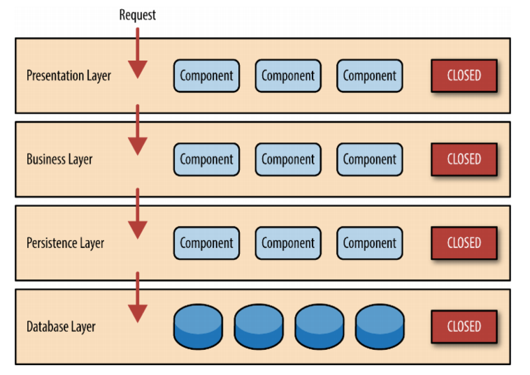
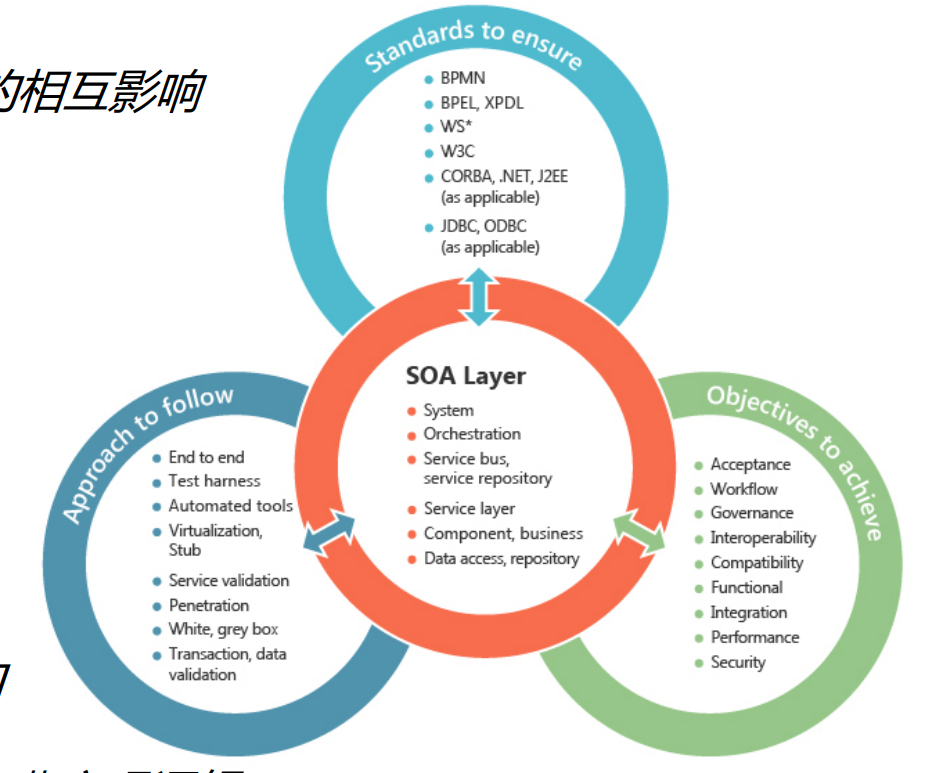
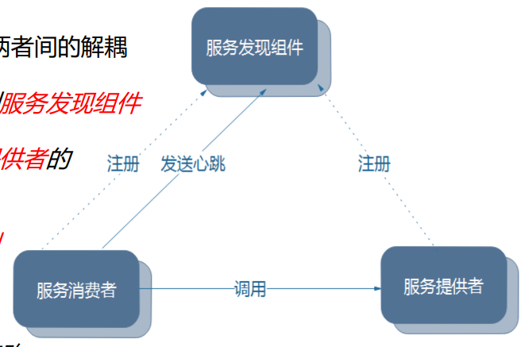
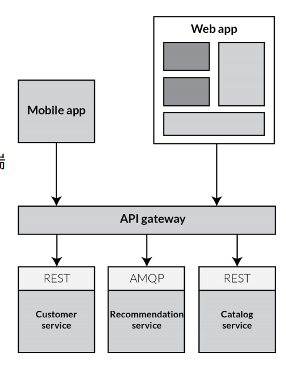
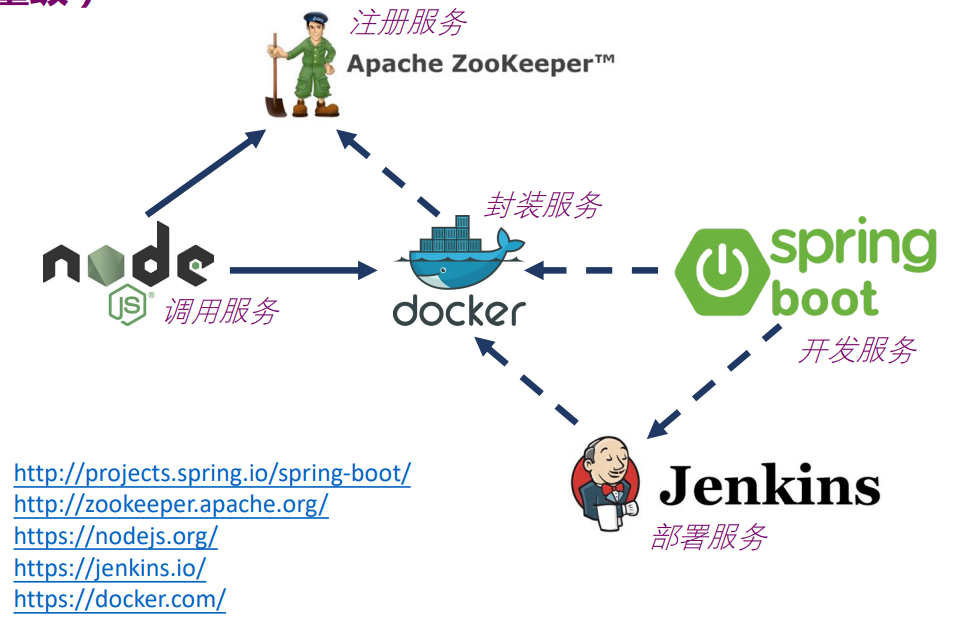
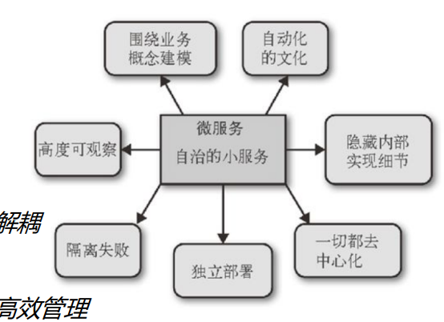

lec19-Microservice Architecture
---

# 1. 什么是软件架构(体系结构) ?
1. 很多人都试图给“架构”下定义，而这些定义相互之间却很难统一
2. 架构是一系列重要**决策**的集合，包括：软件的**组织**、构成系统的结构**要素**及其**接口**的选择、元素在协作中表现的**行为**
3. 软件架构即一系列重要的**设计决策**，这些决策上的失误可能最终导致软件系统项目的失败
4. 软件系统的架构将系统定义为计算**组件**(Components)及组件之间的交互：**连接**(Connector)和**约束**(Constraints)
5. 软件架构是一组具有特定形式的架构元素，包括:负责完成数据加工的处理元素(Processing Elements)、作为被加工信息的**数据元素**(Data Elements)、及用于将不同部分组合在一起的**连接元素**(Connecting Elements)。
6. 软件架构包括系统**组件、连接件和约束**的集合，反映不同涉众需求的集合、以及**原理**(Rationale)的集合。
7. 软件架构是以**组件**、组件相互间的**关系**、组件与**环境**之间的关系所描述的软件系统的基本组织**结构**，以及指导其设计与演化的原理(Principle)。
8. 软件架构是系统的单一或多重**结构**，它们由软件**元素**、这些元素的外部可见**属性**，以及元素之间的**关系**组成。

# 2. 软件架构的演化

## 2.1. 单体架构
1. 单体(Monolithic)应用的全部功能被**集成**在一起作为一个**单一**的单元。
2. 单体架构更多地作为应用的**部署架构**，即只要它部署在同一台(虚拟)机器上，运行于同一进程中，而无论应用内部如何模块化，服务化或者分层。

## 2.2. 分层架构
1. **关注点分离**原则
2. 软件系统的组件被分成多个相互**不重叠**的**层次**，每一层都有着特定的职能，仅处理本层的逻辑，而并不关心其它层的实现。
   1. 表现层
   2. 业务层
   3. 持久层
   4. 数据层
3. 分层架构模式特点:
   1. `+` 结构简单
   2. `+` 易于组织开发
   3. `+` 便于独立测试、维护
   4. `-` 不易实现持续发布、部署
   5. `-` 性能代价
   6. `-` 可扩展性差

## 2.3. 面向服务架构(SOA)
1. 面向服务架构(SOA)：是一个**分布式**组件的集合，这些组件为其它组件**提供**服务(provider)，或者**消费**其它组件所提供的服务(consumer)，而无需知道其它组件的实现细节。
2. 企业服务总线(ESB)：为服务间的**相互调用**提供支持环境，**路由**服务间的消息，并对消息和数据进行必要的**转换**。
3. 服务编排引擎(Orchestration Engine)：可以根据预先定义的**脚本**对服务消费者与服务提供者之间的交互进行**指挥**。

4. 面向服务架构的特点:
   1. +服务自身**高内聚**、服务间**松耦合**，最小化开发维护中的相互影响
   2. +良好的**互操作性**，符合开放标准
   3. +模组化， 高**重用性**
   4. +服务动态**识别、注册、调用**
   5. -系统**复杂性**提高
   6. -难以**测试**验证
   7. -各独立服务的**演化**不可控
   8. -中间件易成为**性能**瓶颈
5. 面向服务架构实现原则:
   1. 服务**解耦**:服务之间的关系最小化，只是互相知道接口
   2. 服务**契约**:服务按照描述文档所定义的服务契约行事
   3. 服务**封装**:除了服务契约所描述内容，服务将对外部隐藏实现逻辑
   4. 服务**重用**:将逻辑分布在不同的服务中，以提高服务的重用性
   5. 服务**组合**:一组服务可以协调工作，组合起来形成定制组合业务需求
   6. 服务**自治**:服务对所封装的逻辑具有控制权
   7. 服务**无状态**:服务将一个活动所需保存的资讯最小化

## 2.4. 构建云原生应用(SaaS)的12要素
1. **基准代码**:一份基准代码，多份部署。基准代码和应用之间总是保持一一对应的关系。所有部署的基准代码相同，但每份部署可以使用其不同的版本。
2. **依赖**:显式声明依赖关系。应用程序一定通过依赖清单，确切地声明所有依赖项。
3. **配置**:在环境中存储配置。将应用的配置存储于环境变量中。环境变量可以非常方便地在不同的部署间做修改，却不动一行代码。
4. **后端服务**:把后端服务当作附加资源。应用不会区别对待本地或第三方服务。对应用程序而言，两种都是附加资源。
5. **构建，发布，运行**:严格区分构建，发布，运行这三个步骤。
6. **进程**:以一个或多个无状态进程运行应用。应用的进程必须无状态且无共享。
7. **端口绑定**:通过端口绑定提供服务。应用完全自我加载而不依赖任何网络服务器就可以创建一个面向网络的服务。
8. **并发**:通过进程模型进行扩展。开发人员可以运用这个模型去设计应用架构，将不同工作分配给不同的进程类型。
9. **易处理**:快速启动和优雅终止可最大化健壮性。应用的进程是可支配的，意思是说它们可以瞬间开启或停止。
10. **开发环境与线上环境等价**:尽可能保持开发、预发布、线上环境相同。应用想要做到持续部署就必须缩小本地与线上差异。
11. **日志**:把日志当作事件流。应用本身考虑存储自己的输出流。不应该试图去写或者管理日志文件。
12. **管理进程**:后台管理任务当作一次性进程运行。一次性管理进程应该和正常的常驻进程使用同样的环境。

# 3. 微服务架构风格

## 3.1. 什么是微服务架构? 
1. 微服务( Microservices )架构风格是一种将一个**单一应用**程序开发为**一组小型服务**的方法，每个服务运行在**自己的进程**中，服务间通信采用**轻量级通信**机制，这些服务围绕**业务能力**构建并可通过自动部署机制**独立部署**。
2. 微服务架构本质上仍然是一种**分布式**架构，也是**面向服务**架构的一种扩展。

## 3.2. 微服务架构的特点
1. 通过服务组件化
   1. 组件是一个可**独立替换**或**升级**的软件**单元**，微服务架构实现组件化的方式是**分解成服务**。
   2. 服务是一种**进程外**的组件，它通过**Web**服务请求或远程过程用(**RPC**)机制通信。
   3. 使用服务作为组件的主要原因是服务是可**独立部署**。
   4. 使用服务作为组件产生更加明确的组件**发布接口**。
2. 围绕业务能力组织
   1. 传统软件系统开发管理通常聚焦在**技术层面**，导致UI团队、服务逻辑团队、数据库团队等的划分，将始终伴随**跨团队**的沟通、交接和预算审批等。
   2. 微服务采用围绕**业务能力**的划分方法来组织服务，实现在服务的业务领域内的**宽栈实现**，其团队都是跨职能的，包括全方位开发技能，如用户体验、数据库项目管理。
   3. 微服务采用**产品开发**模式，而非项目模式，开发团队负责软件的整个**产品周期**，持续关注软件如何帮助用户提升业务能力，实现**价值交付**。
3. 内聚和解耦
   1. 基于微服务构建的系统目标是尽可能的**解耦**和尽可能的**内聚**，他们拥有各自的**领域逻辑**。
   2. 当系统被划分成分离的服务时，可利用**领域驱动设计**(Domain-Driven Design)的理念，把一个复杂域划分成多个**限界上下文**(Bounded Context)，并且映射出它们之间的关系。
   3. 服务和上下文**边界**的确定有助于澄清和**强化分离**，实现解耦。
4. 去中心化
   1. 去中心化**治理**，在构建微服务时可以有服务自己的**技术栈选择**。
      1. 服务之间只需要约定接口，而无需关注彼此的内部**实现**;
      2. 同样，**运维**只需要知道服务的部署规范。
   2. 去中心化**数据存储**，微服务更倾向于让每个服务管理**自己的数据库**，或者同一数据库技术的不同实例，或完全不同的数据库系统。
   3. 去中心化**数据管理**，对跨微服务的数据来说，去中心化责任对管理升级带来困难，微服务架构强调服务间的**无事务协作**，需要**权衡**更大一致性的业务损失与修复错误的代价。
5. 基础设施自动化
   1. 随着基础设施的自动化，特别是云和Web Services等技术的发展，已经**降低**构建部署和运维微服务的**操作复杂度**。
6. 服务设计
   1. **高可用性**
      1. 任何服务调用都可能因为服务**提供者不可用**而失败，客户端必须尽可能有效的应对这种失效。
      2. 为每个单独的服务设置完善的**监控**和**日志**记录，有助于对于快速发现不良突发行为而尽早**修复**。
   2. 变更与演化
      1. 把组件放在服务中，只需重新**部署**修改的服务，可以在更**细粒度**上实现频繁快速的发布。
      2. 服务的**划分**上，系统中很少**变更**的部分应该和正在经历频繁改动的部分放在不同的服务里(如果不断地-起改变两个服务，它们应该被合并)。

## 3.3. 微服务架构与传统架构比较

- 《Microservice Architecture in Reality: An Industrial Inquir》

## 3.4. 微服务架构的核心模式
1. 核心模式即针对采用微服务系统在**特定场景**下的**特定问题**，所使用的成熟的架构**解决方案**集合。
2. 服务注册与发现：服务消费者获取服务提供者的机制，以实现两者间的解耦服务发现组件
   1. 微服务**启动时**将自己的地址等信息**注册**到**服务发现组件**
   2. 服务**消费者**可从**服务发现组件**查询服务**提供者**的网络**地址**和调用**接口**
   3. 各个微服务与服务发现组件使用一定**机制通信**，如长时间无法通信即注销该实例
   4. 微服务数量、地址和接口等**发生变更**时，会**重新注册**到服务发现组件，无需人工修改

3. API网关
   1. 微服务架构的应用客户端如何**访问**各项**服务**?
      1. 微服务提供的是**细粒度**API，客户端需要同多项服务进行交互。
      2. 不同客户端需要不同的**数据**。
      3. 不同客户端的**性能**要求亦有所区别。
      4. 服务实例**数量**与其**位置**(地址和端口)会发生动态变化。
      5. 服务的**划分**方式会随时间的推移而改变。
   2. API网关作为全部客户端的**单一入口点**，可以针对不同客户端提供出不同的API。
      1. 确保客户端不必关心应用程序的微服务**拆分方式**。
      2. 确保客户端不受服务**实例位置**的影响。
      3. 为每套客户端提供**最优API**。
      4. 降低请求往返**次数**。
      5. 将从客户端调用多项服务的逻辑**转换**为从AP|网关处调用，以简化整个客户端。

3. 熔断器
   1. 微服务之间难免存在**依赖**关系，同时相互之间通过**网络**进行通信，一旦任何服务或网络出现问题会引起请求失败，并可能导致**级联故障**，将不可用在系统中逐渐放大。
   2. 熔断器模式
      1. 可以**防止**程序不断地尝试执行可能会失败的操作;
      2. 可以使程序能够**诊断**错误是否经**修正**，进而再次尝试调用操作。
   3. 熔断器的实现
      1. **闭合**状态:对程序的请求能够直接引起方法的调用。
      2. **断开**状态:对程序的请求会立即返回错误响应。
      3. **半断开**状态:允许对程序的**一定数量**的请求可以调用服务，如**调用成功**，可认为之前导致调用失败的错误已经修正，熔断器切换到**闭合**状态;如**调用失败**，则认为问题仍存在，熔断器切回到**断开**状态。

## 3.5. 微服务架构的实现

## 3.6. 微服务技术选型(轻量级)
1. 微服务技术选型(轻量级)
   1. **开发**服务: Spring Boot
   2. **封装**服务: Docker
   3. **部署**服务: Jenkins
   4. **注册**服务: ZooKeeper
   5. **调用**服务: Node.js

# 4. 小结
1. 什么是软件架构(体系结构) ?
   1. 结构，元素(组件)，属性，关系，行为，原则
2. 软件架构的演化
   1. 单体 - 分层 - 面向服务 - 微服务
3. 微服务架构的特点
   1. **服务颗粒**化:服务粒度由业务功能决定，服务间尽可能解耦
   2. **责任单一**化:单一职责原则，服务内尽可能内聚
   3. **运行隔离**化:服务运行在各自进程中，互不影响
   4. **管理自动**化:对服务提供自动化部署与监控预警能力，高效管理
4. 微服务架构的挑战
   1. **运维**要求高:微服务数量多，部署与监控要求高
   2. **发布**复杂度:部署环境多样化，网络性能系统容错、分布式事务等挑战
   3. **部署**依赖强:服务间相互调用关系复杂，存在部署顺序依赖
   4. **通信**成本高:跨进程调用比进程内调用消耗更多的资源

