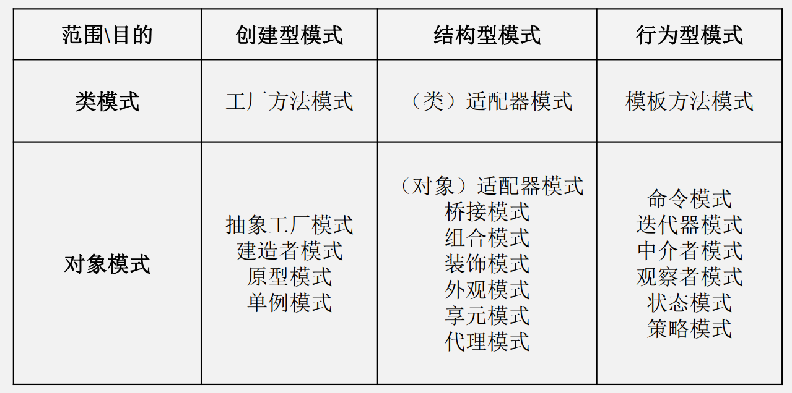
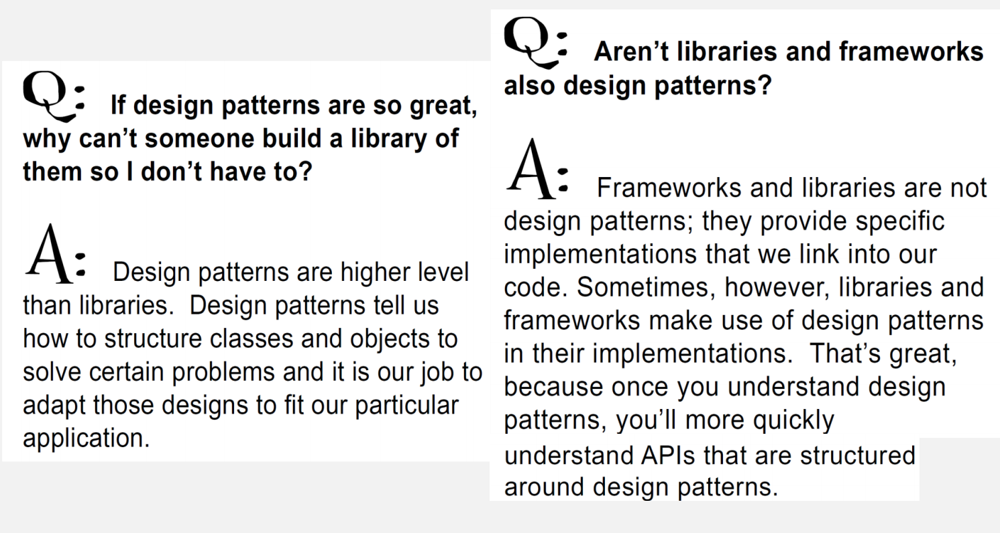
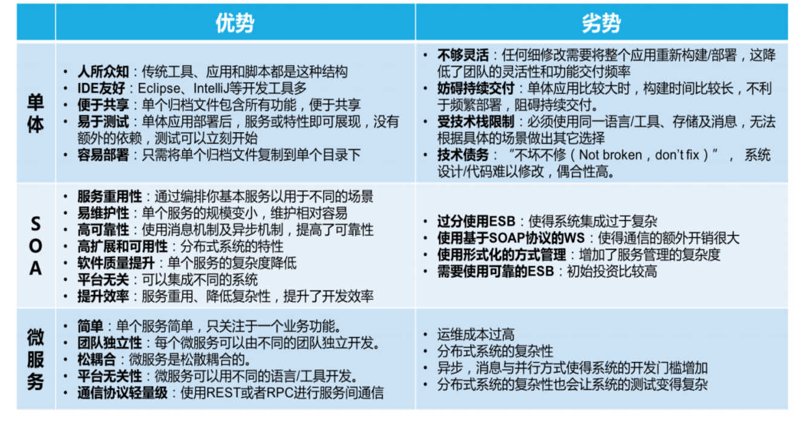
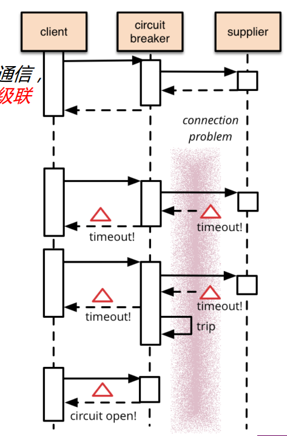

Lec21-Microservice Architecture
---

# 1. 什么是软件架构(体系结构) ?
1. 很多人都试图给“架构”下定义,而这些定义相互之间却很难统一 -Martin Fowler
2. 架构是一系列重要决策的集合,包括:软件的组织、构成系统的结构要素及其接口的选择、 元素在协作中表现的行为 -Grady Booch, lames Rumbaugh, Ilvar Jacobson
3. 软件架构即一系列重要的设计决策,这些决策上的失误可能最终导致软件系统项目的失败。-Eoin Woods
4. 软件系统的架构将系统定义为计算组件( Components )及组件之间的交互:连接( Connector )和约束 ( Constraints )。-Mary Shaw
5. 软件架构是一组具有特定形式的架构元素,包括:负责完成数据加工的处理元素( Processing Elements )、作为被加工信息的数据元素( Data Elements )、及用于将不同部分组合在一起的连接元素 ( Connecting Elements )。-Dewayne Perry, Alexander Wolf
6. 软件架构包括系统组件、连接件和约束的集合,反映不同涉众需求的集合、以及原理( Rationale )的集合。-Barry Boehm
7. 软件架构是以组件、组件相互间的关系、组件与环境之间的关系所描述的软件系统的基本组织结构,以及指导其设计与演化的原理( Principle )。 -IEEE 610.12-1990
8. 软件架构是系统的单一或多重结构 ,它们由软件元素、这些元素的外部可见属性,以及元素之间的关系组成。-Len Bass

# 2. 软件架构的演化

## 2.1. 单体架构
1. 单体( Monolithic )应用的全部功能被集成在一起作为一 个单一的单元。单体架构更多地作为应用的部署架构,即只要它部署在同一台(虚拟)机器上，运行于同一进程中,而无论应用内部如何模块化，服务化或者分层。

## 2.2. 分层架构
1. 关注点分离”原则
2. 软件系统的组件被分成多个相互不重叠的层次,每一层都有着特定的职能,仅处理本层的逻辑，而并不关心其它层的实现。
   1. 表现层
   2. 业务层
   3. 持久层
   4. 数据层
3. 分层架构模式特点:
   1. +结构简单
   2. +易于组织开发
   3. +便于独立测试、维护
   4. -不易实现持续发布、部署
   5. -性能代价
   6. -可扩展性差

## 2.3. 面向服务架构
1. 面向服务架构的特点:
   1. +服务自身高内聚、服务间松耦合,最小化开发维护中的相互影响
   2. +良好的互操作性,符合开放标准
   3. +模组化, 高重用性
   4. +服务动态识别、注册、调用
   5. -系统复杂性提高
   6. -难以测试验证
   7. -各独立服务的演化不可控
   8. -中间件易成为性能瓶颈
2. 面向服务架构实现原则:
   1. 服务解耦:服务之间的关系最小化,只是互相知道接口
   2. 服务契约:服务按照描述文档所定义的服务契约行事
   3. 服务封装:除了服务契约所描述内容,服务将对外部隐藏实现逻辑
   4. 服务重用:将逻辑分布在不同的服务中,以提高服务的重用性
   5. 服务组合:一组服务可以协调工作,组合起来形成定制组合业务需求
   6. 服务自治:服务对所封装的逻辑具有控制权
   7. 服务无状态:服务将一个活动所需保存的资讯最小化

## 2.4. 构建云原生应用(SaaS)的12要素
1. 基准代码: - -份基准代码,多份部署。基准代码和应用之间总是保持一-对应的关系。 所有部署的基准代码相同,但每份部署可以使用其不同的版本。
2. 依赖:显式声明依赖关系。应用程序- 定通过依赖清单,确切地声明所有依赖项。
3. 配置:在环境中存储配置。将应用的配置存储于环境变量中。环境变量可以非常方便地在不同的部署间做修改,却不动一行代码。
4. 后端服务:把后端服务当作附加资源。应用不会区别对待本地或第三方服务。对应用程序而言,两种都是附加资源。
5. 构建,发布，运行:严格区分构建,发布,运行这三个步骤。
6. 进程:以一个或多个无状态进程运行应用。应用的进程必须无状态且无共享。
7. 端口绑定:通过端口绑定提供服务。应用完全自我加载而不依赖任何网络服务器就可以创建一个面向网络的服务。
8. 并发:通过进程模型进行扩展。开发人员可以运用这个模型去设计应用架构,将不同工作分配给不同的进程类型。
9. 易处理:快速启动和优雅终止可最大化健壮性。应用的进程是可支配的,意思是说它们可以瞬间开启或停止。
10. 开发环境与线上环境等价:尽可能保持开发、预发布、线上环境相同。应用想要做到持续部署就必须缩小本地与线上差异。
11. 日志:把日志当作事件流。应用本身考虑存储自己的输出流。不应该试图去写或者管理日志文件。
12. 管理进程:后台管理任务当作一次性进程运行。一次性管理进程应该和正常的常驻进程使用同样的环境。

# 3. 微服务架构风格

## 3.1. 什么是微服务架构? 
1. 微服务( Microservices )架构风格是一种将一 个单一 -应用程序开发为一组小型服务的方法,每个服务运行在自己的进程中,服务间通信采用轻量级通信机制,这些服务围绕业务能力构建并可通过自动部署机制独立部署。
2. 微服务架构本质上仍然是一种分布式架构,也是面向服务架构的一种扩展。

## 3.2. 微服务架构的特点
1. 通过服务组件化
   1. 组件是一个可独立替换或升级的软件单元,微服务架构实现组件化的方式是分解成服务。
   2. 服务是一种进程外的组件,它通过Web服务请求或远程过程用( RPC )机制通信。
   3. 使用服务作为组件的主要原因是服务是可独立部署。
   4. 使用服务作为组件产生更加明确的组件发布接口。
2. 围绕业务能力组织
   1. 传统软件系统开发管理通常聚焦在技术层面,导致UI团队、服务逻辑团队、数据库团队等的划分,将始终伴随跨团队的沟通、交接和预算审批等。
   2. 微服务采用围绕业务能力的划分方法来组织服务,实现在服务的业务领域内的宽栈实现,其团队都是跨职能的，包括全方位开发技能,如用户体验、数据库项目管理。
   3. 微服务采用产品开发模式,而非项目模式,开发团队负责软件的整个产品周期,持续关注软件如何帮助用户提升业务能力,实现价值交付。
3. 内聚和解耦
   1. 基于微服务构建的系统目标是尽可能的解耦和尽可能的内聚,他们拥有各自的领域逻辑。
   2. 当系统被划分成分离的服务时,可利用领域驱动设计( Domain-Driven Design )的理念，把一个复杂域划分成多个限界上下文( Bounded Context ) , 并且映射出它们之间的关系。
   3. 服务和上下文边界的确定有助于澄清和强化分离,实现解耦。
4. 去中心化
   1. 去中心化治理 ,在构建微服务时可以有服务自己的技术栈选择。
      1. 服务之间只需要约定接口,而无需关注彼此的内部实现;
      2. 同样,运维只需要知道服务的部署规范。
   2. 去中心化数据存储,微服务更倾向于让每个服务管理自己的数据库,或者同一数据库技术的不同实例,或完全不同的数据库系统。
   3. 去中心化数据管理,对跨微服务的数据来说,去中心化责任对管理升级带来困难,微服务架构强调服务间的无事务协作,需要权衡更大一致性的业务损失与修复错误的代价。
5. 基础设施自动化
   1. 随着基础设施的自动化,特别是云和Web Services等技术的发展,已经降低构建部署和运维微服务的操作复杂度。
6. 服务设计
   1. 高可用性
      1. 任何服务调用都可能因为服务提供者不可用而失败,客户端必须尽可能有效的应对这种失效。
      2. 为每个单独的服务设置完善的监控和日志记录,有助于对于快速发现不良突发行为而尽早修复。
   2. 变更与演化
      1. 把组件放在服务中,只需重新部署修改的服务,可以在更细粒度上实现频繁快速的发布。
      2. 服务的划分上,系统中很少变更的部分应该和正在经历频繁改动的部分放在不同的服务里(如果不断地-起改变两个服务,它们应该被合并)。

## 3.3. 微服务架构与传统架构比较

- 《Microservice Architecture in Reality: An Industrial Inquir》

## 3.4. 微服务架构的核心模式
1. 核心模式即针对采用微服务系统在特定场景下的特定问题,所使用的成熟的架构解决方案集合。
2. 服务注册与发现：服务消费者获取服务提供者的机制,以实现两者间的解耦服务发现组件
   1. 微服务启动时将自己的地址等信息注册到服务发现组件
   2. 服务消费者可从服务发现组件查询服务提供者的网络地址和调用接口
   3. 各个微服务与服务发现组件使用一定机制通信,如长时间无法通信即注销该实例
   4. 微服务数量、地址和接口等发生变更时，会重新注册到服务发现组件,无需人工修改

3. API网关
   1. 微服务架构的应用客户端如何访问各项服务?
      1. 微服务提供的是细粒度API ,客户端需要同多项服务进行交互。
      2. 不同客户端需要不同的数据。
      3. 不同客户端的性能要求亦有所区别。
      4. 服务实例数量与其位置(地址和端口)会发生动态变化。
      5. 服务的划分方式会随时间的推移而改变。
   2. API网关作为全部客户端的单一入口点 ,可以针对不同客户端提供出不同的API。
      1. 确保客户端不必关心应用程序的微服务拆分方式。
      2. 确保客户端不受服务实例位置的影响。
      3. 为每套客户端提供最优API。
      4. 降低请求往返次数。
      5. 将从客户端调用多项服务的逻辑转换为从AP|网关处调用,以简化整个客户端。

3. 熔断器
   1. 微服务之间难免存在依赖关系 ,同时相互之间通过网络进行通信,一旦任何服务或网络出现问题会引起请求失败,并可能导致级联故障,将不可用在系统中逐渐放大。
   2. 熔断器模式
      1. 可以防止程序不断地尝试执行可能会失败的操作;
      2. 可以使程序能够诊断错误是否经修正，进而再次尝试调用操作。
   3. 熔断器的实现
      1. 闭合状态:对程序的请求能够直接引起方法的调用。
      2. 断开状态:对程序的请求会立即返回错误响应。
      3. 半断开状态:允许对程序的一定数量的请求可以调用服务,如调用成功，可认为之前导致调用失败的错误E 3经修正，熔断器切换到闭合状态;如调用失败,则认为问题仍存在,熔断器切回到断开状态。

## 3.5. 微服务架构的实现

## 微服务技术选型(轻量级)
1. 微服务技术选型(轻量级)
   1. 开发服务: Spring Boot
   2. 封装服务: Docker
   3. 部署服务: Jenkins
   4. 注册服务: ZooKeeper
   5. 调用服务: Node.js

# 4. 小结
1. 什么是软件架构(体系结构) ?
   1. 结构,元素(组件),属性,关系,行为,原则
2. 软件架构的演化
   1. 单体 - 分层 - 面向服务 - 微服务
3. 微服务架构的特点
   1. 服务颗粒化:服务粒度由业务功能决定,服务间尽可能解耦
   2. 责任单一化:单一职责原则,服务内尽可能内聚
   3. 运行隔离化:服务运行在各自进程中,互不影响
   4. 管理自动化:对服务提供自动化部署与监控预警能力,高效管理
4. 微服务架构的挑战
   1. 运维要求高:微服务数量多,部署与监控要求高
   2. 发布复杂度:部署环境多样化,网络性能系统容错、分布式事务等挑战
   3. 部署依赖强:服务间相互调用关系复杂,存在部署顺序依赖
   4. 通信成本高:跨进程调用比进程内调用消耗更多的资源

