Lec4-Design
---

# 1. 设计架构

## 1.1. 设计策略

### 1.1.1. 分解
1. 质量属性需求可以**分解**，并**分配**给分解**元素**。
2. 请记住给定的约束，并安排分解，使其能够**适应**这些**约束**。
3. 设计活动的目标是生成一个适应约束并**达到**系统**质量**和**业务目标**的设计。

### 1.1.2. 根据ASR进行设计
1. **非ASR**要求如何？
   1. ASR的选择意味着要求的**优先级**
      1. 您**仍然可以满足**其他要求
      2. 您可以**稍加调整**现有**设计**即可与其他人见面
      3. 您无法在当前设计下结识其他人
         1. 您**即将**达到要求
         2. 重新确定需求的**优先级**并**重新设计**
         3. 您**不能满足**要求
2. 设计**一次所有**ASR还是**一次**？
   1. 答案是经验问题。
   2. 通过经验和教育，您将开发出一种直观的设计方法，并运用模式/策略来帮助您设计多个ASR。

### 1.1.3. 生成并测试
1. 将特定设计视为假设：当前设计假设的**错误**在**下一设计假设中得到解决**，而正确的事情得到保留。
2. **最初的假设**从何而来？
   1. 现有系统
   2. 框架（部分设计）
   3. 模式与策略
   4. 设计清单（提供指导和信心）
3. 有哪些**测试**？
   1. 分析技术
   2. 设计清单
4. **下一个假设**是如何产生的？
5. 你什么时候**做完**
   1. 具有满足ASR的设计，或者在您用尽预算进行设计时。
   2. 实施您做出的最佳假设

# 2. 属性驱动设计(Attribute-Driven Design，ADD)

## 2.1. ADD的输入：需求？

### 2.1.1. 步骤1：确认有足够的需求信息
1. 系统的利益相关者已根据业务和任务目标确定了**需求**的**优先级**。
2. 您可以确定设计期间要重点关注的**系统元素**。
3. 您确定是否有关于系统质量属性要求的**足够信息**："**刺激反应**"形式。

#### 2.1.1.1. 第一次迭代的元素视图
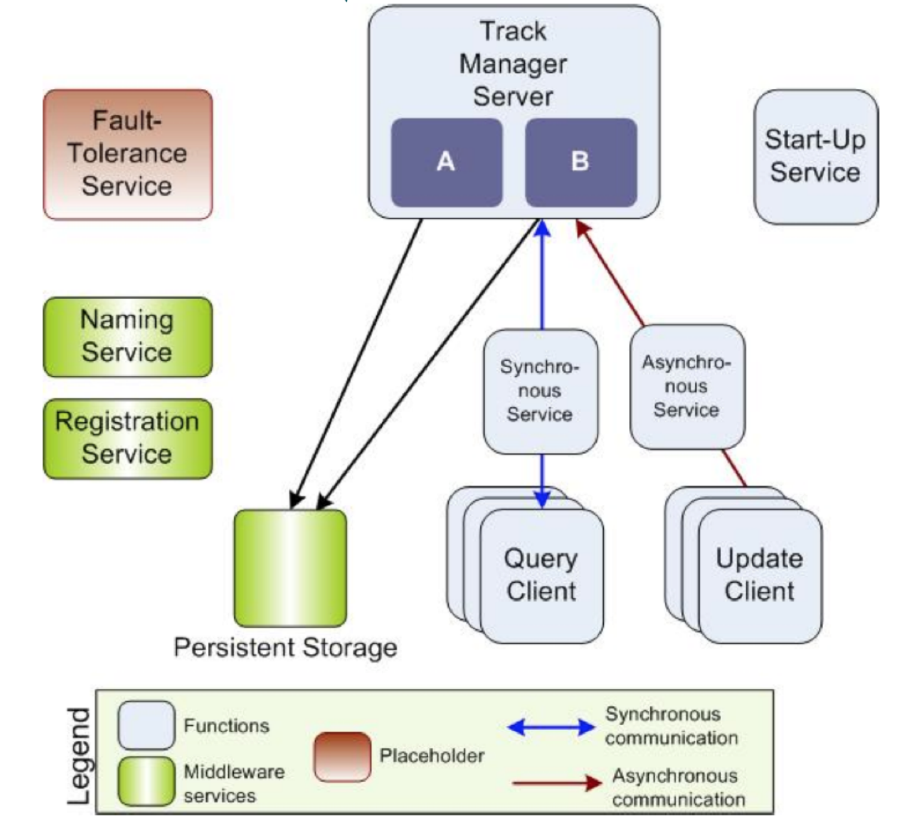

#### 2.1.1.2. 第一次迭代的结果
1. 该设计使用客户端-服务器模型，其中Track Manager为更新和查询客户端提供服务。
2. 跟踪管理器分为两个元素：A和B。此分解允许两种部署策略：

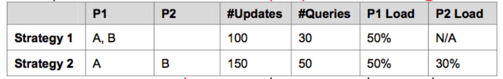

3. 更新和查询客户端与跟踪管理器之间的**通信机制**不同：
   1. **更新**客户端使用**异步通信**机制。
   2. **查询**客户端使用**同步通信**机制。
4. 元素A和B都包含状态数据，必须将其保存为永久存储中的检查点。

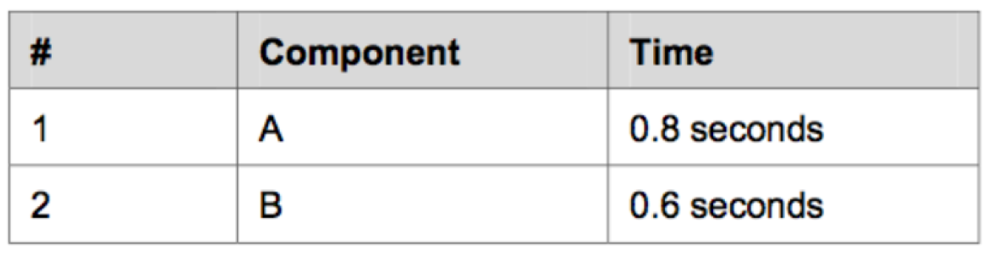

5. 中间件**命名服务**接受**请求的服务**的名称，并返回该服务的访问代码。
6. 如果提供中间件**注册服务**会导致**持久性存储超出**其备用**容量**限制，则该中间件注册服务将拒绝为新客户端提供服务。
7. 分配了一个**单独的团队**来考虑Track Manager元素的启动。
8. A和B都在命名服务中注册其接口。
9. 当**更新客户端**发出**请求**时，该请求直接从A或B到达**异步**通信服务，然后再到达**命名服务**以获取该服务的**句柄**。
10. 当**查询客户端**发出**请求**时，该请求直接从A或B到达**同步**通信服务，然后再到达**命名服务**以获取该服务的**句柄**。
11. 团队决定由一位容错专家来完善容错占位符。

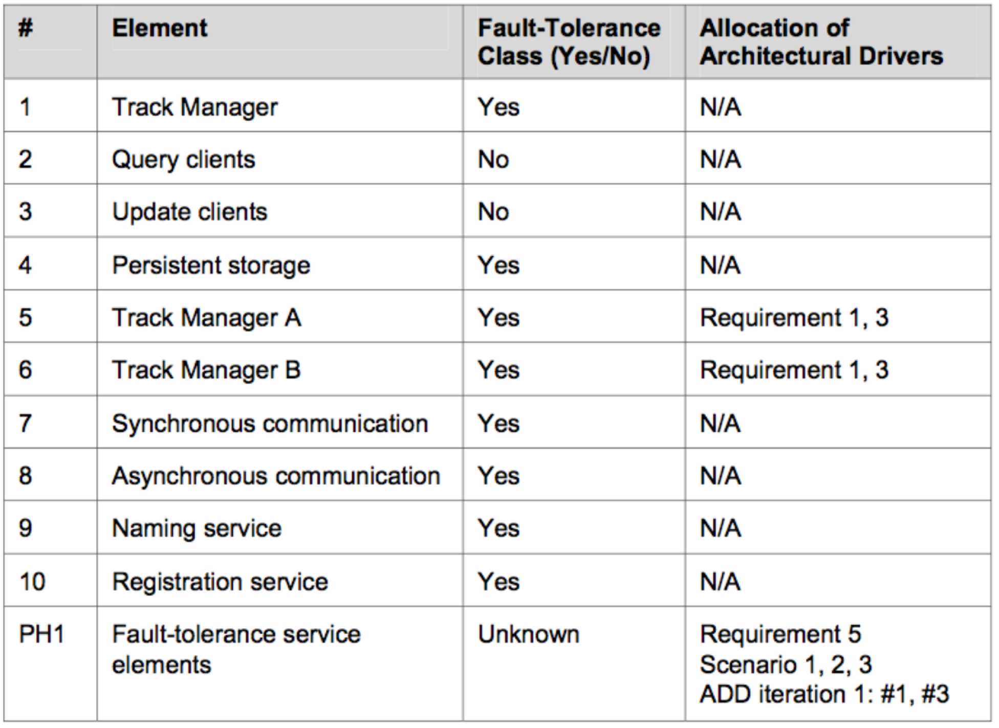

### 2.1.2. 步骤2：选择要分解的系统元素
1. 如果是第一次作为“**未开发**”开发的一部分，则将**所有需求**分配给系统。
2. **完善**部分设计的系统时，系统已划分为多个元素，并为其分配了要求。从这些元素中选择**一个**作为结果。

#### 2.1.2.1. 第一次迭代的元素视图
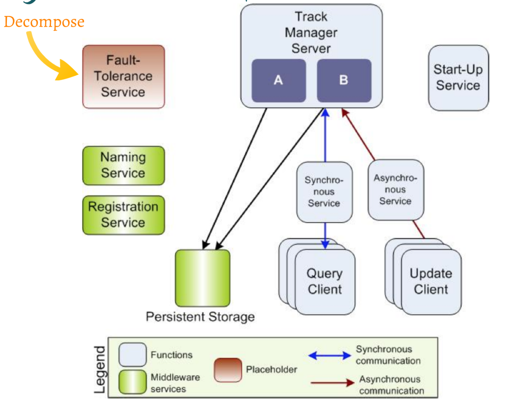

### 2.1.3. 步骤3：确定所选元素的ASR
1. 根据对每个需求的高影响，中影响或低影响，根据对架构的相对**影响**第二次对这些相同需求进行**排名**。
2. （H，H）（H，M）（H，L）（M，H）（M，M）（M，L）（L，H）（L，M）（L，L）
   1. 第一个字母表示要求对利益相关者的重要性；
   2. 第二个字母表示需求对体系结构的潜在影响。

#### 2.1.3.1. 架构上重要的要求
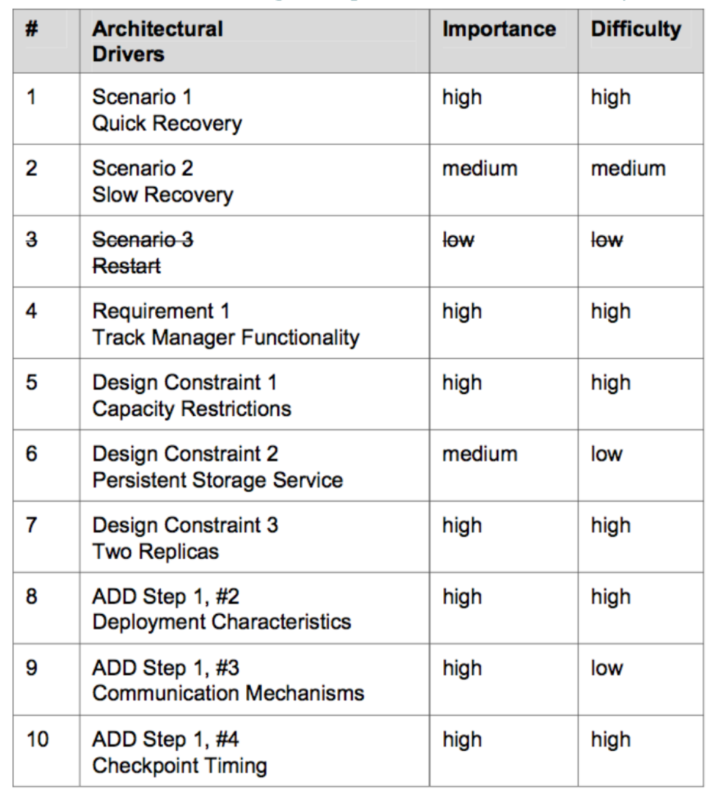

1. 从初始**体系结构要求**中识别出**7**个ASR。
2. 从ADD的第一次迭代产生的**设计约束**中识别出**3**个ASR。
3. 标记为（**高，高**）的ASR直接取决于方案1（**最难满足**且具有**最高优先级**驱动程序）中**2秒**的端到端定时要求。
4. 标有（**中，中**）的ASR与运行追踪管理器的单个副本的时间相关联，并且恢复应在**2**分钟内发生。
5. 重新启动场景最不重要，因此单独的启动设计工作正在考虑其细节。

### 2.1.4. 步骤4：选择符合ASR的设计概念

#### 2.1.4.1. 步骤4.1：找出设计问题
1. 如何解决设计中的ASR？

##### 2.1.4.1.1. 容错服务的设计问题
1. **故障准备**：此问题包括在正常操作过程中**定期执行的策略**，以确保发生故障时可以进行恢复。
2. **故障检测**：此问题包括与**检测**故障并**通知**要处理该故障的元素有关的策略。
3. **故障恢复**：此问题解决了在**瞬态**情况下的操作-在故障**发生**和**恢复**正常操作之间的时间段。

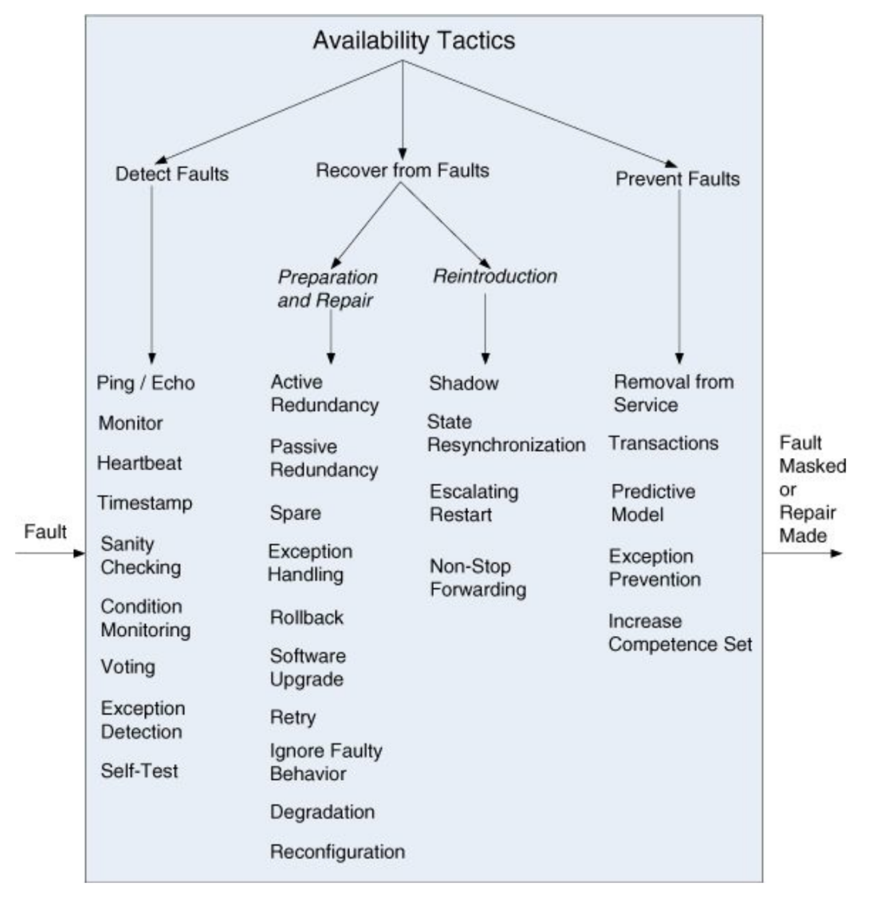

##### 2.1.4.1.2. 设计考量(可能的策略)
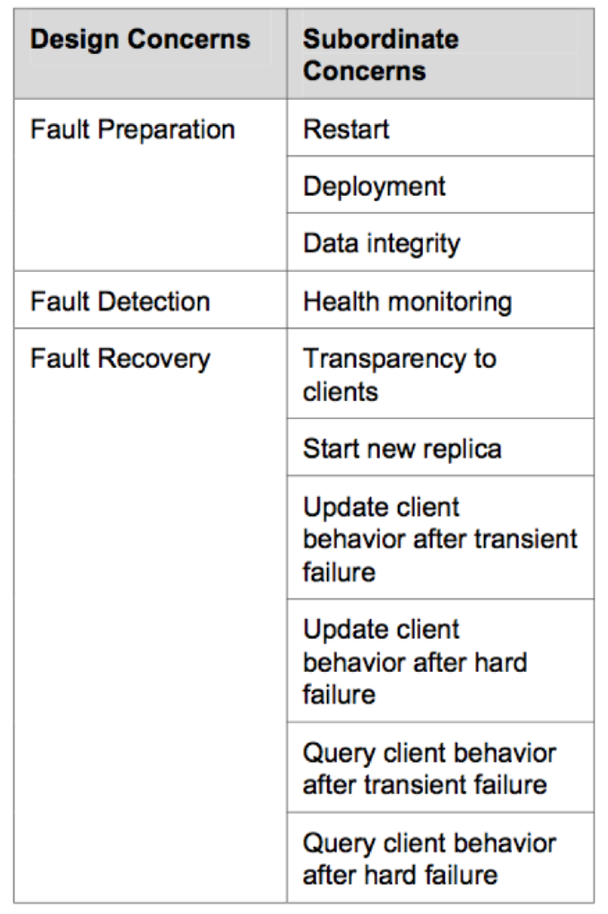

#### 2.1.4.2. 步骤4.2：列出替代模式，下属关注的策略
1. 对于列表中的每个模式，您应该
   1. **识别**每个模式的区分**参数**，以帮助您在模式和战术中进行选择；
   2. **估计**区分参数的**值**

##### 2.1.4.2.1. 可替代的重启策略
1. 区分参数：
   1. 故障后可以忍受的停机时间（方案1）
   2. 系统在故障时间前后的时间间隔内处理服务请求的方式； 例如，如果它尊重了他们并降低了响应时间或放弃了它们（方案1）

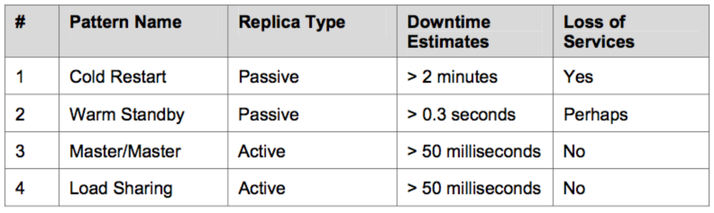

##### 2.1.4.2.2. 可替代的部署策略
1. 区分参数：
   1. 故障后可以**忍受**的**停机时间**（方案1）
   2. 支持**100个更新客户端**和**25个查询客户端**（需求2）

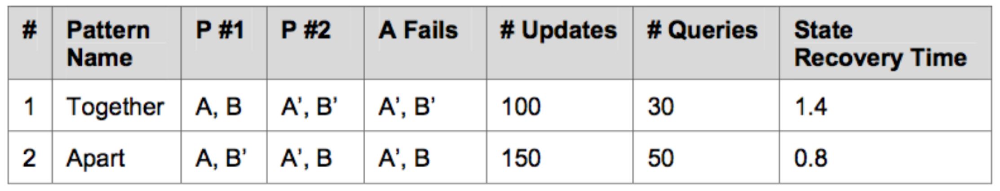

##### 2.1.4.2.3. 可替代的数据集成策略
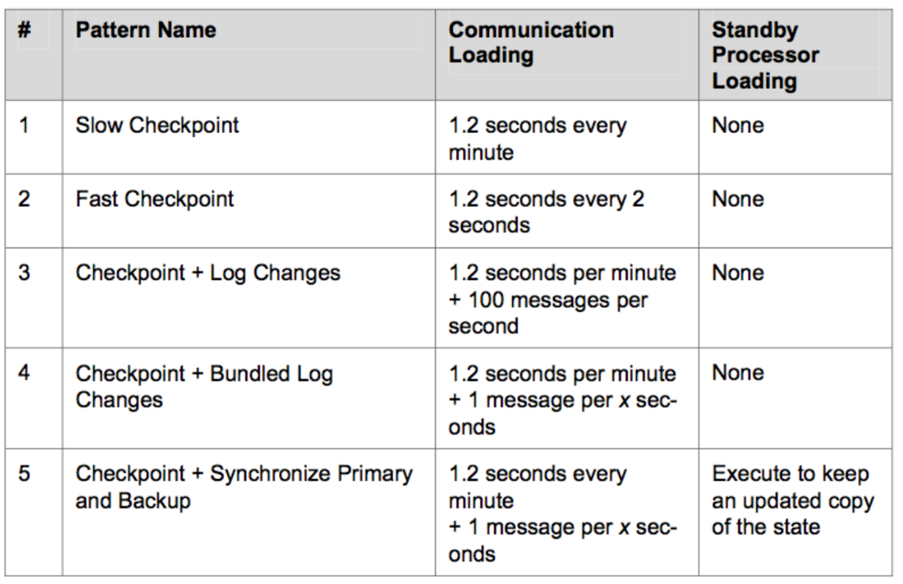

##### 2.1.4.2.4. 可替代的生命检测策略
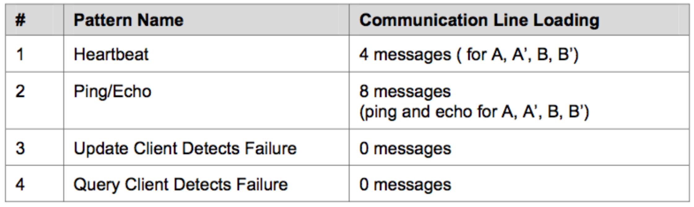

##### 2.1.4.2.5. 可替代的透明策略
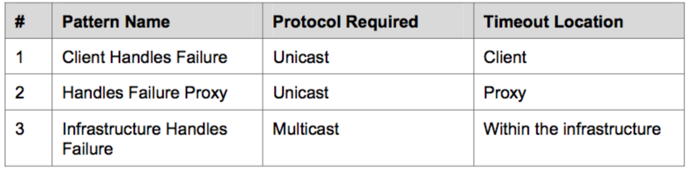

#### 2.1.4.3. 步骤4.3：从清单中选择模式/策略
1. 使用每种模式时需要进行哪些**权衡**？
2. 模式之间的**结合**程度如何？
3. 是否有任何模式**互斥**？

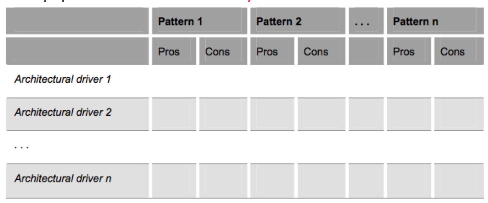

##### 2.1.4.3.1. 选择重启策略
1. 推理
   1. 方案1和要求1都指示**重新启动时间**必须**少于2秒**；因此，冷重启策略是不合适的。
   2. “热备份”策略比“主/主”或“老兄共享”策略更**易于实施**；并且似乎很容易满足场景中描述的时间要求。
2. 决策：使用“热备份”策略。
3. 实现
   1. 每个组件（A和B）的**主要**跟踪管理器都会接收所有请求并做出响应。
   2. 每个组件（A和B）的**辅助**（备用）轨道管理器都加载在另一个处理器上，并占用内存。

##### 2.1.4.3.2. 选择部署策略
1. 推理
   1. 即使恢复时间较慢，架构师也**熟悉**采用**单一故障**转移方案从软件或硬件故障中恢复（统称为策略）。
   2. 该策略可以满足处理要求，尽管可以减少处理次数。
2. 决策：使用**共同**战术。
3. 实现
   1. **主要**组件（A和B）**共享一个处理器**，次要组件（A和B）也共享一个处理器。
   2. 该系统将永远无法与不同处理器中的主要组件一起运行。

##### 2.1.4.3.3. 选择数据集成策略
1. 推理
   1. 显然，需要每分钟有一个状态检查点才能满足方案2。但是，**一分钟前**的状态不能满足方案1。策略1被拒绝。
   2. 策略2满足方案1和2的升级要求；但是，这会带来不可接受的**通信负载**。策略2被拒绝。
   3. 策略3将满足方案1和2，但是（如策略2一样）它给通信系统带来了沉重的负担。策略3被拒绝。
   4. **如果x小于2秒**，则策略4满足方案1和2。这也带来了更合理的通信负载。捆绑升级周期为2秒似乎令人满意。选择了战术4。
   5. 策略5也可以满足这种情况，但**更为复杂**，因为辅助服务器必须每隔x秒执行一次以更新其状态副本。策略5被拒绝。
2. 决策：使用**检查点+捆绑日志更改**策略。
3. 实现
   1. 主副本每分钟将状态保存到一个**持久性检查点文件**中。
   2. 主数据库将所有状态更改的本地捆绑文件保留2秒，然后**每2秒**将其作为**日志文件**发送一次。
   3. 升级后的主数据库在升级后会先读取检查点文件，然后读取日志文件并在读取时更新每个状态更改...

##### 2.1.4.3.4. 选择错误检测策略
1. 推理：**ping/echo**故障检测比**心跳**检测**更为复杂**，并且需要**两倍的带宽**。
2. 决策：使用**心跳**策略。
3. 实现
   1. 心跳必须足够快，以允许辅助节点**初始化**并在**发生故障后2秒钟内开始**处理。初始化两个检查点文件需要1.2秒。心跳会额外增加0.25秒，剩下0.55秒的备用时间，这似乎是合理的。
   2. 运行状况**监视**元素**每0.25秒检查一次心跳**。 如果未检测到心跳，则健康监视器会**通知**所有**必要的元素**。
   3. 如果主根子跟踪管理器组件检测到内部故障，则用于传达故障的机制是不发出心跳。

##### 2.1.4.3.5. 选择透明策略
1. 推理
   1. 客户端处理故障是不希望的，故障转移很容易被误解并使它变得不那么健壮。
   2. 该基础结构**没有内置的多播**功能，因此添加此功能将很昂贵。
2. 决策：使用**代理处理失败**策略。
3. 含义
   1. 代理服务将服务方法注册到名称服务器。
   2. 代理服务会启动第一个组件，并以不同的名称（AA.a，AA.b，BB.c和BB.d）注册它们，并同样对第二个组件（AA.a，AA'.b，BB'.c 和 BB'.d）进行注册。
   3. 客户端请求服务（A.a）。此请求将导致命名服务被调用并返回A.a的访问代码，该代码被指定为access（A.a）。接下来，客户端调用访问权限（A.a）。
   4. 代理服务（A.a）确定AA是主要副本，并将访问（AA.a）作为“转发请求”返回给客户端。
   5. 客户端调用访问（AA.a）并继续执行直到AA失败。
   6. 当运行状况监视器在AA中检测到心跳失败时，它将通知代理服务...

#### 2.1.4.4. 步骤4.4：确定模式/策略与ASR之间的关系
1. 考虑到目前为止确定的**模式/策略**，我决定它们**之间的关系**。
2. 所选图案的组合可以产生新的图案。

##### 2.1.4.4.1. 策略和ASR之间的映射
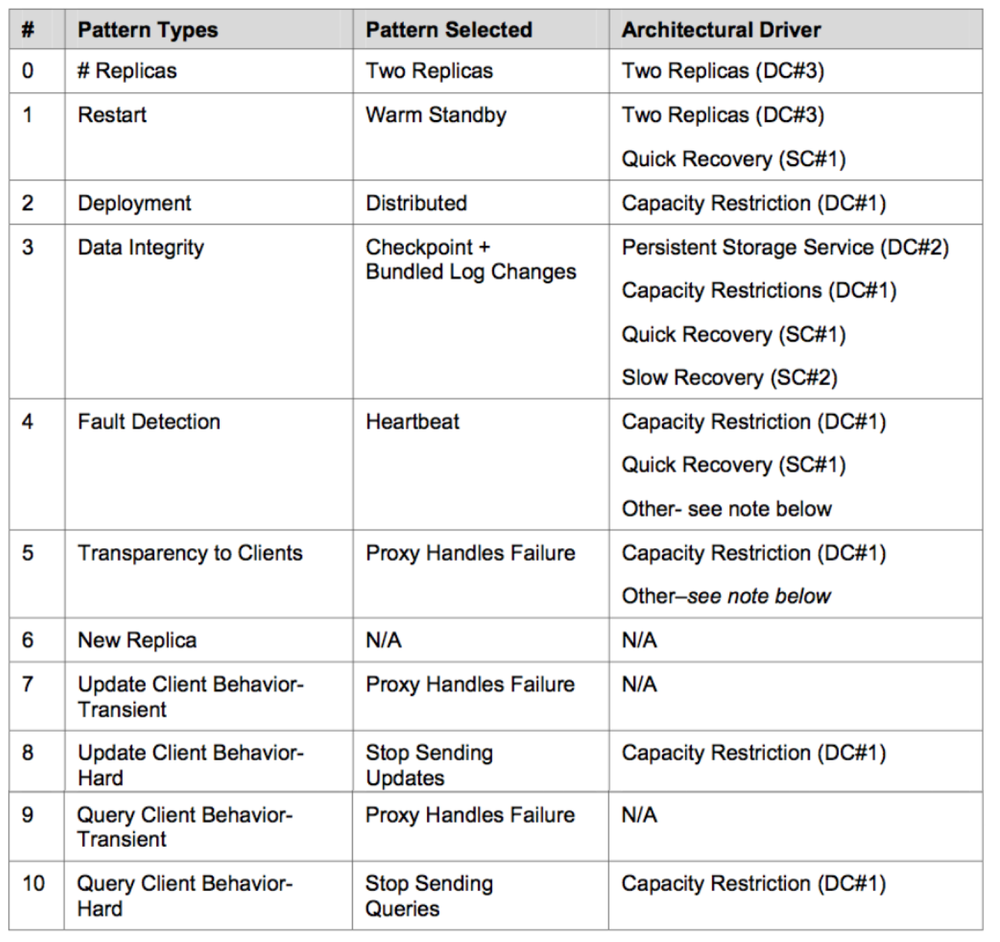

#### 2.1.4.5. 步骤4.5：捕获初步的架构视图
1. 通过开始捕获不同的**架构视图**来描述您选择的**模式**。
2. 在此阶段，您无需创建完整记录的架构视图

##### 2.1.4.5.1. 元素表
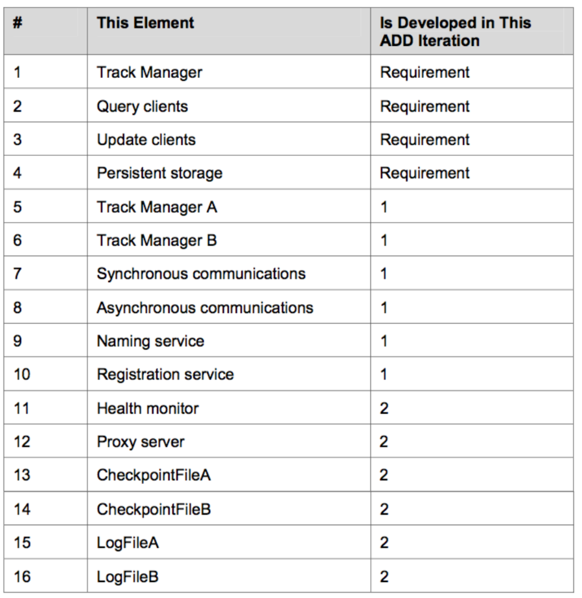

##### 2.1.4.5.2. 架构元素视图
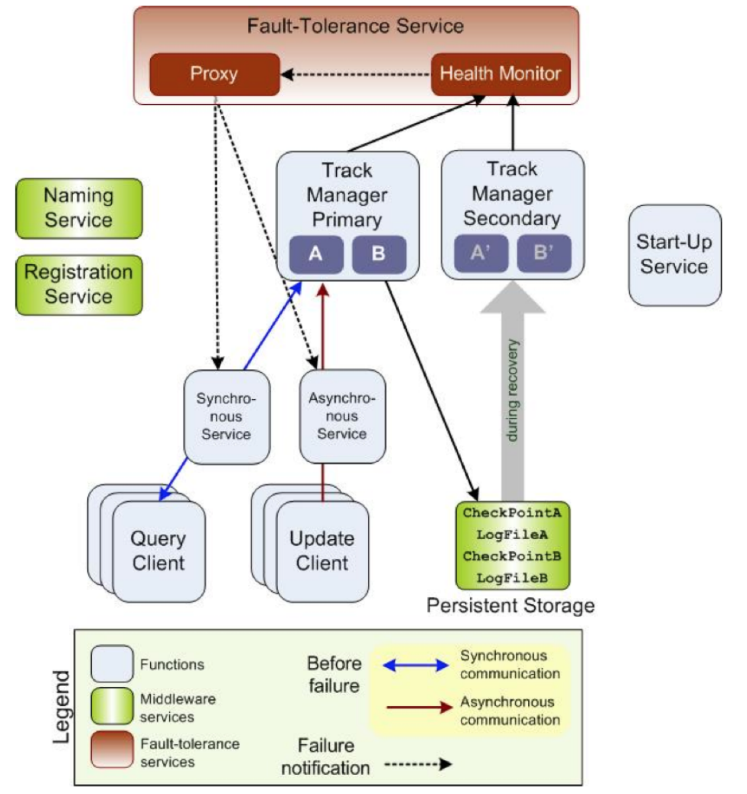

##### 2.1.4.5.3. 顺序图
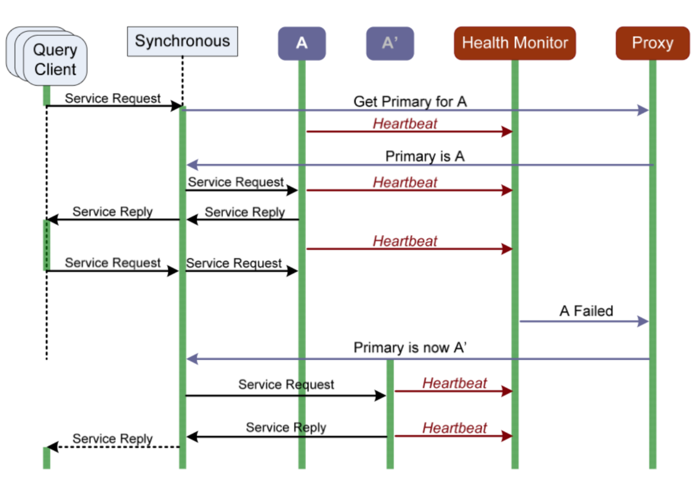

#### 2.1.4.6. 步骤4.6：评估并解决不一致问题
1. 根据体系结构**驱动**程序评估**设计**。
2. 确定**是否有未考虑**的体系结构驱动程序。
3. 评估**替代模式**或应用其他**策略**。
4. 将**当前元素的设计**与体系结构中**其他**元素的设计进行评估，并解决所有**不一致**之处。

##### 2.1.4.6.1. 时间模型
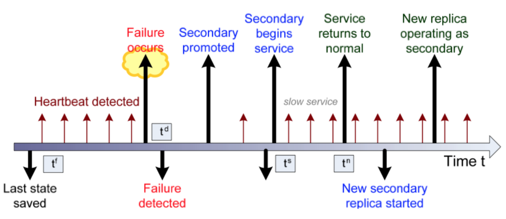

##### 2.1.4.6.2. 顺序发生的事件
1. 保存对持久性日志文件的状态更新。
2. 保存状态后，多次检测到心跳。
3. 轨迹管理器中发生崩溃故障。
4. 当心跳之前发生超时时，运行状况监视器将检测到故障。
5. 辅助跟踪管理器提升为主要。
6. 辅助服务开始响应客户端请求，以减少请求的积压并缩短响应时间。
7. 响应缓慢的过渡时间结束后，服务将恢复正常。
8. 新副本完成初始化，并准备与当前主副本同步并成为辅助副本。
9. 新副本已完成所有需要的状态更新，并且还原服务的过程已完成。

##### 2.1.4.6.3. 时间衡量
1. Tps：状态ogFile保存的周期（2秒）
2. Th：心跳周期（0.25秒）
3. TrA：从持久性存储中恢复A状态所花费的时间（0.8秒）
4. TrB：从持久性存储中恢复B状态所花费的时间（0.6秒）
5. TrL：从持久性存储中恢复L _ogFile所花费的时间（估计为0.2秒）
6. Tus：从日志文件更新A和B的状态所花费的时间（估计为0.1秒）
7. T1 = Tps + Th + TrA + TrB + TrL + Tus
8. T1 = 2 + 0.25 + 0.8 + 0.6 + 0.2 + 0.1 = 3.95> 2.0

##### 2.1.4.6.4. 可能的时间分辨率
1. 减少日志文件保存到永久性存储的周期。同步日志文件和心跳，以便在启动保存后立即发生心跳。
2. 将日志文件保存到永久性存储中相当于心跳。每0.5秒发送一次日志。扩展持久性存储元素，以便它识别出未能接收到日志文件更新会触发一个请求，以通知其他必要的元素失败（即代理，备用，客户端）。
3. 使持久存储并发访问，而不是顺序访问。
4. 将部署决策更改为第二种模式，其中A和B的主节点位于不同的处理器中；因此，带有组件A的处理器的故障将是最坏的情况。
5. 更改状态更新的样式，其中辅助数据库通过在启动期间与主数据库同步来维护状态模型。它还定期接收一堆状态更新，从而消除了从持久性存储中读取数据的需求。
6. 通过在重新启动时重新计算一些状态数据来减少要为组件A和B保存的状态的大小。

##### 2.1.4.6.5. 时间决策
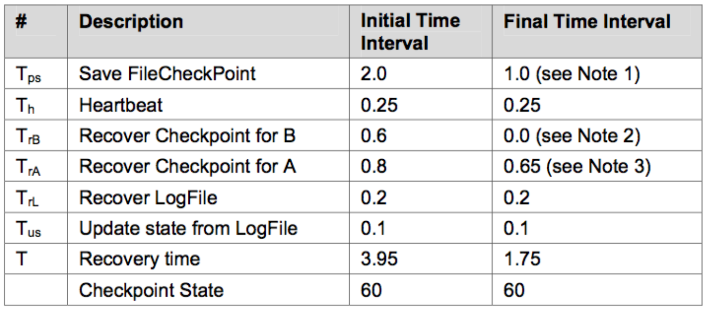

### 2.1.5. 步骤5：实例化架构元素并分配职责
1. 实例化您选择的**每种元素**的一个**实例**。
2. 根据**子元素**的类型**分配职责**。
3. 在其子级之间**分配**与父级元素相关联的责任。
4. 分析并**记录**您所做的设计决策。

#### 2.1.5.1. 分配职责给每一个元素
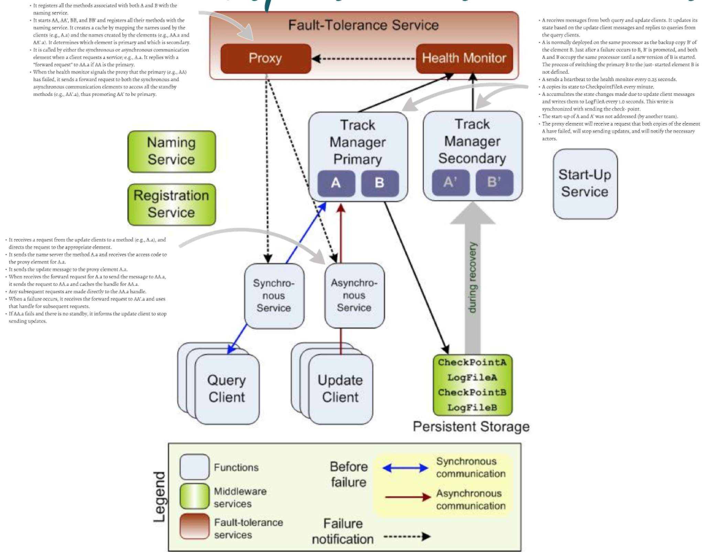

#### 2.1.5.2. 解释1
1. A接收来自查询和更新客户端的消息。 它根据更新客户端消息更新其状态，并回复查询客户端的查询。
2. 通常，A与元素B的备份副本B'部署在同一处理器上。在B发生故障之后，B'被提升，并且A和B都占用相同的处理器，直到启动新版本的B。 未定义将主节点B切换到刚启动的元素B的过程。
3. A每0.25秒向健康监视器发送一次心跳
4. A每分钟将其状态复制到检查点文件A。
5. A会累积由于更新客户端消息而导致的状态更改，并每1.0秒将其写入LogFileA。
6. 此写入与发送检查点同步。 A和A'的启动未解决（另一个团队）。
7. proxy元素将收到一个请求，要求元素A的两个副本都失败，将停止发送更新，并通知必要的参与者。

#### 2.1.5.3. 解释2
1. 它使用命名服务注册与A和B关联的所有方法
2. 它启动AA，AA'，BB和BB'，并在命名服务中注册其所有方法。 它通过映射客户端使用的名称（例如A.a）和元素创建的名称（例如AA.a和AA'.a）来创建缓存。 它确定哪个元素是主要元素，哪个是次要元素。
3. 当客户端请求服务时，它由同步或异步通信元素调用； 例如A.a. 如果AA是主要服务器，它会向AA.a发出“转发请求”。当运行状况监视器向代理发出信号通知主服务器（例如AA）发生故障时，它将向同步和异步通信元素发送转发请求，以访问所有备用方法（例如AA'.a），从而提升AA'到主要位置。

#### 2.1.5.4. 解释3
1. 它接收来自更新客户端的对方法（例如A.a）的请求，并将该请求定向到适当的元素。
2. 它向名称服务器发送方法A.a，并接收对A.a代理元素的访问代码。
3. 它将更新消息发送到代理元素A.a。
4. 当收到转发给A.a的转发请求以将消息发送到A.a时，它将请求发送给A.a并缓存A.a的句柄。
5. 任何后续请求均直接向AA.a句柄发出。
6. 发生故障时，它将接收到AA'.a的转发请求，并将该句柄用于后续请求。
7. 如果Aa.a失败并且没有备用，它将通知更新客户端停止发送更新。

### 2.1.6. 步骤6：为实例化元素定义接口
1. 接口描述了PROVIDES和REQUIRES假设，即软件元素之间相互联系。
   1. 练习涉及您实例化的元素的**功能要求**。
   2. 观察由一个元素**产生**并由另一元素**消耗**的**任何信息**。

#### 2.1.6.1. 接口总结
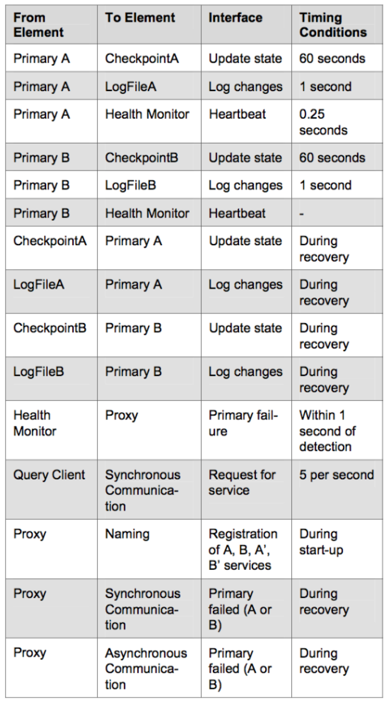

### 2.1.7. 步骤7：验证和完善需求，并使其成为实例化元素的约束
1. **验证**分配给**父元素**的所有需求是否已分配给一个或多个**子元素**。
2. 将分配给子元素的所有**职责转换**为各个元素的**功能需求**。

#### 2.1.7.1. 架构上重要的要求
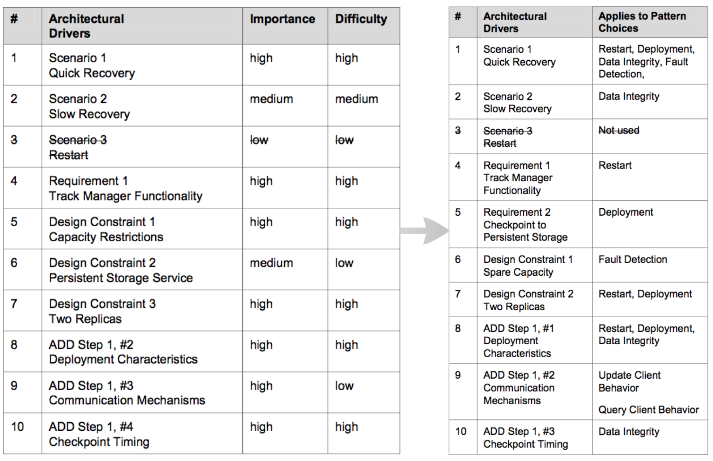

### 2.1.8. 步骤8：重复进行，直到满足所有ASR
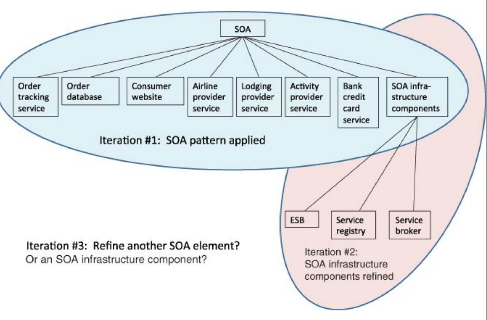

## 2.2. ADD的输出
1. **软件元素**：履行各种角色和**职责**，具有预定**属性**并与其他软件元素相关以组成系统架构的计算或开发工件
2. **角色**：一组相关职责
3. **责任**：软件元素提供的**功能，数据或信息**
4. **属性**：有关软件元素的附加信息
5. **关系**：两个软件元素如何相互**关联或交互**的定义

# 3. 系统功能视角
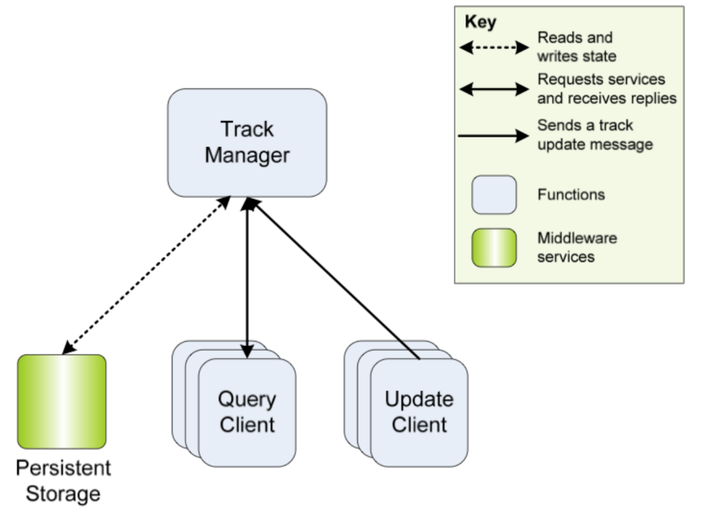

## 3.1. 功能需求
1. 跟踪管理器为两种类型的客户端提供跟踪服务：
   1. **更新客户端**：这些客户端会**定期**向Track Manager发送曲目更新。跟踪管理器可以**容忍**某些偶然的更新丢失，尤其是在由于设备故障造成的瞬态情况下。所有更新客户端**每秒都会进行一次更新**，当Irack Manager收到第三个信号时，它可以从**两个丢失的更新信号中恢复**。如果错过了两个以上的信号，则操作员可能必须在恢复过程中协助轨道管理器。换句话说，如果发生故障，则**必须在两秒钟之前重新开始处理**，以避免操作员的干预。
   2. **查询客户端**：这些客户端**偶尔**会运行，并且必须收到对其查询的准确答复。（查询客户端可能与某些客户端经常请求小块数据（例如，从一个客户端进行两次请求之间有五秒的几千字节的请求）和其他客户端**偶尔**请求**大数据块**（例如在两次询问之间有数分钟的几兆字节的请求）不同。查询的时间应少于特定查询正常响应时间的两倍。
  
## 3.2. 设计约束
1. **容量限制**：提供的处理器在交付时应具有**50%的备用处理器**和**内存**容量，而局域网（LAN）具有**50%的备用吞吐量**能力。有**100个更新**客户端和**25个查询**客户端。为了进行时序估算，假设每秒有**100个更新和5个查询**。
2. **持久性存储服务**：我的服务将**维护状态**副本，该副本至少由Track Manager**每分钟检查一次**。 如果Track Manager的所有副本均失败，则可以从检查点文件开始**重新启动**。
3. **两个副本**：为了满足可用性和可靠性要求，已经进行了可靠性，可用性和可维护性（RMA）研究，并且在正常情况下，Track Manager和永久性存储元素都应具有两个副本。

## 3.3. 质量属性需求
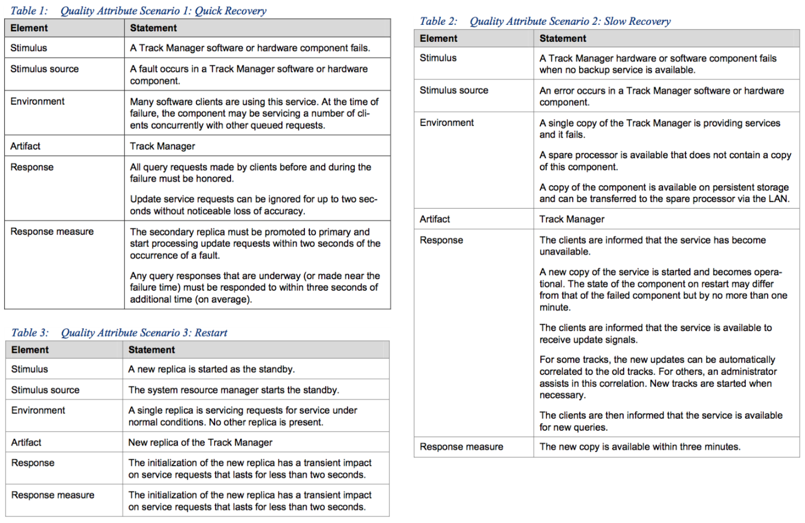

# 4. 阅读材料
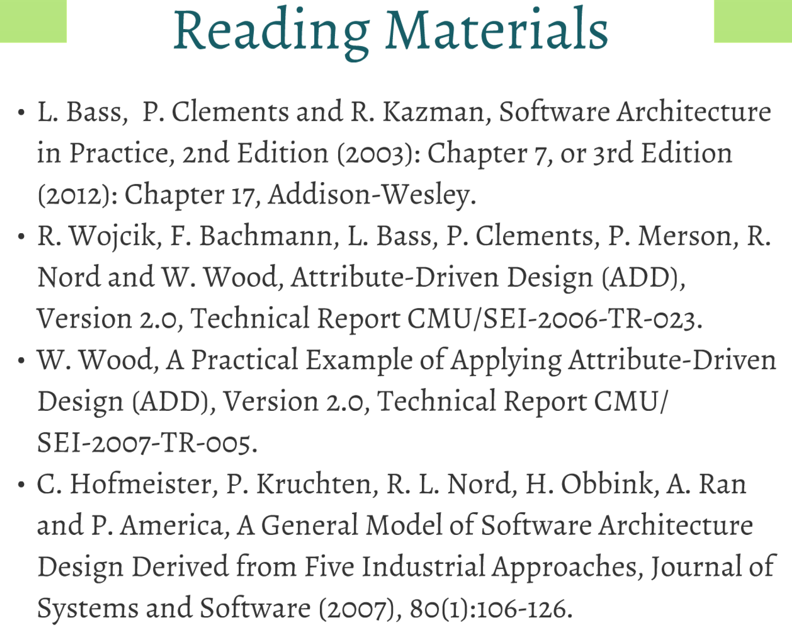
