Lec5-Description
---
1. 梁鹏 武汉大学计算机学院

# 1. Overview
1. What is an architecture description?
2. ISO standard for architecture description
3. Arch. representation in architecture views
4. How to obtain a set of architecture views

# 2. What is an architecture description?

## 2.1. Software design in UML
1. Class diagrams, state diagrams, sequence diagram, etc
2. Who can read those diagrams?
3. Which type of questions do they answer?
4. Do they provide enough information?

## 2.2. Who can read those diagrams?
1. Designer, programmer, tester, maintainer, etc
2. Client?
3. User?

## 2.3. Which type of questions do they answer?
1. How much will it cost?
2. How secure and reliable will the system be?
3. How about maintenance cost?
4. How to evolve the system to meet new requirements?
5. What if requirement A is replaced by requirement B?

## 2.4. Building architecture
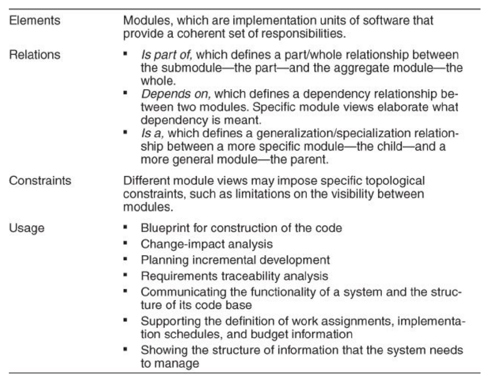

## 2.5. Analogy with building architecture
1. Overall picture of building (client)
2. Front view (client, "beauty" committee)
3. Separate picture for water supply (plumber)
4. Separate picture for electrical wiring (electrician)
5. etc

## 2.6. Architecture presentations in practice
1. By and large two flavors:
   1. Powerpoint slides (box and line) – for managers, users, consultants, etc
   2. UML diagrams in UML notations, for technicians
2. A small sample in practice …

### 2.6.1. Eclipse 1.0 architecture
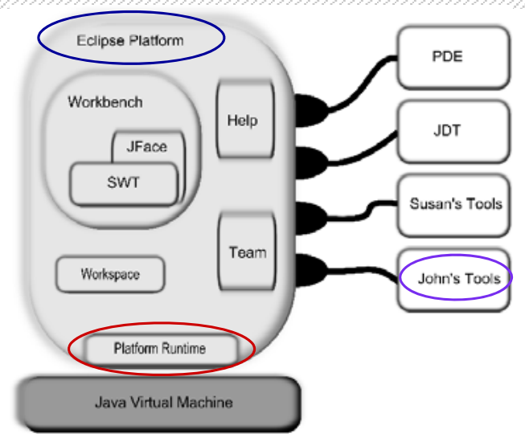

### 2.6.2. Eclipse 3.0 architecture (evolution)
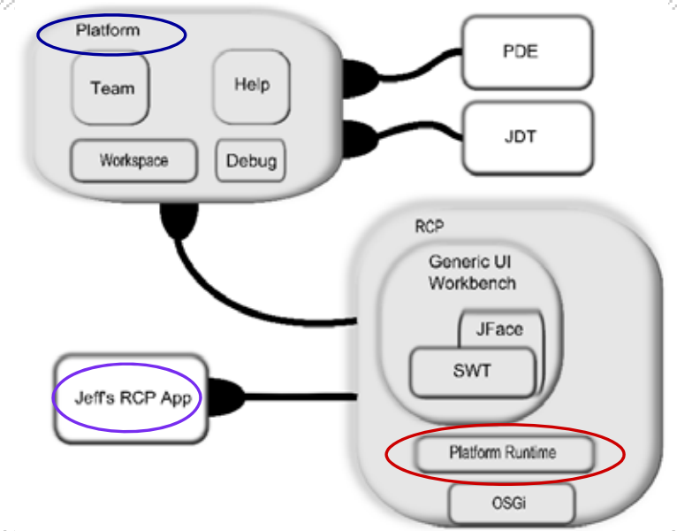

### 2.6.3. 问题
1. 从Eclipse 1.0到3.0，其软件体系结构设计的主要变化是什么？为什么？

### 2.6.4. Earth Observing System
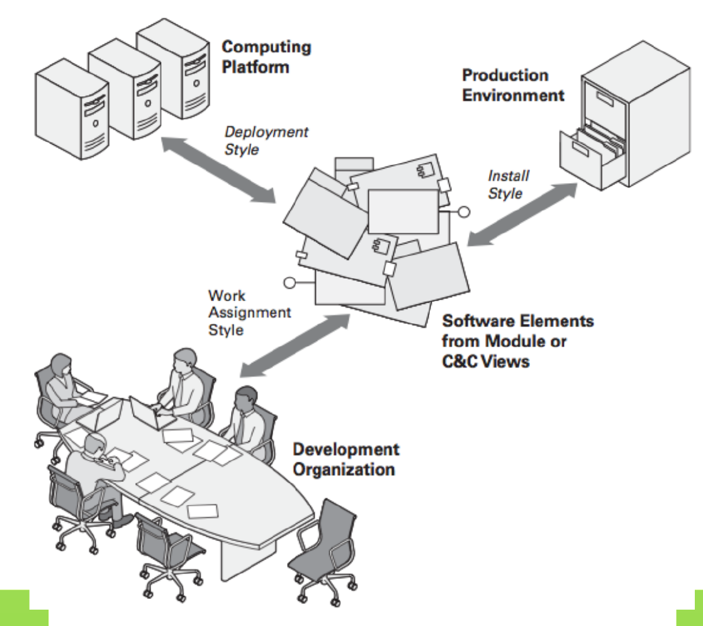

### 2.6.5. Decision-Making System
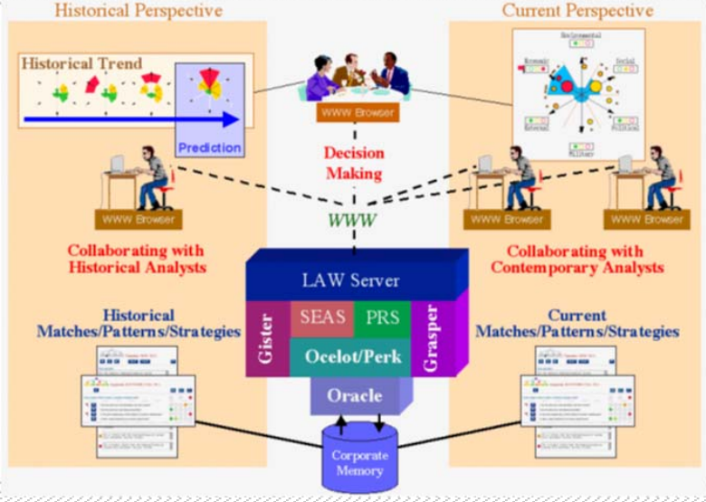

### 2.6.6. ebXML Framework
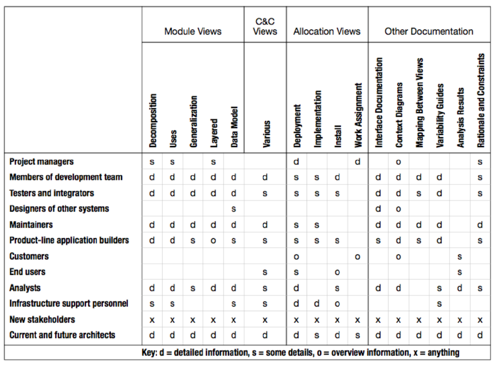

### 2.6.7. So
1. Different representations
2. For different people
3. For different purposes

# 3. ISO standard for architecture description

## 3.1. Conceptual model of architecture description [from ISO Std 42010]
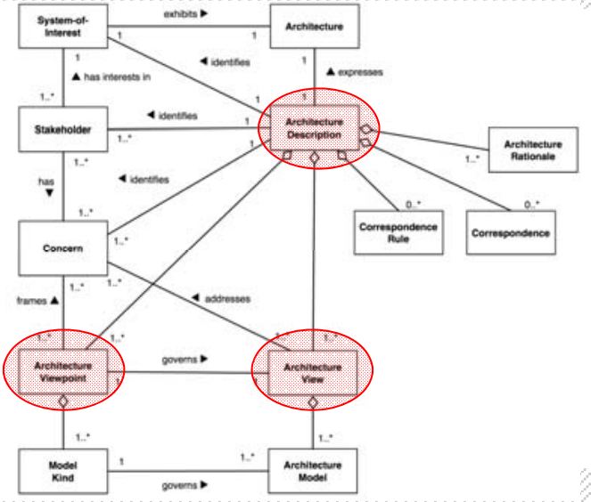

## 3.2. Think about model as template
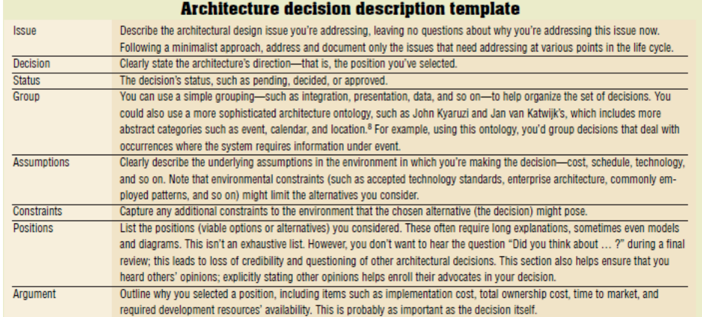

## 3.3. 问题
1. 不同涉众（stakeholders）有不同的关注点，从不同的视角（viewpoints）来看待系统的体系结构设计，是否能采用同一种描述方式来描述系统？

## 3.4. Some terms/definitions (from ISO standard)
1. System stakeholder: individual, team, organization, or classes thereof, anyone having an interest in a system
2. View: expresses the architecture of a system from the perspective of specific system concerns
3. Viewpoint: establishes the conventions for the construction, interpretation and use of architecture views to frame specific system concerns
4. view : viewpoint :: program : programming language
5. view : viewpoint :: map : legend

## 3.5. Possible concerns (QAs from ISO standard)
1. External quality
   1. Development cost
   2. Customer experience (usability)
   3. Availability
   4. Performance
2. Internal quality
   1. Evolvability
   2. Maintainability
   3. Testability
   4. Changeability

## 3.6. The twin peaks
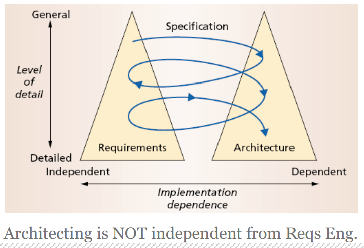

## 3.7. Quality attribute Scenarios
1. Quality attributes can be made SMART by defining appropriate scenarios
2. Quality attribute scenarios are defined by:
   1. The source of the stimulus: Human or machine
   2. The stimulus (event)
   3. The environment or condition where the stimulus occurs
   4. The response measure: Time, value and location
3. 系统的非功能属性可以基于应用场景（scenarios）来量化

## 3.8. What is a scenario in architecture design
1. Scenarios are brief narratives of expected or anticipated use of a system from both development and end-user viewpoints.
2. 从开发和用户视角来看系统的使用
3. 是关于系统使用的具体描述
4. 超市系统每晚12点备份当天交易数据
5. 查看双11 22点峰值的红包堵塞节点

## 3.9. Example Performance Scenarios
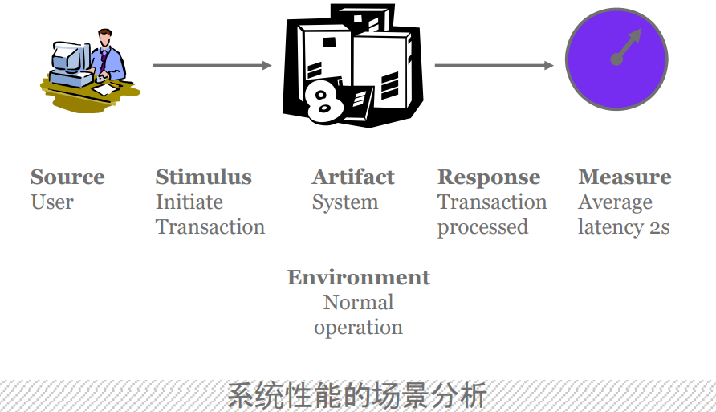
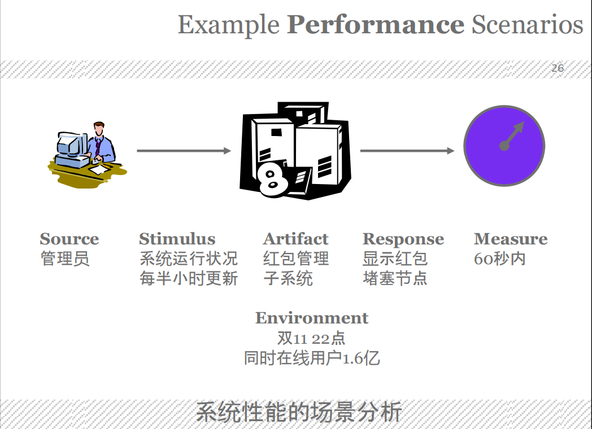

## 3.10. Important business-related QAs
1. Time-to-market
2. Cost price
3. Return on Investment (ROI)
4. Total Cost of Ownership (TCO)
5. Lifetime of the system
6. Integration with existing (legacy) systems
7. Marketing features
8. Etc.

## 3.11. Important Design-time QAs
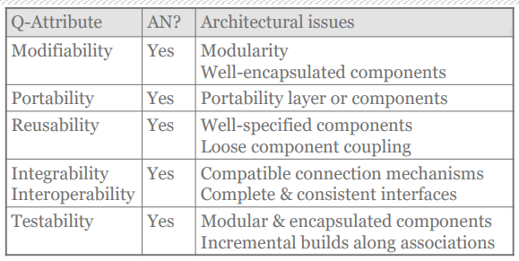

## 3.12. Important Run-time QAs
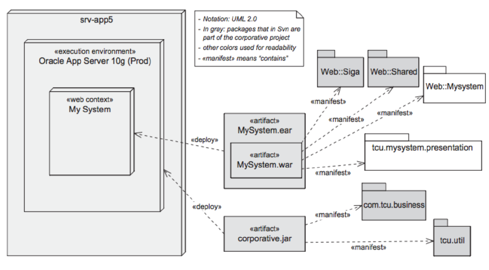

## 3.13. Context of architecture description [from Std 42010]

## 3.14. Stakeholders
1. Customer
2. User
3. Architect
4. Requirements engineer
5. Designer
6. Implementer
7. Tester, integrator
8. Maintainer
9. Product manager
10. Quality assurance people

## 3.15. Viewpoint specification
1. Viewpoint name
2. Stakeholders addressed
3. Concerns addressed
4. Language, modeling techniques

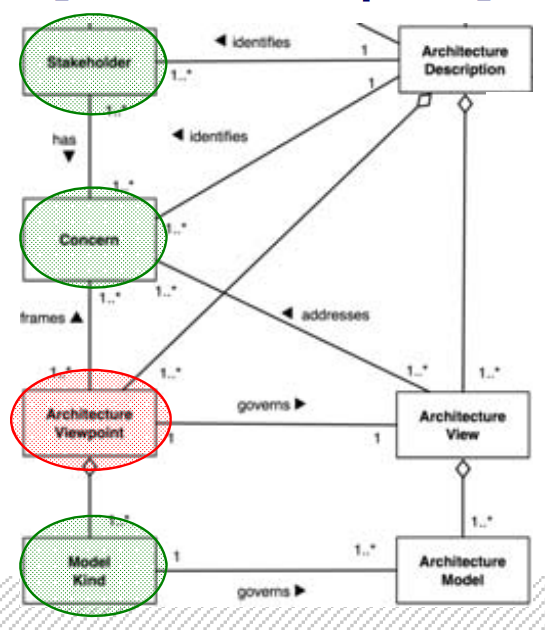

### 3.15.1. Example view: context view of Sagitta 2000
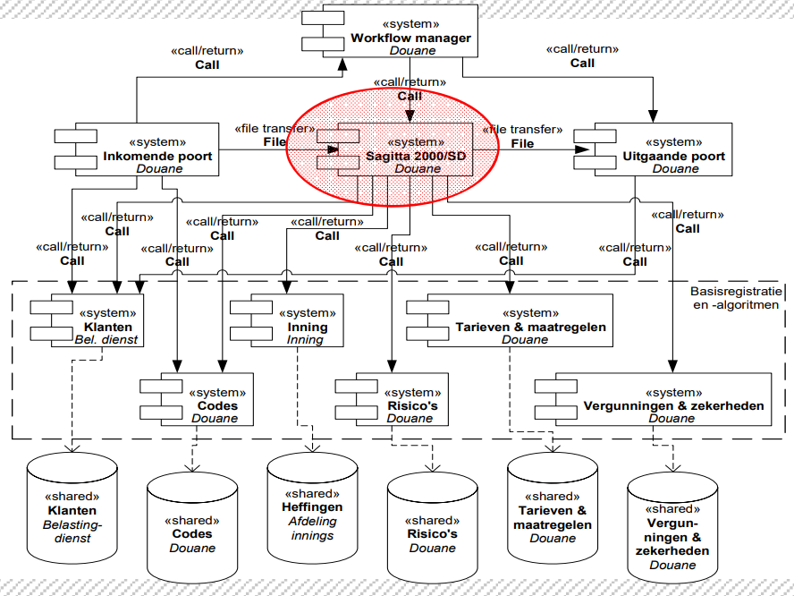

### 3.15.2. Example viewpoint definition
1. Name: Context viewpoint
2. Stakeholders: system owners, maintainers
3. Concerns: system boundaries, effect of changes
4. Language: UML variant

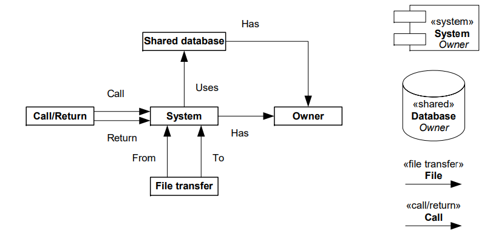

# 4. Architecture views

## 4.1. Key concepts of views and viewpoints
1. A viewpoint (视角) covers one or more concerns
2. Viewpoints separate concerns (关注点)
3. A view (视图) conforms to a viewpoint
4. A view consists of one or more models (模型)
5. An architecture description is organized in one or more views (一个或一组视图构成)

## 4.2. The 4 + 1 view model
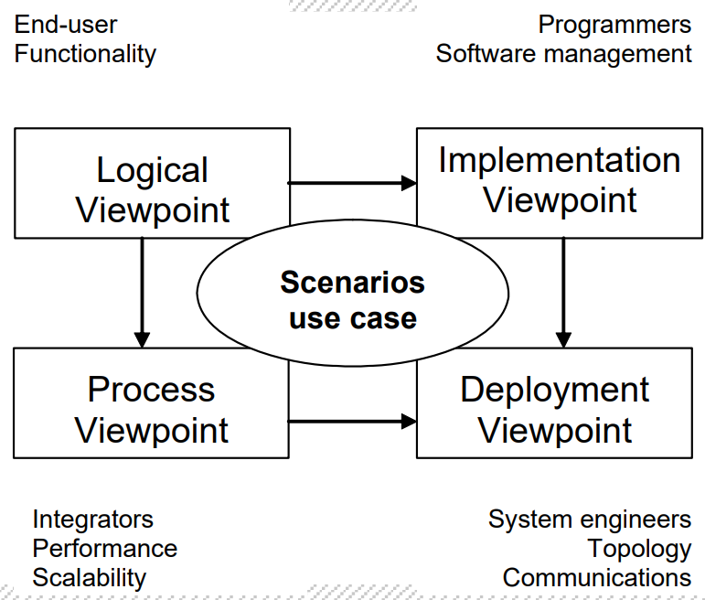
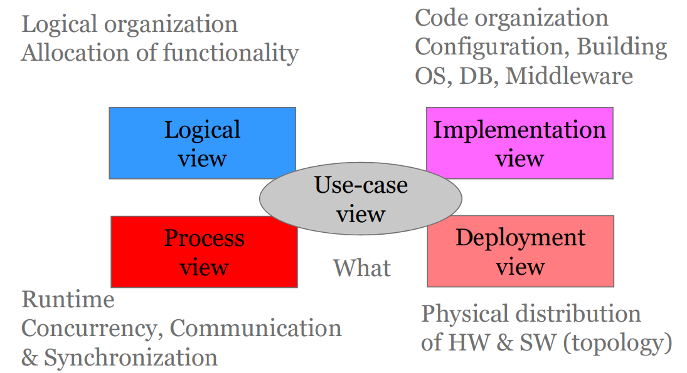

## 4.3. The 5 architecture views
1. Use–case view (external - the system viewed by an actor) Key scenarios that drive arch. discovery, design & validation Define functionality & QAs and translate into requirements
2. Logical view (internal)：Functionality, structure and behavior of the system
3. Process view (internal)：Concurrency, comm. & synchronization at runtime
4. Deployment view (internal)：Mapping of components onto processing platforms
5. Implementation view (internal)：Implementation details
6. 用例定义了待开发系统的范围

## 4.4. UML用于 4+1 软件体系结构视图描述

### 4.4.1. Example of use case view
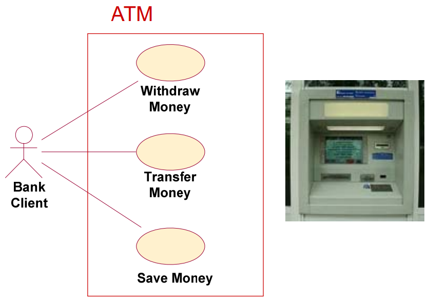

### 4.4.2. (4 + 1): Logical/Conceptual Viewpoint
1. The logical viewpoint supports the functional requirements, i.e., the services the system should provide to its end users.
2. Typically, it shows the key abstractions (e.g., classes and interactions amongst them).

### 4.4.3. Example of logical view
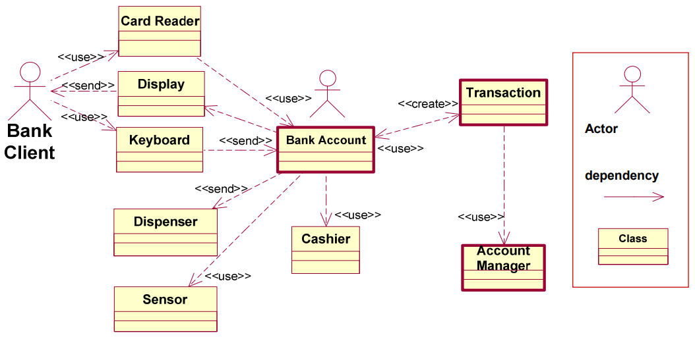

### 4.4.4. (4 + 1): Process Viewpoint
1. The process viewpoint gives the mapping of functions to runtime elements
2. It takes into account some nonfunctional requirements, such as performance, system availability, concurrency and distribution, system integrity, and fault-tolerance.

### 4.4.5. Example of process view
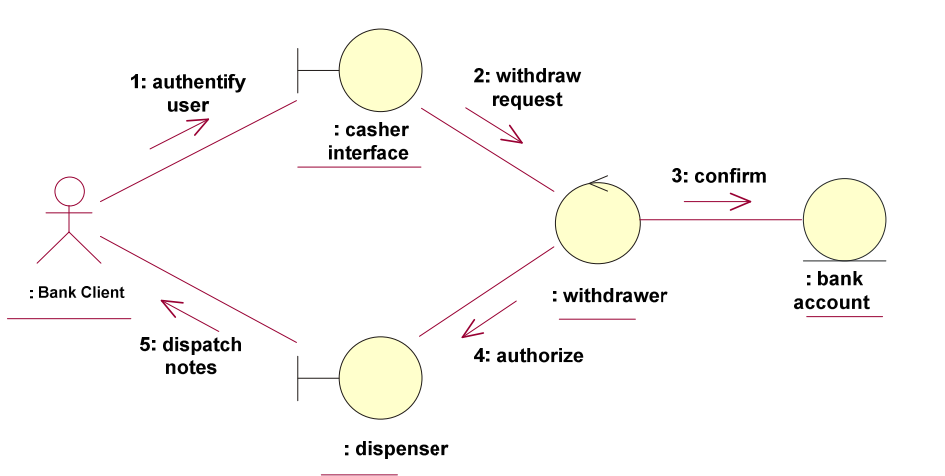

### 4.4.6. (4 + 1): Implementation Viewpoint
1. The implementation viewpoint focuses on the organization of the actual software modules in the software-development environment.
2. The software is packaged in small chunks-program libraries or subsystems-that can be developed by one or more developers.

### 4.4.7. Example of implementation view
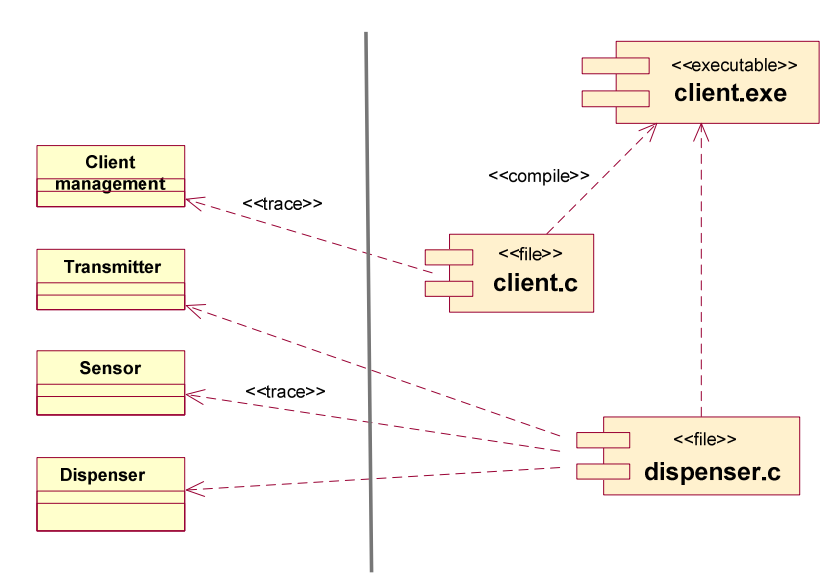

### 4.4.8. (4 + 1): Deployment Viewpoint
1. The deployment viewpoint defines how the various elements identified in the logical, process, and implementation viewpointsnetworks, processes, tasks, and objects-must be mapped onto the various nodes.
2. It takes into account the system's nonfunctional requirements such as system availability, reliability (fault-tolerance), performance (throughput), and scalability.

### 4.4.9. Example of deployment view
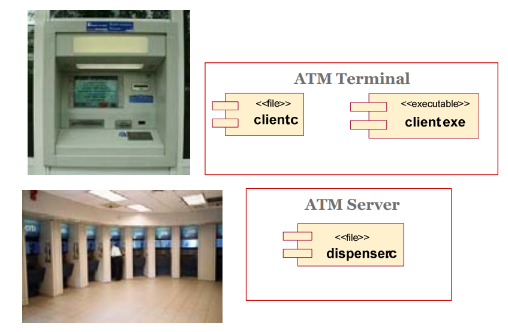

## 4.5. Using 4 + 1 view in UML
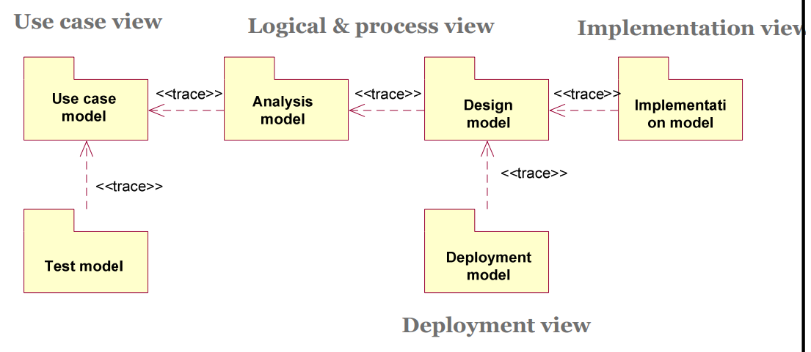

## 4.6. Traceability of Models
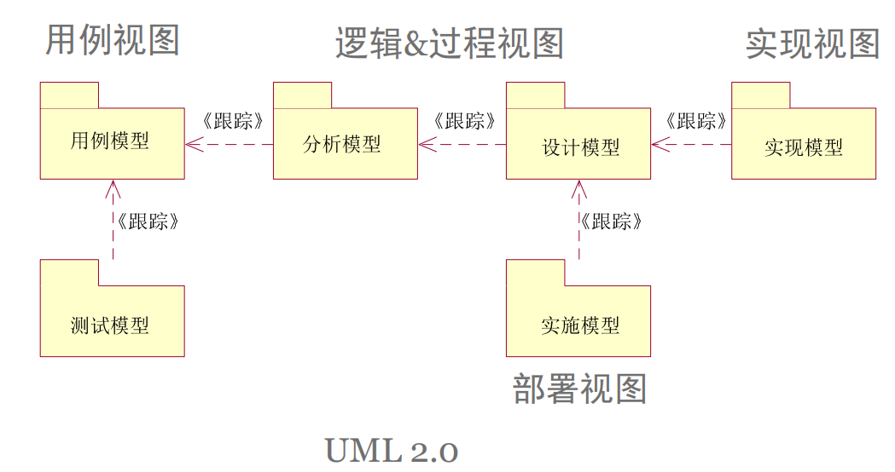

## 4.7. Rational Rose in 4+1 view
| 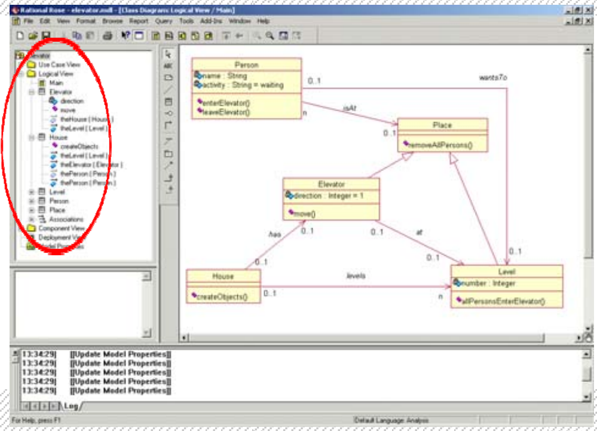 | 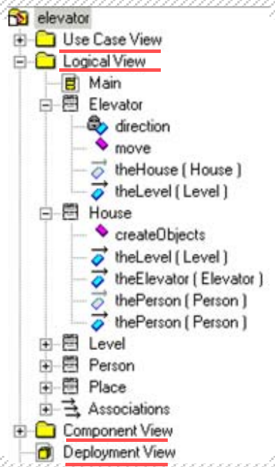 |
| -------------------- | -------------------- |

## 4.8. Crosscutting viewpoints (交叉的体系结构视图)
1. Security shows up in functional view as user authentication, and in deployment view as firewall
2. Performance shows up in functional view in component coupling, in deployment view as distributed topology
3. Consistencies between architecture views are important , but difficult to maintain (traceability helps)

## 4.9. Problems/pitfalls in architecture views
1. Poorly defined interfaces
2. Poorly understood responsibilities
3. Overloading the view
4. Just drawing the picture
5. Inappropriate level of detail
6. "God" elements

## 4.10. Example overloaded view
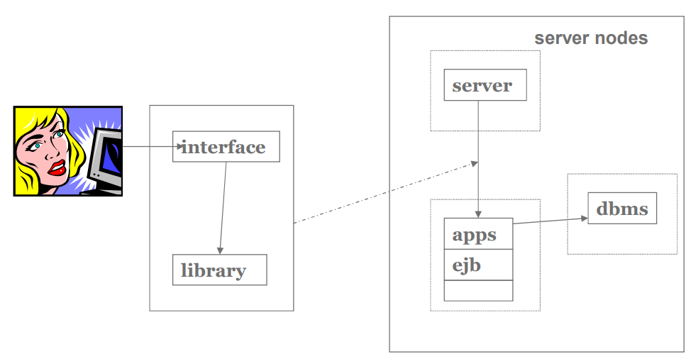

## 4.11. Architectural views in your projects
1. One viewpoint should focus on the system from the perspective of (some or all) external stakeholders
2. One of the viewpoints should be a technical viewpoint.
3. How to express business concerns of stakeholders in an understandable way?
4. Some good examples from previous years:
5. 软件体系结构文档中的视图要求

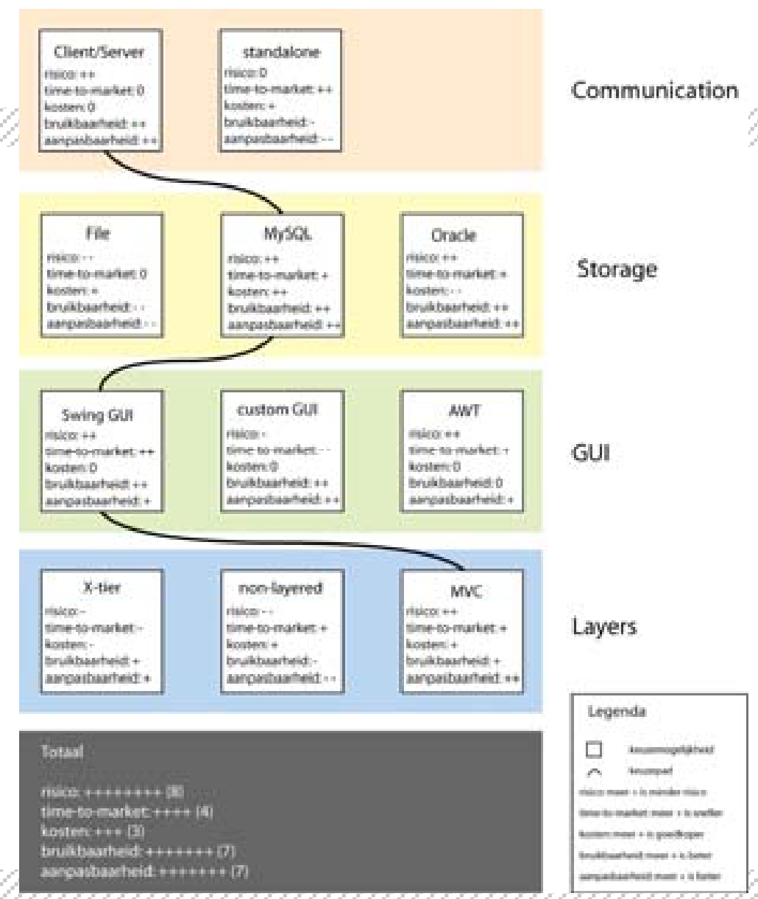

# 5. How to obtain a set of arch. views

## 5.1. How to decide on which views
1. Start with business goals
2. What are the stakeholders and their concerns?
3. Which views address these concerns?
4. Prioritize and possibly combine views (key drivers)

## 5.2. Categories of business goals [Ch 16]
1. Organization’s growth and continuity
2. Meeting financial objectives
3. Meeting personal objectives
4. Meeting responsibility of employees
5. Meeting responsibility to country
6. Meeting responsibility to society
7. Meeting responsibility to shareholders
8. Managing market position
9. Improving business processes
10. Managing product’s quality and reputation

## 5.3. Example business goal
1. Stakeholder: we want to provide users with a reliable, securer way to access government services online
   1. Goal subject: project manager
   2. Goal object: population
   3. Environment: user population’s computing skills
   4. Goal: provide users with reliable access
   5. Goal measure: system operates 24/7, no loss of confidential data
   6. Possible architectural approach: quality reqs for usability, data confidentiality, reliability, availability

## 5.4. Define a viewpoint
1. Primary presentation (graphical or textual)
2. Element catalog
3. Variability guide
4. Glossary of terms
5. Other information

## 5.5. Documentation using views
1. What the architecture is using views
2. Why the architecture is the way it is

## 5.6. Example of context viewpoint
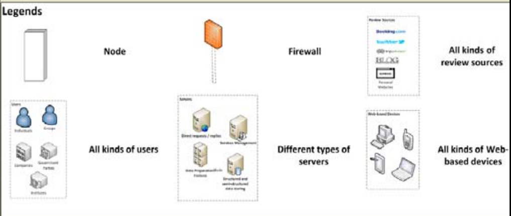

## 5.7. Example of context view
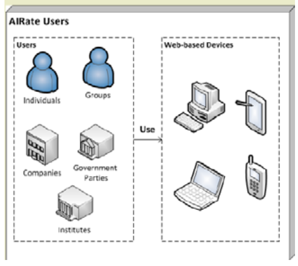

## 5.8. What is a good arch. description?
1. Explicit vision, design decisions, and rationales
2. Essential information only on a minimum of pages
3. Traceability & up-to-date

## 5.9. Read
1. Bass et al, Ch 18: Documenting SA
2. ISO standard 42010
3. Kruchten’s IEEE Software article
4. Bass et al, Ch 16: Architecture and Requirements

# 6. Summary
1. An architecture has different stakeholders, with different concerns
2. To properly address these stakeholders and their concerns, we need different architecture views and representations