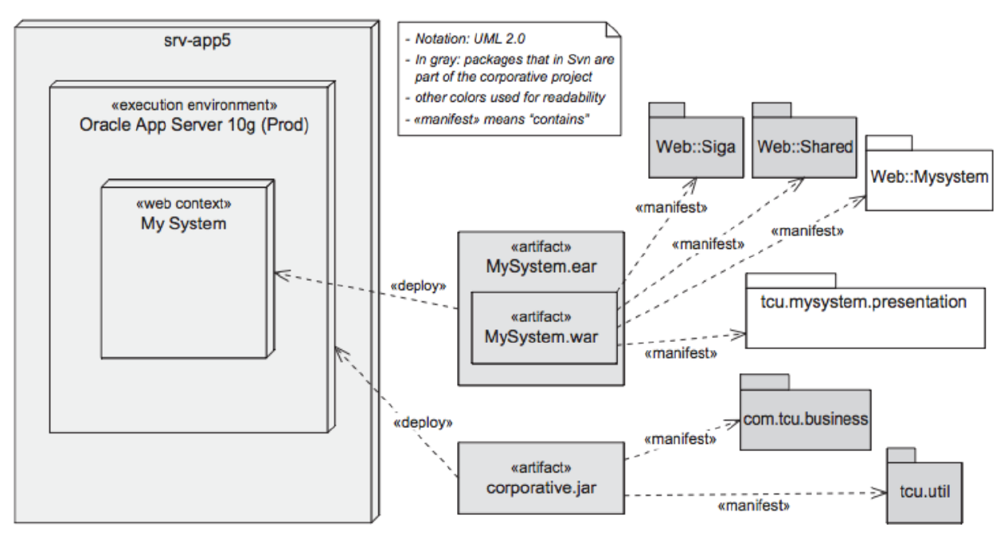

lec6-Document
---

# 1. 文件架构 Document Architecture

## 1.1. 为什么要记录软件架构？ Why to document software architecture?
1. 这是记录软件架构的几个很好的理由，例如：There are several good reasons for documenting software architecture such as:
   1. 交流和社交化架构设计决策 Communicating and socialising architecture design decisions
   2. 帮助理解和评估架构设计决策 Helping understand and assess architecture designdecisions
   3. 刷新设计师对某些决策的记忆 Refreshing designers' memories about certain decisions
   4. 培训架构设计人员 Training people in designing architecture
   5. 支持地理位置分散的团队 Supporting geographically ditributed teams
2. 体系结构文档用于以下活动：Architecture documentation is used for several activities:
   1. 架构设计分析 Architecture design analysis.
   2. 工作分解和分配 Work breakdown and assignment.
   3. 部署后维护 Post-deployment maintenance.
3. 软件体系结构文档提供了维护和修改决策的框架 Software architecture documentation provides a framework for maintenance and modification decisions.

## 1.2. What to document?
1. Many things worth of documenting such as:
   1. Component interfaces and dependencies
   2. Subsystems constraints
   3. Test scenarios.
   4. Contextual information surrounding design decisions
2. Several factors affect the decision of what to document:
   1. Complexity of the architecture being documented
   2. Longevity of an application
   3. Based on the expected use of documentation by stakeholders

## 1.3. (7) Rules for Architecture Documentation
1. Write documentation from the reader's point of view
2. Avoid unnecessary repetition.
3. Avoid ambiguity.
4. Use a standard organization. 
5. Record rationale.
6. Keep documentation current but not too current.
7. Review documentation for fitness of purpose.

# 2. View and Beyond

## 2.1. Views

### 2.1.1. Styles and Views

#### 2.1.1.1. Three Categories of Styles
1. How it is structured as a set of implementation units?Allocation style
2. How it is structured as a set of elements that have runtime behavior and interactions?Component-connector(C&C) styles
3. How it relates to non-software structures in its
environment?Module styles 

#### 2.1.1.2. Styles Vs. Patterns
1. An architecture style is a"specialization of element and relation types, together with a set of constraints on how they can be used" (Bass, Clements, and Kazman 2003)
2. An architecture pattern"expresses a fundamental  structural organization schema for software systems"(Buschmann et al. 1996)
3. An essential part of an architecture pattern is its focus on the problem and context as well as how to solve the problem in that context.
4. An architecture style focuses on the architecture approach, with more lightweight guidance on when a particular style may or may not be useful. 
5. Architecture pattern: {problem, context} --> architecture approach
6. Architecture style: architecture approach
7. A style description does not generally include detailed problem/context information; architecture patterns do.

### 2.1.2. Architectura Views
1. A view is a representation of a set of system elements and relations among them - not all system elements, but those of a particular type.
2. Views let us divide the system's entity into interesting and manageable representations of the system.
3. Different views support different goals and users, and highlight different system elements and relations
4. Different views expose different quality attributes to different degrees.

### 2.1.3. Structural Views

#### 2.1.3.1. Module Views
1. A module is an implementation unit that provides a coherent set of responsibility.
2. It is unlikely that the documentation of any software architecture can be complete without at least one module view.
3. Decomposition view
4. Uses view 
5. Generalization v1ew
6. Layered view
7. Aspects View
8. Data model view

#### 2.1.3.2. Summary of Module Views

#### 2.1.3.3. Component-Connector Views
1. Component-and-connector views show elements that have some runtime presence, e.g, processes, objects, clients, servers, and data stores (being termed 'components).
2. Attachments indicate which connectors are attached to which components.
3. Attachment is shown by connecting the endpoints of the connector to the ports of components.
4. Pipe-and- filter view
5. Client-server view
6. Peer-to-peer view
7. Service-oriented architecture (SOA) view
8. Publish-subscribe view .
9. Shared-data view
10. Multi-tier view .

#### 2.1.3.4. Summary of C&C Views

#### 2.1.3.5. Allocation Views
1. Allocation views describe the mapping of software units to elements of an environment in which the software is developed or in which it executes.
2. The usual goal of an allocation view is to compare the properties required by the software element with the properties provided by the environmental elements to determine whether the allocation will be successful or not.
3. Allocation views can depict static or dynamic views.
4. Deployment view
5. Install view
6. Work assignment view
7. Other allocation views

#### 2.1.3.6. Summary of Allocation Views

### 2.1.4. Quality Views
1. Security view
2. Performance view
3. Reliability view
4. Communication V1ew
5. Exception view (error-handling) view

### 2.1.5. Documenting Views

#### 2.1.5.1. (3)-Step for Choosing Views
1. Step-1: Build a stakeholder/view table
2. Step-2: Combine views
   1. 2.1 Identify marginal views in the above table
   2. 2.2 Combine each marginal views with another view with stronger constituency by associating between elements in one view and elements in the other
3. Step-3: Prioritize and stage
   1. decomposition view
   2. 80/20 principle
   3. complete all views in sequence?

#### 2.1.5.2. Stakeholder and Documentation

#### 2.1.5.3. Stackholder-View Table

### 2.1.6. Combining Views
1. Various C&C view
2. Deployment view with either SOA or communicating- process Views
3. Decomposition view and any of work assignment, implementation, uses, or layered views

### 2.1.7. View Template

1. Section-1: The Primary Presentation
   1. shows the elements and relations of the view
   2. often graphical with a key
2. Section-2: The Element Catalog
   1. details the elements depicted in Sect. 1
   2. Elements and their properties
   3. Relations and their properties
   4. Element interfaces and behavior
3. Section-3: Context Diagram
   1. how the system or its portion relates to its envlronment
4. Section-4: Variability Guide
   1. how to exercise any variation points of the architecture in this view
5. Section-5: Rationale 
   1. why the design reflected in the view
   2. provides a convincing argument that it 1s sound .

### 2.1.8. Context Diagram

## 2.2. Beyond(Information Beyond Views)

### 2.2.1. Documentation Beyond Views

### 2.2.2. Document Control information

1. Section-1: Documentation Roadmap tells what in formation is in the documentation and where to find it
   1. Scope and summary
   2. How the documentation is organized
      1. short synopsis
      2. annotated table of contents
   3. View overview
   4. How stakeholders can use the documentation

### 2.2.3. Mapping between Views

### 2.2.4. Documentation Package

