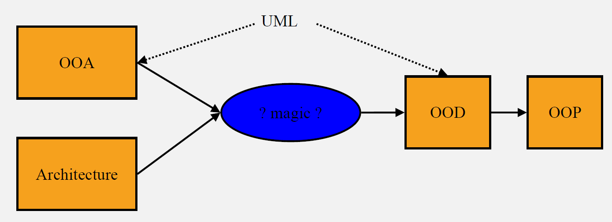
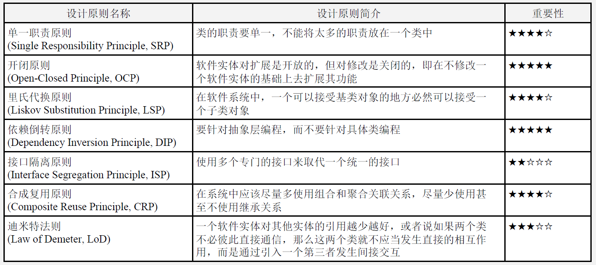

lec7-Evaluating Architecture
---

# 1. Architecture Process

## 1.1. Why to evaluate architecture?
1. Large projects often delivered late and over-budget
   1. Don't function as promised due to design failures
   2. COTS components don't work as expected
2. Considerable rework often required late in project
   1. Team members not communicated the issues? 
   2. Team members lacking expertise to detect problems early?
   3. Costly
3. Architecture evaluations help alleviate these problems
   1. Thoroughly assess COTS component suitability
   2. Identify problems before they become costly to fix
   3. Inform management so they can make better decisions
4. Locate problems early when they are cheap to fix
   1. Design faults
   2. Unexpected COTS components behavior
   3. Mismatch of COTS components to overall architecture
5. Disseminate architecture/design best practices
   1. Reviewers are experts, can capture best practices
   2. Reviewers have broad perspective across many projects
6. Provide management with better technical and project information
7. Identify areas where training could provide broad impact on commonly recurring problem areas
8. Improve interactions with COTS component suppliers

## 1.2. When to evaluate an architecture?
1. Acquisition
   1. Minimize risks of choosing inappropriate COTS components
   2. Involve acquirers and vendors (with obvious caveats:-})
2. Evolution/Upgrade
   1. Assess impact of changes
3. Design
   1. Early 'validation' that the new architecture is suitable for requirements
4. Build
   1. Is actual architecture built as intended
   2. Is it built 'well?
5. Always evaluate early!!!

## 1.3. Why evaluate architecture early?
1. Architecture evaluation should be done early because:
   1. there is time for correction
   2. correcting wrong decision is relatively inexpensive
   3. it is one of the most effective quality assurance and risk mitigation techniques
   4. it is considered a good commercial practice
2. Early quality evaluation is cost effective (AT&T: 10% productivity increase/project 1991) - Lately, $I million savings on systems of 100,000 non-commentary LOC by detecting and resolving problems early
3. There are competing requirements; decisions must be made early according to business goals 
4. Rationale for architecture design decisions should be captured and reasoned about

## 1.4. How to evaluate software architecture?
1. A systematic approach to evaluate architecture needs a method that helps ask right questions
   1. to discover risks
   2. to identify wrong architectural choices
   3. to ensure quality issues have been addressed
2. There are a number of methods to evaluate software architecture:
   1. Software Architecture Analysis Method (SAAM)
   2. Architecture Level Modifiability Analysis (ALMA)
   3. Performance Assessment of Software Architecture (PASA)
   4. Architecture Trade-off Analysis Method (ATAM)
3. All these methods are scenario-based approaches as quality attributes are defined using scenarios
4. Scenarios are mapped on architectural components to evaluate architectural capability to fulfill desired quality attributes

## 1.5. How can a method be helpful!?
1. It helps stakeholders ask right questions early to:
   1. Identify risks: Architectural decisions that may negatively affect desired quality attributes
   2. Find sensitivity points: Architecture decisions to which a particular quality attribute is sensitive to
   3. Discover tradeoffs: Architecture decision that affect more than one quality attribute
2. Find trends: correlation between architectural decisions and predictions of system properties
3. Efforts can be directed to mitigate the found risks by further analysis, design or prototyping
4. Tradeoffs made and rationale underpinning them can appropriately be documented for future reference

## 1.6. Analysis Methods for Evaluation

## 1.7. Evaluate Forms
1. Evaluation by designers within the design process
   1. generate-and-test approach
2. Evaluation by peers within the design process
   1. The reviewers determine a number of quality attribute scenarios to drive the review.
   2. The architect presents the portion of the architecture to be evaluated.
   3. For each scenario, the designer wallks through the architecture and explains how the scenario is satisfied.
   4. Potential problems are captured.
3. Evaluation by outsiders once the architecture has been designed

# 2. ATAM：Architecture Tradeoff Analysis Method

## 2.1. Phase

### 2.1.1. Phase-0: Partnership 8 Preparation
1. Participants: evaluation team leadership and key project decision makers
2. Inputs: the architecture documentation
3. Outputs: the evaluation plan
   1. Who? a preliminary list of stakeholders
   2. Logistics: When? Where? and How?
   3. When the evaluation report is to be delivered to whom?
   4. What information to be included in the evaluation report?

### 2.1.2. Phase-1: Evaluation (1)
1. Participants: evaluation team and project decision makers
2. Step 1-6
3. Outputs:
   1. a concise presentation of the architecture
   2. articulation of the business goals (drivers)
   3. a prioritized list of specific quality attribute requlrements realized as scenarios
   4. utility tree
   5. risks and nonrisks
   6. sensitivity points and tradeoff points

### 2.1.3. Phase- 2: Evaluation (2)
1. Participants: evaluation team, project decision makers, and architecture stakeholders
2. Step (1) 7~9
3. Outputs:
   1. a list of prioritized scenarios from the stakeholder community
   2. risk themes and business drivers threatened by each one

### 2.1.4. Phase- 3: Follow-up
1. Participants: evaluation team and key stakeholders (evaluation clients)
2. Outputs: the final evaluation report
3. The evaluation team produces a written final report that is circulated to key stakeholders for revlew.
4. After the review, the report is delivered to whom commissioned the evaluation.

### 2.1.5. Summary of ATAM phases

## 2.2. Steps of Pharse-1

### 2.2.1. Step1 - Present the ATAM
1. The evaluation leader presents the ATAM in brief to assembled project representatives ('decision makers') for their understanding of the process and outputs of the evaluation

### 2.2.2. Step2 - Present the Business Drivers
1. Project manager or system's customer presents a system overview from a business perspective, describing
   1. its most important functional requirements
   2. its technical, managerial, economic, or political constralnts
   3. its business goals and context
   4. its major stakeholders
   5. the architectural drivers (major quality attribute goals that shape the architecture)

### 2.2.3. Step3 - Present the architecture
1. The lead architect makes a presentation describing the architecture at an appropriate level of detail:
   1. technical constraints such as an OS, hardware, or middleware prescribed for use
   2. other systems with which the system must interact
   3. architectural approaches used to meet quality attribute requirements
2. Architecture Presentation (Approximately 20 slides; 60 Minutes)
   1. Driving architectural requirements, the measurable quantities you associate with these requirements, and any existing standards/ models/ approaches for meeting these (2-3 slides)
      1. Important architectural information (4-8 slides):
         1. Context diagram- -the system within the context in which it will exist. Humans or other systems with which the system will interact.
         2. Module or layer view- the modules (which may be subsystems or layers) that describe the system s decomposition of functionality, along with the objects, procedures, functions that populate these, and the relations among them (e.g, procedure call, method invocation, callback, containment).
         3. Component-and-connector view-processes, threads along with the synchronization, data flow, and events that connect them.
         4. Deployment view- CPUs, storage, external devices/ sensors along with the networks and communication devices that connect them. Also shown are the processes that execute on the various processors.
      2. Architectural approaches, patterns, or tactics employed, including what quality attributes they address and a description of how the approaches address those attributes (3-6 slides):
         1. Use of commercial off-the-shelf (COTS) products and how they are chosen/integrated (1-2 slides).
         2. Trace of 1 to 3 of the most important use case scenarios. If possible, include the runtime resources consumed for each scenario (1-3 slides).
         3. Trace of1 to 3 of the most important change scenarios. If possible, describe the change impact (estimated size/ difficulty of the change) in terms of the changed modules or interfaces (1-3 slides).
         4. Architectural issues/risks with respect to meeting the driving architectural requirements (2- -3 slides).
         5. Glossary (1 slide).

### 2.2.4. Step4 - Identify Architectural Approaches
1. ATAM focuses on analyzing an architecture by understanding its architectural approaches.
2. By this step, the evaluation team
   1. have studied the architecture documentation
   2. have heard the architect's presentation
   3. have asked the architect about patterns and tactics used in designing the system
3. The evaluation team catalogs the architectural approaches (styles, patterns and tactics) that have been identified.

### 2.2.5. Step5 - Generate Quality Attribute Utility Tree
1. This is a crucial step that guides the remainder of the analysis.
2. The evaluation team works with the project decision makers to identify, prioritize and refine the system's most important quality attribute goals.
3. The quality attribute goals are articulated in detail via quality attribute utility tree that makes the requirements concrete by defining precisely the relevant quality attribute requirements.

### 2.2.6. Step6 - Analyze Architectural Approaches
1. The goal is for the evaluation team to be convinced that the instantiation of the approach is appropriate for meeting the attribute-specific requirements.
2. The evaluation team examines that the highest-ranked scenarios(from the utility tree) one at a time by asking the architect to explain how the architecture supports each other.
3. The evaluation team documents the relevant architectural decisions and identifies and catalogs their risks, nonrisks, sensitivity points, and tradeoffs through a discussion.
4. The analysis is to elicit sufficient architectural information to establish some link between the architectural decisions that have been made and quality attributes that need to be satisfied.
5. At the end of this step, the evaluation team should have a clear picture of the most important aspects of the entire architecture, the rationale for key design decisions, and a list of risks, nonrisks, sensitivity points, and tradeoff points.

### 2.2.7. Example Agenda for Day 1 for ATAM

## 2.3. Steps of phase-2

### 2.3.1. Step-1: Present the ATAM & Previous Results
1. Step 1 is repeated so that the stakeholders understand the method and the roles they are to play.
2. The evaluation leader recaps the results of steps 2 through 6, and shares the outputs (except the utility tree).

### 2.3.2. Step-7: Brainstorm & Prioritize Scenarios
1. The purpose of this step is to take the pulse of the larger stakeholder community to understand what system success means to them.
2. The evaluation team asks the stakeholders to brainstorm scenarios that are operationally meaningful with respect to their individual roles.
3. Once the scenarios have been collected, stakeholders are asked to prioritize and merge scenarios they feel represent the behavior or quality concern.
4. The list of prioritized scenarios is compared with those from the utility tree.
5. If the discrepancy is significant, the additional scenario may be identified as a risk.

### 2.3.3. Step-8: Analyze Architectual Approaches
1. In this step, the evaluation team performs the same activities as in Step 6, using the highest ranked (e.g. top 5 to 10), but newly generated scenarios. 
2. The architect explains how relevant architectural decisions contribute to realizing each one.

### 2.3.4. Step-9: Present Results
1. The evaluation team groups the risks into risk themes, based on common underlying concern or systemic deficiency.
2. The identified risk themes are then related to specific business drivers listed in Step 2.
3. The collected information from evaluation is summarized and presented to all stakeholders: 
   1. The architectural approaches documented
   2. The set of scenarios and their prioritization from brainstorming
   3. The utility tree
   4. The risks discovered and nonrisks documented
   5. The sensitivity points and tradeoff points found
   6. Risk themes and the business drivers threatened by each one

## 2.4. Summary of ATAM Phases

## 2.5. Summary of ATAM Outputs
1. A concise presentation of the architecture
2. Articulation of the business goals 
3. Prioritized quality attribute requirements expressed as quality attribute scenarios
4. A utility tree
5. A set of risks and nonrisks
6. A set of riskthemes
7. Mapping of architectural decisions to quality requlrements
8. A set of identified sensitivity and tradeoff points
9. Final evaluation report

## 2.6. Lightweight Architecture Evaluation

