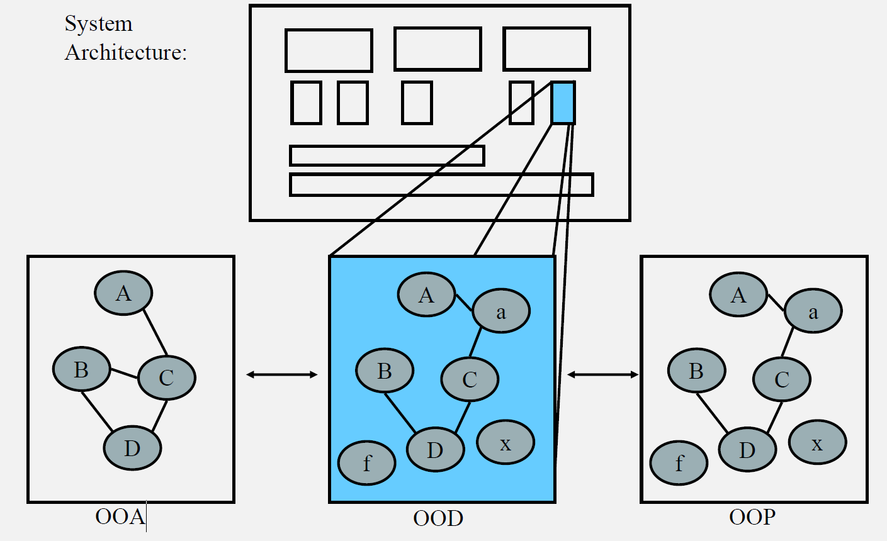
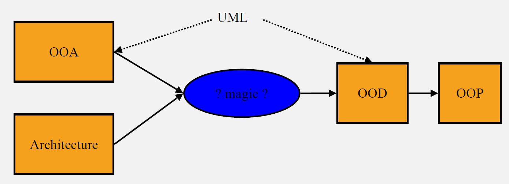
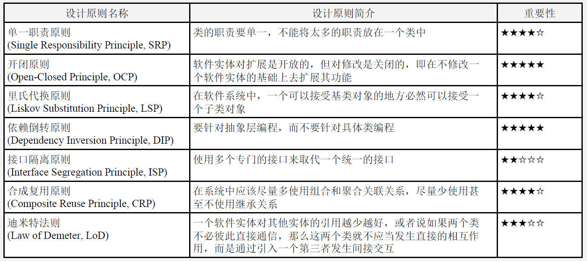
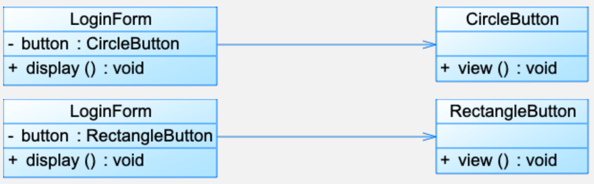
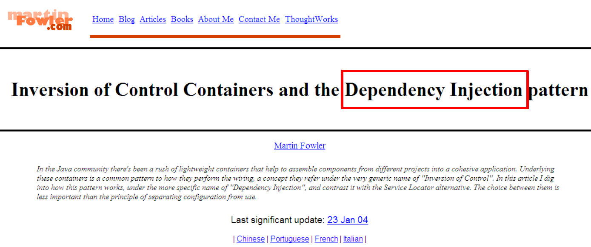
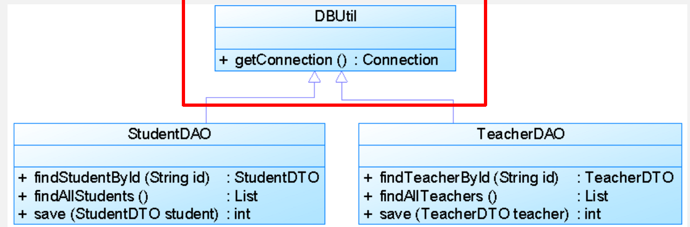
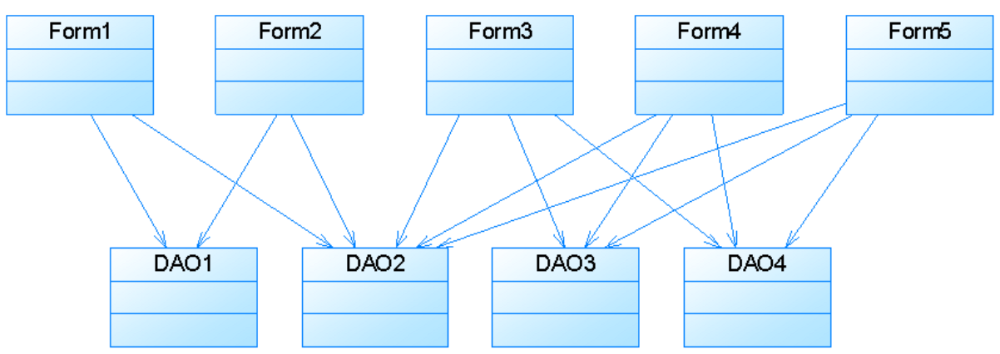
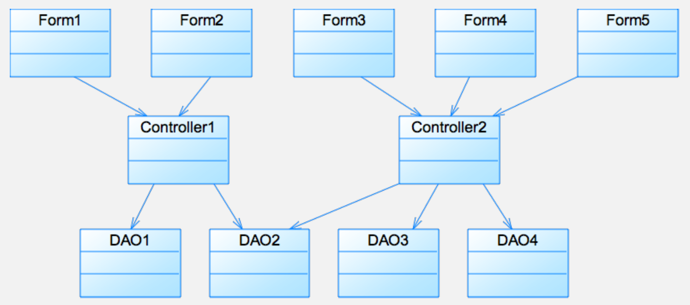

Lec8-Strategy Pattern
---

1. It is started with a simple SimUDuck application



2. Now we need the ducks to Fly



3. problem: Rubber duckies flying



4. Think about inheritance
   1. We could always just override the fly() method in rubber duck, the way we are with the quack() method...
   2. But then what happens when we add wooden decoy ducks to the program? They are not supposed to fly or quack…
   3. The executives want to update the product every six months. There will be new Duck subclasses in every update, what a nightmare!


5. How about an interface?


6. No. Duplicate code
   1. If you thought having to override a few methods was bad, how are you gonna feel when you need to make change to the flying behavior … in all 48 of the flying Duck subclasses.
   2. Change the not-flying subclass (inheritance, override)
      1. VS.
   3. Change the flying subclass (interface)

# 1. Change
1. The one constant in software development.
2. Lots of things can drive change. List some reasons you've had to change code in your applications.
3. Write some change in software development.
4. My customers or users decide they want something else, or they want new functionality.
5. My company decided it is going with another database vendor and it is also purchasing its data from another supplier that uses a different data format. Argh!
6. Well, technology changes and we’ve got to update our code to make use of protocols.
7. We’ve learned enough building our system that we’d like to go back and do things a little better.

# 2. Design Principle
1. Encapsulate what varies.
2. Identify the aspects of your application that vary and separate them from what stays the same.
3. Take the parts that vary and encapsulate them, so that later you can alter or extend the parts that vary without affecting those that don’t.

## 2.1. Separating what changes from what stays the same
1. We know that fly() and quack() are the parts of the Duck class that vary across ducks.
2. To separate these behaviors from the Duck class, we’ll pull both methods out of the Duck class and create a new set of classes to represent each behavior.



## 2.2. Designing the Duck Behaviors
1. We want:
   1. Keep things flexible;
   2. Assign behaviors to the instances of Duck;
   3. Change the behavior of a duck dynamically;
      1. Change the duck’s behavior at runtime.

# 3. Design Principle
1. Program to an interface, not an implementation.

## 3.1. Classes to represent behavior
1. It won’t be the Duck classes that will implement the flying and quacking interfaces.
2. We’ll make a set of classes whose entire reason for living is to represent a behavior. (Strange?)
3. Our first solution, concrete implementation in superclass. Second solution, providing a specialized implementation in the subclass itself. They are all relying on an implementation.

## 3.2. Recall for the polymorphism
1. "Program to an interface" really means "program to a supertype".
2. There is the concept of interface, but there’s also the Java construct interface. You can program to an interface, without having to actually use a Java interface.
3. The declared type of the variables should be a supertype, usually an abstract class of interface, so that the objects assigned to those variables can be of any concrete implementation of the supertype, which means the class declaring them doesn’t have to know about the actual object types!


## 3.3. With the design
1. Other type of objects can reuse our fly and quack behavior because these behaviors are no longer hidden away in our Duck classes.
2. We can add new behaviors without modifying any of our existing behavior classes or touching any of the Duck classes that use flying behaviors.
3. So we get the benefit of REUSE without all the baggage that comes along with inheritance.

## 3.4. Q and A
1. Q: It feels a little weird to have a class that’s just a behavior. Aren’t classes supposed to represent things?Aren’t classes supposed to have both state AND behavior?
2. A: In an OO system, yes, classes represent things that generally have both state (instance variables) and methods. And in this case, the thing happens to be a behavior. But even a behavior can still have state and methods; a flying behavior might have instance variables representing the attributes for the flying (wing beats per minute, max altitude and speed, etc.)behavior.

## 3.5. Integrating the Duck behavior
1. The key is that a Duck will now delegate its flying and quacking behavior, instead of using quacking and flying methods defined in the Duck class (or subclass).

### 3.5.1. (1) First we’ll add two instance variables to the Duck class


### 3.5.2. (2) Now we implement performQuack()


### 3.5.3. (3) How the flyBehavior and quackBehavior instance varibales are set


## 3.6. Testing the code




## 3.7. Setting behavior dynamically


## 3.8. Make a new Duck type


## 3.9. Make a new FlyBehavior type


## 3.10. Make the ModelDuck rocket-enabled



# 4. HAS-A can be better than IS-A
> Favor composition over inheritance.

1. Composition gives you a lot more flexibility.
2. Not only does it let you encapsulate a family of
algorithms into their own set of classes, but it
also lets you change behavior at runtime.

## 4.1. The first design pattern-- STRATEGY
1. The Strategy Pattern defines a family of algorithms, encapsulates each one, and makes them interchangeable. Strategy lets the algorithm vary independently from clients that use it.


# 5. Pattern
1. Name:Strategy
2. Intent:Define a family of algorithms, encapsulate each one, and make them interchangeable. Strategy lets the algorithm vary independently from clients that use it.
3. Also known as:Policy

## 5.1. Motivation – breaking a stream of text into lines
1. Many algorithms exist for breaking a stream of text into lines. Hard-wiring all such algorithms into the classes isn't desirable.

```java
public class Context{
  public void algorithm(String type){
    if(type == "strategyA")
    {}
    else if(type == "strategyB")
    {}
    else if(type == "strategyC")
    {}
  }
}
```

## 5.2. Applicability
1. Use the Strategy pattern when
   1. many related classes differ only in their behavior.Strategies provide a way to configure a class with one of many behaviors.
   2. you need different variants of an algorithm. For example, you might define algorithms reflecting different space/time trade-offs. Strategies can be used when these variants are implemented as a class hierarchy of algorithms.
   3. an algorithm uses data that clients shouldn't know about. Use the Strategy pattern to avoid exposing complex, algorithm-specific data structures.
   4. a class defines many behaviors, and these appear as multiple conditional statements in its operations. Instead of many conditionals, move related conditional branches into their own Strategy class.

## 5.3. Consequences
1. Families of related algorithms. Hierarchies of Strategy classes define a family of algorithms or behaviors for contexts to reuse. Inheritance can help factor out common functionality of the algorithms.
2. An alternative to subclassing.
3. Strategies eliminate conditional statements
4. A choice of implementations. Strategies can provide different implementations of the same behavior. The client can choose among strategies with different time and space trade-offs.
5. Clients must be aware of different Strategies. The pattern has a potential drawback in that a client must understand how Strategies differ before it can select the appropriate one. Clients might be exposed to implementation issues.
6. Communication overhead between Strategy and Context.
7. Increased number of objects.

## 5.4. Shared vocabulary
1. ALICE：I need a Cream cheese with jelly on white bread, a chocolate soda with vanilla ice cream, a grilled cheese sandwich with bacon, a tuna fish salad on toast, a banana split with ice cream & sliced bananas and a coffee with a cream and two sugars, ... oh, and put a hamburger on the grill!
2. FLO：Give me a C.J. White, a black & white, a Jack Benny, a radio, a house boat, a coffee regular and burn one!
3. lDesign Patterns give you a shared vocabulary with other developers.
4. It also elevates your thinking about architectures by letting you think at the pattern level, not the nitty gritty object level.

## 5.5. The power of a shared pattern vocabulary
1. Shared pattern vocabularies are POWERFUL.
   1. When you communicate with another developer or your team using patterns, you are communication not just a pattern name but a whole set of qualities, characteristics and constraints that the pattern represents.
2. Patterns allow you to say more with less.
   1. When you use a pattern in a description, other developers quickly know precisely the design you have in mind.
3. Talking at the pattern level allows you to stay "in the design" longer.
4. Do not lost in the details.
5. Shared vocabularies can turbo charge your development team.
6. Shared vocabularies encourage more junior developers to get up to speed.

# 6. How do we use design patterns?
1. Libraries and frameworks.
2. DP help us structure our own applications to be more maintainable and flexible.
3. DP first go into your BRAIN.

# 7. Q & A
1. Q: If design patterns are so great, why can't someone build a library of them so I don't have to?
2. A: Design patterns are higher level than libraries. Design patterns tell us how to structure classes and objects to solve certain problems and it is our job to adapt those designs to fit our particular application.
3. Q: Aren't libraries and frameworks also design patterns?
4. A: Frameworks and libraries are not design patterns; they provide specific implementations that we link into our code. Sometimes, however, libraries and frameworks make use of design patterns in their implementations. That's great, because once you understand design patterns, you'll more quickly understand APIs that are structured around design patterns.

# 8. Patterns are nothing more than using OO design principles?
1. Knowing concepts like abstraction, inheritance, and polymorphism do not make you a good object oriented designer. A design guru thinks about how to create flexible designs that are maintainable and that can cope with change.

# 9. Tools for your design toolbox
1. OO Basics
2. Abstraction
3. Encapsulation
4. Polymorphism
5. Inheritance
6. OO Principles
7. Encapsulate what varies
8. Favor composition over inheritance
9. Program to interfaces, not implementation
10. OO Patterns
11. Strategy

# 10. Reviews
1. Knowing the OO basics does not make you a good OO designer.
2. Good OO designs are reusable, extensible and maintainable.
3. Patterns show you how to build systems with good OO design qualities.
4. Patterns are proven object oriented experience.
5. Patterns don't give you code, they give you general solutions to design problems. You apply them to your specific application.
6. Patterns aren't invented, they are discovered.
7. Most patterns and principles address issues of change in software.
8. Most patterns allow some part of a system to vary independently of all other parts. 
9. We often try to take what varies in a system and encapsulate it.
10. Patterns provide a shared language that can maximize the value of your communication with other developer.