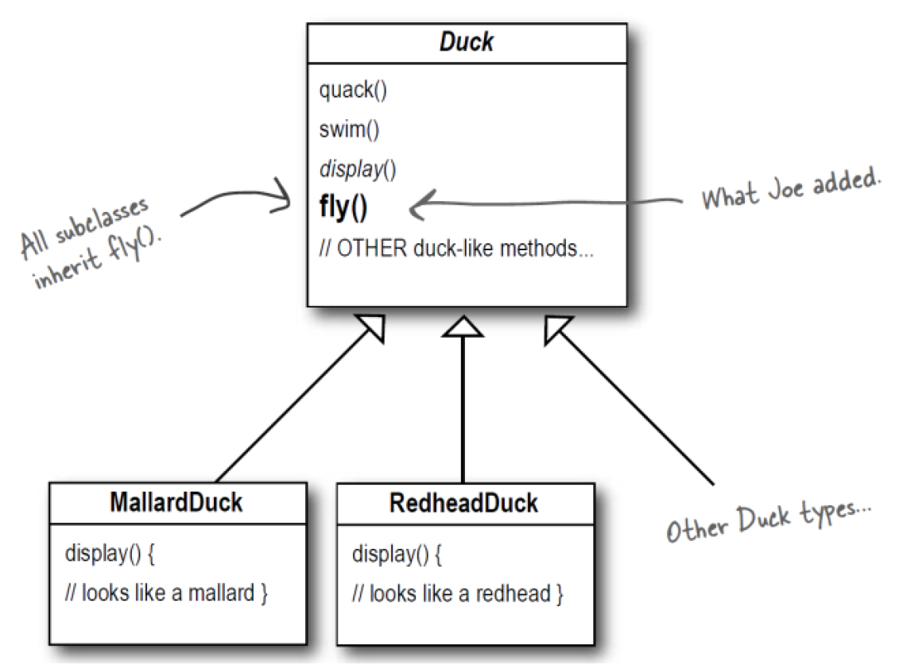
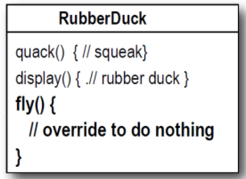
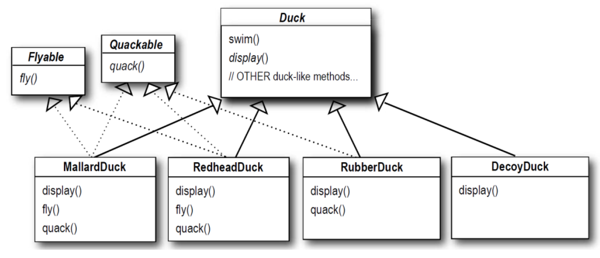
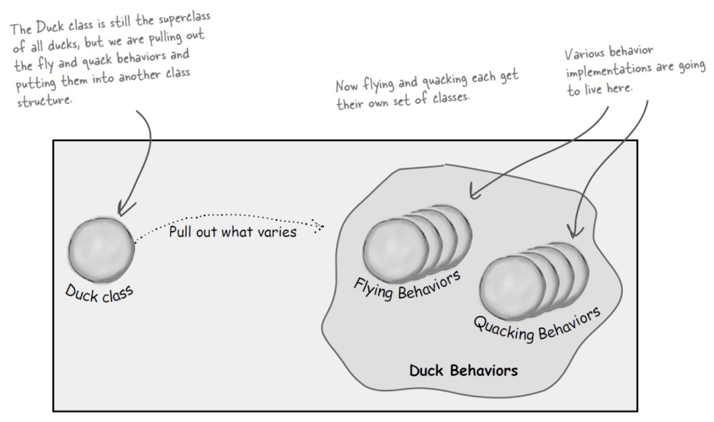
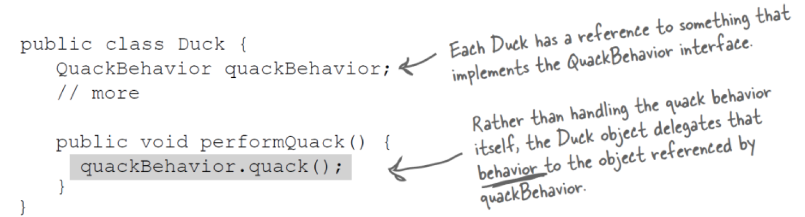
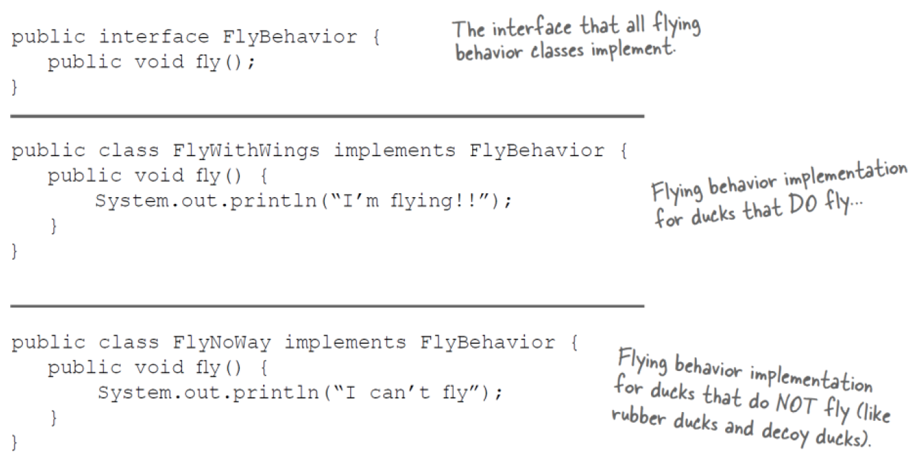

Lec9-设计模式
---

# 1. 我们从一个简单的SimUDuck应用程序开始


现在我们需要鸭子飞 Now we need the ducks to Fly



问题：橡皮鸭飞 problem: Rubber duckies flying


1. 我们需要意识到不是所有的鸭子都会飞
2. 考虑继承 Think about inheritance
   1. 我们总是可以像使用quack()方法一样在橡皮鸭中覆盖fly()方法... We could always just override the fly() method in rubber duck, the way we are with the quack() method...
   2. 但是，当我们在程序中添加木制诱饵鸭子时会发生什么呢？ 他们不应该飞或嘎嘎…… But then what happens when we add wooden decoy ducks to the program? They are not supposed to fly or quack…
   3. 高管们希望每六个月更新一次产品  每次更新中都会有新的Duck子类，真是一场噩梦！The executives want to update the product every six months. There will be new Duck subclasses in every update, what a nightmare!



如果我们使用接口呢 How about an interface?



1. 其实并没有真正解决这个问题：导致代码无法复用
2. 没有重复的代码 No Duplicate code
   1. 如果您认为必须重写一些方法是不好的，那么当您需要更改飞行行为时会感觉如何……在所有48种Duck子类中  If you thought having to override a few methods was bad, how are you gonna feel when you need to make change to the flying behavior … in all 48 of the flying Duck subclasses.
   2. 更改非飞行子类（继承，覆盖）VS 更改飞行子类（接口） Change the not-flying subclass (inheritance, override) VS. Change the flying subclass (interface)

# 2. 改变 Change
1. 软件开发中的一个常数 The one constant in software development.
2. 很多事情都可以推动变化 列出一些您必须在应用程序中更改代码的原因 Lots of things can drive change. List some reasons you've had to change code in your applications.
3. 在软件开发中编写一些更改 Write some change in software development.
4. 我的客户或用户决定他们想要其他东西，或者他们想要新功能 My customers or users decide they want something else, or they want new functionality.
5. 我的公司决定与另一家数据库供应商合作，并且还从另一家使用不同数据格式的供应商那里购买数据 My company decided it is going with another database vendor and it is also purchasing its data from another supplier that uses a different data format. Argh!
6. 嗯，技术不断变化，我们必须更新代码以使用协议 Well, technology changes and we’ve got to update our code to make use of protocols.
7. 我们已经学到了足够的知识来构建我们的系统，我们想回去做点更好的事情 We’ve learned enough building our system that we’d like to go back and do things a little better.

# 3. 设计原理：封装各种变化 Encapsulate what varies
1. 对应实现的原则：开闭原则
2. 识别应用程序中各个方面，将其与保持不变的方面分开 Identify the aspects of your application that vary and separate them from what stays the same.
3. 将变化的部分封装起来，以便以后可以更改或扩展变化的部分而不会影响那些不变的部分 Take the parts that vary and encapsulate them, so that later you can alter or extend the parts that vary without affecting those that don’t.

## 3.1. 将变化与保持不变分开Separating what changes from what stays the same
1. 我们知道fly()和quack()是Duck类的一部分，它们在鸭子之间有所不同 We know that fly() and quack() are the parts of the Duck class that vary across ducks.
2. 为了将这些行为与Duck类分开，我们将把这两种方法都从Duck类中拉出，并创建一组新的类来表示每种行为 To separate these behaviors from the Duck class, we’ll pull both methods out of the Duck class and create a new set of classes to represent each behavior.



## 3.2. 设计鸭子行为 Designing the Duck Behaviors
1. 我们想要：We want:
   1. 保持灵活性 Keep things flexible
   2. Assign behaviors to the instances of Duck;
   3. Change the behavior of a duck dynamically;
      1. Change the duck’s behavior at runtime.

# 4. 设计原则：编程到接口，而不是实现 Design Principle：Program to an interface, not an implementation
对应实现的原则：依赖倒转原则

## 4.1. 表示行为的类 Classes to represent behavior
1. 不会实现Duck类的将实现flying和quacking接口 It won’t be the Duck classes that will implement the flying and quacking interfaces.
2. 我们将制作一组类，其全部目的是代表一种行为（奇怪的？）We’ll make a set of classes whose entire reason for living is to represent a behavior. (Strange?)
3. 我们的第一个解决方案是超类中的具体实现  第二个解决方案，在子类本身中提供专门的实现  **它们都依赖于实现**  Our first solution, concrete implementation in superclass. Second solution, providing a specialized implementation in the subclass itself. **They are all relying on an implementation**.

## 4.2. 回忆多态性 Recall for the polymorphism
1. “对接口编程”实际上意味着“对超类型编程” "Program to an interface" really means "program to a supertype".
2. 这里有接口的概念，但也有Java结构接口  您可以对接口进行编程，而不必实际使用Java接口 There is the concept of interface, but there’s also the Java construct interface. You can program to an interface, without having to actually use a Java interface.
3. 变量的声明类型应该是超类型，通常是接口的抽象类，以便分配给这些变量的对象可以是超类型的任何具体实现，这意味着声明它们的类不必知道 实际的对象类型！The declared type of the variables should be a supertype, usually an abstract class of interface, so that the objects assigned to those variables can be of any concrete implementation of the supertype, which means the class declaring them doesn’t have to know about the actual object types!


4. 我们将行为抽象出来，同时分别具体了两个子类(实现了依赖倒转)，并且是完整的封装


## 4.3. 在这个设计过程中
1. 其他类型的对象可以重用我们的飞行和嘎嘎行为，因为这些行为不再隐藏在我们的Duck类中 Other type of objects can reuse our fly and quack behavior because these behaviors are no longer hidden away in our Duck classes.
2. 我们可以添加新行为，而无需修改任何现有行为类或触摸任何使用飞行行为的Duck类 We can add new behaviors without modifying any of our existing behavior classes or touching any of the Duck classes that use flying behaviors.
3. 这样，我们就可以在没有继承带来的所有负担的情况下获得REUSE的好处 So we get the benefit of REUSE without all the baggage that comes along with inheritance.

## 4.4. Q and A
1. 问：类只是一种行为，这感觉有点奇怪。类不应该代表事物吗？类不应该同时具有状态和行为吗？Q: It feels a little weird to have a class that’s just a behavior. Aren’t classes supposed to represent things?Aren’t classes supposed to have both state AND behavior?
2. 答：在OO系统中，是的，类表示通常具有状态（实例变量）和方法的事物。在这种情况下，事情恰好是一种行为。但是，即使一个行为仍然可以具有状态和方法。飞行行为可能具有实例变量，这些变量代表飞行属性（每分钟的飞行节拍，最大高度和速度等） A: In an OO system, yes, classes represent things that generally have both state (instance variables) and methods. And in this case, the thing happens to be a behavior. But even a behavior can still have state and methods; a flying behavior might have instance variables representing the attributes for the flying (wing beats per minute, max altitude and speed, etc.)behavior.

# 5. 整合鸭子行为 Integrating the Duck behavior
1. 关键在于，Duck现在将**委托**其飞行和鸣叫行为，而不是使用Duck类（或子类）中定义的quacking和flying方法 The key is that a Duck will now delegate its flying and quacking behavior, instead of using quacking and flying methods defined in the Duck class (or subclass).
   1. 委托是调用另一个部分的方法

## 5.1. (1) 首先，我们将两个实例变量添加到Duck类中


## 5.2. (2) 现在我们实现performQuack()


## 5.3. (3) 如何设置飞行行为和叫行为实例变量


# 6. 测试代码 Testing the code
|  |  |
| -------------------- | -------------------- |
|  |  |

## 6.1. 动态设置行为 Setting behavior dynamically


## 6.2. 制作新的鸭子类型 Make a new Duck type


## 6.3. 制作新的FlyBehavior类型 Make a new FlyBehavior type


## 6.4. 使ModelDuck具有火箭功能 Make the ModelDuck rocket-enabled


# 7. HAS-A可以比IS-A更好 HAS-A can be better than IS-A
> 优先考虑组成而不是继承 Favor composition over inheritance.

1. 合成为您提供了更多的灵活性 Composition gives you a lot more flexibility.
2. 它不仅使您可以将一系列算法封装到自己的类集中，而且还使您可以在运行时更改行为 Not only does it let you encapsulate a family of algorithms into their own set of classes, but it also lets you change behavior at runtime.

# 8. 第一个设计模式-策略 The first design pattern-- STRATEGY
1. 策略模式定义了一系列算法，将每个算法封装在一起，并使它们可互换  策略使算法独立于使用该算法的客户端而变化 The Strategy Pattern defines a family of algorithms, encapsulates each one, and makes them interchangeable. Strategy lets the algorithm vary independently from clients that use it.


## 8.1. Pattern
1. Name:Strategy
2. Intent:Define a family of algorithms, encapsulate each one, and make them interchangeable. Strategy lets the algorithm vary independently from clients that use it.
3. Also known as:Policy

## 8.2. Motivation – breaking a stream of text into lines
1. Many algorithms exist for breaking a stream of text into lines. Hard-wiring all such algorithms into the classes isn't desirable.

```java
public class Context{
  public void algorithm(String type){
    if(type == "strategyA")
    {}
    else if(type == "strategyB")
    {}
    else if(type == "strategyC")
    {}
  }
}
```

## 8.3. Applicability
1. Use the Strategy pattern when
   1. many related classes differ only in their behavior.Strategies provide a way to configure a class with one of many behaviors.
   2. you need different variants of an algorithm. For example, you might define algorithms reflecting different space/time trade-offs. Strategies can be used when these variants are implemented as a class hierarchy of algorithms.
   3. an algorithm uses data that clients shouldn't know about. Use the Strategy pattern to avoid exposing complex, algorithm-specific data structures.
   4. a class defines many behaviors, and these appear as multiple conditional statements in its operations. Instead of many conditionals, move related conditional branches into their own Strategy class.

## 8.4. Consequences
1. Families of related algorithms. Hierarchies of Strategy classes define a family of algorithms or behaviors for contexts to reuse. Inheritance can help factor out common functionality of the algorithms.
2. An alternative to subclassing.
3. Strategies eliminate conditional statements
4. A choice of implementations. Strategies can provide different implementations of the same behavior. The client can choose among strategies with different time and space trade-offs.
5. Clients must be aware of different Strategies. The pattern has a potential drawback in that a client must understand how Strategies differ before it can select the appropriate one. Clients might be exposed to implementation issues.
6. Communication overhead between Strategy and Context.
7. Increased number of objects.

## 8.5. Shared vocabulary
1. ALICE：I need a Cream cheese with jelly on white bread, a chocolate soda with vanilla ice cream, a grilled cheese sandwich with bacon, a tuna fish salad on toast, a banana split with ice cream & sliced bananas and a coffee with a cream and two sugars, ... oh, and put a hamburger on the grill!
2. FLO：Give me a C.J. White, a black & white, a Jack Benny, a radio, a house boat, a coffee regular and burn one!
3. lDesign Patterns give you a shared vocabulary with other developers.
4. It also elevates your thinking about architectures by letting you think at the pattern level, not the nitty gritty object level.

## 8.6. The power of a shared pattern vocabulary
1. Shared pattern vocabularies are POWERFUL.
   1. When you communicate with another developer or your team using patterns, you are communication not just a pattern name but a whole set of qualities, characteristics and constraints that the pattern represents.
2. Patterns allow you to say more with less.
   1. When you use a pattern in a description, other developers quickly know precisely the design you have in mind.
3. Talking at the pattern level allows you to stay "in the design" longer.
4. Do not lost in the details.
5. Shared vocabularies can turbo charge your development team.
6. Shared vocabularies encourage more junior developers to get up to speed.

# 9. How do we use design patterns?
1. Libraries and frameworks.
2. DP help us structure our own applications to be more maintainable and flexible.
3. DP first go into your BRAIN.

# 10. Q & A
1. Q: If design patterns are so great, why can't someone build a library of them so I don't have to?
2. A: Design patterns are higher level than libraries. Design patterns tell us how to structure classes and objects to solve certain problems and it is our job to adapt those designs to fit our particular application.
3. Q: Aren't libraries and frameworks also design patterns?
4. A: Frameworks and libraries are not design patterns; they provide specific implementations that we link into our code. Sometimes, however, libraries and frameworks make use of design patterns in their implementations. That's great, because once you understand design patterns, you'll more quickly understand APIs that are structured around design patterns.

# 11. Patterns are nothing more than using OO design principles?
1. Knowing concepts like abstraction, inheritance, and polymorphism do not make you a good object oriented designer. A design guru thinks about how to create flexible designs that are maintainable and that can cope with change.

# 12. Tools for your design toolbox
1. OO Basics
2. Abstraction
3. Encapsulation
4. Polymorphism
5. Inheritance
6. OO Principles
7. Encapsulate what varies
8. Favor composition over inheritance
9. Program to interfaces, not implementation
10. OO Patterns
11. Strategy

# 13. Reviews
1. Knowing the OO basics does not make you a good OO designer.
2. Good OO designs are reusable, extensible and maintainable.
3. Patterns show you how to build systems with good OO design qualities.
4. Patterns are proven object oriented experience.
5. Patterns don't give you code, they give you general solutions to design problems. You apply them to your specific application.
6. Patterns aren't invented, they are discovered.
7. Most patterns and principles address issues of change in software.
8. Most patterns allow some part of a system to vary independently of all other parts. 
9. We often try to take what varies in a system and encapsulate it.
10. Patterns provide a shared language that can maximize the value of your communication with other developer.